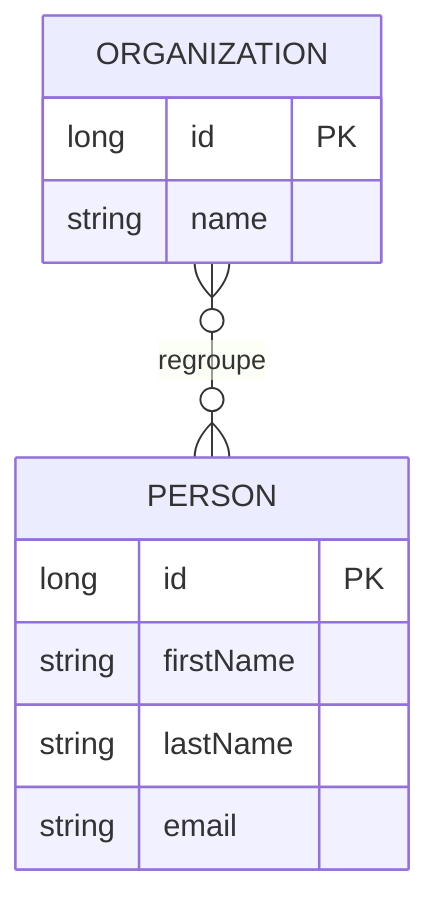
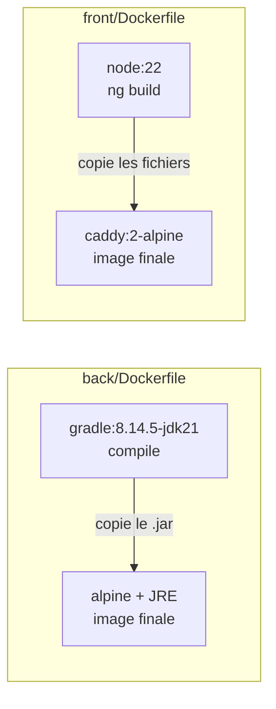
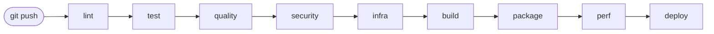
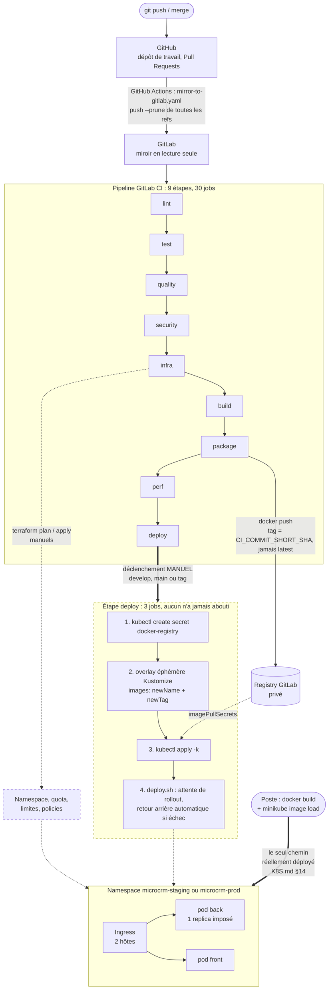
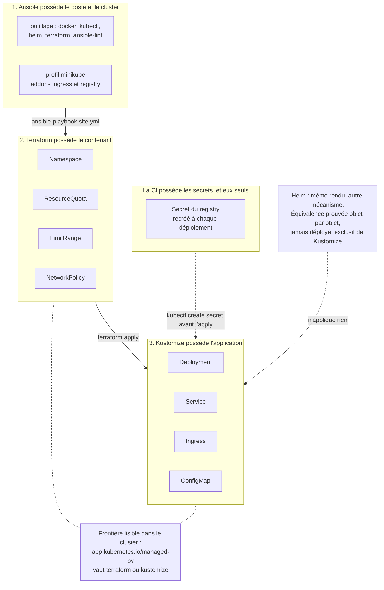
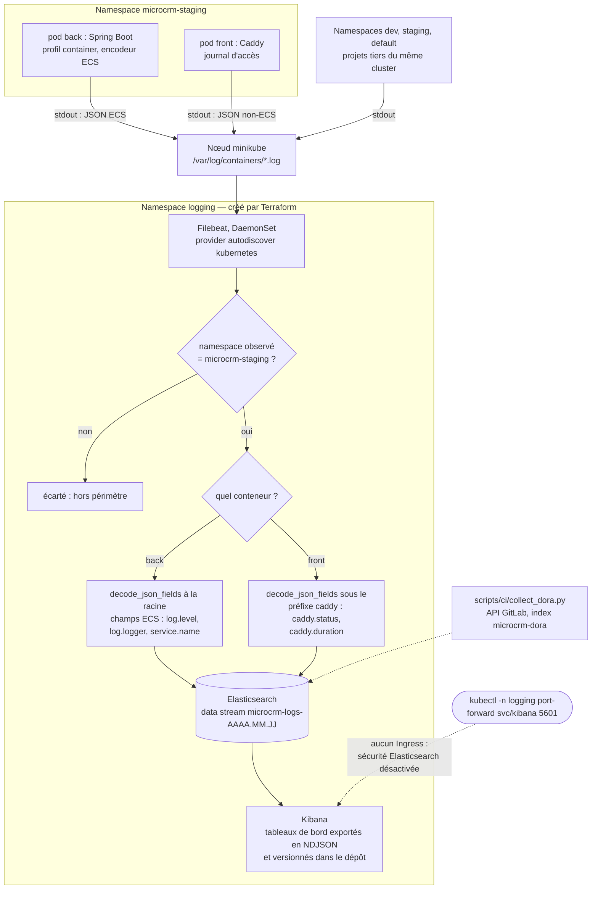

# Architecture — MicroCRM

Vue d'ensemble technique du projet : composants applicatifs, conteneurisation,
pipeline CI/CD et environnements.

---

## 1. Architecture applicative (runtime)

**Composants**

| Brique | Techno                                 | Port   | Rôle                                      |
| ------ | -------------------------------------- | ------ | ----------------------------------------- |
| Front  | Angular (statique) servi par **Caddy** | `80`   | Sert l'interface au navigateur            |
| Back   | **Spring Boot** (Tomcat intégré)       | `8080` | Expose l'API REST                         |
| Base   | **HSQLDB** _en mémoire_                | —      | Stockage (données perdues au redémarrage) |

> ⚠️ Le navigateur parle **directement** au back : le front appelle
> `http://localhost:8080` (`front/src/app/config.ts`). Caddy ne fait **pas** de
> reverse-proxy vers le back ici — les deux sont exposés séparément.

---

## 2. Modèle de données

Deux entités liées en **many-to-many** (voir `DATABASE.md` pour le détail).

---

## 3. Conteneurisation (multi-stage build)

Chaque service = **une image**, construite en deux étapes (atelier lourd → image légère livrée).

- **Étape 1** (build) : contient tous les outils de compilation → **jetée** à la fin.
- **Étape 2** (runtime) : ne garde que l'artefact (le `.jar` / les fichiers statiques).
- Bénéfices : images plus petites, moins de surface d'attaque, build reproductible.

### Taille des images livrées

| Image   | Taille     | Base                     | Dont l'application |
| ------- | ---------- | ------------------------ | ------------------ |
| `back`  | **377 Mo** | `alpine:3.19` (11,9 Mo)  | ~365 Mo            |
| `front` | **85 Mo**  | `caddy:2-alpine` (85 Mo) | ~0,2 Mo            |

Le front est à quelques centaines de kilo-octets près sa propre image de base :
un bundle Angular optimisé pèse peu, et Caddy est un binaire unique.

Le back, lui, est dominé par `openjdk21-jre-headless` — environ 365 des 377 Mo.
C'est le prix d'un JRE complet. Un runtime taillé sur mesure avec `jlink`, ne
contenant que les modules réellement utilisés, ramènerait l'image autour de
150 Mo. Ce n'est pas fait aujourd'hui : la complexité ajoutée au Dockerfile ne
se justifie pas encore pour une application de démonstration, mais c'est la
première optimisation à envisager si la taille devient un sujet.

### Contexte de build

Chaque application a son propre `.dockerignore`. Ce n'est pas redondant avec
celui de la racine : les jobs `package-*` construisent avec `--context ./back`
et `--context ./front`, or Docker ne lit que le `.dockerignore` situé **à la
racine du contexte**. Celui du dépôt n'est donc jamais appliqué lors de ces
builds.

L'effet est loin d'être cosmétique :

| Contexte | Avant    | Après      |
| -------- | -------- | ---------- |
| `front`  | 1 195 Mo | **0,6 Mo** |
| `back`   | 51 Mo    | **0,1 Mo** |

Côté front, l'essentiel venait du cache de compilation Angular (`.angular`,
920 Mo) et de `node_modules` (329 Mo) — deux répertoires que l'image régénère
de toute façon, puisque le Dockerfile lance `npm ci` puis `ng build`.

### Utilisateur d'exécution

Les deux images tournent en **UID 1000, utilisateur non privilégié**. C'est le
même UID que celui déclaré dans les manifestes Kubernetes
(`k8s/base/*-deployment.yaml`), pour que le conteneur se comporte de façon
identique qu'on le lance avec Docker ou avec Kubernetes.

Le cas du front mérite une note : Caddy écrit dans les répertoires XDG déclarés
par son image (`/data`, `/config`), détenus par root — d'où le `chown` du
Dockerfile, sans lequel l'exécution en non-root échoue. Et il écoute sur le
port 80 sans privilège grâce à la capability de fichier
`cap_net_bind_service=ep` que porte son binaire ; c'est elle, et non le numéro
de port, qui oblige à conserver `NET_BIND_SERVICE` dans le conteneur même avec
`capabilities.drop: [ALL]` (voir [K8S.md](K8S.md) §11).

---

## 4. Pipeline CI/CD (GitLab)

Le pipeline compte **9 stages et 30 jobs**, exécutés dans cet ordre :

| Stage      | Jobs                                                                                           | Rôle                                                  |
| ---------- | ---------------------------------------------------------------------------------------------- | ----------------------------------------------------- |
| `lint`     | `lint-front`, `lint-back`, `shellcheck`, `lint-k8s`, `lint-helm`                               | ESLint, Checkstyle, Bash, manifestes et chart         |
| `test`     | `test-scripts`, `test-front`, `test-back`                                                      | Tests des scripts d'automatisation, Karma, JUnit      |
| `quality`  | `sonar-back`, `sonar-front`, `spotbugs-back`, `coverage-gate`, `mutation-back`, `quality-gate` | Analyse Sonar, bugs, seuil de couverture, mutation    |
| `security` | `dependency-check-back`, `trivy-fs`                                                            | CVE des dépendances, secrets, misconfigurations       |
| `infra`    | `terraform-validate`, `ansible-lint`, `terraform-plan`, `terraform-apply`                      | L'infrastructure se valide **avant** qu'on ne compile |
| `build`    | `build-front`, `build-back`                                                                    | Compilation des artefacts                             |
| `package`  | `package-back`, `package-front`                                                                | Images Docker taguées par SHA + scan Trivy            |
| `perf`     | `k6-smoke`, `k6-load`, `k6-stress`                                                             | Tests de performance k6 sur l'image construite        |
| `deploy`   | `deploy-staging`, `deploy-production`, `rollback-production`                                   | Déploiement Kubernetes et retour arrière              |

Le détail du déclenchement par branche et de la procédure de release est dans
[RELEASE.md](RELEASE.md) ; celui des scripts appelés par ces jobs dans
[SCRIPTS.md](SCRIPTS.md).

---

## 5. Environnements

| Env            | Déclencheur           | Déploiement            | Usage                 |
| -------------- | --------------------- | ---------------------- | --------------------- |
| **staging**    | branche `develop`     | **manuel**             | Validation avant prod |
| **production** | branche `main` ou tag | **manuel** (garde-fou) | Utilisateurs finaux   |

Les deux déploiements sont en `when: manual` : ils ne partent pas tout seuls, il
faut cliquer dans GitLab. Le passage de staging en automatique est décrit dans
[RELEASE.md](RELEASE.md) §6.

Chaque cible est déclarée via le mot-clé `environment:` dans `.gitlab-ci.yml`
(suivi des déploiements dans GitLab → _Operate → Environments_).

---

## 6. Hébergement du code : GitHub → GitLab

Le dépôt de travail est **GitHub**, mais le pipeline tourne sur **GitLab CI**. Les
deux sont reliés par un workflow GitHub Actions,
[`.github/workflows/mirror-to-gitlab.yaml`](.github/workflows/mirror-to-gitlab.yaml) :

À chaque push sur n'importe quelle branche ou tag, le workflow recopie toutes les
références vers GitLab, où le pipeline se déclenche.

> ⚠️ **GitLab est un miroir en lecture seule.** Le push utilise `--prune` : toute
> branche qui n'existe pas sur GitHub y est supprimée. Ne jamais committer
> directement sur GitLab, le travail serait effacé au push suivant.

Le lien du dépôt GitLab :
`https://gitlab.com/pasquietted/G-rez-le-cycle-de-vie-de-d-veloppement-logiciel`

---

## 7. Convention de nommage des branches

Le projet suit **GitFlow**. Le nommage n'est pas cosmétique : `.gitlab-ci.yml` filtre
les jobs sur le préfixe de branche, donc **une branche mal nommée ne déclenche aucun
pipeline**.

| Branche       | Rôle                           | Jobs déclenchés               |
| ------------- | ------------------------------ | ----------------------------- |
| `main`        | Code en production             | Tous, jusqu'au déploiement    |
| `develop`     | Intégration continue           | Tous, jusqu'au staging        |
| `feature/...` | Nouvelle fonctionnalité        | lint, test, quality, security |
| `release/...` | Préparation d'une version      | Tous                          |
| `hotfix/...`  | Correctif urgent en production | Tous                          |
| Tag `vX.Y.Z`  | Version livrée                 | Tous, déploiement prod        |

Le séparateur est un **slash**, pas un underscore : la règle est
`$CI_COMMIT_BRANCH =~ /^feature\//`. Une branche `feature_ma-fonctionnalite` ou
`docs/ma-doc` ne correspond à aucune règle et son pipeline ne partira jamais.
Les mots composés s'écrivent avec un tiret : `feature/initial-documentation`.

---

## 8. Schémas d'architecture

Trois schémas, et un seul format : **Mermaid, en texte, dans le dépôt**. Ce n'est
pas une préférence d'outil. Une image binaire ne se relit pas : dans une revue
elle se remplace, et rien ne dit ce qui a changé entre deux versions — il faut
croire la légende sur parole. Un bloc Mermaid apparaît dans un `git diff` ligne à
ligne, se corrige sans rouvrir un éditeur graphique, et GitHub comme GitLab le
rendent nativement.

Chaque schéma existe à deux endroits : le bloc ci-dessous, et sa source dans
`docs/schemas/`, pour qu'on puisse le rendre isolément
(`mmdc -i docs/schemas/<nom>.mmd -o /tmp/<nom>.svg`) sans extraire le bloc à la
main.

| Source                                    | Schéma                       |
| ----------------------------------------- | ---------------------------- |
| `docs/schemas/plateforme-deploiement.mmd` | §8.1 — du commit au pod      |
| `docs/schemas/iac-frontiere.mmd`          | §8.2 — l'IaC et sa frontière |
| `docs/schemas/flux-logs.mmd`              | §8.3 — le flux des logs      |

Huit schémas supplémentaires décrivent l'**architecture finale** du projet —
l'état abouti de la plateforme, du point de vue de l'équipe Orion. Ils vivent
dans [docs/schema-architecture.md](docs/schema-architecture.md), avec leurs
sources :

| Source                                    | Schéma                                   |
| ----------------------------------------- | ---------------------------------------- |
| `docs/schemas/chaine-livraison.mmd`       | §2 — du commit à la production           |
| `docs/schemas/application-runtime.mmd`    | §4 — l'application en exécution          |
| `docs/schemas/artefacts-images.mmd`       | §5 — les artefacts                       |
| `docs/schemas/chaine-verification.mmd`    | §6 — la chaîne de vérification           |
| `docs/schemas/frontiere-dev-ops.mmd`      | §7 — la frontière Dev / Ops              |
| `docs/schemas/iac-couches.mmd`            | §8 — les trois couches d'IaC             |
| `docs/schemas/deploiement-progressif.mmd` | §9 — le déploiement et le retour arrière |
| `docs/schemas/observabilite.mmd`          | §10 — l'observabilité et le pilotage     |

Trois autres accompagnent le plan d'optimisation du cycle de release
([docs/plan-optimisation-release.md](docs/plan-optimisation-release.md)) :
`cycle-release-actuel.mmd`, `cycle-release-cible.mmd` et `plan-vagues.mmd`.

> ⚠️ **C'est une duplication, et rien ne la vérifie.** Le fichier `.mmd` porte en
> tête un commentaire `%%` qui rappelle d'où il vient ; le corps est identique au
> bloc ci-dessous, mais aucun test ne compare les deux. Modifier l'un sans
> l'autre est possible, exactement comme pour les deux ConfigMap de
> [MONITORING.md](MONITORING.md) §3 — à la différence près que là-bas une
> assertion échoue. Ici, la seule protection est la relecture.

### 8.1 La plateforme de déploiement : du commit au pod

**Ce que le trait pointillé veut dire.** Les cadres en tirets ne sont pas une
coquetterie graphique : ils marquent ce qui est écrit, testé, et **jamais mené à
son terme**. Sur les 44 pipelines de l'historique du projet, **sept déploiements
ont été déclenchés et les sept ont échoué** ; `deploy-production` et
`rollback-production` n'ont jamais été lancés une seule fois ; il n'existe aucun
déploiement réussi depuis la CI. Le dernier pipeline s'est arrêté sur
`ci_quota_exceeded` — les minutes du Free Tier GitLab sont épuisées et aucun job
n'a démarré. C'est ce que mesurent les indicateurs DORA du projet
([MONITORING.md](MONITORING.md) §9), et c'est le résultat qu'il faut savoir
présenter plutôt que masquer.

**Le trait épais du bas est donc le seul chemin qui a réellement produit des pods
en marche** : images construites sur le poste, chargées par `minikube image
load` (décision D3), overlay appliqué à la main. Le rollout, le rollback
automatique sur une image volontairement cassée, la résilience à la suppression
d'un pod et le comportement des sondes sous kubelet ont tous été observés — la
campagne est consignée dans [K8S.md](K8S.md) §14.

**Pourquoi garder le schéma d'une chaîne qui n'a jamais abouti.** Parce que
l'échec n'est pas dans sa description. Les quatre étapes du job de déploiement
sont couvertes par les 151 assertions de `scripts/tests/run_tests.sh`, l'overlay
éphémère a un garde-fou qui échoue si la substitution d'image ne mord plus
([K8S.md](K8S.md) §6), et c'est précisément cet overlay qui a supprimé la
révision « placeholder » qui rendait `rollback-production` destructeur. Ce qui
manque est le runner, pas le mécanisme.

### 8.2 L'infrastructure comme code, et sa frontière

C'est la règle centrale du projet, et celle qui décide de tout le reste : **un
objet a un propriétaire, et un seul**. Deux outils qui écrivent la même ressource
produisent un `terraform plan` qui propose sans fin de défaire ce que le dernier
`kubectl apply` a posé.

Les numéros sont un ordre d'exécution autant qu'une hiérarchie : depuis un poste
nu, `ansible-playbook site.yml` puis `terraform apply` puis
`kubectl apply -k k8s/overlays/<env>`. Chaque couche suppose la précédente et
n'empiète pas dessus — **Ansible sait parfaitement appliquer un manifeste
(`kubernetes.core.k8s`), et c'est justement pour cela qu'il est écrit qu'il ne le
fera pas** ([ANSIBLE.md](ANSIBLE.md) §2).

Trois conséquences se lisent directement sur le schéma :

- **Le `Secret` du registry ne passera jamais par Terraform.** `terraform.tfstate`
  contient en clair tout ce que les providers ont lu, y compris les attributs
  `sensitive` — le masquage ne vaut que pour l'affichage
  ([TERRAFORM.md](TERRAFORM.md) §3).
- **Helm est branché en pointillé parce qu'il ne déploie rien.** Le chart rend
  exactement les mêmes objets que les overlays, à un label près, mais aucun job
  n'exécute `helm upgrade` et les deux mécanismes ne peuvent pas cohabiter sur un
  même namespace : Helm refuse d'adopter des objets qu'il n'a pas créés
  ([HELM.md](HELM.md) §3).
- **La frontière est interrogeable, pas seulement documentée.** Le label
  `app.kubernetes.io/managed-by` permet de répondre à « qu'est-ce que je casse en
  faisant un `destroy` ? » sans ouvrir l'état.

> ⚠️ **La couture que ce schéma ne montre pas, parce qu'elle n'existe nulle
> part.** Le nom du namespace est écrit à deux endroits — le `terraform.tfvars`
> de l'environnement et la variable GitLab `$STAGING_NAMESPACE` /
> `$PROD_NAMESPACE` — et **rien ne compare les deux**. Terraform crée le
> namespace, la CI y déploie, et les deux ne se parlent pas. En cas de
> divergence, le job échoue sur un namespace inexistant, ou pire en crée un
> second, sans quota ni policy.

### 8.3 Le flux des logs

Le chemin lui-même est banal — un pod écrit sur `stdout`, le runtime en fait un
fichier sur le nœud, un agent le lit. **Les deux losanges sont l'intérêt du
schéma**, parce qu'ils portent les deux décisions sans lesquelles la chaîne ne
tient pas.

**Le premier filtre est une question de périmètre, pas de volume.** Ce cluster
n'est pas dédié à MicroCRM : il héberge aussi les namespaces `dev` et `staging`
d'autres projets et quatre pods dans `default`. Un Filebeat non filtré y
ingérerait les logs de tiers. Le filtre est posé deux fois — sur ce que le
provider `autodiscover` **observe**, et en condition sur ce qu'il **traite** —
pour que l'élargissement de l'un ne fasse pas tomber l'autre. Vérifié après
coup : sur 50 documents indexés, dont 36 du conteneur `back`, **100 % viennent de
`microcrm-staging`**.

**Le second embranchement évite une panne irréversible.** Le back produit de
l'ECS, décodé à la racine ; le front produit lui aussi du JSON, mais non-ECS,
dont les champs portent les mêmes noms sans avoir la même forme. Un décodage
uniforme faisait rejeter ses documents
(`object mapping for [file] tried to parse field [file] as object`), et une
collision de mapping ne se répare pas : une fois le champ typé dans l'index,
aucun document contradictoire n'y entrera plus. Le journal du front est donc
décodé sous le préfixe `caddy`, ce qui isole ses champs de l'espace ECS.

Deux dépendances du schéma méritent d'être nommées. Le namespace `logging` est
créé par **Terraform**, comme tout autre contenant — la frontière du §8.2 ne
souffre pas d'exception. Et la bascule texte → JSON du back tient à la seule clé
`SPRING_PROFILES_ACTIVE` de la ConfigMap : **sans elle, le pod journalise en
texte sans que rien ne le signale**, et Kibana n'a plus rien à filtrer.

---

## 9. Pourquoi l'option locale a été retenue

Le brief propose AWS ou Azure, et **autorise nommément l'environnement local**, y
compris pour Terraform (« gestion de ressources conteneurisées à l'aide de
Terraform … sur votre environnement local »). Autoriser n'est pas dispenser
d'argumenter : la décision D2 a retenu le tout-local — minikube et Docker
Desktop, aucun compte cloud, aucune ressource payante — et voici sur quoi elle
s'appuie.

**1. Aucun coût, donc aucune ressource oubliée.** Pas de carte bancaire, pas de
facture à surveiller, rien à détruire après la soutenance. Le mode de défaillance
le plus banal d'un projet d'école en cloud n'est pas technique : c'est un compte
qui continue de facturer parce qu'une ressource a survécu au projet, ou à
l'inverse une infrastructure supprimée trop tôt qui rend la démonstration
impossible. Ni l'un ni l'autre n'est possible ici.

**2. L'environnement existait déjà.** minikube v1.38.1, Kubernetes v1.35.1, un
nœud `Ready`, les addons `ingress` et `registry` activés, Docker Desktop
installé. Le temps qui aurait servi à créer un compte, un réseau, un cluster
managé et des rôles a servi à ce que le projet devait effectivement démontrer :
le pipeline, l'IaC, la chaîne de logs, les indicateurs DORA.

**3. Le livrable reste vérifiable par un tiers, indéfiniment.** C'est la
contrainte réelle d'une soutenance : le jury doit pouvoir constater. Un cluster
cloud éteint après la démonstration ne se constate plus ; un dépôt qui se rejoue
se constate toujours. C'est la raison pour laquelle chaque document du projet se
termine par une section « Rejouer », et pourquoi les tableaux de bord Kibana sont
versionnés en NDJSON plutôt que laissés dans une instance : **un livrable qui
n'existe que dans un environnement disparaît avec lui.**

**4. Le local n'est pas une simulation.** Le provider `hashicorp/kubernetes`
parle à un vrai serveur d'API, crée un vrai `Namespace`, un vrai `ResourceQuota`,
et un `terraform plan` y annonce 6 ressources à créer par environnement. Il n'y a
ni plan simulé, ni dry-run présenté comme une preuve. Ce qui manque est le
fournisseur, pas la mécanique — et c'est exactement ce que la table du §10 sert à
montrer.

**5. Une nuance, et elle s'est vérifiée : gratuit ne veut pas dire sans
limite.** Le dernier pipeline du projet ne s'est pas arrêté sur un test rouge
mais sur `ci_quota_exceeded` : les minutes du Free Tier GitLab étaient épuisées
et aucun job n'a démarré. L'option locale supprime la facture, pas la contrainte
de ressource — elle la déplace vers le poste et vers les quotas gratuits, où elle
finit par se manifester aussi.

---

## 10. Transposer l'infrastructure vers AWS ou Azure

Cette table est ce qui distingue un choix d'une méconnaissance. Elle décrit, pour
chaque brique réellement présente dans le dépôt, ce qui la remplacerait chez les
deux fournisseurs que le brief propose.

| Brique du projet                           | Aujourd'hui (local)                                                         | AWS                                                            | Azure                                                    |
| ------------------------------------------ | --------------------------------------------------------------------------- | -------------------------------------------------------------- | -------------------------------------------------------- |
| Le cluster                                 | minikube, 1 nœud, driver `docker`, créé par Ansible                         | EKS                                                            | AKS                                                      |
| `Namespace`, `ResourceQuota`, `LimitRange` | objets Kubernetes créés par Terraform, provider `hashicorp/kubernetes`      | **inchangés** — même provider, autre `kube_context`            | **inchangés**                                            |
| `Deployment`, `Service`, `ConfigMap`       | Kustomize, overlays par environnement                                       | **inchangés**                                                  | **inchangés**                                            |
| `Ingress`                                  | ingress-nginx (addon minikube), hôtes résolus sur le poste                  | ingress-nginx derrière un NLB, ou AWS Load Balancer Controller | ingress-nginx, ou Application Gateway Ingress Controller |
| Exposition publique, DNS, TLS              | aucune — `kubectl port-forward` et en-tête `Host:`                          | Route 53 + certificat ACM                                      | Azure DNS + certificat dans Key Vault                    |
| Registry d'images                          | registry GitLab pour la CI ; `minikube image load` en local (D3)            | ECR                                                            | ACR                                                      |
| `Secret` du registry                       | recréé par la CI à chaque déploiement (`imagePullSecrets`)                  | **disparaît** — identité de pod IRSA, tirage ECR sans secret   | **disparaît** — identité managée, tirage ACR sans secret |
| État Terraform                             | backend `local`, un fichier par environnement, non commité, **sans verrou** | S3 + verrouillage                                              | Azure Storage (blob) + lease                             |
| Stockage persistant (PVC d'Elasticsearch)  | provisionneur `standard` de minikube, sur le disque du poste                | EBS via le pilote CSI, snapshots                               | Azure Disk via CSI, snapshots                            |
| Stack de logs                              | Elasticsearch, Kibana et Filebeat dans le namespace `logging`               | OpenSearch Service, ou CloudWatch Logs                         | Log Analytics / Azure Monitor, ou Elastic Cloud          |
| Indicateurs DORA                           | `collect_dora.py` contre l'API GitLab, index `microcrm-dora`                | **inchangé** — la source est GitLab, pas le cloud              | **inchangé**                                             |
| Le poste de travail                        | rôles Ansible `outillage` et `cluster`                                      | le rôle `cluster` devient sans objet ; `outillage` demeure     | idem                                                     |

**Ce que la table montre vraiment, c'est où passe la frontière du portable.**
Les lignes marquées « inchangées » sont le cœur du projet : les manifestes, les
overlays et les modules Terraform de namespace se déplaceraient tels quels. Ce
n'est pas un hasard, c'est le résultat d'une règle déjà appliquée — **les
manifestes ne contiennent ni namespace ni chemin de registry**, ces coordonnées
viennent de la CI ([K8S.md](K8S.md) §4). Un manifeste qui ne connaît pas son
environnement ne s'oppose pas à en changer.

Ce qui bougerait, en revanche, est de nature différente et se résume à trois
choses : **le cluster lui-même** — un bloc Terraform qui n'existe pas aujourd'hui,
avec un second provider (`aws` ou `azurerm`) et le réseau qui va avec ; **la
façon dont le trafic entre** ; et **la façon dont l'identité circule**. Cette
dernière est la plus intéressante à défendre : en cloud, le `Secret` du registry
ne se remplace pas par un autre secret, il **disparaît**, absorbé par l'identité
de la charge de travail. C'est un cas rare où le passage au cloud retire une
pièce du dispositif au lieu d'en ajouter une.

Le chemin de migration de l'état Terraform, lui, est déjà écrit et ne demande
même pas de cloud : GitLab héberge gratuitement des états sur le Free Tier via un
backend `http`, et la bascule ne touche qu'un bloc suivi d'un
`terraform init -migrate-state` ([TERRAFORM.md](TERRAFORM.md) §4).

---

## 11. Ce que l'option locale ne démontre pas

La table du §10 dit ce qui se transpose. Cette section dit ce qui ne se transpose
pas — ce qu'aucune ligne de documentation ne remplace, et qui ne s'acquiert qu'en
payant un fournisseur. C'est la liste que le jury est en droit d'attaquer, et
elle est donnée sans enrobage.

**La haute disponibilité.** Un seul nœud. Aucune anti-affinité à exercer, aucun
`drain` à observer, aucune perte de nœud à encaisser, aucun `PodDisruptionBudget`
qui ait un sens. La question ne se pose même pas côté application : le back est
plafonné à **un replica** tant que HSQLDB vit en mémoire, si bien que la limite
applicative masquerait la limite d'infrastructure.

**Un LoadBalancer réel.** Aucun `Service` de type `LoadBalancer`, aucune adresse
publique, aucun certificat, aucun DNS. Les deux hôtes d'Ingress sont fictifs et
ne se résolvent nulle part : l'accès de test passe par un `kubectl port-forward`
vers le contrôleur, avec l'hôte fourni en en-tête `Host:`. Tout ce qui se joue
entre Internet et le cluster — terminaison TLS, répartition entre zones, filtrage
en amont — est hors périmètre.

**Le stockage managé et sauvegardé.** Le seul `PersistentVolumeClaim` du projet
est celui d'Elasticsearch, servi par le provisionneur `standard` de minikube,
c'est-à-dire par le disque du poste : pas de snapshot, pas de réplication, pas de
restauration éprouvée. Côté application la question ne se pose pas davantage — la
base vit en mémoire, **il n'y a rien à sauvegarder**, ce qui est un fait
structurel et non un oubli de procédure.

**L'IAM et la gestion fine des droits.** Un seul kubeconfig, celui de
l'administrateur du poste, avec tous les droits. Aucun cloisonnement par équipe,
aucun rôle limité à un namespace, aucune identité de charge de travail. Le seul
RBAC écrit dans tout le projet est celui de Filebeat, et il existe parce que
`autodiscover` a besoin d'interroger l'API — pas parce qu'on aurait modélisé des
droits. Terraform, lui, s'exécute avec les droits de la personne qui le lance.

**Les coûts et leur maîtrise.** Zéro dépense, donc zéro arbitrage. Les quotas des
namespaces ont été dimensionnés contre la capacité du nœud — 7,75 Gio
d'allocatable, à partager avec les projets voisins — jamais contre un budget.
Rien dans ce projet ne démontre qu'on sait choisir une taille d'instance en
regardant une facture.

**La montée en charge automatique.** Ni `HorizontalPodAutoscaler`, ni
`metrics-server`, ni autoscaler de nœuds. Le projet collecte des **logs**, pas des
métriques ([MONITORING.md](MONITORING.md) §10) : il manque donc jusqu'au signal
sur lequel un autoscaler déciderait. Et les tests k6 s'exécutent contre l'image
construite dans la CI, pas contre le cluster — ils mesurent l'application, pas
l'élasticité de l'infrastructure.

**Le cloisonnement réseau est décrit, pas prouvé.** Les `NetworkPolicy` existent
et sont correctes, mais leur application appartient au CNI : celui de minikube par
défaut ne les implémente pas et les ignore **sans rien signaler**. L'API les
accepte, `kubectl get networkpolicy` les affiche, et aucun paquet n'est filtré.
Un `apply` réussi ne permet donc pas de conclure que le namespace est cloisonné
([TERRAFORM.md](TERRAFORM.md) §6.2).

**Et une production.** L'environnement `production` vise le même minikube, dans un
autre namespace. Ce qu'il démontre : qu'un second environnement se décrit par les
mêmes modules et d'autres valeurs. Ce qu'il ne démontre pas : qu'une production
existe.

Aucun de ces points ne se corrige par une phrase mieux tournée. Chacun se
corrigerait par un compte chez un fournisseur — c'est-à-dire par le coût que la
décision D2 a délibérément refusé de payer. La liste est là pour qu'on sache
lequel on a payé à la place.

---

## Limites connues et assumées

Ces points sont vrais en l'état. Ils ne sont pas des oublis : chacun est un
choix, ou une contrainte identifiée dont le coût de levée n'est pas justifié
aujourd'hui.

1. **HSQLDB vit en mémoire.** Redémarrer le back efface les données, qui sont
   recréées par `InitialDataFixture`. Acceptable pour une démonstration, mais
   deux conséquences suivent : il n'y a rien à sauvegarder, et le back ne peut
   pas dépasser **un seul replica** — à deux pods, deux bases divergeraient sans
   qu'aucune erreur ne soit levée. Une base externe (PostgreSQL) avec un
   `PersistentVolumeClaim` lèverait les deux d'un coup.

2. **La chaîne de déploiement n'a jamais abouti depuis la CI.** Les manifestes,
   eux, ont bien été appliqués sur un cluster : rollout, rollback automatique,
   sondes sous kubelet et résilience ont été observés lors de la campagne de
   [K8S.md](K8S.md) §14 — mais **à la main, depuis le poste**. Les sept
   déploiements déclenchés dans l'histoire du projet ont tous échoué, et le
   quota de minutes du Free Tier GitLab est épuisé (§8.1).

3. **L'image du back pèse 377 Mo**, dont ~365 pour le JRE. Voir §3 pour la piste
   `jlink`.

4. **Le front et l'API sont sur des origines différentes** (deux hôtes
   d'Ingress), donc le CORS n'est pas décoratif : `MICROCRM_CORS_ALLOWED_ORIGINS`
   doit contenir l'hôte du front de chaque environnement, sinon le navigateur
   bloquera les requêtes.

### Corrigé depuis

Ces quatre points figuraient ici comme incohérences ; ils ne le sont plus.

| Point                                          | Résolution                                                           |
| ---------------------------------------------- | -------------------------------------------------------------------- |
| `back/Dockerfile` exposait le port `4200`      | corrigé en `8080`, le port réellement écouté                         |
| `API_BASE_URL` compilée en dur dans le bundle  | lue au démarrage depuis `/config.json` servi par Caddy               |
| Aucun `.dockerignore` dans `back/` ni `front/` | créés ; le contexte du front passe de 1 195 Mo à 0,6 Mo              |
| L'image front tournait en `root`               | tourne en UID 1000, comme le back et comme les manifestes Kubernetes |
