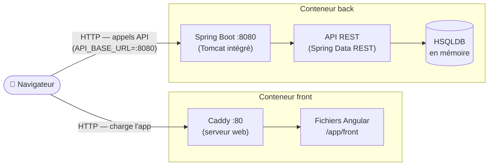
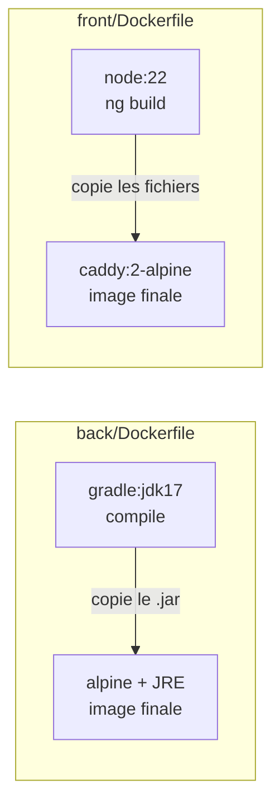
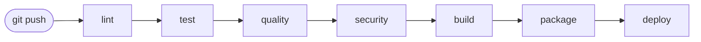
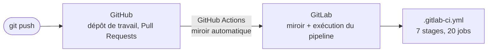

# Architecture — MicroCRM

Vue d'ensemble technique du projet : composants applicatifs, conteneurisation,
pipeline CI/CD et environnements.

---

## 1. Architecture applicative (runtime)



**Composants**

| Brique | Techno                                 | Port   | Rôle                                      |
| ------ | -------------------------------------- | ------ | ----------------------------------------- |
| Front  | Angular (statique) servi par **Caddy** | `80`   | Sert l'interface au navigateur            |
| Back   | **Spring Boot** (Tomcat intégré)       | `8080` | Expose l'API REST                         |
| Base   | **HSQLDB** _en mémoire_                | —      | Stockage (données perdues au redémarrage) |

> ⚠️ Le navigateur parle **directement** au back : le front appelle
> `http://localhost:8080` (`front/src/app/config.ts`). Caddy ne fait **pas** de
> reverse-proxy vers le back ici — les deux sont exposés séparément.

---

## 2. Modèle de données

Deux entités liées en **many-to-many** (voir `DATABASE.md` pour le détail).

```mermaid
erDiagram
    ORGANIZATION }o--o{ PERSON : "regroupe"
    ORGANIZATION { long id PK; string name }
    PERSON { long id PK; string firstName; string lastName; string email }
```

---

## 3. Conteneurisation (multi-stage build)

Chaque service = **une image**, construite en deux étapes (atelier lourd → image légère livrée).



- **Étape 1** (build) : contient tous les outils de compilation → **jetée** à la fin.
- **Étape 2** (runtime) : ne garde que l'artefact (le `.jar` / les fichiers statiques).
- Bénéfices : images plus petites, moins de surface d'attaque, build reproductible.

---

## 4. Pipeline CI/CD (GitLab)

Le pipeline compte **7 stages et 20 jobs**, exécutés dans cet ordre :



| Stage      | Jobs                                                                          | Rôle                                             |
| ---------- | ----------------------------------------------------------------------------- | ------------------------------------------------ |
| `lint`     | `lint-front`, `lint-back`, `shellcheck`                                       | ESLint, Checkstyle, analyse des scripts Bash     |
| `test`     | `test-scripts`, `test-front`, `test-back`                                     | Tests des scripts d'automatisation, Karma, JUnit |
| `quality`  | `sonar-back`, `sonar-front`, `spotbugs-back`, `coverage-gate`, `quality-gate` | Analyse Sonar, bugs, seuil de couverture         |
| `security` | `dependency-check-back`, `trivy-fs`                                           | CVE des dépendances, secrets, misconfigurations  |
| `build`    | `build-front`, `build-back`                                                   | Compilation des artefacts                        |
| `package`  | `package-back`, `package-front`                                               | Images Docker taguées par SHA + scan Trivy       |
| `deploy`   | `deploy-staging`, `deploy-production`, `rollback-production`                  | Déploiement Kubernetes et retour arrière         |

Le détail du déclenchement par branche et de la procédure de release est dans
[RELEASE.md](RELEASE.md) ; celui des scripts appelés par ces jobs dans
[SCRIPTS.md](SCRIPTS.md).

---

## 5. Environnements

| Env            | Déclencheur           | Déploiement            | Usage                 |
| -------------- | --------------------- | ---------------------- | --------------------- |
| **staging**    | branche `develop`     | **manuel**             | Validation avant prod |
| **production** | branche `main` ou tag | **manuel** (garde-fou) | Utilisateurs finaux   |

Les deux déploiements sont en `when: manual` : ils ne partent pas tout seuls, il
faut cliquer dans GitLab. Le passage de staging en automatique est décrit dans
[RELEASE.md](RELEASE.md) §6.

Chaque cible est déclarée via le mot-clé `environment:` dans `.gitlab-ci.yml`
(suivi des déploiements dans GitLab → _Operate → Environments_).

---

## 6. Hébergement du code : GitHub → GitLab

Le dépôt de travail est **GitHub**, mais le pipeline tourne sur **GitLab CI**. Les
deux sont reliés par un workflow GitHub Actions,
[`.github/workflows/mirror-to-gitlab.yaml`](.github/workflows/mirror-to-gitlab.yaml) :



À chaque push sur n'importe quelle branche ou tag, le workflow recopie toutes les
références vers GitLab, où le pipeline se déclenche.

> ⚠️ **GitLab est un miroir en lecture seule.** Le push utilise `--prune` : toute
> branche qui n'existe pas sur GitHub y est supprimée. Ne jamais committer
> directement sur GitLab, le travail serait effacé au push suivant.

Le lien du dépôt GitLab :
`https://gitlab.com/pasquietted/G-rez-le-cycle-de-vie-de-d-veloppement-logiciel`

---

## 7. Convention de nommage des branches

Le projet suit **GitFlow**. Le nommage n'est pas cosmétique : `.gitlab-ci.yml` filtre
les jobs sur le préfixe de branche, donc **une branche mal nommée ne déclenche aucun
pipeline**.

| Branche       | Rôle                           | Jobs déclenchés               |
| ------------- | ------------------------------ | ----------------------------- |
| `main`        | Code en production             | Tous, jusqu'au déploiement    |
| `develop`     | Intégration continue           | Tous, jusqu'au staging        |
| `feature/...` | Nouvelle fonctionnalité        | lint, test, quality, security |
| `release/...` | Préparation d'une version      | Tous                          |
| `hotfix/...`  | Correctif urgent en production | Tous                          |
| Tag `vX.Y.Z`  | Version livrée                 | Tous, déploiement prod        |

Le séparateur est un **slash**, pas un underscore : la règle est
`$CI_COMMIT_BRANCH =~ /^feature\//`. Une branche `feature_ma-fonctionnalite` ou
`docs/ma-doc` ne correspond à aucune règle et son pipeline ne partira jamais.
Les mots composés s'écrivent avec un tiret : `feature/initial-documentation`.

---

## ⚠️ Incohérences à corriger (état actuel du repo)

Ces points sont importants à connaître — le repo n'est **pas cohérent** en l'état :

1. **`back/Dockerfile` expose le port `4200`** alors que Spring Boot écoute sur
   **`8080`** (port par défaut, confirmé par `API_BASE_URL` côté front). Le `EXPOSE 4200`
   est trompeur → devrait être `EXPOSE 8080`.

2. **`front/src/app/config.ts` fige `API_BASE_URL = "http://localhost:8080"`.** C'est
   la seule incohérence réellement bloquante : une fois l'image front déployée sur
   Kubernetes, le navigateur du visiteur appellera `localhost`, donc l'application ne
   joindra jamais le back. → à externaliser (fichier `environment.ts` Angular, ou
   substitution au démarrage du conteneur).

3. **Aucun `.dockerignore` dans `back/` ni `front/`.** Celui de la racine est inopérant,
   puisque les jobs `package-*` buildent avec `--context ./back` et `--context ./front`.
   Conséquence : les ~330 Mo de `front/node_modules` sont envoyés au démon Docker à
   chaque build.

4. **Le front tourne en `root` dans son image**, contrairement au back qui déclare bien
   un utilisateur non privilégié. Posture de sécurité incohérente entre les deux images.

5. **HSQLDB en mémoire = pas de persistance.** Acceptable pour une démo, mais à
   mentionner : redémarrer le back efface les données. Une base externe (PostgreSQL)
   serait plus réaliste en prod.
