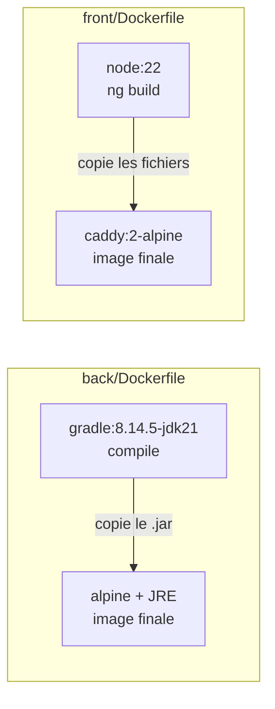
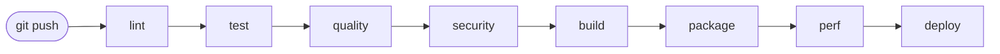
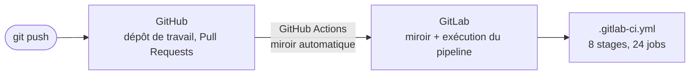

# Architecture — MicroCRM

Vue d'ensemble technique du projet : composants applicatifs, conteneurisation,
pipeline CI/CD et environnements.

---

## 1. Architecture applicative (runtime)


**Composants**

| Brique | Techno                                 | Port   | Rôle                                      |
| ------ | -------------------------------------- | ------ | ----------------------------------------- |
| Front  | Angular (statique) servi par **Caddy** | `80`   | Sert l'interface au navigateur            |
| Back   | **Spring Boot** (Tomcat intégré)       | `8080` | Expose l'API REST                         |
| Base   | **HSQLDB** _en mémoire_                | —      | Stockage (données perdues au redémarrage) |

> ⚠️ Le navigateur parle **directement** au back : le front appelle
> `http://localhost:8080` (`front/src/app/config.ts`). Caddy ne fait **pas** de
> reverse-proxy vers le back ici — les deux sont exposés séparément.

---

## 2. Modèle de données

Deux entités liées en **many-to-many** (voir `DATABASE.md` pour le détail).

```mermaid
erDiagram
    ORGANIZATION }o--o{ PERSON : "regroupe"
    ORGANIZATION { long id PK; string name }
    PERSON { long id PK; string firstName; string lastName; string email }
```

---

## 3. Conteneurisation (multi-stage build)

Chaque service = **une image**, construite en deux étapes (atelier lourd → image légère livrée).



- **Étape 1** (build) : contient tous les outils de compilation → **jetée** à la fin.
- **Étape 2** (runtime) : ne garde que l'artefact (le `.jar` / les fichiers statiques).
- Bénéfices : images plus petites, moins de surface d'attaque, build reproductible.

### Taille des images livrées

| Image   | Taille     | Base                     | Dont l'application |
| ------- | ---------- | ------------------------ | ------------------ |
| `back`  | **377 Mo** | `alpine:3.19` (11,9 Mo)  | ~365 Mo            |
| `front` | **85 Mo**  | `caddy:2-alpine` (85 Mo) | ~0,2 Mo            |

Le front est à quelques centaines de kilo-octets près sa propre image de base :
un bundle Angular optimisé pèse peu, et Caddy est un binaire unique.

Le back, lui, est dominé par `openjdk21-jre-headless` — environ 365 des 377 Mo.
C'est le prix d'un JRE complet. Un runtime taillé sur mesure avec `jlink`, ne
contenant que les modules réellement utilisés, ramènerait l'image autour de
150 Mo. Ce n'est pas fait aujourd'hui : la complexité ajoutée au Dockerfile ne
se justifie pas encore pour une application de démonstration, mais c'est la
première optimisation à envisager si la taille devient un sujet.

### Contexte de build

Chaque application a son propre `.dockerignore`. Ce n'est pas redondant avec
celui de la racine : les jobs `package-*` construisent avec `--context ./back`
et `--context ./front`, or Docker ne lit que le `.dockerignore` situé **à la
racine du contexte**. Celui du dépôt n'est donc jamais appliqué lors de ces
builds.

L'effet est loin d'être cosmétique :

| Contexte | Avant    | Après      |
| -------- | -------- | ---------- |
| `front`  | 1 195 Mo | **0,6 Mo** |
| `back`   | 51 Mo    | **0,1 Mo** |

Côté front, l'essentiel venait du cache de compilation Angular (`.angular`,
920 Mo) et de `node_modules` (329 Mo) — deux répertoires que l'image régénère
de toute façon, puisque le Dockerfile lance `npm ci` puis `ng build`.

### Utilisateur d'exécution

Les deux images tournent en **UID 1000, utilisateur non privilégié**. C'est le
même UID que celui déclaré dans les manifestes Kubernetes
(`k8s/base/*-deployment.yaml`), pour que le conteneur se comporte de façon
identique qu'on le lance avec Docker ou avec Kubernetes.

Le cas du front mérite une note : Caddy écrit dans les répertoires XDG déclarés
par son image (`/data`, `/config`), détenus par root — d'où le `chown` du
Dockerfile, sans lequel l'exécution en non-root échoue. Et il écoute sur le
port 80 sans privilège grâce à la capability de fichier
`cap_net_bind_service=ep` que porte son binaire ; c'est elle, et non le numéro
de port, qui oblige à conserver `NET_BIND_SERVICE` dans le conteneur même avec
`capabilities.drop: [ALL]` (voir [K8S.md](K8S.md) §11).

---

## 4. Pipeline CI/CD (GitLab)

Le pipeline compte **8 stages et 24 jobs**, exécutés dans cet ordre :



| Stage      | Jobs                                                                          | Rôle                                             |
| ---------- | ----------------------------------------------------------------------------- | ------------------------------------------------ |
| `lint`     | `lint-front`, `lint-back`, `shellcheck`                                       | ESLint, Checkstyle, analyse des scripts Bash     |
| `test`     | `test-scripts`, `test-front`, `test-back`                                     | Tests des scripts d'automatisation, Karma, JUnit |
| `quality`  | `sonar-back`, `sonar-front`, `spotbugs-back`, `coverage-gate`, `quality-gate` | Analyse Sonar, bugs, seuil de couverture         |
| `security` | `dependency-check-back`, `trivy-fs`                                           | CVE des dépendances, secrets, misconfigurations  |
| `build`    | `build-front`, `build-back`                                                   | Compilation des artefacts                        |
| `package`  | `package-back`, `package-front`                                               | Images Docker taguées par SHA + scan Trivy       |
| `perf`     | `k6-smoke`, `k6-load`, `k6-stress`                                            | Tests de performance k6 sur l'image construite   |
| `deploy`   | `deploy-staging`, `deploy-production`, `rollback-production`                  | Déploiement Kubernetes et retour arrière         |

Le détail du déclenchement par branche et de la procédure de release est dans
[RELEASE.md](RELEASE.md) ; celui des scripts appelés par ces jobs dans
[SCRIPTS.md](SCRIPTS.md).

---

## 5. Environnements

| Env            | Déclencheur           | Déploiement            | Usage                 |
| -------------- | --------------------- | ---------------------- | --------------------- |
| **staging**    | branche `develop`     | **manuel**             | Validation avant prod |
| **production** | branche `main` ou tag | **manuel** (garde-fou) | Utilisateurs finaux   |

Les deux déploiements sont en `when: manual` : ils ne partent pas tout seuls, il
faut cliquer dans GitLab. Le passage de staging en automatique est décrit dans
[RELEASE.md](RELEASE.md) §6.

Chaque cible est déclarée via le mot-clé `environment:` dans `.gitlab-ci.yml`
(suivi des déploiements dans GitLab → _Operate → Environments_).

---

## 6. Hébergement du code : GitHub → GitLab

Le dépôt de travail est **GitHub**, mais le pipeline tourne sur **GitLab CI**. Les
deux sont reliés par un workflow GitHub Actions,
[`.github/workflows/mirror-to-gitlab.yaml`](.github/workflows/mirror-to-gitlab.yaml) :



À chaque push sur n'importe quelle branche ou tag, le workflow recopie toutes les
références vers GitLab, où le pipeline se déclenche.

> ⚠️ **GitLab est un miroir en lecture seule.** Le push utilise `--prune` : toute
> branche qui n'existe pas sur GitHub y est supprimée. Ne jamais committer
> directement sur GitLab, le travail serait effacé au push suivant.

Le lien du dépôt GitLab :
`https://gitlab.com/pasquietted/G-rez-le-cycle-de-vie-de-d-veloppement-logiciel`

---

## 7. Convention de nommage des branches

Le projet suit **GitFlow**. Le nommage n'est pas cosmétique : `.gitlab-ci.yml` filtre
les jobs sur le préfixe de branche, donc **une branche mal nommée ne déclenche aucun
pipeline**.

| Branche       | Rôle                           | Jobs déclenchés               |
| ------------- | ------------------------------ | ----------------------------- |
| `main`        | Code en production             | Tous, jusqu'au déploiement    |
| `develop`     | Intégration continue           | Tous, jusqu'au staging        |
| `feature/...` | Nouvelle fonctionnalité        | lint, test, quality, security |
| `release/...` | Préparation d'une version      | Tous                          |
| `hotfix/...`  | Correctif urgent en production | Tous                          |
| Tag `vX.Y.Z`  | Version livrée                 | Tous, déploiement prod        |

Le séparateur est un **slash**, pas un underscore : la règle est
`$CI_COMMIT_BRANCH =~ /^feature\//`. Une branche `feature_ma-fonctionnalite` ou
`docs/ma-doc` ne correspond à aucune règle et son pipeline ne partira jamais.
Les mots composés s'écrivent avec un tiret : `feature/initial-documentation`.

---

## Limites connues et assumées

Ces points sont vrais en l'état. Ils ne sont pas des oublis : chacun est un
choix, ou une contrainte identifiée dont le coût de levée n'est pas justifié
aujourd'hui.

1. **HSQLDB vit en mémoire.** Redémarrer le back efface les données, qui sont
   recréées par `InitialDataFixture`. Acceptable pour une démonstration, mais
   deux conséquences suivent : il n'y a rien à sauvegarder, et le back ne peut
   pas dépasser **un seul replica** — à deux pods, deux bases divergeraient sans
   qu'aucune erreur ne soit levée. Une base externe (PostgreSQL) avec un
   `PersistentVolumeClaim` lèverait les deux d'un coup.

2. **Les manifestes Kubernetes n'ont jamais été appliqués sur un vrai cluster.**
   Ils se construisent et sont validés par 60 assertions sans cluster
   (`scripts/tests/validate_k8s.sh`), mais le rollout, le routage de l'Ingress
   et le comportement des sondes sous kubelet restent à observer.

3. **L'image du back pèse 377 Mo**, dont ~365 pour le JRE. Voir §3 pour la piste
   `jlink`.

4. **Le front et l'API sont sur des origines différentes** (deux hôtes
   d'Ingress), donc le CORS n'est pas décoratif : `MICROCRM_CORS_ALLOWED_ORIGINS`
   doit contenir l'hôte du front de chaque environnement, sinon le navigateur
   bloquera les requêtes.

### Corrigé depuis

Ces quatre points figuraient ici comme incohérences ; ils ne le sont plus.

| Point                                          | Résolution                                                           |
| ---------------------------------------------- | -------------------------------------------------------------------- |
| `back/Dockerfile` exposait le port `4200`      | corrigé en `8080`, le port réellement écouté                         |
| `API_BASE_URL` compilée en dur dans le bundle  | lue au démarrage depuis `/config.json` servi par Caddy               |
| Aucun `.dockerignore` dans `back/` ni `front/` | créés ; le contexte du front passe de 1 195 Mo à 0,6 Mo              |
| L'image front tournait en `root`               | tourne en UID 1000, comme le back et comme les manifestes Kubernetes |
