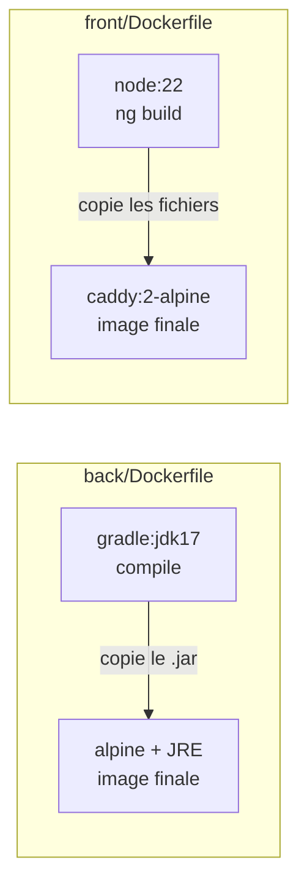
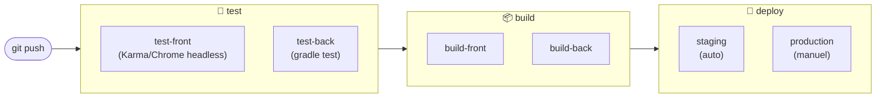

# Architecture — MicroCRM

Vue d'ensemble technique du projet : composants applicatifs, conteneurisation,
pipeline CI/CD et environnements.

---

## 1. Architecture applicative (runtime)


**Composants**

| Brique | Techno                                 | Port   | Rôle                                      |
| ------ | -------------------------------------- | ------ | ----------------------------------------- |
| Front  | Angular (statique) servi par **Caddy** | `80`   | Sert l'interface au navigateur            |
| Back   | **Spring Boot** (Tomcat intégré)       | `8080` | Expose l'API REST                         |
| Base   | **HSQLDB** _en mémoire_                | —      | Stockage (données perdues au redémarrage) |

> ⚠️ Le navigateur parle **directement** au back : le front appelle
> `http://localhost:8080` (`front/src/app/config.ts`). Caddy ne fait **pas** de
> reverse-proxy vers le back ici — les deux sont exposés séparément.

---

## 2. Modèle de données

Deux entités liées en **many-to-many** (voir `DATABASE.md` pour le détail).

```mermaid
erDiagram
    ORGANIZATION }o--o{ PERSON : "regroupe"
    ORGANIZATION { long id PK; string name }
    PERSON { long id PK; string firstName; string lastName; string email }
```

---

## 3. Conteneurisation (multi-stage build)

Chaque service = **une image**, construite en deux étapes (atelier lourd → image légère livrée).



- **Étape 1** (build) : contient tous les outils de compilation → **jetée** à la fin.
- **Étape 2** (runtime) : ne garde que l'artefact (le `.jar` / les fichiers statiques).
- Bénéfices : images plus petites, moins de surface d'attaque, build reproductible.

---

## 4. Pipeline CI/CD (GitLab)



| Stage    | Jobs                            | Rôle                                |
| -------- | ------------------------------- | ----------------------------------- |
| `test`   | `test-front`, `test-back`       | Tests unitaires front + back        |
| `build`  | `build-front`, `build-back`     | Compilation des artefacts           |
| `deploy` | `deploy-staging`, `deploy-prod` | Déploiement vers les environnements |

---

## 5. Environnements

| Env            | Déclencheur       | Déploiement            | Usage                 |
| -------------- | ----------------- | ---------------------- | --------------------- |
| **staging**    | branche `develop` | **automatique**        | Validation avant prod |
| **production** | branche `main`    | **manuel** (garde-fou) | Utilisateurs finaux   |

Chaque cible est déclarée via le mot-clé `environment:` dans `.gitlab-ci.yml`
(suivi des déploiements dans GitLab → _Operate → Environments_).

---

## ⚠️ Incohérences à corriger (état actuel du repo)

Ces points sont importants à connaître — le repo n'est **pas cohérent** en l'état :

1. **`docker-compose.yml` ne correspond pas à l'appli.** Il décrit un service
   `workshop-organizer` connecté à **PostgreSQL**, alors que le code actuel utilise
   **HSQLDB en mémoire** (aucun driver PostgreSQL dans `back/build.gradle`, aucune
   config `spring.datasource`). Ce compose **ne démarrerait pas** l'appli telle quelle,
   et n'orchestre pas non plus le front. → à réécrire (front + back) OU à assumer comme
   _cible_ (migrer vers PostgreSQL, ce qui serait un vrai plus DevOps : données persistantes).

2. **`back/Dockerfile` expose le port `4200`** alors que Spring Boot écoute sur
   **`8080`** (port par défaut, confirmé par `API_BASE_URL` côté front). Le `EXPOSE 4200`
   est trompeur → devrait être `EXPOSE 8080`.

3. **HSQLDB en mémoire = pas de persistance.** Acceptable pour une démo, mais à
   mentionner : redémarrer le back efface les données. Une base externe (PostgreSQL)
   serait plus réaliste en prod.
