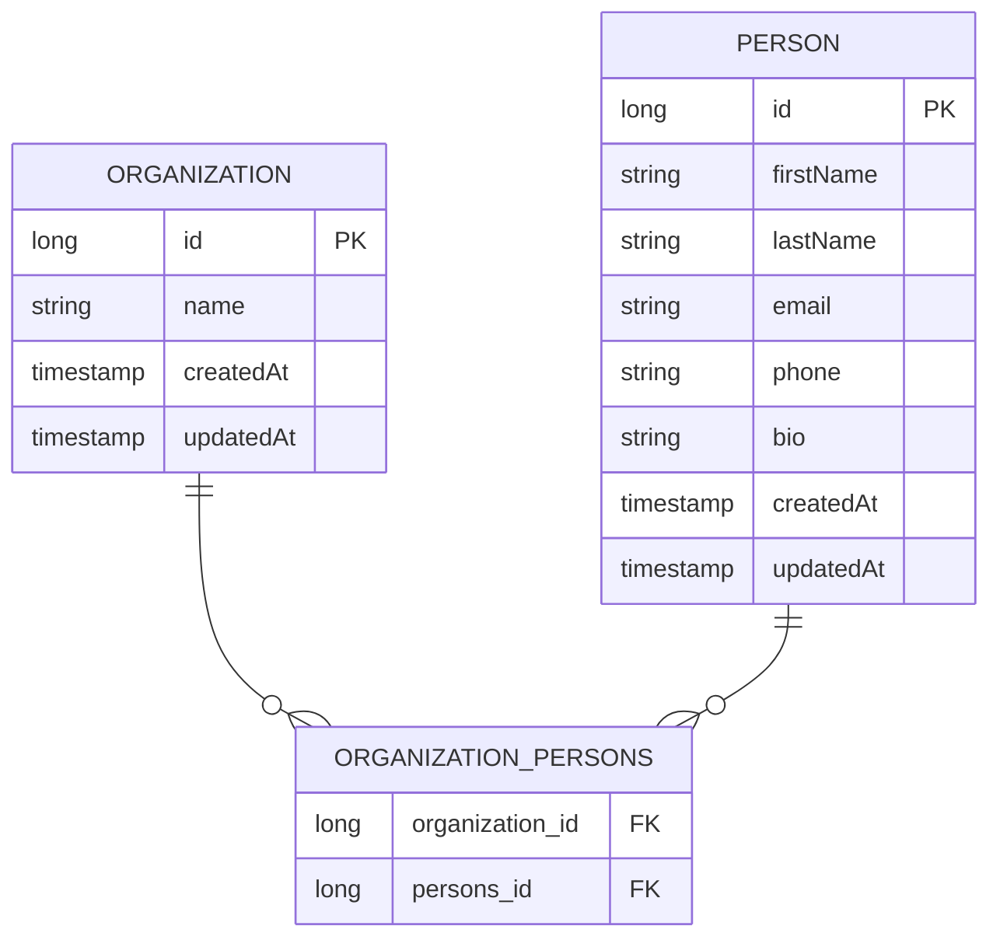

# Database — MicroCRM

This document describes the data model of the **MicroCRM** backend (Spring Boot / Spring Data JPA).

## Overview

| Item              | Value                                                                                                             |
| ----------------- | ----------------------------------------------------------------------------------------------------------------- |
| ORM               | Spring Data JPA / Hibernate                                                                                       |
| Database engine   | [HSQLDB](http://hsqldb.org/) in-memory **by default**; PostgreSQL when the datasource is configured — see below   |
| Schema management | Auto-generated by Hibernate from the JPA entities (no migration files)                                            |
| API layer         | Spring Data REST — repositories are exposed automatically as HAL/REST endpoints                                   |
| Seed data         | `InitialDataFixture` loads one organization + one person on first startup (only when the `person` table is empty) |

The schema is derived entirely from the JPA-annotated entity classes in
`back/src/main/java/com/openclassroom/devops/orion/microcrm/`. There is no SQL DDL committed to the repo; Hibernate creates the tables at boot time.

## Which engine runs where

Saying "the engine is HSQLDB" is no longer accurate on its own. The engine is
chosen at runtime by three standard Spring variables — no profile, no extra
properties file:

| Context                              | Engine                 | How it is selected                                                                         |
| ------------------------------------ | ---------------------- | ------------------------------------------------------------------------------------------ |
| `cd back && ./gradlew test`, locally | HSQLDB, in-memory      | `SPRING_DATASOURCE_*` unset — nothing to install, nothing to start                         |
| CI jobs `test-back`, `mutation-back` | **PostgreSQL 16**      | `postgres:16-alpine` started as a GitLab service; `SPRING_DATASOURCE_*` point at its alias |
| The application image, run as-is     | HSQLDB, in-memory      | same default — this is what `docker compose up` and the k6 perf jobs exercise              |
| A deployment with a real database    | whatever the URL names | the same three variables, injected by the environment                                      |

Why the CI does not settle for the in-memory default: **nobody reviews this
schema before it exists.** It is inferred from the entities by Hibernate, so the
first reader is the engine itself — and engines disagree. Loose type coercion,
identifier case, row order without an `ORDER BY`, when a constraint is actually
checked: HSQLDB tolerates what PostgreSQL rejects. A green suite on HSQLDB says
nothing about PostgreSQL, which is the engine the target architecture deploys
(`docs/schema-architecture.md` §4). Running the suite against a real PostgreSQL
moves that discovery from the first production start-up to a merge request.

The local default is kept deliberately: a test suite that requires a running
database before it can be launched is a test suite people stop launching.
[README.md](README.md) shows how to reproduce the CI run on a workstation with a
throwaway container.

## Entities

### `Person`

Source: `Person.java`

| Column      | Type        | Notes                                    |
| ----------- | ----------- | ---------------------------------------- |
| `id`        | `long` (PK) | `@GeneratedValue(strategy = AUTO)`       |
| `firstName` | `String`    |                                          |
| `lastName`  | `String`    |                                          |
| `email`     | `String`    | Queryable via `findByEmail`              |
| `phone`     | `String`    |                                          |
| `bio`       | `String`    |                                          |
| `createdAt` | `timestamp` | `@CreationTimestamp` — set on insert     |
| `updatedAt` | `timestamp` | `@UpdateTimestamp` — set on every update |

On delete, the `@PreRemove` hook (`remoteFromOrganization`) detaches the person
from every organization it belongs to before the row is removed.

### `Organization`

Source: `Organization.java`

| Column      | Type        | Notes                                    |
| ----------- | ----------- | ---------------------------------------- |
| `id`        | `long` (PK) | `@GeneratedValue(strategy = AUTO)`       |
| `name`      | `String`    |                                          |
| `createdAt` | `timestamp` | `@CreationTimestamp` — set on insert     |
| `updatedAt` | `timestamp` | `@UpdateTimestamp` — set on every update |

## Relationship

`Person` and `Organization` have a **many-to-many** relationship:

- An organization can contain many persons.
- A person can belong to many organizations.

The relationship is mapped with `@ManyToMany`:

- **Owning side:** `Organization.persons` — `@ManyToMany(cascade = CascadeType.ALL)`.
  Because `cascade = ALL`, persisting/removing an organization cascades to its persons.
- **Inverse side:** `Person.organizations` — `@ManyToMany(mappedBy = "persons")`.

Hibernate materializes this as a **join table** (default name `organization_persons`)
holding the two foreign keys:

| Column            | References        |
| ----------------- | ----------------- |
| `organization_id` | `Organization.id` |
| `persons_id`      | `Person.id`       |

## Entity–Relationship diagram

## Repositories (REST endpoints)

Both repositories extend `PagingAndSortingRepository` + `CrudRepository` and are
annotated with `@RepositoryRestResource`, so Spring Data REST exposes standard
CRUD + pagination endpoints automatically.

| Repository               | Entity         | Notable query                                                  |
| ------------------------ | -------------- | -------------------------------------------------------------- |
| `PersonRepository`       | `Person`       | `findByEmail(email)` → `/persons/search/findByEmail?email=...` |
| `OrganizationRepository` | `Organization` | —                                                              |

`SpringDataRestCustomization` exposes entity IDs in the REST payloads
(`exposeIdsFor(Person, Organization)`) and configures CORS
(`GET, POST, PUT, PATCH, DELETE`, restricted to the origins listed in
`microcrm.cors.allowed-origins` / `MICROCRM_CORS_ALLOWED_ORIGINS` — never `*`).

## Seed data

On first startup, when the `person` table is empty (`InitialDataFixture.canBeLoaded()`),
the app inserts:

- **Organization:** `Orion Incorporated`
- **Person:** John Doe (`jdoe@example.net`), linked to that organization.

## Persistence and backup

This section is about the **deployed** application, which runs on the default
engine: the PostgreSQL of the CI lives and dies with its job and holds nothing
worth keeping.

The database is **in-memory** (`mem:` HSQLDB) and reseeded at every startup.
There is no file, no volume and no snapshot: a restarted pod starts from an
empty schema that `InitialDataFixture` immediately repopulates.

This has one consequence worth stating plainly: **there is nothing to back up**.
A backup job on this application would copy nothing. It is also why the backend
is pinned to a single replica — two pods would hold two divergent datasets with
no error raised.

What it would take to make the data persistent, what a backup procedure would
then look like, and how a whole environment is rebuilt from the repository
alone, are documented in [RELEASE.md](RELEASE.md) §9.
