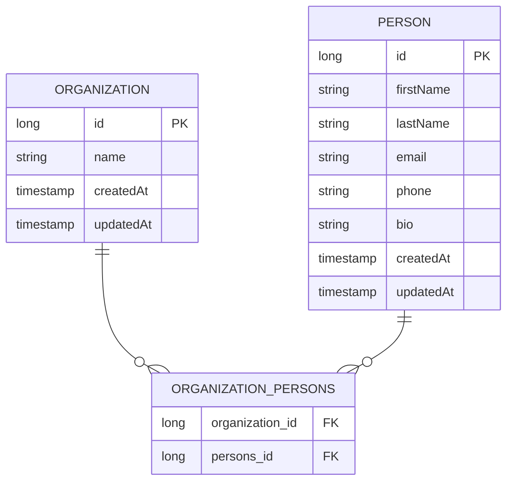

# Database — MicroCRM

This document describes the data model of the **MicroCRM** backend (Spring Boot / Spring Data JPA).

## Overview

| Item              | Value                                                                                                             |
| ----------------- | ----------------------------------------------------------------------------------------------------------------- |
| ORM               | Spring Data JPA / Hibernate                                                                                       |
| Database engine   | [HSQLDB](http://hsqldb.org/) (`runtimeOnly 'org.hsqldb:hsqldb'`) — in-memory by default                           |
| Schema management | Auto-generated by Hibernate from the JPA entities (no migration files)                                            |
| API layer         | Spring Data REST — repositories are exposed automatically as HAL/REST endpoints                                   |
| Seed data         | `InitialDataFixture` loads one organization + one person on first startup (only when the `person` table is empty) |

The schema is derived entirely from the JPA-annotated entity classes in
`back/src/main/java/com/openclassroom/devops/orion/microcrm/`. There is no SQL DDL committed to the repo; Hibernate creates the tables at boot time.

## Entities

### `Person`

Source: `Person.java`

| Column      | Type        | Notes                                    |
| ----------- | ----------- | ---------------------------------------- |
| `id`        | `long` (PK) | `@GeneratedValue(strategy = AUTO)`       |
| `firstName` | `String`    |                                          |
| `lastName`  | `String`    |                                          |
| `email`     | `String`    | Queryable via `findByEmail`              |
| `phone`     | `String`    |                                          |
| `bio`       | `String`    |                                          |
| `createdAt` | `timestamp` | `@CreationTimestamp` — set on insert     |
| `updatedAt` | `timestamp` | `@UpdateTimestamp` — set on every update |

On delete, the `@PreRemove` hook (`remoteFromOrganization`) detaches the person
from every organization it belongs to before the row is removed.

### `Organization`

Source: `Organization.java`

| Column      | Type        | Notes                                    |
| ----------- | ----------- | ---------------------------------------- |
| `id`        | `long` (PK) | `@GeneratedValue(strategy = AUTO)`       |
| `name`      | `String`    |                                          |
| `createdAt` | `timestamp` | `@CreationTimestamp` — set on insert     |
| `updatedAt` | `timestamp` | `@UpdateTimestamp` — set on every update |

## Relationship

`Person` and `Organization` have a **many-to-many** relationship:

- An organization can contain many persons.
- A person can belong to many organizations.

The relationship is mapped with `@ManyToMany`:

- **Owning side:** `Organization.persons` — `@ManyToMany(cascade = CascadeType.ALL)`.
  Because `cascade = ALL`, persisting/removing an organization cascades to its persons.
- **Inverse side:** `Person.organizations` — `@ManyToMany(mappedBy = "persons")`.

Hibernate materializes this as a **join table** (default name `organization_persons`)
holding the two foreign keys:

| Column            | References        |
| ----------------- | ----------------- |
| `organization_id` | `Organization.id` |
| `persons_id`      | `Person.id`       |

## Entity–Relationship diagram

## Repositories (REST endpoints)

Both repositories extend `PagingAndSortingRepository` + `CrudRepository` and are
annotated with `@RepositoryRestResource`, so Spring Data REST exposes standard
CRUD + pagination endpoints automatically.

| Repository               | Entity         | Notable query                                                  |
| ------------------------ | -------------- | -------------------------------------------------------------- |
| `PersonRepository`       | `Person`       | `findByEmail(email)` → `/persons/search/findByEmail?email=...` |
| `OrganizationRepository` | `Organization` | —                                                              |

`SpringDataRestCustomization` exposes entity IDs in the REST payloads
(`exposeIdsFor(Person, Organization)`) and configures CORS
(`GET, POST, PATCH, DELETE` from any origin).

## Seed data

On first startup, when the `person` table is empty (`InitialDataFixture.canBeLoaded()`),
the app inserts:

- **Organization:** `Orion Incorporated`
- **Person:** John Doe (`jdoe@example.net`), linked to that organization.
