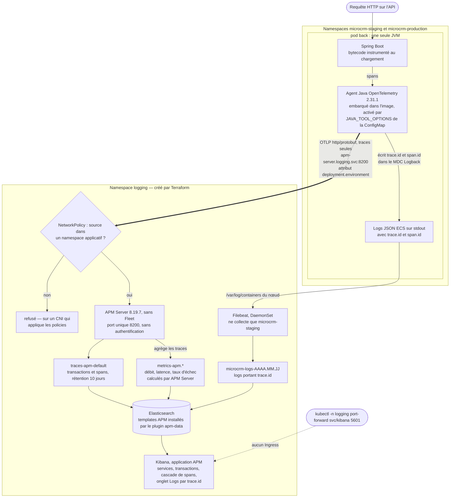
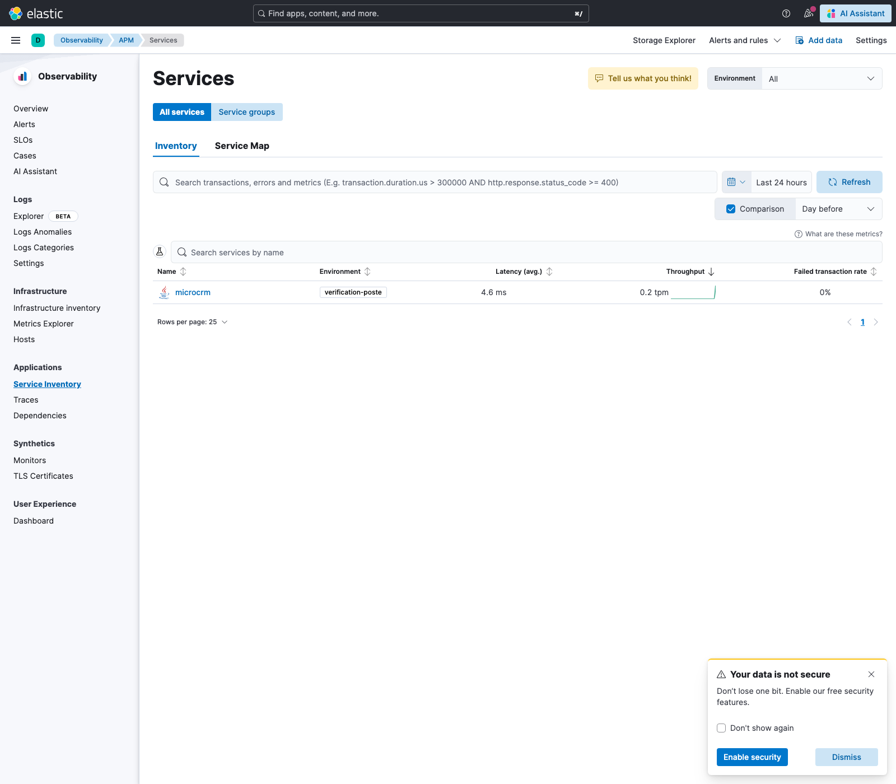
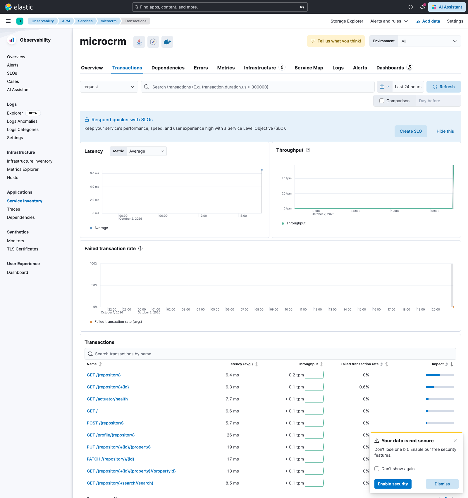
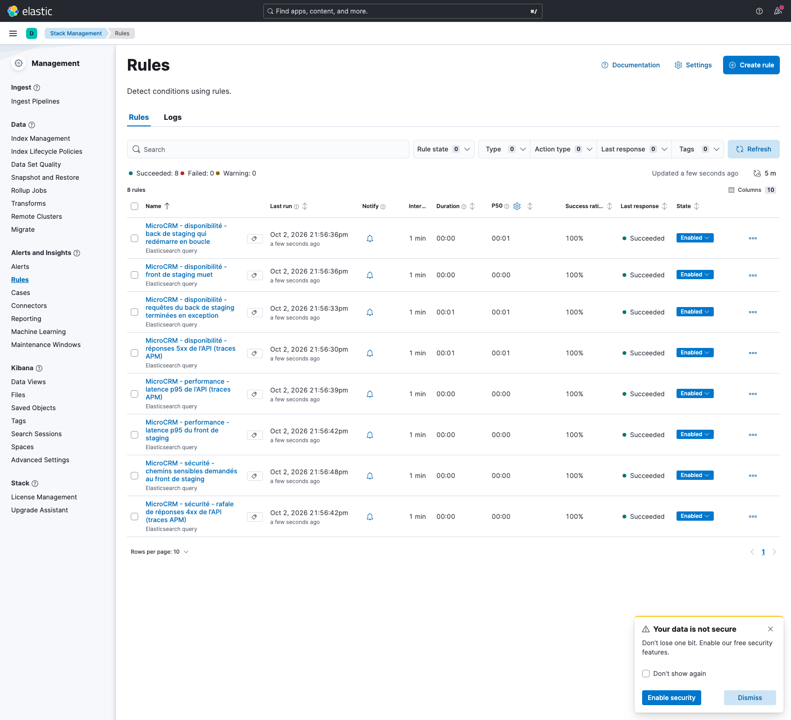
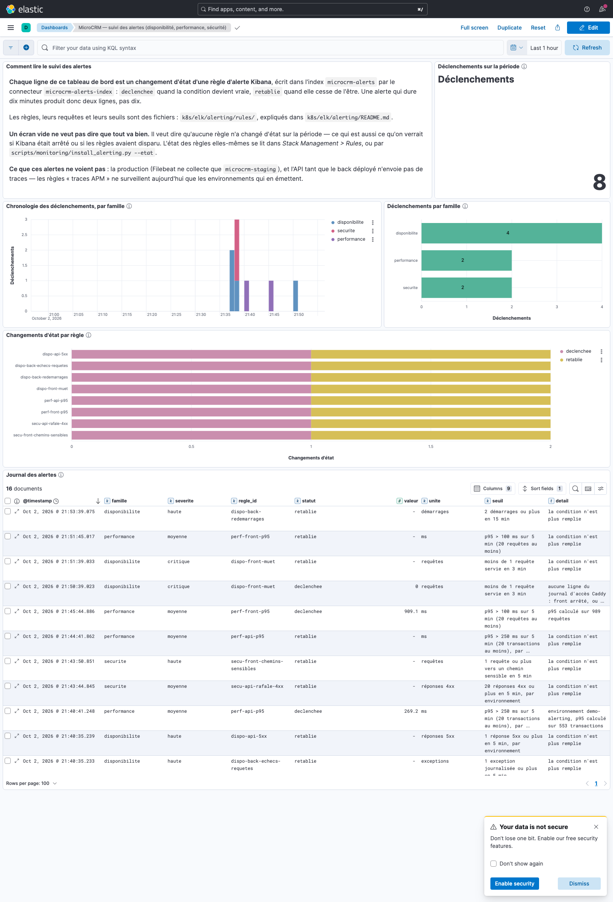

# Supervision — la stack ELK, les traces et l'alerting

Centralisation des logs de MicroCRM : Elasticsearch, Kibana et Filebeat sur le
cluster local. Depuis le 2026-10-01, **traces de l'API** : un agent
OpenTelemetry dans le back, APM Server dans la même stack. Et depuis le
2026-10-02, **alerting** : huit règles Kibana versionnées, qui écrivent dans un
index et dans le journal de Kibana. Ce document dit ce que la chaîne fait, ce
qu'elle ne fait pas, et les pièges qu'il a fallu écarter pour qu'elle
fonctionne.

Les trois volets n'en sont pas au même point. **Les logs sont en service**
depuis le 2026-08-16. **Les traces sont écrites et éprouvées depuis le poste,
mais pas encore déployées** : au 2026-10-02, les pods du cluster n'en émettent
aucune (§10.4). **L'alerting est installé sur le cluster et ses huit règles ont
été déclenchées une fois, volontairement** (§11) ; il n'envoie aucune
notification hors de Kibana.

**État : la chaîne des logs est déployée et vérifiée de bout en bout.** Un log
écrit par le pod `back` se retrouve dans Elasticsearch, décodé et enrichi.

La vérification initiale, à la mise en service (2026-08-16) :

| Vérification                              | Résultat                                                              |
| ----------------------------------------- | --------------------------------------------------------------------- |
| Rollout Elasticsearch / Kibana / Filebeat | les trois `Running`                                                   |
| Documents indexés                         | 50, dont **36 du conteneur `back`**                                   |
| Provenance                                | **100 % `microcrm-staging`** — aucun projet voisin collecté           |
| Champs ECS décodés                        | `log.level`, `log.logger`, `service.name`, `process.thread.name`      |
| Métadonnées Kubernetes                    | `kubernetes.pod.name`, `kubernetes.namespace`, `container.image.name` |

L'état relevé le 2026-10-02, en fin de journée — les compteurs de logs bougent
d'une minute à l'autre, la collecte étant continue :

| Vérification                               | Résultat                                                                                       |
| ------------------------------------------ | ---------------------------------------------------------------------------------------------- |
| Pods du namespace `logging`                | Elasticsearch, Kibana, APM Server et Filebeat `1/1`, tous en 8.19.7                            |
| Documents `microcrm-logs-*`                | **92 175**, tous de `microcrm-staging` : la production n'est pas collectée                     |
| Niveaux journalisés par le back (47 jours) | 325 `INFO`, 49 `WARN`, 0 `ERROR` avant les essais d'alerting                                   |
| Traces venues du cluster                   | **0** — les images déployées précèdent l'agent (§10.4)                                         |
| Traces d'un conteneur local                | 325 transactions, 1 211 spans, latence par route (§10.4)                                       |
| Règles d'alerte                            | **8** installées, activées, dernière exécution réussie, 0 alerte active après les essais (§11) |
| Index `microcrm-alerts`                    | 16 documents : 8 déclenchements et 8 rétablissements, tous provoqués (§11.3)                   |
| Index `microcrm-security`                  | 966 documents, produits par `collect_security.py` sur des scans rejoués (§8)                   |
| Index `microcrm-dora`                      | 26 documents ; réalimenté le 2026-10-02, il ne l'avait pas été depuis le 2026-08-16 (§9)       |
| Tableaux de bord versionnés                | **5** fichiers NDJSON, 69 objets sauvegardés (§8)                                              |

## 1. Le manque que ça comble

`QUALITY.md` §6 l'annonçait sans détour : les contrôles du projet agissent tous
**avant** le déploiement. Une fois l'application en marche, plus rien ne disait
si elle répondait ni ce qu'elle racontait. Le seul moyen de lire un log était
`kubectl logs`, c'est-à-dire un pod à la fois, sans historique — un pod
redémarré emportait ses logs avec lui.

Les logs ont comblé ce premier manque. Il en restait un second, écrit en toutes
lettres au §5 : **aucune mesure de la latence de l'API**. Les traces (§10) sont
faites pour le combler, et lui seulement — le CPU et la mémoire des pods ne sont
toujours mesurés par rien (§12). Un troisième manque tenait en une phrase :
**rien ne prévenait personne**. L'alerting (§11) y répond en partie — il
détecte et consigne, il ne notifie pas hors de Kibana.

## 2. La chaîne, maillon par maillon

```
pod back ─┐                                    ┌─ Elasticsearch ─ Kibana
          ├─ stdout ─ /var/log/containers ─ Filebeat ─┘
pod front ┘            (sur le nœud)
```

1. **Le back écrit du JSON au format ECS** — pas du texte. Sans cela,
   Elasticsearch reçoit une chaîne opaque et Kibana ne sait rien filtrer.
2. **Filebeat**, en DaemonSet, lit les fichiers de log du nœud, décode le JSON,
   et ajoute les métadonnées Kubernetes (pod, namespace, image).
3. **Elasticsearch** indexe dans un _data stream_ dédié au projet.
4. **Kibana** lit Elasticsearch.

Un second chemin est décrit depuis le 2026-10-01 — celui des traces, du pod
`back` à APM Server. Il a sa propre section (§10) et son propre schéma.

## 3. Les logs applicatifs : deux formats, un profil

Le _structured logging_ natif de Spring Boot n'est arrivé qu'en 3.4, après le
choix fait ici sur la 3.2.5. La bascule passe donc par un encodeur Logback,
`co.elastic.logging:logback-ecs-encoder:1.7.0`, choisi plutôt que l'encodeur
Logstash parce qu'il émet directement le schéma qu'attendent Elasticsearch et
Kibana ; l'autre aurait imposé de renommer chaque champ, donc de maintenir une
traduction en double.

`back/src/main/resources/logback-spring.xml` rend **deux** formats :

| Contexte               | Format   | Pourquoi                                             |
| ---------------------- | -------- | ---------------------------------------------------- |
| Poste de développement | texte    | du JSON sur une console est illisible pour un humain |
| Conteneur              | JSON ECS | c'est ce que la chaîne sait exploiter                |

La bascule se fait par le profil Spring `container`, posé par la clé
`SPRING_PROFILES_ACTIVE` de la ConfigMap `microcrm-config`.

⚠️ **Sans cette clé, le pod journalise en texte sans que rien ne le signale**, et
Filebeat déverse dans Elasticsearch des lignes que Kibana ne sait pas filtrer.
Le défaut lisible-par-l'humain est délibéré côté application ; c'est donc la
ConfigMap, et elle seule, qui décide. Elle existe en **deux exemplaires** —
`k8s/base/configmap.yaml` et `helm/microcrm/templates/configmap.yaml` — et
l'assertion d'équivalence de `scripts/tests/validate_k8s.sh` échouerait en
nommant le champ si l'un des deux était oublié.

## 4. Filebeat ne collecte pas tout, et c'est délibéré

**Ce cluster n'est pas dédié à MicroCRM.** Il héberge aussi les namespaces `dev`
et `staging` (projets `olympic-games-app` et `workshop-organizer`) et quatre pods
dans `default`. Un Filebeat non filtré y ingérerait les logs de projets tiers :
ce n'est pas une question de volume, c'est une question de périmètre.

L'autodiscover ne collecte donc que le namespace de l'application, et ce
namespace est une valeur de configuration, pas une chaîne enfouie dans le YAML.
Vérifié après coup : sur 50 documents, **100 % viennent de `microcrm-staging`**.

**Deux décodages JSON, et un seul à la racine.** Le back produit de l'ECS, décodé
à la racine. Le front (Caddy) écrit lui aussi du JSON, mais **non-ECS**, dont les
champs portent les mêmes noms que ceux de Filebeat sans avoir la même forme. Un
décodage appliqué à tous les conteneurs faisait rejeter ses documents :

```
document_parsing_exception: object mapping for [file] tried to parse field [file] as object
```

Une collision de mapping est **irréversible** : une fois le champ typé dans
l'index, aucun document contradictoire n'y entrera plus. Le journal du front est
donc décodé sous le préfixe `caddy`, ce qui isole ses champs de l'espace ECS et
laisse les deux formats cohabiter.

## 5. La latence : d'où elle vient, et pourquoi elle n'existait pas

Il n'y avait, au départ, **aucune donnée de latence dans toute la chaîne**. Les
logs applicatifs du back portent ce que l'application raconte, pas le temps
qu'elle met ; et le Caddyfile n'avait aucune directive `log`, donc le front
n'écrivait que ses journaux internes de démarrage et de maintenance TLS. Un
écran « latence » construit là-dessus aurait été décoratif.

Le journal d'accès de Caddy a donc été activé (`front/Caddyfile`). C'est la
seule source qui voit réellement passer le trafic, et elle porte les trois
mesures d'un coup : `caddy.status`, `caddy.duration` et le simple comptage.

Mesuré après 105 requêtes :

```
p50 = 0,14 ms     p95 = 1,60 ms     p99 = 3,11 ms
```

⚠️ **C'est la latence vue par le serveur web, pas par l'API.** Caddy sert le
bundle Angular et `/config.json` ; les appels à l'API partent du navigateur vers
un hôte distinct et ne passent pas par lui. Mesurer la latence de l'API
demandait de l'instrumenter elle-même : c'est l'objet des traces (§10), écrites
depuis le 2026-10-01 et pas encore déployées. Les deux mesures ne se remplacent
pas — celle-ci reste la seule qui voie le front.

⚠️ **Le front ne produira quasiment jamais de 4xx.** C'est une application
Angular servie avec `try_files {path} /index.html` : tout chemin inconnu renvoie
`200` avec la page, à charge pour le routeur Angular de décider. Vérifié — 12
requêtes vers des chemins inexistants ont toutes renvoyé `200`. Les erreurs
réelles se lisent donc côté back, dans `log.level`.

## 6. Le dimensionnement, et pourquoi il tient

Point de vigilance explicite du brief : une stack sous-dimensionnée ne démarre
pas. Les chiffres, et la règle qui les gouverne :

| Composant     | requests      | limits         | tas                    |
| ------------- | ------------- | -------------- | ---------------------- |
| Elasticsearch | 500m / 1536Mi | 2 CPU / 2Gi    | 1 Gio (`ES_JAVA_OPTS`) |
| Kibana        | 200m / 768Mi  | 1 CPU / 1536Mi | 768 Mio                |
| Filebeat      | 100m / 128Mi  | 500m / 256Mi   | —                      |

**La limite mémoire vaut le double du tas.** Un conteneur JVM dont la limite
égale le tas est tué par l'OOM killer au premier pic hors-tas — metaspace, cache
de code, piles de threads. C'est la cause la plus banale d'une stack ELK qui
« ne démarre pas » sans message utile.

Le namespace porte un `ResourceQuota` créé par Terraform
(`terraform/environments/logging/`), calé sur le **pic d'un déploiement** et non
sur l'état stable. Le calcul du pic diffère de celui des environnements
applicatifs, parce que les trois composants n'ont pas la même stratégie :

- **Elasticsearch est en `Recreate`**, pas en `RollingUpdate`. Son PVC est
  `ReadWriteOnce` et son répertoire de données verrouillé par `node.lock` : un
  second pod resterait bloqué en `ContainerCreating`, pendant que l'ancien reste
  en place — un déploiement qui ne finit jamais. Son pic vaut donc **1 pod**.
- Kibana surge à 2. Filebeat est un DaemonSet : il remplace sans ajouter.

**Vérifié en conditions réelles**, en relançant Kibana et en observant le quota
pendant le rollout :

```
$ kubectl -n logging describe quota logging-quota      # pendant le rollout
limits.memory    5376Mi  6Gi
requests.memory  3200Mi  4Gi
pods             4       12
```

Ce sont exactement les valeurs calculées dans `terraform.tfvars`, au mégaoctet
près. C'est aussi la première fois qu'un quota posé par Terraform est confronté à
une charge réelle — ce que `TERRAFORM.md` §9.4 listait comme non vérifié.

## 7. Les pièges écartés

Ils sont documentés parce qu'ils se reproduiront.

**`vm.max_map_count`.** Elasticsearch exige 262144 et refuse de démarrer sinon.
La parade habituelle est un initContainer **privilégié** — inacceptable ici, le
projet impose `runAsNonRoot` et `allowPrivilegeEscalation: false` partout, et
`validate_k8s.sh` le vérifie. La stack utilise `node.store.allow_mmap: false` :
accès disque moins efficace, mais aucun conteneur privilégié dans un cluster
partagé avec d'autres projets.

**Filebeat doit lire des fichiers appartenant à root.** Les journaux sont en
`0640 root:root` derrière des répertoires `0710`. Plutôt qu'un conteneur
privilégié ou un UID root, Filebeat tourne en `runAsUser: 1000` avec
`runAsGroup: 0` : le groupe root donne exactement le droit de lecture requis,
sans UID root, sans capability ajoutée, et tous les montages hôte sont en
`readOnly`.

**Elasticsearch ne peut pas tourner en `readOnlyRootFilesystem`.** Son point
d'entrée crée `config/elasticsearch.keystore` et écrit sous `logs/`, dans la même
arborescence que `jvm.options` et `modules` — y monter des `emptyDir` empêche le
démarrage. C'est la seule exception au socle de sécurité du projet ; Kibana et
Filebeat restent en `true`.

**En 8.x, Filebeat écrit dans des _data streams_**, pas dans des index. D'où le
nom `.ds-microcrm-logs-…` dans `_cat/indices`, et `setup.ilm.enabled: false`
comme contrepartie d'un nommage propre au projet.

## 8. Les tableaux de bord, et pourquoi ils sont dans le dépôt

**Cinq tableaux de bord**, un fichier chacun dans `k8s/elk/dashboards/`. Le
premier date de la mise en service ; les quatre autres ont été ajoutés ou
refondus le 2026-10-02.

| Fichier                | Ce qu'il montre                                                                                           | Objets | Données lues                                           |
| ---------------------- | --------------------------------------------------------------------------------------------------------- | ------ | ------------------------------------------------------ |
| `microcrm.ndjson`      | Supervision : volume par conteneur, latence du front, erreurs applicatives et HTTP, statuts, logs récents | 8      | `microcrm-logs*`                                       |
| `dora.ndjson`          | Les quatre indicateurs DORA, les tentatives, les motifs d'échec, la chronologie (§9)                      | 13     | `microcrm-dora`                                        |
| `securite.ndjson`      | Constats Trivy par sévérité, par cible et dans le temps ; exceptions et leur échéance ; erreurs du back   | 22     | `microcrm-security`, `microcrm-logs*`, `microcrm-dora` |
| `disponibilite.ndjson` | Sondes servies par le front, démarrages du back, présence de logs, débit et latence vus par APM           | 18     | `microcrm-logs*`, `traces-apm*`, `microcrm-dora`       |
| `alertes.ndjson`       | Suivi des alertes : déclenchements par famille et par règle, journal des changements d'état (§11)         | 8      | `microcrm-alerts`                                      |

Le détail panneau par panneau, et la confrontation de chaque valeur affichée à
l'agrégation Elasticsearch équivalente, sont dans
`k8s/elk/dashboards/README.md`. Trois points à connaître avant de les lire :

- **Le tableau de sécurité est alimenté par `scripts/ci/collect_security.py`**
  (`SCRIPTS.md`), qui transforme les rapports JSON de Trivy et de
  Dependency-Check en documents de l'index `microcrm-security`. Son historique
  est **rejoué** : huit commits scannés le 2026-10-02 avec la base de
  vulnérabilités du jour, datés du commit. Aucun rapport Dependency-Check réel
  n'y a été collecté, et le collecteur n'a jamais lu les rapports publiés par un
  pipeline — ces jobs n'ont pas encore tourné.
- **Le tableau de disponibilité ne mesure pas une disponibilité.** Il montre une
  présence de logs, en staging seulement, sur un minikube éteint la nuit : 189
  heures sur 360 portent au moins une sonde, et ce n'est pas un taux de service.
  Ses panneaux APM décrivent les conteneurs d'essai lancés sur le poste, pas les
  pods déployés.
- **Le tableau DORA a été refondu.** Construit le 2026-08-16, quand rien n'avait
  été déployé, il affirmait encore « aucun déploiement réussi » dans son titre et
  « Non mesurable » dans deux panneaux de texte écrits en dur. Il s'intitule
  désormais « MicroCRM — métriques DORA (quatre indicateurs, fenêtre de
  30 jours) », ses indicateurs sont des tuiles qui lisent la dernière collecte,
  et sa période par défaut est passée de 90 à 30 jours — la fenêtre du
  collecteur.

Le premier tableau, celui de la supervision, tient en six panneaux : volume par
conteneur, latence (p50/p95/p99), erreurs applicatives, erreurs HTTP,
répartition des statuts, et une table des logs récents. C'est sur lui que
portent les vérifications qui suivent.

**Le livrable n'est pas « des écrans dans Kibana », c'est un fichier.** Un
tableau de bord qui n'existe que dans une instance disparaît avec elle — et
celle-ci tourne sur un `emptyDir` de poste de développement. Les huit objets
sauvegardés sont donc exportés dans `k8s/elk/dashboards/microcrm.ndjson`, vue de
données comprise : un export qui l'oublierait produirait à la réimportation des
panneaux vides et un message obscur.

Vérifié en supprimant d'abord les objets de l'instance, pour que le test soit
froid et non un simple écrasement :

```
$ curl -X POST '…/api/saved_objects/_import?overwrite=true' \
    -H 'kbn-xsrf: true' --form file=@k8s/elk/dashboards/microcrm.ndjson
{"success": true, "successCount": 8, "warnings": []}
```

Et chaque panneau a été confronté à la même agrégation jouée directement contre
Elasticsearch : mêmes chiffres des deux côtés, y compris la latence après
conversion des secondes en millisecondes.

⚠️ **L'unité de `caddy.duration` est déclarée dans la vue de données**
(`fieldFormatMap`, secondes → millisecondes), pas dans une formule de chaque
panneau. Un panneau ajouté demain en hérite ; c'est aussi ce qui rend la vue de
données indispensable à l'export.

⚠️ **Un NDJSON écrit à la main ne s'importe pas.** Sans `typeMigrationVersion`,
Kibana rejoue toute la chaîne de migration 7.x → 8.x et échoue sur
`Cannot read properties of undefined (reading 'layers')`. Les objets doivent
être créés par l'API puis exportés — jamais rédigés à la main. C'est écrit dans
`k8s/elk/dashboards/README.md`, avec la commande de régénération. Les quatre
fichiers du 2026-10-02 suivent la règle : leurs objets ont été créés par l'API,
contrôlés à l'écran, puis exportés par Kibana. Leur réimport à froid, objets
supprimés au préalable, rend `successCount` 22, 18, 13 et 8.

## 9. Les métriques DORA

Les quatre indicateurs DORA sont calculés par `scripts/ci/collect_dora.py`, en
Python standard et sans aucune dépendance — même règle que le reste de
`scripts/ci/`, parce que le job tourne dans une image qui n'a pas `pip install`.

**Pourquoi un collecteur maison.** Les métriques DORA natives de GitLab sont
réservées aux offres payantes. Sur le Free Tier, il faut les calculer soi-même
depuis l'API — et le projet est mesurable sans jeton : le dépôt GitHub se
miroite vers un projet GitLab **public**, où le pipeline tourne réellement.

### 9.1 Ce que les chiffres disent, et il faut l'entendre

Mesuré le 2026-09-23, sur les 50 pipelines des 30 derniers jours. Rejoué le
2026-10-02 sur 57 pipelines : **les quatre valeurs sont identiques**, parce
qu'aucun déploiement n'a eu lieu entre les deux relevés — le pipeline de
`develop` était rouge sur ses trois dernières exécutions, pour trois raisons
différentes (§10.4).

| Indicateur                            | Valeur                           | Observations |
| ------------------------------------- | -------------------------------- | ------------ |
| Fréquence de déploiement              | **0,1667** par jour              | 5            |
| Délai de mise en production (médiane) | **1,38 h** (min 0,64 / max 4,87) | 5            |
| Temps de rétablissement (médiane)     | **2,14 h** (min 0,09 / max 4,18) | 2            |
| Taux d'échec des changements          | **66,67 %**                      | 9            |

**La chaîne aboutit depuis le 2026-09-22.** Neuf jobs de déploiement ont
réellement tourné sur la fenêtre, cinq ont réussi, et deux rollbacks ont été
joués. Staging et production tournent aujourd'hui avec des images du registry
GitLab, posées par la CI et non à la main depuis le poste.

Ce n'est pas le mécanisme qui a changé — il n'a pas bougé — mais une contrainte
et trois défauts :

- **Un runner auto-hébergé** a été enregistré sur le poste. Le Free Tier n'est
  plus consommé du tout, donc `ci_quota_exceeded` ne peut plus arrêter un
  pipeline. C'est ce qui a rendu les trois défauts suivants observables : ils
  étaient là avant, aucun job n'allait assez loin pour les rencontrer.
- **`deploy-*` recevait un kubeconfig par variable de projet**
  (`KUBECONFIG: $KUBE_CONFIG`), lequel désigne le serveur d'API en `127.0.0.1` —
  dans un conteneur de job, c'est le conteneur lui-même, donc une adresse
  structurellement injoignable. Ces jobs passent maintenant par le tunnel de
  l'agent GitLab, comme `terraform-apply-*` le faisait déjà.
- **Le RBAC de l'agent ne couvrait pas les objets applicatifs.** Il a été élargi
  aux Deployments, Services, Ingress, ConfigMaps et Secrets, avec un
  resserrement volontaire sur les Secrets : ni `list`, ni `watch`, ni `delete`.
- **`$STAGING_NAMESPACE` n'était pas définie côté GitLab**, et le job déployait
  dans `default` en silence. Le garde-fou `exige_namespace` fait désormais
  échouer le job — un déploiement qui atterrit ailleurs qu'annoncé est pire
  qu'un déploiement qui n'a pas lieu.

⚠️ **Ces chiffres n'ont pas de valeur statistique, et il faut le dire avant de
les commenter.** Un taux d'échec sur 9 tentatives, un MTTR sur 2 observations :
ce sont des faits, pas des tendances. Les cinq déploiements réussis — un tous
les six jours en moyenne — sont en réalité concentrés sur deux journées
consécutives, celles où la chaîne a été débloquée. Quant au délai de mise en
production de 1,38 h, il mesure surtout l'intervalle entre un commit et le clic
qui déclenche le déploiement : les deux jobs restent `when: manual`.

Les onze jobs retenus, dans l'ordre :

```
2026-09-22T14:36:39  deploy-production    failed   main
2026-09-22T18:01:37  deploy-staging       failed   develop
2026-09-22T18:37:05  deploy-staging       failed   develop
2026-09-22T18:47:39  deploy-staging       success  develop
2026-09-23T07:20:59  deploy-production    failed   main
2026-09-23T07:26:31  deploy-production    success  main
2026-09-23T09:28:52  deploy-production    success  main
2026-09-23T13:01:30  rollback-production  failed   main
2026-09-23T13:29:06  deploy-staging       success  develop
2026-09-23T13:34:44  rollback-production  success  main
2026-09-23T13:42:13  deploy-production    success  main
```

Le rollback de production a donc été exercé pour de bon, puis suivi d'un
redéploiement : la production est en révision 4, sur l'image `9f4168b3`.

### 9.2 ⚠️ Zéro mesuré et absence de donnée ne sont pas la même chose

C'est la règle qui gouverne tout le collecteur, et la seule qui puisse le rendre
utile plutôt que décoratif. Elle ne se voit plus dans la sortie d'aujourd'hui —
les quatre indicateurs ont une valeur — mais c'est elle qui a tenu pendant les
deux mois où le projet n'avait rien déployé :

- `deployment_frequency` valait alors **`0.0`** : c'était une mesure. Zéro
  déploiement avait bien eu lieu, sur une fenêtre connue, après sept tentatives.
- `lead_time_for_changes` valait **`null`**, accompagné de sa raison : il
  n'existait aucune arrivée en production vers laquelle mesurer un délai.

Rendre le second en `0` aurait affiché un délai de mise en production de zéro
heure, c'est-à-dire **la performance parfaite** — là où il n'y avait simplement
jamais eu de mise en production. Un test de `run_tests.sh` échoue si un
indicateur sans donnée se met à ressortir en `0`, et il n'a aucune raison de
partir : le cas se reproduit dès qu'on interroge une fenêtre sans déploiement.

### 9.3 Comment un rollback est compté, et la limite qu'on assume

Un déploiement réussi puis annulé par un rollback compte comme un **échec**.
C'est la définition DORA du taux d'échec des changements : un changement qui a
dégradé la production. Ces cas sont comptés à part dans la sortie, pour qu'on
puisse les distinguer d'un job simplement rouge :

```json
"details": { "tentatives": 9, "echecs_directs": 4, "reussites_annulees": 2 }
```

Le collecteur retient par ailleurs les jobs en `success` **et** en `failed`
(`STATUTS_EXECUTES`, ligne 103 de `scripts/ci/collect_dora.py`) : un job qui a
tourné compte, quel que soit son verdict. `manual`, `skipped`, `created` et
`canceled` sont exclus — ils décrivent des déploiements qui n'ont pas eu lieu.

⚠️ **La limite est dans l'appariement, et elle est purement chronologique.** Un
rollback est rattaché au dernier déploiement réussi qui le précède, sans que son
issue ni son environnement n'entrent en ligne de compte. Les deux
`reussites_annulees` du 2026-09-23 en sont l'illustration :

- Le rollback de 13:01:30 a **échoué** sur un timeout du tunnel de l'agent. Il
  n'a donc rien annulé, et il compte quand même comme l'annulation du
  déploiement de 09:28:52.
- Le rollback de 13:34:44, joué en **production**, est rattaché au déploiement
  de 13:29:06 — qui visait **staging**. Il a bien annulé quelque chose, mais
  pas celui-là : il a ramené en arrière la production déployée à 09:28:52.

Une seule annulation a donc réellement eu lieu, là où le collecteur en compte
deux. Un appariement exact — rollback abouti, et même environnement — ramènerait
le taux d'échec de **66,67 % à 55,56 %** (5 échecs sur 9).

**Ce comptage est assumé, pas corrigé**, et le choix se justifie dans un seul
sens. Un collecteur pessimiste surévalue le taux d'échec ; l'erreur inverse
produirait un chiffre flatteur que personne n'aurait les moyens de contredire.
Entre les deux, on garde celui qui ne se vante pas — à la condition stricte
d'écrire ce qu'il rate, ce que fait ce paragraphe. Le corriger reste possible et
demanderait deux choses : lire l'`environment:name` du job de rollback, et ne
retenir que les rollbacks en `success`.

### 9.4 Comment il est testé

Sur des **fixtures**, c'est-à-dire des réponses d'API enregistrées, et pas contre
le réseau : un test qui dépend d'un service tiers échoue les jours où ce service
est lent, et on finit par ne plus le croire.

Deux jeux, et la distinction est délibérée :

- `scripts/tests/fixtures/` — **réel**, enregistré verbatim depuis l'API : les
  44 pipelines et les jobs des 7 pipelines ayant déclenché un déploiement ;
- `scripts/tests/fixtures/dora-scenario-fabrique/` — **fabriqué**, et nommé pour
  qu'on ne s'y trompe pas. Il contient ce que le jeu réel n'offre pas — des
  déploiements réussis — sans quoi les formules du délai et du MTTR ne seraient
  empruntées par aucun test. On ne vérifierait alors qu'une chose : la capacité
  du collecteur à dire « je n'ai rien ».

⚠️ **Les fixtures réelles datent d'avant le 2026-09-22** : rejouées, elles
rendent encore `0,0` déploiement par jour et 100 % d'échec, ce qui est correct
pour la fenêtre qu'elles décrivent. Elles n'ont pas été réenregistrées, et le
jeu fabriqué reste donc nécessaire. Le jour où on les rafraîchira, la sortie de
référence des tests changera avec elles — c'est le prix d'une fixture verbatim,
et il est préférable à celui d'un test qui appelle le réseau.

### 9.5 Rejouer

```shell
# Contre la vraie API, sans jeton (le projet miroir est public)
python3 scripts/ci/collect_dora.py --project 84606666 --days 30

# Hors ligne, sur les fixtures
python3 scripts/ci/collect_dora.py --fixtures scripts/tests/fixtures --days 0

# Injection dans Elasticsearch, pour le tableau de bord
kubectl -n logging port-forward svc/elasticsearch 9200:9200 &
python3 scripts/ci/collect_dora.py --project 84606666 --days 0 \
  --elasticsearch http://127.0.0.1:9200 --es-index microcrm-dora
```

**Un job de CI exécute désormais ce collecteur** : `dora-metrics`
(`.gitlab/ci/deploy.yml`), sur les pipelines de `develop`, de `main` et de tag.
Il publie le résultat en artefact, `reports/dora.json`, conservé 30 jours.
C'était l'action A3.3 du plan (`docs/plan-optimisation-release.md`).

⚠️ **Deux limites, pour ne pas lui prêter plus qu'il ne fait.** Il n'alimente
**pas** Elasticsearch : l'instance vit dans le cluster, sans adresse joignable
depuis un conteneur de job, donc le tableau de bord Kibana reste rempli à la
main par la troisième commande ci-dessus. Et le job, écrit le 2026-10-02, n'a
encore tourné dans aucun pipeline : seul le script a été exécuté, en local.

## 10. Les traces : OpenTelemetry et Elastic APM

Depuis le 2026-10-01 (commit `143adb7`), le dépôt sait tracer chaque requête
traitée par le back : un agent OpenTelemetry dans la JVM, APM Server dans la
stack ELK, et l'application APM de Kibana pour lire le tout. Aucune ligne du
code Java n'a changé.

⚠️ **État au 2026-10-02 : la chaîne est écrite, éprouvée depuis le poste, et pas
encore en service dans le cluster.** APM Server tourne, mais les pods `back` de
staging et de production exécutent des images du 2026-09-23, antérieures à
l'agent : aucune trace n'en sort. Le relevé complet est au §10.4 ; tout ce qui
suit décrit ce que le code fait, et le §10.4 dit ce qui a été observé.

### 10.1 Ce que ça comble, et ce que ça ne comble pas

Ce document écrivait jusqu'ici qu'il n'existait « aucune donnée de latence » de
l'API. C'est devenu faux, mais **en partie seulement**, et la frontière mérite
d'être tracée précisément :

| Ce qu'on veut savoir                               | Sans les traces                | Avec les traces                                            |
| -------------------------------------------------- | ------------------------------ | ---------------------------------------------------------- |
| Latence de l'API, par point d'entrée               | rien                           | **mesurée** : p50, p95, p99 par transaction                |
| Débit de l'API (requêtes par minute)               | rien                           | **mesuré**, calculé par APM Server depuis les traces       |
| Taux d'échec, par point d'entrée                   | à déduire de `log.level`       | **mesuré** : `event.outcome` de chaque transaction         |
| Où passe le temps d'une requête (contrôleur, JDBC) | rien                           | **mesuré** : la cascade des spans                          |
| Les logs écrits par une requête donnée             | recherche à la main, par heure | **reliés** par `trace.id`, en staging                      |
| Latence du front                                   | journal d'accès de Caddy (§5)  | inchangé — c'est toujours la seule mesure du front         |
| CPU et mémoire des pods                            | rien                           | **toujours rien** : pas de `metrics-server`                |
| Métriques de la JVM (tas, GC, threads)             | rien                           | **toujours rien** : `OTEL_METRICS_EXPORTER=none`, délibéré |
| Ce que vit le navigateur de l'utilisateur          | rien                           | **toujours rien** : le front n'est pas instrumenté         |

Autrement dit : les traces mesurent **ce que l'API fait de ses requêtes**, pas
**ce que ses pods consomment**. Les `resources` des Deployments
restent des estimations (§12).

### 10.2 La chaîne, maillon par maillon



_Source versionnée : `docs/schemas/traces-apm.mmd`, reprise dans
`ARCHITECTURE.md` §8.4._

1. **L'agent Java OpenTelemetry est dans l'image, mais inactif.**
   `back/Dockerfile` le télécharge dans une étape à part (version 2.31.1, depuis
   Maven Central) et vérifie son empreinte SHA-256 avant de le copier : un agent
   altéré s'exécuterait avec les droits de l'application et verrait passer
   chaque requête. La commande de l'image ne le charge pas.
2. **La ConfigMap l'active.** `JAVA_TOOL_OPTIONS=-javaagent:/app/opentelemetry-javaagent.jar`
   est lue par la JVM au démarrage. L'agent réécrit alors le bytecode des
   classes instrumentées à leur chargement : c'est ce qui dispense de toucher
   au code.
3. **Les traces partent en OTLP**, en `http/protobuf`, vers
   `http://apm-server.logging.svc:8200`. Seules les traces partent : métriques
   et logs sont coupés à la source (`OTEL_METRICS_EXPORTER` et
   `OTEL_LOGS_EXPORTER` à `none`).
4. **APM Server** (8.19.7, un pod, sans Fleet ni Elastic Agent) reçoit l'OTLP sur
   son port unique, le traduit en documents Elasticsearch, et **calcule
   lui-même** les agrégats de débit, de latence et de taux d'échec.
5. **Elasticsearch** range le tout dans les data streams standard d'APM —
   `traces-apm-default` pour les transactions et les spans, `metrics-apm.*` pour
   les agrégats. Leurs templates ne viennent ni d'APM Server ni de Kibana : c'est
   le plugin `apm-data` d'Elasticsearch qui les installe, et ils portent une
   rétention — relevée : 10 jours pour les traces, 90 jours pour les agrégats à
   la minute.
6. **Kibana** lit ces data streams dans son application APM, sans aucun réglage.
7. **La corrélation avec les logs** ne passe pas par APM Server. L'agent écrit
   l'identifiant de la trace dans le MDC Logback, l'encodeur ECS le recopie dans
   chaque ligne JSON, et Filebeat collecte cette ligne comme n'importe quelle
   autre (§2). Kibana retrouve ensuite les logs d'une trace par `trace.id`.

Les huit clés qui règlent l'agent, toutes dans la ConfigMap `microcrm-config` :

| Clé                           | Valeur                                           | Rôle                                       |
| ----------------------------- | ------------------------------------------------ | ------------------------------------------ |
| `JAVA_TOOL_OPTIONS`           | `-javaagent:/app/opentelemetry-javaagent.jar`    | L'interrupteur                             |
| `OTEL_SERVICE_NAME`           | `microcrm`                                       | Nom du service dans Kibana APM             |
| `OTEL_EXPORTER_OTLP_ENDPOINT` | `http://apm-server.logging.svc:8200`             | Destination                                |
| `OTEL_EXPORTER_OTLP_PROTOCOL` | `http/protobuf`                                  | Protocole                                  |
| `OTEL_TRACES_EXPORTER`        | `otlp`                                           | Les traces partent                         |
| `OTEL_METRICS_EXPORTER`       | `none`                                           | Les métriques de l'agent ne partent pas    |
| `OTEL_LOGS_EXPORTER`          | `none`                                           | Les logs passent déjà par Filebeat         |
| `OTEL_RESOURCE_ATTRIBUTES`    | `deployment.environment=staging` ou `production` | Sépare les deux environnements dans Kibana |

Deux autres variables, `OTEL_INSTRUMENTATION_COMMON_LOGGING_TRACE_ID_KEY`
et `…_SPAN_ID_KEY`, sont posées par l'**image** (`back/Dockerfile`), pas par la
ConfigMap : elles décrivent le format des logs de cette image et doivent
voyager avec elle.

Comme `SPRING_PROFILES_ACTIVE` (§3), ces clés existent en **deux exemplaires** —
`k8s/base/configmap.yaml` et `helm/microcrm/templates/configmap.yaml` — et
`validate_k8s.sh` compare les deux rendus clé par clé.

### 10.3 Les choix, et leurs raisons

**L'agent est embarqué mais éteint par défaut.** Les jobs k6 de la CI démarrent
l'image du back comme service, sans aucun collecteur OTLP. Activé d'office,
l'agent y journaliserait en boucle ses échecs d'export et ralentirait le
démarrage que la mesure de performance chronomètre. `JAVA_TOOL_OPTIONS` plutôt
qu'un `-javaagent` dans la commande du conteneur : la commande reste celle de
l'image, et désactiver les traces se résume à retirer une clé.

**`http/protobuf` plutôt que gRPC**, alors qu'APM Server accepte les deux sur le
même port : c'est du HTTP/1.1 ordinaire, qu'un `curl` suffit à tester, là où
gRPC impose HTTP/2 et un outil dédié pour le moindre diagnostic.

**Les métriques de l'agent restent coupées.** Ce dont l'application APM a
besoin — débit, latence, taux d'échec par transaction — APM Server le calcule à
partir des traces. Exporter aussi les métriques ajouterait celles de la JVM et
des histogrammes HTTP, toutes les 60 secondes, dans un data stream de plus sur
un PVC de 5 Gio, pour des séries qu'aucun écran n'exploite. Réversible sans
reconstruire l'image : passer la clé à `otlp`.

**Les logs ne sont pas exportés en OTLP, et ce n'est pas négociable.** Ils
arrivent déjà par Filebeat. Les exporter aussi les indexerait deux fois, dans
deux data streams différents, et chaque ligne apparaîtrait en double sous sa
trace.

**Le nom du service est aligné sur celui des logs.** `OTEL_SERVICE_NAME` vaut
`microcrm`, comme le `service.name` des logs ECS (`spring.application.name`).
L'onglet « Logs » d'un service dans Kibana APM filtre sur ce champ : avec deux
noms différents, il resterait vide. On a aligné les traces sur les logs plutôt
que l'inverse, pour ne pas changer le JSON déjà indexé.

**L'environnement est une étiquette, et sa valeur de base est volontairement
fausse.** Staging et production écrivent dans le même APM Server ; c'est
`deployment.environment` qui les sépare. La base porte `non-surcharge` : chaque
overlay doit la remplacer, et `validate_k8s.sh` échoue si elle survit au rendu.
Une trace étiquetée `non-surcharge` désignerait un patch oublié au lieu de se
faire passer pour un vrai environnement.

**APM Server tourne sans Fleet.** C'est possible en 8.19 parce qu'Elasticsearch
installe lui-même les templates APM (plugin `apm-data`, actif par défaut depuis
la 8.15). Un binaire et un fichier de configuration : ni Fleet, ni Elastic
Agent, ni intégration à installer.

**APM Server vit dans la stack ELK, pas à part**, pour une raison
fonctionnelle : Kibana ne relie une trace à ses logs que si les deux sont dans
le même Elasticsearch.

**Aucune authentification, et le périmètre est tenu par le réseau.** Un jeton
sur APM Server ne protégerait qu'une porte d'une maison sans serrure —
Elasticsearch lui-même n'en a pas (§12). Le Service est en `ClusterIP`, sans
Ingress, et une `NetworkPolicy` posée par Terraform
(`terraform/environments/logging/main.tf`) n'ouvre le port 8200 qu'aux
namespaces `microcrm-staging` et `microcrm-production`. C'est la **seule**
policy du namespace `logging`, et elle ne sélectionne que les pods d'APM
Server.

**Le dimensionnement est mesuré, pas arrondi.** 50m / 64Mi en requests, 500m /
256Mi en limits. La mémoire d'APM Server a été relevée sur ce cluster : environ
21 Mio au repos, 54 Mio au pic d'une rafale de 1 000 requêtes OTLP en 4,3
secondes. Le quota du namespace n'a pas été relevé pour lui : au pic d'un
double rollout Kibana + APM Server, observé le 2026-09-29, il affichait
`limits.memory 5888Mi/6Gi`. **La marge restante est donc mince** — 256 Mio — et
le prochain composant ajouté à `logging` devra relever le quota.

### 10.4 Ce qui arrive réellement — relevé du 2026-10-02

**Dans le cluster : rien encore.** C'est le constat le plus important de cette
section, et il contredit ce qu'on croirait en lisant les manifestes.

| Ce qui a été regardé                            | Ce qui a été trouvé                                                                            |
| ----------------------------------------------- | ---------------------------------------------------------------------------------------------- |
| APM Server                                      | `1/1 Running`, version 8.19.7, répond sur `GET /`                                              |
| Data streams APM dans Elasticsearch             | créés le 2026-09-29 : `traces-apm-default` (rétention 10 j), trois `metrics-apm.*.1m` (90 j)   |
| Documents dans `traces-apm*`                    | **0**                                                                                          |
| Image du back en staging                        | `back:bf272532`, construite le 2026-09-23 — `/app` ne contient que `microcrm.jar`, pas l'agent |
| Image du back en production                     | `back:9f4168b3`, construite le 2026-09-23 — même constat                                       |
| ConfigMap `microcrm-config` des deux namespaces | 3 clés ; ni `JAVA_TOOL_OPTIONS`, ni aucune clé `OTEL_*`                                        |
| Logs portant un `trace.id`                      | **0** sur 92 145 documents `microcrm-logs-*`                                                   |
| `NetworkPolicy` d'APM Server dans `logging`     | **absente** : `kubectl -n logging get networkpolicy` ne renvoie rien                           |
| `kubectl top pods`                              | `Metrics API not available` — pas de `metrics-server`                                          |

L'explication tient en une ligne : le commit des traces est sur `develop`, et
rien n'a été déployé depuis le 2026-09-23. Le pipeline n'a pas abouti depuis :
ses trois dernières exécutions sur `develop` ont échoué pour **trois raisons
différentes**, relevées job par job dans l'API GitLab :

| Pipeline              | Ce qui a échoué                                                                                             |
| --------------------- | ----------------------------------------------------------------------------------------------------------- |
| `#2892321711` (29/09) | Tous les jobs en `stuck_pending_no_matching_runners` : aucun runner disponible                              |
| `#2901472002` (01/10) | `trivy-fs` et `terraform-plan` ; la cause de l'échec de `terraform-plan` n'a pas été recherchée             |
| `#2902337581` (01/10) | `package-back` : cinq CVE HIGH de Jackson dans l'image, corrigées sur la branche `fix/jackson-databind-cve` |

Seul le troisième tient à Jackson, et son correctif (Jackson 2.21.7) n'est pas
encore fusionné. Il n'existe donc aucune image du back qui embarque l'agent
dans le registry, et les manifestes qui l'activent n'ont jamais été appliqués. De même, le
`terraform apply` de `logging` n'a pas été rejoué depuis l'ajout de la
`NetworkPolicy`.

**La chaîne elle-même, éprouvée depuis le poste.** Pour ne pas en rester à une
lecture de manifestes, l'image `microcrm-back:otel` — construite le 2026-09-29
depuis le `Dockerfile` qui embarque l'agent — a été lancée dans un conteneur
Docker local, avec les huit clés de la ConfigMap. Deux seules différences :
l'adresse d'APM Server, atteint par `kubectl port-forward`, et l'environnement,
étiqueté `verification-poste` pour que ces traces ne passent pas pour celles de
staging. 303 requêtes HTTP lui ont été envoyées en 18 secondes.

| Ce qui a été relevé (2026-10-02, 19:30 UTC) | Valeur                                                                                    |
| ------------------------------------------- | ----------------------------------------------------------------------------------------- |
| Services vus par Kibana APM                 | **1** : `microcrm`, agent `opentelemetry/java` 2.31.1, environnement `verification-poste` |
| Documents dans `traces-apm-default`         | **1 536** : 325 transactions et 1 211 spans                                               |
| Dont transactions HTTP                      | 303 ; les 22 autres sont les requêtes JDBC et les appels de repository du démarrage       |
| Spans                                       | 904 internes à l'application, 307 de base de données (`hsqldb`)                           |
| Agrégats calculés par APM Server            | présents dans quatre data streams `metrics-apm.*.1m`, moins de deux minutes après         |
| Échecs d'export dans le journal de l'agent  | 0                                                                                         |

La latence, par transaction — ce qui n'existait nulle part avant :

| Transaction              | Requêtes | p50     | p95     | p99      | Statuts            |
| ------------------------ | -------- | ------- | ------- | -------- | ------------------ |
| `GET /{repository}`      | 200      | 4,20 ms | 5,65 ms | 8,60 ms  | 200                |
| `GET /{repository}/{id}` | 80       | 2,64 ms | 3,41 ms | 6,03 ms  | 200 × 40, 404 × 40 |
| `POST /{repository}`     | 20       | 3,01 ms | 5,02 ms | 24,25 ms | 201                |

`{repository}` est la route générique de Spring Data REST : `/persons` et
`/organizations` y sont confondus. Séparés par `url.path`, ils donnent
4,20 / 5,65 / 7,16 ms pour `GET /persons` et 4,17 / 5,55 / 8,60 ms pour
`GET /organizations` (100 requêtes chacun).

**La corrélation, constatée des deux côtés.** Les lignes JSON écrites par le
conteneur pendant une requête portent `"trace.id"` et `"span.id"` — trois
lignes seulement, l'application ne journalisant rien par requête. Le `trace.id`
de l'une d'elles (`7bf2a72e…`) se retrouve dans `traces-apm-default`, sur la
transaction `GET /actuator/health` qui l'a produite. Ce qui n'est **pas**
constaté : l'onglet « Logs » de Kibana, puisque les logs d'un conteneur local
ne passent pas par Filebeat.

**Le surcoût de l'agent, mesuré une fois.** Même image, même série de requêtes,
avec et sans `JAVA_TOOL_OPTIONS` : démarrage de Spring Boot en 3,39 s contre
2,45 s, et 408 Mio contre 292 Mio de mémoire après la série (`docker stats`).
Une seule mesure, sur un conteneur sans limite mémoire : c'est un ordre de
grandeur, pas un dimensionnement. Il est tout de même nettement au-dessus des
« quelques dizaines de Mio » qu'estimait jusque-là le commentaire de
`k8s/base/back-deployment.yaml` : ce commentaire a été corrigé le 2026-10-02
pour citer la mesure. Les valeurs de `resources`, elles, n'ont pas été
modifiées — une mesure unique, sans limite mémoire, ne suffit pas à les
recaler — et l'écart reste à confronter à la limite de 768 Mio du pod.





⚠️ **Trois réserves sur ces chiffres.** Ce sont les latences d'un conteneur
local, sur un poste chargé, avec une base de démonstration presque vide : elles
prouvent que la mesure existe, pas ce que vaut l'API de staging. La seconde
capture, prise quelques minutes après le relevé, agrège aussi les requêtes d'un
autre essai local (environnement `demo-alerting`) : ses chiffres diffèrent donc
du tableau. Et ces traces d'essai restent dans Elasticsearch jusqu'à leur
expiration, dix jours plus tard ; elles se reconnaissent à leur environnement.

### 10.5 Les pièges rencontrés

Ils sont dans les commentaires du code. Ils sont repris ici parce qu'aucun ne
produit de message d'erreur utile.

**Le port est 8200, pas 4318, et l'URL s'arrête au port.** APM Server
multiplexe tout sur un seul port ; les ports OTLP « standard » d'un
OpenTelemetry Collector (4317, 4318) n'existent pas ici. Et en `http/protobuf`,
l'agent ajoute lui-même `/v1/traces` à l'URL de base : l'écrire donnerait
`/v1/traces/v1/traces`, un 404. Dans les deux cas l'agent n'en dit qu'une ligne
par minute.

**Protobuf, pas JSON.** L'OTLP/HTTP d'APM Server 8.19 refuse le JSON :
`failed to unmarshal request body`, code 400.

**⚠️ Un rollback ramène l'image, pas la ConfigMap.** Si le fichier de l'agent
est absent, la JVM refuse de démarrer (`Error opening zip file or JAR manifest
missing`) et le pod boucle en `CrashLoopBackOff`. Or `kubectl rollout undo` —
donc `rollback.sh`, et l'annulation automatique de `deploy.sh` — ramène l'image
précédente mais laisse la ConfigMap. Revenir à une image construite **avant**
le commit `143adb7` avec `JAVA_TOOL_OPTIONS` en place, c'est un pod neuf qui ne
démarre jamais. L'ancien reste en service grâce à `maxUnavailable: 0`, mais le
rollback n'aboutit pas. Dans ce cas précis : retirer d'abord la clé.

**Les noms de champs décident de tout.** Par défaut l'agent écrit `trace_id` et
`span_id` dans le MDC, que Kibana ne relie à rien : ECS attend `trace.id` et
`span.id`. Trois façons de casser ce renommage sans la moindre erreur :

- surcharger la variable par une valeur **vide** — l'agent prend la chaîne vide
  pour nom de clé, et le JSON contient `"":"<identifiant>"` ;
- la redéfinir dans la ConfigMap — `envFrom` l'emporte sur l'`ENV` de l'image ;
- remplacer l'encodeur ECS par un format texte, ou par un encodeur qui filtre
  le MDC.

**Sans `observability:logSources`, l'onglet « Logs » d'une trace reste vide**,
alors que les logs portent bien le `trace.id`. Kibana ne cherche les logs que
dans `logs-*-*`, `logs-*` et `filebeat-*` ; Filebeat écrit ici dans
`microcrm-logs-*`, qu'aucun des trois ne couvre. Le motif est ajouté par
`uiSettings.overrides`, dans un `kibana.yml` monté en ConfigMap
(`k8s/elk/kibana-config.yaml`) — un fichier, parce que le point d'entrée de
l'image Kibana ne traduit en réglage qu'une liste fermée de variables
d'environnement, et que `uiSettings.*` n'y figure pas.

**Ne pas renommer les index d'APM** par symétrie avec `microcrm-logs-*`.
L'application APM ne sait lire que les noms standard, et un index renommé
perdrait son template : une trace indexée en mapping dynamique ne s'affiche
plus dans la cascade.

**Une ligne de texte au milieu du JSON.** La JVM écrit
`Picked up JAVA_TOOL_OPTIONS: …` sur la sortie d'erreur au démarrage. Filebeat
l'indexe telle quelle.

**La file de l'agent est bornée, et elle jette en silence.** L'agent garde
2 048 spans en attente par défaut ; pleine, elle perd les suivants sans erreur
côté application. C'est la raison du `RollingUpdate` d'APM Server : pas de
coupure de la réception pendant un redémarrage.

**Deux faux positifs Trivy, écrits comme tels** (commit `6d600d1`,
`.trivyignore.yaml`). `DS-0031` signale tout `ENV` dont le nom contient `KEY` :
les deux variables de renommage ci-dessus en font partie, et « key » y désigne
une clé de MDC. `KSV-0109` cherche le mot « secret » dans les valeurs d'une
ConfigMap : il le trouve dans un commentaire d'`apm-server.yml`. Les deux
exceptions sont limitées à leur fichier et expirent le 2026-12-31. Et un point
qui n'est pas un faux positif : Trivy voit le jar de l'agent comme **un seul
paquet**, ses dépendances embarquées lui sont invisibles. Un « 0 vulnérabilité »
sur ce jar n'est pas un certificat ; c'est le SBOM publié avec l'agent qu'il
faut scanner à chaque montée de version.

### 10.6 Rejouer, et vérifier

```shell
# 1. APM Server tourne, et répond
kubectl -n logging rollout status deployment/apm-server --timeout=120s
kubectl -n logging port-forward svc/apm-server 8200:8200 &
curl -s http://127.0.0.1:8200/          # sa version, en JSON

# 2. L'agent est bien chargé dans le back
kubectl -n microcrm-staging logs deploy/back | grep -m1 'Picked up JAVA_TOOL_OPTIONS'

# 3. Produire quelques requêtes tracées
kubectl -n microcrm-staging port-forward svc/back 18081:8080 &
for i in $(seq 1 20); do curl -s -o /dev/null http://127.0.0.1:18081/persons; done

# 4. Les traces sont arrivées
kubectl -n logging port-forward svc/elasticsearch 9200:9200 &
curl -s 'http://127.0.0.1:9200/_cat/indices/*apm*?v&s=index'
curl -s 'http://127.0.0.1:9200/traces-apm*/_count?q=processor.event:transaction'

# 5. La latence par point d'entrée, sans passer par Kibana
curl -s -X POST 'http://127.0.0.1:9200/traces-apm*/_search?size=0' \
  -H 'Content-Type: application/json' -d '{
    "query": {"term": {"processor.event": "transaction"}},
    "aggs": {"par_nom": {"terms": {"field": "transaction.name", "size": 20},
      "aggs": {"latence": {"percentiles": {
        "field": "transaction.duration.us", "percents": [50, 95, 99]}}}}}}'

# 6. La corrélation : des logs portent un trace.id
curl -s 'http://127.0.0.1:9200/microcrm-logs*/_count?q=_exists_:trace.id'

# 7. Kibana > Observability > APM > Services > microcrm
kubectl -n logging port-forward svc/kibana 5601:5601
```

Les durées sont en **microsecondes** dans `transaction.duration.us`. Hors
cluster, `bash scripts/tests/validate_k8s.sh` vérifie la cohérence de toute la
chaîne : l'endpoint de la ConfigMap désigne bien le Service d'APM Server, le
port de la `NetworkPolicy` est bien celui du conteneur, les quatre images
Elastic partagent leur version, et chaque overlay pose son environnement.

### 10.7 Les limites

- **Le back seul est tracé.** Le front Angular n'est pas instrumenté (`rum`
  désactivé dans APM Server) : il faudrait exposer APM Server hors du cluster,
  donc sans authentification derrière un Ingress. Une trace commence à l'API,
  pas au clic.
- **Les logs de production ne sont pas collectés.** Filebeat ne lit que
  `microcrm-staging`. Les traces de production arrivent dans Kibana ; leur
  onglet « Logs » reste vide.
- **Aucune authentification sur APM Server**, et la `NetworkPolicy` qui borne
  son accès n'existe pas encore dans le cluster (§10.4) ; une fois créée, le
  CNI par défaut de minikube ne l'appliquerait de toute façon pas. Sur ce
  cluster, n'importe quel pod peut y écrire des traces.
- **Aucun échantillonnage n'est réglé** : l'agent garde son comportement par
  défaut et trace toutes les requêtes, sondes du kubelet comprises. Sans
  conséquence à ce débit ; à régler avant toute charge réelle.
- **La chaîne n'est pas en service dans le cluster** (§10.4) : elle le sera au
  premier déploiement d'une image construite après le commit `143adb7`.
- **Les noms de transaction sont ceux des routes de Spring Data REST**, pas
  ceux des ressources : `/persons` et `/organizations` sont confondus sous
  `GET /{repository}`. Les séparer demande de filtrer sur `url.path`.
- **Le surcoût de l'agent n'est mesuré qu'une fois, hors cluster** (§10.4) :
  environ une seconde de démarrage et une centaine de Mio. Sous la limite de
  768 Mio et d'1 CPU du pod, rien n'est mesuré : le budget du `startupProbe`
  (150 s) a été conservé par raisonnement, et `k8s/base/back-deployment.yaml`
  dit lui-même que la mesure reste à faire.
- **Une seule JVM, donc pas de trace « distribuée ».** Les traces décrivent ce
  qui se passe dans le back. Il n'y a ni second service ni base externe à
  traverser : l'intérêt de la propagation entre services n'est pas démontré
  ici.
- **Rien ne teste la chaîne de bout en bout en CI.** `validate_k8s.sh` vérifie
  que les manifestes sont cohérents entre eux, pas qu'une trace arrive.

## 11. L'alerting

Jusqu'au 2026-10-02, cette stack se regardait : rien ne prévenait. Huit règles
d'alerte couvrent désormais trois familles — disponibilité, performance,
sécurité. Elles sont versionnées dans `k8s/elk/alerting/`, installées par
`scripts/monitoring/install_alerting.py`, et chacune a été déclenchée puis
rétablie sur le cluster. Le détail règle par règle est dans
`k8s/elk/alerting/README.md` ; cette section en donne le raisonnement, les
seuils, les preuves et les limites.

### 11.1 Le mécanisme, et pourquoi celui-là

**Des règles Kibana natives, de type `.es-query`, écrites en ES|QL.** Vérifié
sur cette stack (8.19.7, licence `basic`, sécurité désactivée) : elles
s'exécutent sans clé d'API ni utilisateur. ElastAlert n'a donc pas été déployé —
un composant de moins à faire tourner et à mettre à jour.

**Le livrable est un dossier de fichiers, pas une liste dans Kibana.** Une règle
créée à la souris vit dans l'index `.kibana` d'un pod et disparaît avec lui — et
une alerte disparue ne prévient pas qu'elle a disparu. C'est le raisonnement du
§8, appliqué aux règles : un fichier JSON par règle dans
`k8s/elk/alerting/rules/`, dont le nom est l'identifiant de la règle dans
Kibana. C'est cet identifiant choisi qui rend l'installation idempotente :
première exécution « 8 règles créées », seconde « 8 règles mises à jour »,
toujours huit au total.

Trois réglages ont été nécessaires, et chacun est un piège si on l'ignore.

**1. La clé de chiffrement de Kibana.** Sans
`xpack.encryptedSavedObjects.encryptionKey`, Kibana tire une clé au hasard à
chaque démarrage. Constaté avant correction : `GET /api/alerting/_health`
renvoyait `"has_permanent_encryption_key": false`, et
`GET /api/actions/connectors` répondait **500**. Cette clé est un secret et le
dépôt est public : elle n'est écrite dans aucun fichier. Elle vit dans le Secret
`kibana-encryption-key` du namespace `logging`, créé hors dépôt avec une valeur
aléatoire, et `k8s/elk/kibana-deployment.yaml` la lit par `secretKeyRef` —
`optional: true`, pour qu'un `kubectl apply -k` sur un cluster neuf donne tout
de même un Kibana qui démarre.

**2. Les connecteurs que la licence autorise.** Relu sur l'instance par
`GET /api/actions/connector_types` :

| Type de connecteur | Licence minimale | Utilisable ici |
| ------------------ | ---------------- | -------------- |
| `.index`           | basic            | oui            |
| `.server-log`      | basic            | oui            |
| `.webhook`         | gold             | **non**        |
| `.slack`           | gold             | **non**        |
| `.email`           | gold             | **non**        |

Chaque règle déclenche donc deux actions : un document dans l'index
`microcrm-alerts`, et une ligne dans le journal du pod Kibana. Les deux
connecteurs sont **préconfigurés** dans `k8s/elk/kibana-config.yaml`
(`xpack.actions.preconfigured`) : identifiant fixe, présents dès le démarrage,
non modifiables depuis l'interface.

**3. ES|QL plutôt que le seuil sur index.** Le type `.index-threshold` ne
calcule que `count`, `avg`, `min`, `max` et `sum` : pas de percentile, donc pas
de p95. En ES|QL, la règle se déclenche dès que la requête renvoie une ligne ;
le seuil est écrit **dans la requête**, ce qui permet de la rejouer telle quelle
dans _Dev Tools_ pour comprendre une alerte.

### 11.2 Les huit règles, leur seuil et sa justification

Toutes s'évaluent **chaque minute**. Les statistiques qui justifient les seuils
ont été relevées dans Elasticsearch le 2026-10-02.

| Règle                          | Famille       | Source                        | Fenêtre | Seuil                                     | Ce qui justifie le seuil                                                                                                                    |
| ------------------------------ | ------------- | ----------------------------- | ------- | ----------------------------------------- | ------------------------------------------------------------------------------------------------------------------------------------------- |
| `dispo-front-muet`             | disponibilité | logs Caddy, staging           | 3 min   | moins de 1 requête                        | Les sondes du kubelet produisent 90 lignes par 5 minutes (médiane sur 7 jours), soit 54 attendues en 3 minutes : zéro n'est jamais un creux |
| `dispo-back-redemarrages`      | disponibilité | logs du back, staging         | 15 min  | 2 démarrages ou plus                      | 12 démarrages en 47 jours, jamais plus d'un par quart d'heure sauf une fois ; un déploiement normal en produit un seul                      |
| `dispo-back-echecs-requetes`   | disponibilité | logs du back, staging         | 5 min   | 1 exception ou plus                       | Aucune ligne `ERROR` ni `error.type` en 47 jours (325 `INFO`, 49 `WARN`, 0 `ERROR`) ; chaque occurrence est une requête terminée en 500     |
| `dispo-api-5xx`                | disponibilité | traces APM, par environnement | 5 min   | 1 réponse 5xx ou plus                     | 0 réponse 5xx sur les 401 transactions relevées avant l'essai                                                                               |
| `perf-front-p95`               | performance   | `caddy.duration`, staging     | 5 min   | p95 > 100 ms, sur 20 requêtes ou plus     | Sur 624 tranches de 5 minutes, p95 médian de 1,54 ms ; 12 tranches dépassent 100 ms, 4 avec 20 requêtes ou plus, toutes machine saturée     |
| `perf-api-p95`                 | performance   | traces APM, par environnement | 5 min   | p95 > 250 ms, sur 20 transactions ou plus | Sur 401 transactions : p95 de 5,6 et 17,4 ms selon l'environnement, maximum 97 ms. **Échantillon petit et hors cluster : seuil à recaler**  |
| `secu-front-chemins-sensibles` | sécurité      | `caddy.request.uri`, staging  | 5 min   | 1 requête ou plus                         | Sur 68 493 requêtes en 30 jours, le seul chemin demandé est `/` ; une requête vers `/.env` ou `/.git` suffit à dire que quelqu'un cherche   |
| `secu-api-rafale-4xx`          | sécurité      | traces APM, par environnement | 5 min   | 20 réponses 4xx ou plus                   | Le trafic nominal relevé n'en produit aucune (0 sur 98) ; une énumération d'identifiants en produit des dizaines (40 et 64 observées)       |

La requête exacte de chaque règle est le champ `params.esqlQuery.esql` de son
fichier. Les motifs surveillés par `secu-front-chemins-sensibles` sont `.env`,
`.git`, `.aws`, `..`, `%2e%2e`, `etc/passwd`, `id_rsa`, `wp-`, `phpmyadmin`,
`.php`, `cgi-bin` et `actuator`.

**Ce que les données permettent, et ce qu'elles interdisent.** Les règles ont
été écrites à partir de ce qui est réellement collecté, pas de ce qu'on
aimerait surveiller :

- **Filebeat ne collecte que `microcrm-staging`** (§4). Aucune des cinq règles
  fondées sur les logs ne voit la production.
- **Le journal d'accès du front ne contient que les sondes de Kubernetes** en
  temps normal : 41 430 requêtes en 7 jours, toutes `GET /` en 200. C'est un
  battement de cœur régulier, donc un bon signal de disponibilité — et un
  mauvais signal de trafic.
- **Le front ne renvoie jamais de 4xx** (§5) : un « pic de 404 » ne peut pas
  exister de ce côté. C'est le chemin demandé qui est surveillé.
- **Le back ne journalise pas ses accès.** Il n'écrit rien pour un 400 ou un
  404, et une ligne `WARN` portant `error.type` pour un 500.
- **L'application n'a pas d'authentification** : ni 401 ni 403 ne peuvent se
  produire. La règle de sécurité côté API compte donc les 4xx en général.
- **Les back déployés n'envoient pas de traces** (§10.4). Les trois règles
  fondées sur les traces sont installées et prouvées, mais elles ne
  surveilleront staging et production qu'après le déploiement d'une image
  instrumentée.

### 11.3 Les preuves de déclenchement — 2026-10-02

Les huit règles ont été déclenchées, puis se sont rétablies. Heures UTC,
relevées dans l'index `microcrm-alerts` :

| Règle                          | Provoquée par                                                       | Déclenchée | Valeur   | Rétablie |
| ------------------------------ | ------------------------------------------------------------------- | ---------- | -------- | -------- |
| `dispo-back-echecs-requetes`   | `GET /persons/abc` sur le back de staging, qui répond 500           | 19:37:35   | 1        | 19:40:35 |
| `dispo-api-5xx`                | la même requête, sur un back instrumenté lancé sur le poste         | 19:37:35   | 1        | 19:40:35 |
| `dispo-back-redemarrages`      | deux `kubectl rollout restart deploy/back` en staging               | 19:38:38   | 3        | 19:53:39 |
| `secu-api-rafale-4xx`          | 60 `GET /persons/<identifiant inexistant>` sur le back instrumenté  | 19:38:47   | 64       | 19:43:44 |
| `secu-front-chemins-sensibles` | 8 requêtes (`/.env`, `/.git/config`, `/wp-login.php`…) sur le front | 19:38:50   | 8        | 19:43:50 |
| `perf-api-p95`                 | back instrumenté bridé à 0,05 CPU                                   | 19:40:41   | 269,2 ms | 19:44:41 |
| `perf-front-p95`               | front de staging bridé à 10 m CPU, sous charge                      | 19:45:44   | 909,1 ms | 19:51:45 |
| `dispo-front-muet`             | `kubectl scale deploy/front --replicas=0` en staging                | 19:50:39   | 0        | 19:51:39 |

L'index porte **16 documents** : un par changement d'état, huit `declenchee` et
huit `retablie`. Les mêmes lignes sont dans le journal du pod Kibana, par
exemple :

```
[2026-10-02T19:50:39.027+00:00][WARN ][plugins.actions.server-log] Server log: ALERTE [disponibilite/critique] MicroCRM - disponibilité - front de staging muet - valeur 0 requêtes (seuil : moins de 1 requête servie en 3 min) - …
```

État final, lu par `install_alerting.py --etat` : huit règles activées, dernière
exécution réussie, aucune alerte active.





⚠️ **Quatre réserves, pour ne pas sur-lire ce tableau.**

- **Les trois règles fondées sur les traces sont prouvées hors cluster**, sur un
  conteneur `microcrm-back:otel` lancé sur le poste (environnement
  `demo-alerting`), supprimé depuis. Aucun pod du cluster n'émet de trace.
- **`dispo-back-redemarrages` affiche 3 et non 2** : `minikube start` avait
  lui-même démarré le back douze minutes plus tôt.
- **Le front n'a pas pu être ralenti par un client lent** — le `port-forward`
  absorbe la lenteur. Il a fallu lui retirer du CPU ; sa limite a été remise à
  200 m ensuite.
- **Ces déclenchements sont provoqués, pas subis.** Ils prouvent que chaque
  règle sonne et se rétablit ; ils ne disent rien de sa tenue sur plusieurs
  jours, faux positifs compris.

**Un défaut applicatif trouvé au passage.** `GET /persons/abc` renvoie **500**
(`ConversionFailedException`) au lieu de 400, en staging. Ce n'est pas un défaut
de l'alerting : c'est un défaut de l'application, que la règle
`dispo-back-echecs-requetes` a rendu visible. Il n'est pas corrigé.

### 11.4 Rejouer

L'installation complète est au §13. Pour provoquer un déclenchement, une fois
les règles installées et les `port-forward` ouverts :

```shell
# Sécurité — immédiat et sans effet de bord
kubectl -n microcrm-staging port-forward svc/front 8080:80 &
for chemin in /.env /.git/config /wp-login.php; do
  curl -s -o /dev/null "http://127.0.0.1:8080$chemin"
done

# Disponibilité — une exception du back
kubectl -n microcrm-staging port-forward svc/back 8081:8080 &
curl -s -o /dev/null http://127.0.0.1:8081/persons/abc

# Disponibilité — front muet (staging uniquement ; compter 4 minutes)
kubectl -n microcrm-staging scale deploy/front --replicas=0
kubectl -n microcrm-staging scale deploy/front --replicas=1

# Lire le résultat, une à deux minutes plus tard
curl -s 'http://127.0.0.1:9200/microcrm-alerts/_search?sort=@timestamp:desc&size=5'
kubectl -n logging logs deploy/kibana | grep server-log
scripts/monitoring/install_alerting.py --etat
```

Pour modifier une règle : éditer son fichier, relancer
`install_alerting.py`. Une retouche faite dans l'interface de Kibana est écrasée
à l'installation suivante — c'est voulu.

### 11.5 Les limites

- **Aucune notification ne sort de Kibana.** Une alerte s'écrit dans un index et
  dans un journal : il faut ouvrir le tableau de bord pour la voir. Les
  connecteurs webhook, Slack et e-mail exigent la licence `gold`. Le pont vers
  `scripts/ci/notify.py` — un programme qui relirait `microcrm-alerts` et
  pousserait les nouvelles lignes vers `NOTIFY_WEBHOOK_URL` — n'est pas fait.
- **L'alerting ne se surveille pas lui-même.** Si Kibana ou Elasticsearch tombe,
  les règles ne s'évaluent plus et aucune alerte ne le dit. Un tableau de bord
  vide se lit alors comme « tout va bien ».
- **La production n'est pas couverte.** Les cinq règles sur logs ne voient que
  staging ; les trois règles sur traces ne verront un environnement déployé
  qu'après la mise en service d'un back instrumenté.
- **Un back arrêté sans redémarrer n'est détecté par rien.** À zéro replica, il
  n'écrit rien : le back n'a pas de battement de cœur dans ses logs.
- **Aucune métrique d'infrastructure** : ni CPU, ni mémoire, ni disque, ni état
  des pods. Un `CrashLoopBackOff` n'est vu que par ses effets, et le remplissage
  du PVC d'Elasticsearch n'est pas surveillé.
- **`dispo-front-muet` sonne au réveil d'un poste mis en veille** : l'alerte est
  exacte — rien n'a été servi — et sans intérêt.
- **Deux seuils reposent sur peu de données** : `perf-api-p95` et
  `secu-api-rafale-4xx` sont calés sur quelques centaines de transactions
  d'essai, hors cluster.
- **Aucune rétention sur `microcrm-alerts`**, comme sur le reste de la stack.
- **L'installation n'est pas automatisée** : aucun job de CI ne lance
  `install_alerting.py`. Les tests de `run_tests.sh` contrôlent les fichiers de
  règles et le script contre de faux binaires, pas une instance.
- **La clé de chiffrement ne survit pas à `minikube delete`.** Sur un cluster
  reconstruit, une nouvelle clé est tirée et les règles sont réinstallées depuis
  les fichiers ; rien n'est perdu, précisément parce qu'elles ne vivent pas dans
  l'instance.

**Ce qui n'a pas été vérifié.** La création réelle du Secret par
`install_alerting.py --secret` : le Secret du cluster a été créé à la main avant
que le script n'existe, et seuls la branche « existe déjà », la syntaxe en
`--dry-run=client` et le chemin complet contre le faux `kubectl` des tests ont
été éprouvés. Le démarrage de Kibana **sans** le Secret, sur un cluster neuf,
n'a pas été rejoué. Et aucune règle fondée sur les traces n'a été éprouvée sur
un pod du cluster.

## 12. Ce qui n'est pas fait

**La sécurité d'Elasticsearch est désactivée** (`xpack.security.enabled: false`).
En 8.x elle est active par défaut, et Kibana ne peut s'y connecter sans
identifiants ni certificat. Le choix est assumé pour une stack locale de
démonstration ; il serait inacceptable ailleurs, et c'est la première chose à
reprendre si cette stack devait sortir du poste.

**Aucun Ingress.** L'accès à Kibana se fait par
`kubectl -n logging port-forward svc/kibana 5601:5601`. Exposer une console
d'administration sans authentification derrière un Ingress serait cohérent avec
le point précédent — c'est-à-dire une mauvaise idée.

**Les champs ECS sont indexés en clés plates** (`log.level`, `service.name`)
alors que Filebeat produit par ailleurs un objet `log` imbriqué
(`log.file.path`). Les deux coexistent et restent interrogeables, mais un filtre
Kibana sur `log.*` demande de savoir lequel des deux on vise. Les tableaux de
bord fonctionnent malgré tout — vérifié, `k8s/elk/dashboards/README.md` — et un
pipeline d'ingestion reste souhaitable pour la propreté, pas nécessaire.

**Aucune rétention.** Sans ILM, les données s'accumulent jusqu'à ce que le PVC
de 5 Gio se remplisse. Sur un poste de développement c'est sans conséquence
immédiate ; en revanche les seuils disque d'Elasticsearch (85 / 90 / 95 %)
mettent l'index en lecture seule bien avant que le volume soit plein.

**Aucune métrique de ressources.** Ni CPU, ni mémoire : `kubectl top` répond
`Metrics API not available`, faute de `metrics-server`. Les `resources` des
Deployments restent des estimations. Les traces (§10) apportent la latence et
le débit de l'API, pas la consommation des pods ; et les métriques de la JVM
que l'agent pourrait envoyer sont coupées (`OTEL_METRICS_EXPORTER=none`).

**Les traces ne sont pas déployées.** Le code est là, APM Server tourne, et
aucun pod du cluster n'émet de trace (§10.4). Leurs autres limites sont au
§10.7.

**L'alerting ne notifie personne hors de Kibana, et ne se surveille pas
lui-même.** Ses dix limites sont au §11.5.

**La production n'est pas observée.** Filebeat ne collecte que
`microcrm-staging`, et aucun pod n'émet de trace : ni les tableaux de bord ni
les règles d'alerte ne voient le namespace `microcrm-production`.

**Presque rien n'est automatisé.** Aucun job de CI ne déploie ni ne teste cette
stack, ni n'installe ses règles d'alerte. Le seul qui la concerne de loin,
`dora-metrics`, calcule les indicateurs sans les y injecter (§9.5) ; les
rapports de sécurité publiés par `trivy-fs` et `package-*` ne sont pas non plus
envoyés à `microcrm-security` par un job.

## 13. Rejouer

```shell
# 1. Le namespace, son quota et ses limites (Terraform possède le contenant)
cd terraform/environments/logging && terraform apply

# 2. La clé de chiffrement de Kibana, une fois par cluster : le Secret
#    `kibana-encryption-key`, valeur aléatoire, jamais écrite dans le dépôt
scripts/monitoring/install_alerting.py --secret

# 3. La stack
kubectl apply -k k8s/elk -n logging
kubectl -n logging rollout status deployment/elasticsearch --timeout=300s
kubectl -n logging rollout status deployment/kibana --timeout=420s

# 4. Vérifier que la collecte fonctionne
kubectl -n logging exec deploy/elasticsearch -- \
  curl -s 'localhost:9200/_cat/indices?v'

# 5. Vérifier qu'un log du back est bien arrivé, décodé
kubectl -n logging exec deploy/elasticsearch -- curl -s -X POST \
  'localhost:9200/microcrm-logs*/_search?size=1' -H 'Content-Type: application/json' \
  -d '{"query":{"term":{"kubernetes.container.name":"back"}}}'

# 6. Kibana et Elasticsearch, joignables depuis le poste
kubectl -n logging port-forward svc/kibana 5601:5601 &
kubectl -n logging port-forward svc/elasticsearch 9200:9200 &

# 7. Les règles d'alerte : modèle d'index, puis les huit règles
scripts/monitoring/install_alerting.py            # crée ou met à jour
scripts/monitoring/install_alerting.py --etat     # état de chaque règle

# 8. Les cinq tableaux de bord
for f in microcrm dora securite disponibilite alertes; do
  curl -s -X POST 'http://127.0.0.1:5601/api/saved_objects/_import?overwrite=true' \
    -H 'kbn-xsrf: true' --form file=@k8s/elk/dashboards/$f.ndjson
done
```

L'étape 1 crée aussi la `NetworkPolicy` d'APM Server, et l'étape 3 son
Deployment. La vérification des traces est au §10.6.

⚠️ **L'ordre des étapes 2 et 3 compte, et l'étape 7 le vérifie.** `--secret`
redémarre Kibana, ce qui coupe tout `port-forward` ouvert vers lui : c'est la
raison pour laquelle la création du Secret et l'installation des règles sont
deux commandes distinctes. Sans clé permanente, `install_alerting.py` refuse
d'installer et dit quoi lancer. Les tableaux de bord `dora` et `securite`
restent vides tant que leurs index ne sont pas alimentés (§9.5, et
`collect_security.py` dans `SCRIPTS.md`).

⚠️ Le back doit tourner avec le profil `container` pour produire du JSON. Une
image construite avant ce lot journalise en texte : les documents arrivent quand
même, mais sans champ exploitable.
