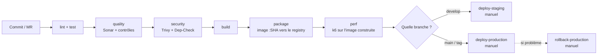

# Comment on gère les mises en production (releases)

Ce document explique comment le projet est livré, déployé, et comment revenir en
arrière si ça se passe mal. Tout ça est mis en place dans le pipeline
(`.gitlab-ci.yml`) et les scripts du dossier `scripts/`.

> Pour le détail de chaque script, voir [SCRIPTS.md](SCRIPTS.md).

---

## 1. Les grandes idées

- **L'image ne change plus une fois construite.** Chaque image Docker est taguée
  avec le SHA du commit. Quand on met en prod, on redéploie une image déjà
  construite et déjà scannée, on ne la reconstruit pas.
- **On promeut, on ne reconstruit pas.** La même image passe de `staging` à
  `production`. On déploie toujours un tag précis, jamais `latest`.
- **On vérifie avant de déployer.** Une image n'arrive à l'étape de déploiement
  qu'après les tests, Sonar, et les scans de sécurité.
- **On peut revenir en arrière vite.** Kubernetes garde l'historique des versions,
  donc on peut remettre la version d'avant sans rien reconstruire.
- **On sait ce qui a été livré.** On utilise des tags de version (SemVer) et des
  messages de commit propres (Conventional Commits, vérifiés par commitlint).

---

## 2. Le déroulé d'une release



- **`perf`** → l'image tout juste construite est démarrée et mise sous charge par k6.
  Le test de fumée `k6-smoke` est bloquant : si l'image ne répond pas correctement,
  on n'arrive même pas au choix de la branche. Détail dans [QUALITY.md](QUALITY.md) §5.
- **`develop`** → on construit l'image et on peut déployer sur **staging**.
- **`main` / tag** → on peut déployer sur **production** (avec validation à la main).
- **En cas de souci en prod** → on lance le job **`rollback-production`**.

---

## 3. Les environnements

| Environnement  | Namespace K8s        | Quand                 | Validation                                |
| -------------- | -------------------- | --------------------- | ----------------------------------------- |
| **staging**    | `$STAGING_NAMESPACE` | branche `develop`     | À la main (peut être automatisé, voir §6) |
| **production** | `$PROD_NAMESPACE`    | branche `main` ou tag | À la main, **obligatoire**                |

Dans GitLab, ces environnements sont déclarés avec le mot-clé `environment:`, ce
qui permet de suivre les déploiements par environnement dans l'interface.

---

## 4. Le déploiement automatique

Le déploiement est fait par le script [`scripts/deploy/deploy.sh`](scripts/deploy/deploy.sh) :

1. il change l'image du Deployment vers la version `:SHA` (`kubectl set image`),
2. il attend que le déploiement se termine (`kubectl rollout status`),
3. **si ça rate ou si c'est trop long**, il revient tout seul à la version d'avant
   (`kubectl rollout undo`). On peut désactiver ce comportement avec `--no-auto-rollback`.

Exemple (extrait du job `deploy-production`) :

```bash
bash scripts/deploy/deploy.sh \
  -n "$PROD_NAMESPACE" -d back -c back \
  -i "$CI_REGISTRY_IMAGE/back:$CI_COMMIT_SHORT_SHA"
```

---

## 5. Le retour en arrière (rollback)

Il y a deux niveaux :

1. **Automatique** : le script `deploy.sh` revient tout seul en arrière si le
   déploiement ne se passe pas bien. Rien à faire.
2. **Manuel** : avec le script [`scripts/deploy/rollback.sh`](scripts/deploy/rollback.sh)
   (job `rollback-production`), quand on repère un bug **après** un déploiement qui
   avait pourtant réussi :

```bash
# Revenir à la version d'avant
bash scripts/deploy/rollback.sh -n "$PROD_NAMESPACE" -d back

# Revenir à une version précise (pour voir la liste : kubectl rollout history)
bash scripts/deploy/rollback.sh -n "$PROD_NAMESPACE" -d back --to-revision 7
```

Comme chaque version correspond à une image fixe (taguée par SHA), on sait
toujours exactement vers quoi on revient.

Ces deux mécanismes ne sont pas seulement documentés : ils sont **testés à
chaque commit** par le job `test-scripts`, avec un faux `kubectl` qui simule un
déploiement qui rate (voir [SCRIPTS.md](SCRIPTS.md#les-tests)). On vérifie que
le `rollout undo` est bien déclenché, qu'il ne l'est pas quand tout va bien, et
qu'on est prévenu si le rollback lui-même échoue.

---

## 6. Ce qu'il faut préparer dans GitLab

À créer dans Settings → CI/CD → Variables :

| Variable                        | Type              | À quoi ça sert                                            |
| ------------------------------- | ----------------- | --------------------------------------------------------- |
| `KUBE_CONFIG`                   | File              | Le fichier de connexion au cluster (jamais dans le code). |
| `STAGING_NAMESPACE`             | Variable          | Le namespace de staging.                                  |
| `PROD_NAMESPACE`                | Variable          | Le namespace de production.                               |
| `SONAR_HOST_URL`, `SONAR_TOKEN` | Variable / Masked | Pour Sonar et le Quality Gate.                            |
| `CI_REGISTRY*`                  | Automatiques      | Fournies par GitLab, rien à faire.                        |

**Pour déployer automatiquement sur staging** : dans le job `deploy-staging`,
remplacer `when: manual` par `when: on_success`. Le déploiement partira alors tout
seul dès que l'étape `package` réussit sur `develop`.

---

## 7. Étapes pour une mise en prod

1. Merger sur `main` (via une MR avec le pipeline vert).
2. Créer un tag de version : `git tag vX.Y.Z && git push origin vX.Y.Z`.
3. Le pipeline construit l'image et l'envoie sur le registry.
4. Lancer le job `deploy-production` à la main et valider.
5. Vérifier que l'appli fonctionne bien.
6. **Si problème** : lancer `rollback-production`.

---

## 8. Ce qu'on pourrait ajouter plus tard

- Des petits tests automatiques après le déploiement (vérifier que l'appli répond).
- Un déploiement progressif (blue/green ou canary) pour limiter les risques.
- La génération automatique du changelog à partir des messages de commit.
- Une notification (Slack ou mail) quand un déploiement échoue.
