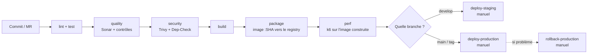

# Comment on gère les mises en production (releases)

Ce document explique comment le projet est livré, déployé, et comment revenir en
arrière si ça se passe mal. Tout ça est mis en place dans le pipeline
(`.gitlab-ci.yml`) et les scripts du dossier `scripts/`.

> Pour le détail de chaque script, voir [SCRIPTS.md](SCRIPTS.md).

---

## 1. Les grandes idées

- **L'image ne change plus une fois construite.** Chaque image Docker est taguée
  avec le SHA du commit. Quand on met en prod, on redéploie une image déjà
  construite et déjà scannée, on ne la reconstruit pas.
- **On promeut, on ne reconstruit pas.** La même image passe de `staging` à
  `production`. On déploie toujours un tag précis, jamais `latest`.
- **On vérifie avant de déployer.** Une image n'arrive à l'étape de déploiement
  qu'après les tests, Sonar, et les scans de sécurité.
- **On peut revenir en arrière vite.** Kubernetes garde l'historique des versions,
  donc on peut remettre la version d'avant sans rien reconstruire.
- **On sait ce qui a été livré.** On utilise des tags de version (SemVer) et des
  messages de commit propres (Conventional Commits, vérifiés par commitlint).

---

## 2. Le déroulé d'une release



- **`perf`** → l'image tout juste construite est démarrée et mise sous charge par k6.
  Le test de fumée `k6-smoke` est bloquant : si l'image ne répond pas correctement,
  on n'arrive même pas au choix de la branche. Détail dans [QUALITY.md](QUALITY.md) §5.
- **`develop`** → on construit l'image et on peut déployer sur **staging**.
- **`main` / tag** → on peut déployer sur **production** (avec validation à la main).
- **En cas de souci en prod** → on lance le job **`rollback-production`**.

---

## 3. Les environnements

| Environnement  | Namespace K8s        | Quand                 | Validation                                |
| -------------- | -------------------- | --------------------- | ----------------------------------------- |
| **staging**    | `$STAGING_NAMESPACE` | branche `develop`     | À la main (peut être automatisé, voir §6) |
| **production** | `$PROD_NAMESPACE`    | branche `main` ou tag | À la main, **obligatoire**                |

Dans GitLab, ces environnements sont déclarés avec le mot-clé `environment:`, ce
qui permet de suivre les déploiements par environnement dans l'interface.

---

## 4. Le déploiement automatique

Le déploiement est fait par le script [`scripts/deploy/deploy.sh`](scripts/deploy/deploy.sh) :

1. il change l'image du Deployment vers la version `:SHA` (`kubectl set image`),
2. il attend que le déploiement se termine (`kubectl rollout status`),
3. **si ça rate ou si c'est trop long**, il revient tout seul à la version d'avant
   (`kubectl rollout undo`). On peut désactiver ce comportement avec `--no-auto-rollback`.

Exemple (extrait du job `deploy-production`) :

```bash
bash scripts/deploy/deploy.sh \
  -n "$PROD_NAMESPACE" -d back -c back \
  -i "$CI_REGISTRY_IMAGE/back:$CI_COMMIT_SHORT_SHA"
```

---

## 5. Le retour en arrière (rollback)

Il y a deux niveaux :

1. **Automatique** : le script `deploy.sh` revient tout seul en arrière si le
   déploiement ne se passe pas bien. Rien à faire.
2. **Manuel** : avec le script [`scripts/deploy/rollback.sh`](scripts/deploy/rollback.sh)
   (job `rollback-production`), quand on repère un bug **après** un déploiement qui
   avait pourtant réussi :

```bash
# Revenir à la version d'avant
bash scripts/deploy/rollback.sh -n "$PROD_NAMESPACE" -d back

# Revenir à une version précise (pour voir la liste : kubectl rollout history)
bash scripts/deploy/rollback.sh -n "$PROD_NAMESPACE" -d back --to-revision 7
```

Comme chaque version correspond à une image fixe (taguée par SHA), on sait
toujours exactement vers quoi on revient.

Ces deux mécanismes ne sont pas seulement documentés : ils sont **testés à
chaque commit** par le job `test-scripts`, avec un faux `kubectl` qui simule un
déploiement qui rate (voir [SCRIPTS.md](SCRIPTS.md#les-tests)). On vérifie que
le `rollout undo` est bien déclenché, qu'il ne l'est pas quand tout va bien, et
qu'on est prévenu si le rollback lui-même échoue.

---

## 6. Ce qu'il faut préparer dans GitLab

À créer dans Settings → CI/CD → Variables :

| Variable                        | Type              | À quoi ça sert                                            |
| ------------------------------- | ----------------- | --------------------------------------------------------- |
| `KUBE_CONFIG`                   | File              | Le fichier de connexion au cluster (jamais dans le code). |
| `STAGING_NAMESPACE`             | Variable          | Le namespace de staging.                                  |
| `PROD_NAMESPACE`                | Variable          | Le namespace de production.                               |
| `SONAR_HOST_URL`, `SONAR_TOKEN` | Variable / Masked | Pour Sonar et le Quality Gate.                            |
| `CI_REGISTRY*`                  | Automatiques      | Fournies par GitLab, rien à faire.                        |

**Pour déployer automatiquement sur staging** : dans le job `deploy-staging`,
remplacer `when: manual` par `when: on_success`. Le déploiement partira alors tout
seul dès que l'étape `package` réussit sur `develop`.

---

## 7. Étapes pour une mise en prod

1. Merger sur `main` (via une MR avec le pipeline vert).
2. Créer un tag de version : `git tag vX.Y.Z && git push origin vX.Y.Z`.
3. Le pipeline construit l'image et l'envoie sur le registry.
4. Lancer le job `deploy-production` à la main et valider.
5. Vérifier que l'appli fonctionne bien.
6. **Si problème** : lancer `rollback-production`.

---

## 8. Ce qu'on pourrait ajouter plus tard

- Des petits tests automatiques après le déploiement (vérifier que l'appli répond).
- Un déploiement progressif (blue/green ou canary) pour limiter les risques.
- La génération automatique du changelog à partir des messages de commit.
- Une notification (Slack ou mail) quand un déploiement échoue.

## 9. Sauvegarde et restauration

### 9.1 Il n'y a rien à sauvegarder, et ce n'est pas un oubli

**La base de MicroCRM vit dans la mémoire du processus.** HSQLDB est démarrée en
mode `mem:` et alimentée à chaque démarrage par `InitialDataFixture`
([DATABASE.md](DATABASE.md)). Il n'existe ni fichier, ni volume, ni instantané :
un pod qui redémarre repart d'une base vide, aussitôt regarnie des mêmes données
de démonstration.

Autrement dit, **une procédure de sauvegarde n'aurait rien à copier**. Écrire un
`CronJob` de `pg_dump` sur cette application ne serait pas une sécurité, ce
serait un décor — et c'est le genre de décor qu'un jury repère.

C'est aussi ce qui impose au back de rester à **1 replica** : deux pods
tiendraient deux bases distinctes, et une requête sur deux ne verrait pas ce que
l'autre a écrit, sans qu'aucune erreur ne soit levée (K8S.md §8.1).

### 9.2 Ce qu'il faudrait pour qu'il y ait quelque chose à sauvegarder

La bascule vers une base persistante est un chantier délimité, et il vaut mieux
le chiffrer que le laisser en intention vague :

| Étape                            | Effort | Ce qui change                                                                                                                                             |
| -------------------------------- | ------ | --------------------------------------------------------------------------------------------------------------------------------------------------------- |
| Remplacer HSQLDB par PostgreSQL  | S      | une dépendance, une URL JDBC, un dialecte Hibernate                                                                                                       |
| Déployer la base                 | M      | `StatefulSet` + `PersistentVolumeClaim` + `Service`, ou une base managée                                                                                  |
| Sortir les identifiants du dépôt | S      | un `Secret`, créé comme celui du registry (K8S.md §12)                                                                                                    |
| Gérer le schéma                  | M      | Hibernate génère aujourd'hui les tables au démarrage ; en persistant, il faut Flyway ou Liquibase, sans quoi la première évolution d'entité casse la base |
| Lever le plafond de replicas     | S      | le back peut enfin monter en charge                                                                                                                       |
| Recalculer les quotas            | S      | un pod de plus à financer dans `terraform/environments/*/terraform.tfvars`                                                                                |

**Le point le moins évident est le quatrième.** Tant que la base est jetable,
`hibernate.ddl-auto` peut la recréer à chaque démarrage. Dès qu'elle persiste,
cette commodité devient un danger : c'est le moment où un outil de migration
cesse d'être un luxe.

### 9.3 La procédure qui s'appliquerait alors

Elle n'est pas mise en œuvre — la base ne persiste pas — mais elle doit être
écrite, sans quoi la bascule du §9.2 s'accompagnerait d'improvisation :

```shell
# Sauvegarde : un CronJob quotidien dans le namespace de l'application
kubectl -n "$NAMESPACE" exec deploy/postgres -- \
  pg_dump -U microcrm -Fc microcrm > microcrm-$(date +%F).dump

# Restauration
kubectl -n "$NAMESPACE" exec -i deploy/postgres -- \
  pg_restore -U microcrm -d microcrm --clean < microcrm-2026-08-18.dump
```

Trois règles vaudraient dès le premier jour : la sauvegarde part **hors du
cluster** (un instantané qui vit sur le volume qu'il sauvegarde ne sauvegarde
rien) ; elle est **chiffrée**, puisqu'elle contient des données personnelles ;
et **elle est restaurée périodiquement**, faute de quoi personne ne sait si elle
fonctionne. Une sauvegarde jamais restaurée n'est pas une sauvegarde, c'est une
croyance.

### 9.4 La vraie garantie : reconstruire l'environnement depuis le dépôt

C'est ici que se joue l'intérêt de tout le travail d'infrastructure. Les
données de MicroCRM sont jetables, mais **l'environnement, lui, se reconstruit
intégralement à partir du seul dépôt** — et cela, c'est vérifiable.

La procédure, dans l'ordre imposé par la frontière des responsabilités
([TERRAFORM.md](TERRAFORM.md) §3) :

```shell
# 0. Détruire l'environnement — c'est le point de départ de l'exercice
kubectl delete namespace "$NAMESPACE"

# 1. Le poste et le cluster (Ansible)
cd ansible && ansible-playbook site.yml

# 2. Le namespace, son quota, ses limites, ses policies (Terraform)
cd terraform/environments/staging && terraform apply

# 3. L'application (Kustomize)
kubectl apply -k k8s/overlays/staging -n "$NAMESPACE"
kubectl -n "$NAMESPACE" rollout status deployment/back  --timeout=300s
kubectl -n "$NAMESPACE" rollout status deployment/front --timeout=300s

# 4. Vérifier que l'API répond et que les données de démonstration sont là
kubectl -n "$NAMESPACE" port-forward svc/back 18081:8080 &
curl -s http://127.0.0.1:18081/persons | head -c 200
```

⚠️ **Cette procédure n'a PAS encore été exécutée de bout en bout.** Chacune de
ses étapes l'a été séparément — le playbook Ansible est idempotent et rejoué
(ANSIBLE.md §7), l'application a été déployée et son rollback observé
(K8S.md §14), Terraform a créé et peuplé le namespace `logging` (MONITORING.md
§6) — mais l'enchaînement complet, à partir d'une destruction réelle, reste à
jouer. Tant qu'il ne l'a pas été, la reconstruction est une conviction
raisonnable, pas une preuve.

Deux points de vigilance connus pour le jour où elle sera jouée :

- **Le namespace doit être absent**, sinon `terraform apply` s'arrête sur
  `already exists` et demande un `terraform import` préalable (TERRAFORM.md
  §10.1). Après un `kubectl delete namespace`, il l'est.
- **Les images doivent être disponibles pour le cluster.** En local elles y sont
  chargées par `minikube image load` (K8S.md §14.1) ; depuis la CI elles
  viennent du registry, et le `Secret` qui l'ouvre est recréé par le job de
  déploiement.
