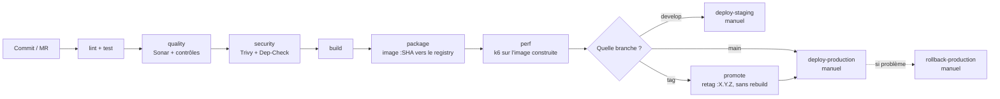

# Comment on gère les mises en production (releases)

Ce document explique comment le projet est livré, déployé, et comment revenir en
arrière si ça se passe mal. Tout ça est mis en place dans le pipeline
(`.gitlab-ci.yml`) et les scripts du dossier `scripts/`.

> Pour le détail de chaque script, voir [SCRIPTS.md](SCRIPTS.md).

---

## 1. Les grandes idées

- **L'image ne change plus une fois construite.** Chaque image Docker est taguée
  avec le SHA du commit. Quand on met en prod, on redéploie une image déjà
  construite et déjà scannée, on ne la reconstruit pas.
- **On promeut, on ne reconstruit pas.** La même image passe de `staging` à
  `production`. On déploie toujours un tag précis, jamais `latest`.
- **On vérifie avant de déployer.** Une image n'arrive à l'étape de déploiement
  qu'après les tests, Sonar, et les scans de sécurité.
- **On peut revenir en arrière vite.** Kubernetes garde l'historique des versions,
  donc on peut remettre la version d'avant sans rien reconstruire.
- **On sait ce qui a été livré.** Une release est un tag Git SemVer (`vX.Y.Z`),
  et ce numéro se retrouve **sur l'image** : `back:1.4.0` et `back:a1b2c3d`
  désignent le même digest. Les messages de commit suivent Conventional
  Commits, vérifiés par commitlint. Le détail est en §2.1.

---

## 2. Le déroulé d'une release



- **`perf`** → l'image tout juste construite est démarrée et mise sous charge par k6.
  Le test de fumée `k6-smoke` est bloquant : si l'image ne répond pas correctement,
  on n'arrive même pas au choix de la branche. Détail dans [QUALITY.md](QUALITY.md) §5.
- **`develop`** → on construit l'image et on peut déployer sur **staging**.
- **`main` / tag** → on peut déployer sur **production** (avec validation à la main).
- **En cas de souci en prod** → on lance le job **`rollback-production`**.

---

## 2.1 Le numéro de version, et comment il atteint l'image

**La source de vérité est le tag Git.** `git tag v1.4.0` déclare la version.

Trois fichiers la répètent — `front/package.json`, `back/build.gradle` et
l'`appVersion` de `helm/microcrm/Chart.yaml` — pour qu'un artefact puisse dire
sa propre version sans qu'on aille interroger Git. Répéter une valeur, c'est
accepter qu'elle diverge : le job `version-consistency` la contrôle **dès la
première étape** d'un pipeline de tag, avant qu'on ait construit ou scanné quoi
que ce soit (`scripts/ci/check_version.sh`).

Restent volontairement à l'écart le `package.json` de la racine, qui décrit
l'outillage du dépôt et non l'application, et le champ `version` du chart, que
la convention Helm distingue de l'`appVersion`.

**Un pipeline de tag ne reconstruit rien.** `package-back` et `package-front`
n'y tournent pas (`.rules_package` dans `.gitlab/ci/templates.yml`). Ce sont
`promote-back` et `promote-front` qui prennent le relais : ils tirent l'image
déjà publiée pour ce commit, lui ajoutent le tag de version, et la repoussent.
`scripts/ci/promote_image.sh` fait ce travail.

C'est la seule façon d'avoir une version qui veut dire quelque chose. Deux
builds du même commit ne produisent pas les mêmes couches — horodatages,
résolution de paquets. Une image reconstruite au moment du tag aurait les mêmes
sources, mais ne serait plus celle que Trivy a scannée ni celle que k6 a mise
sous charge. En retaguant, `1.4.0` **est** l'artefact éprouvé, pas un jumeau.

**Ce qui est refusé, et pourquoi :**

| Forme                               | Verdict  | Raison                                                                                                                          |
| ----------------------------------- | -------- | ------------------------------------------------------------------------------------------------------------------------------- |
| `v1.4.0`, `1.4.0`, `v1.4.0-alpha.1` | acceptée | SemVer valide                                                                                                                   |
| `v1.4`, `v1.4.0.1`, `latest`        | refusée  | ce n'est pas du SemVer                                                                                                          |
| `v01.4.0`                           | refusée  | SemVer interdit les zéros de tête : `01.4.0` et `1.4.0` seraient la même version sous deux tags différents                      |
| `v1.4.0+exp.sha.5114f85`            | refusée  | un tag Docker n'accepte pas le `+`. Le traduire en `_` casserait l'égalité entre tag Git et tag d'image, qui est tout l'intérêt |
| tag sur un commit jamais construit  | refusée  | le `docker pull` échoue : on ne publie pas un numéro de version qui ne désigne aucun artefact                                   |

**Le tag d'image ne porte pas le « v ».** Le tag Git est `v1.4.0`, l'image est
`back:1.4.0` — la convention des registries (`node:22-alpine`,
`postgres:16-alpine`).

**Le déploiement suit.** Les jobs de déploiement résolvent `DEPLOY_IMAGE_TAG` :
le numéro de version sur un pipeline de tag, le SHA du commit partout ailleurs.
C'est ce tag que l'overlay éphémère pose sur les deux Deployments. Comme la
promotion est un retag, ça ne change pas ce qui tourne — ça change ce que le
cluster affiche : un `kubectl describe pod` en production nomme la version
annoncée, sans table de correspondance entre un SHA et une release.

Les règles de refus ci-dessus sont couvertes par `scripts/tests/run_tests.sh`
(bloc `ci/promote_image.sh`), y compris l'assertion qui échoue si une promotion
se met à construire.

---

## 3. Les environnements

| Environnement  | Namespace K8s        | Quand                 | Validation                                |
| -------------- | -------------------- | --------------------- | ----------------------------------------- |
| **staging**    | `$STAGING_NAMESPACE` | branche `develop`     | À la main (peut être automatisé, voir §6) |
| **production** | `$PROD_NAMESPACE`    | branche `main` ou tag | À la main, **obligatoire**                |

Dans GitLab, ces environnements sont déclarés avec le mot-clé `environment:`, ce
qui permet de suivre les déploiements par environnement dans l'interface.

---

## 4. Le déploiement automatique

Le déploiement est fait par le script [`scripts/deploy/deploy.sh`](scripts/deploy/deploy.sh) :

1. il change l'image du Deployment vers la version `:SHA` (`kubectl set image`),
2. il attend que le déploiement se termine (`kubectl rollout status`),
3. **si ça rate ou si c'est trop long**, il revient tout seul à la version d'avant
   (`kubectl rollout undo`). On peut désactiver ce comportement avec `--no-auto-rollback`.

Exemple (extrait du job `deploy-production`) :

```bash
bash scripts/deploy/deploy.sh \
  -n "$PROD_NAMESPACE" -d back -c back \
  -i "$CI_REGISTRY_IMAGE/back:$CI_COMMIT_SHORT_SHA"
```

---

## 5. Le retour en arrière (rollback)

Il y a deux niveaux :

1. **Automatique** : le script `deploy.sh` revient tout seul en arrière si le
   déploiement ne se passe pas bien. Rien à faire.
2. **Manuel** : avec le script [`scripts/deploy/rollback.sh`](scripts/deploy/rollback.sh)
   (job `rollback-production`), quand on repère un bug **après** un déploiement qui
   avait pourtant réussi :

```bash
# Revenir à la version d'avant
bash scripts/deploy/rollback.sh -n "$PROD_NAMESPACE" -d back

# Revenir à une version précise (pour voir la liste : kubectl rollout history)
bash scripts/deploy/rollback.sh -n "$PROD_NAMESPACE" -d back --to-revision 7
```

Comme chaque version correspond à une image fixe (taguée par SHA), on sait
toujours exactement vers quoi on revient.

Ces deux mécanismes ne sont pas seulement documentés : ils sont **testés à
chaque commit** par le job `test-scripts`, avec un faux `kubectl` qui simule un
déploiement qui rate (voir [SCRIPTS.md](SCRIPTS.md#les-tests)). On vérifie que
le `rollout undo` est bien déclenché, qu'il ne l'est pas quand tout va bien, et
qu'on est prévenu si le rollback lui-même échoue.

---

## 6. Ce qu'il faut préparer dans GitLab

À créer dans Settings → CI/CD → Variables :

| Variable                        | Type              | À quoi ça sert                                            |
| ------------------------------- | ----------------- | --------------------------------------------------------- |
| `KUBE_CONFIG`                   | File              | Le fichier de connexion au cluster (jamais dans le code). |
| `STAGING_NAMESPACE`             | Variable          | Le namespace de staging.                                  |
| `PROD_NAMESPACE`                | Variable          | Le namespace de production.                               |
| `SONAR_HOST_URL`, `SONAR_TOKEN` | Variable / Masked | Pour Sonar et le Quality Gate.                            |
| `CI_REGISTRY*`                  | Automatiques      | Fournies par GitLab, rien à faire.                        |

**Pour déployer automatiquement sur staging** : dans le job `deploy-staging`,
remplacer `when: manual` par `when: on_success`. Le déploiement partira alors tout
seul dès que l'étape `package` réussit sur `develop`.

---

## 7. Étapes pour une mise en prod

1. Merger sur `main` (via une MR avec le pipeline vert). **C'est ce pipeline
   qui construit l'image** et la pousse sous le SHA du commit.
2. Créer un tag de version : `git tag vX.Y.Z && git push origin vX.Y.Z`.
3. Le pipeline de tag ne reconstruit rien : `promote-back` et `promote-front`
   posent `X.Y.Z` sur l'image déjà publiée (§2.1). Si l'étape 1 n'a pas abouti,
   ce job échoue — c'est voulu.
4. Lancer le job `deploy-production` à la main et valider. Il déploie
   `:X.Y.Z`.
5. Vérifier que l'appli fonctionne bien.
6. **Si problème** : lancer `rollback-production`.

---

## 8. Ce qu'on pourrait ajouter plus tard

- Des petits tests automatiques après le déploiement (vérifier que l'appli répond).
- Un déploiement progressif (blue/green ou canary) pour limiter les risques.
- La génération automatique du changelog à partir des messages de commit.
- Une notification (Slack ou mail) quand un déploiement échoue.

## 9. Sauvegarde et restauration

### 9.1 Il n'y a rien à sauvegarder, et ce n'est pas un oubli

**La base de MicroCRM vit dans la mémoire du processus.** HSQLDB est démarrée en
mode `mem:` et alimentée à chaque démarrage par `InitialDataFixture`
([DATABASE.md](DATABASE.md)). Il n'existe ni fichier, ni volume, ni instantané :
un pod qui redémarre repart d'une base vide, aussitôt regarnie des mêmes données
de démonstration.

Autrement dit, **une procédure de sauvegarde n'aurait rien à copier**. Écrire un
`CronJob` de `pg_dump` sur cette application ne serait pas une sécurité, ce
serait un décor — et c'est le genre de décor qu'un jury repère.

C'est aussi ce qui impose au back de rester à **1 replica** : deux pods
tiendraient deux bases distinctes, et une requête sur deux ne verrait pas ce que
l'autre a écrit, sans qu'aucune erreur ne soit levée (K8S.md §8.1).

### 9.2 Ce qu'il faudrait pour qu'il y ait quelque chose à sauvegarder

La bascule vers une base persistante est un chantier délimité, et il vaut mieux
le chiffrer que le laisser en intention vague :

| Étape                            | Effort | Ce qui change                                                                                                                                             |
| -------------------------------- | ------ | --------------------------------------------------------------------------------------------------------------------------------------------------------- |
| Remplacer HSQLDB par PostgreSQL  | S      | une dépendance, une URL JDBC, un dialecte Hibernate                                                                                                       |
| Déployer la base                 | M      | `StatefulSet` + `PersistentVolumeClaim` + `Service`, ou une base managée                                                                                  |
| Sortir les identifiants du dépôt | S      | un `Secret`, créé comme celui du registry (K8S.md §12)                                                                                                    |
| Gérer le schéma                  | M      | Hibernate génère aujourd'hui les tables au démarrage ; en persistant, il faut Flyway ou Liquibase, sans quoi la première évolution d'entité casse la base |
| Lever le plafond de replicas     | S      | le back peut enfin monter en charge                                                                                                                       |
| Recalculer les quotas            | S      | un pod de plus à financer dans `terraform/environments/*/terraform.tfvars`                                                                                |

**Le point le moins évident est le quatrième.** Tant que la base est jetable,
`hibernate.ddl-auto` peut la recréer à chaque démarrage. Dès qu'elle persiste,
cette commodité devient un danger : c'est le moment où un outil de migration
cesse d'être un luxe.

### 9.3 La procédure qui s'appliquerait alors

Elle n'est pas mise en œuvre — la base ne persiste pas — mais elle doit être
écrite, sans quoi la bascule du §9.2 s'accompagnerait d'improvisation :

```shell
# Sauvegarde : un CronJob quotidien dans le namespace de l'application
kubectl -n "$NAMESPACE" exec deploy/postgres -- \
  pg_dump -U microcrm -Fc microcrm > microcrm-$(date +%F).dump

# Restauration
kubectl -n "$NAMESPACE" exec -i deploy/postgres -- \
  pg_restore -U microcrm -d microcrm --clean < microcrm-2026-08-18.dump
```

Trois règles vaudraient dès le premier jour : la sauvegarde part **hors du
cluster** (un instantané qui vit sur le volume qu'il sauvegarde ne sauvegarde
rien) ; elle est **chiffrée**, puisqu'elle contient des données personnelles ;
et **elle est restaurée périodiquement**, faute de quoi personne ne sait si elle
fonctionne. Une sauvegarde jamais restaurée n'est pas une sauvegarde, c'est une
croyance.

### 9.4 La vraie garantie : reconstruire l'environnement depuis le dépôt

C'est ici que se joue l'intérêt de tout le travail d'infrastructure. Les
données de MicroCRM sont jetables, mais **l'environnement, lui, se reconstruit
intégralement à partir du seul dépôt** — et cela, c'est vérifiable.

La procédure, dans l'ordre imposé par la frontière des responsabilités
([TERRAFORM.md](TERRAFORM.md) §3) :

```shell
# 0. Détruire l'environnement — c'est le point de départ de l'exercice
kubectl delete namespace "$NAMESPACE"

# 1. Le poste et le cluster (Ansible)
cd ansible && ansible-playbook site.yml

# 2. Le namespace, son quota, ses limites, ses policies (Terraform)
cd terraform/environments/staging && terraform apply

# 3. L'application (Kustomize)
kubectl apply -k k8s/overlays/staging -n "$NAMESPACE"
kubectl -n "$NAMESPACE" rollout status deployment/back  --timeout=300s
kubectl -n "$NAMESPACE" rollout status deployment/front --timeout=300s

# 4. Vérifier que l'API répond et que les données de démonstration sont là
kubectl -n "$NAMESPACE" port-forward svc/back 18081:8080 &
curl -s http://127.0.0.1:18081/persons | head -c 200
```

✅ **Cette procédure a été exécutée de bout en bout le 2026-09-22**, à partir
d'une destruction réelle. Le compte rendu est en §9.5. Ce qui était jusque-là
une conviction raisonnable est devenu une mesure.

Deux points de vigilance étaient connus avant de la jouer, et tous deux se sont
vérifiés :

- **Le namespace doit être absent**, sinon `terraform apply` s'arrête sur
  `already exists` et demande un `terraform import` préalable (TERRAFORM.md
  §10.1). Après un `kubectl delete namespace`, il l'est.
- **Les images doivent être disponibles pour le cluster.** En local elles y sont
  chargées par `minikube image load` (K8S.md §14.1) ; depuis la CI elles
  viennent du registry, et le `Secret` qui l'ouvre est recréé par le job de
  déploiement.

---

### 9.5 Compte rendu d'exécution — 2026-09-22

**Contexte.** minikube v1.38.1, Kubernetes v1.35.1, nœud unique. Namespace
`microcrm-staging` détruit par `kubectl delete namespace`, puis reconstruit
depuis le seul dépôt.

| Étape                       | Commande                              | Résultat                                                 |
| --------------------------- | ------------------------------------- | -------------------------------------------------------- |
| 0. Destruction              | `kubectl delete namespace`            | namespace supprimé, `NotFound` confirmé                  |
| 1. Poste et cluster         | `ansible-playbook site.yml`           | `ok=23 changed=0 failed=0`                               |
| 2. Namespace et gouvernance | `terraform apply plan.cache`          | **6 ressources créées**, 0 modifiée, 0 détruite          |
| 3. Application              | `kubectl apply -k` (overlay éphémère) | 6 objets créés, rollout des deux Deployments en **11 s** |
| 4. Vérification             | `curl /persons`                       | API répond, données de démonstration présentes           |

**Ce que Terraform a recréé** : le namespace, `microcrm-staging-quota`,
`microcrm-staging-limits` et les trois NetworkPolicy (`default-deny-ingress`,
`allow-ingress-nginx-to-back`, `allow-ingress-nginx-to-front`). Le namespace
porte à nouveau ses labels `app.kubernetes.io/managed-by=terraform`,
`part-of=microcrm`, `environment=staging`, donc il rentre dans le recensement
décrit en [TERRAFORM.md](TERRAFORM.md) §3.

**Ce que la vérification a renvoyé** : `/persons` sert une personne
(`John Doe`), recréée par Hibernate au démarrage puisque la base vit en mémoire
— c'est exactement le comportement décrit en §9.1. `/actuator/health` répond
`{"status":"UP","groups":["liveness","readiness"]}`.

**Consommation du quota après déploiement** : `pods 2/10`,
`requests.cpu 210m/1`, `requests.memory 544Mi/1536Mi`, `limits.cpu 1200m/3`,
`limits.memory 832Mi/2Gi`. Le dimensionnement de `terraform.tfvars` laisse donc
de la marge sur tous les axes.

#### Trois écarts constatés, et ils valent d'être écrits

**1. Le namespace n'était pas sous gouvernance Terraform avant l'exercice.**
Relevé avant la destruction : aucun `ResourceQuota`, aucun `LimitRange`, aucune
`NetworkPolicy`, et pour seul label `kubernetes.io/metadata.name`. Le namespace
avait été créé à la main lors des campagnes de `K8S.md` §14. **C'est donc la
première fois que Terraform le gouverne réellement** — l'exercice n'a pas
restauré un état antérieur, il a corrigé un écart qui durait depuis 42 jours.

**2. L'étape 3 de la procédure, telle qu'elle est écrite, est incomplète.**
`kubectl apply -k k8s/overlays/staging` applique les manifestes du dépôt, qui
portent délibérément `microcrm/back:PLACEHOLDER` (K8S.md §4). Appliqué tel quel,
il déploierait une image inexistante. L'exécution a donc repris l'**overlay
éphémère** du pipeline (K8S.md §6), avec `CI_REGISTRY_IMAGE=microcrm` et
`CI_COMMIT_SHORT_SHA=t2-r2`, images déjà chargées par `minikube image load`. Le
garde-fou anti-`PLACEHOLDER` du gabarit de déploiement a été exécuté et n'a rien
signalé.

**3. L'état Terraform a été substitué.** L'état de staging vit normalement sur
GitLab (backend `http`, `versions.tf`), indisponible ce jour-là pour cause de
quota. Un `backend "local"` a été posé en surcharge le temps de la manipulation,
puis retiré. **Ce que cet exercice prouve est donc la reconstruction de
l'environnement à partir du dépôt, pas le chemin de l'état partagé.** Ce dernier
a été éprouvé juste après, par la migration décrite ci-dessous — mais depuis un
poste, pas depuis un job.

#### La conséquence, et comment elle a été réglée le même jour

Les six ressources existaient dans le cluster mais n'étaient suivies que par
l'état **local** produit pendant l'exercice. L'état partagé hébergé par GitLab,
lui, les ignorait : un `terraform plan` lancé depuis la CI aurait annoncé « 6 à
créer », et un `apply` aurait échoué sur `already exists` — le cas décrit en
[TERRAFORM.md](TERRAFORM.md) §10.1.

La réconciliation a été faite dans la foulée, par migration de l'état local vers
le backend `http` :

```shell
cd terraform/environments/staging
export TF_HTTP_ADDRESS="$CI_API_V4_URL/projects/$CI_PROJECT_ID/terraform/state/staging"
export TF_HTTP_LOCK_ADDRESS="$TF_HTTP_ADDRESS/lock"
export TF_HTTP_UNLOCK_ADDRESS="$TF_HTTP_ADDRESS/lock"
export TF_HTTP_USERNAME="<compte GitLab>"   # le jeton, de portée api, n'est jamais écrit
terraform init -migrate-state               # répondre « yes »
```

Terraform a acquis le verrou, constaté que l'état distant était **vide** — ce qui
confirme au passage que l'`apply` n'avait jamais été joué sur cet environnement —
puis copié les six ressources.

**Vérification** : `terraform plan` rafraîchit désormais les six ressources
**depuis l'état partagé** et répond `No changes. Your infrastructure matches the
configuration.` L'état local a été retiré du répertoire ; le backend enregistré
dans `.terraform/` est bien `http`.

Deux choses en découlent :

- La CI et le poste visent enfin le même état. Le prochain
  `terraform-apply-staging` tournera contre un état conforme et n'aura rien à
  faire.
- **Le chemin de l'état partagé, annoncé plus haut comme non éprouvé, l'est
  désormais en lecture et en écriture** : verrou pris et relâché, état écrit,
  état relu. Il reste à le jouer depuis un job de CI, avec `$CI_JOB_TOKEN` au
  lieu d'un jeton personnel.

**Ce qui reste hors de portée de cet exercice** : la restauration de _données_.
Elle n'a pas d'objet tant que la base vit en mémoire — le raisonnement est en
§9.1, et il ne change pas.
