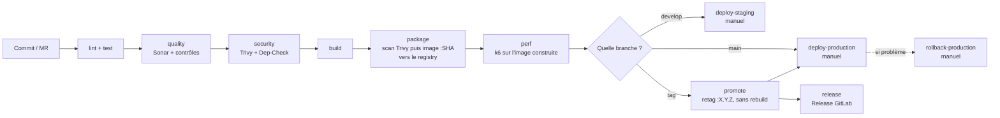

# Comment on gère les mises en production (releases)

Ce document explique comment le projet est livré, déployé, et comment revenir en
arrière si ça se passe mal. Tout ça est mis en place dans le pipeline
(`.gitlab-ci.yml`) et les scripts du dossier `scripts/`.

> Pour le détail de chaque script, voir [SCRIPTS.md](SCRIPTS.md).

---

## 1. Les grandes idées

- **L'image ne change plus une fois construite.** Chaque image Docker est taguée
  avec le SHA du commit. Quand on met en prod, on redéploie une image déjà
  construite et déjà scannée, on ne la reconstruit pas.
- **On promeut, on ne reconstruit pas.** La même image passe de `staging` à
  `production`. On déploie toujours un tag précis, jamais `latest`.
- **On vérifie avant de déployer.** Une image n'arrive à l'étape de déploiement
  qu'après les tests, Sonar, et les scans de sécurité.
- **On scanne avant de publier.** L'image est scannée par Trivy **avant** d'être
  poussée au registry : une image refusée n'y entre pas, donc ne peut être ni
  déployée ni promue. Le relevé du scan est conservé en artefact
  ([SCRIPTS.md](SCRIPTS.md), `ci/trivy_scan.sh`).
- **On peut revenir en arrière vite.** Kubernetes garde l'historique des versions,
  donc on peut remettre la version d'avant sans rien reconstruire.
- **On sait ce qui a été livré.** Une release est un tag Git SemVer (`vX.Y.Z`),
  et ce numéro se retrouve **sur l'image** : `back:1.4.0` et `back:a1b2c3d`
  désignent le même digest. Les messages de commit suivent Conventional
  Commits, vérifiés par commitlint. Le détail est en §2.1.

---

## 2. Le déroulé d'une release


```mermaid
flowchart LR
    A[Commit / MR] --> B[lint + test]
    B --> C[quality<br/>Sonar + contrôles]
    C --> D[security<br/>Trivy + Dep-Check]
    D --> E[build]
    E --> F[package<br/>scan Trivy puis image :SHA<br/>vers le registry]
    F --> P[perf<br/>k6 sur l'image construite]
    P --> G{Quelle branche ?}
    G -- develop --> H[deploy-staging<br/>manuel]
    G -- main --> I[deploy-production<br/>manuel]
    G -- tag --> V[promote<br/>retag :X.Y.Z, sans rebuild]
    V --> R[release<br/>Release GitLab]
    V --> I
    I -. si problème .-> J[rollback-production<br/>manuel]
```

- **`perf`** → l'image tout juste construite est démarrée et mise sous charge par k6.
  Le test de fumée `k6-smoke` est bloquant : si l'image ne répond pas correctement,
  on n'arrive même pas au choix de la branche. Détail dans [QUALITY.md](QUALITY.md) §5.
- **`develop`** → on construit l'image et on peut déployer sur **staging**.
- **`main` / tag** → on peut déployer sur **production** (avec validation à la main).
- **tag** → les deux images sont promues, puis la **Release GitLab** est créée
  automatiquement (§2.2).
- **En cas de souci en prod** → on lance le job **`rollback-production`**.

---

## 2.1 Le numéro de version, et comment il atteint l'image

**La source de vérité est le tag Git.** `git tag v1.4.0` déclare la version.

Trois fichiers la répètent — `front/package.json`, `back/build.gradle` et
l'`appVersion` de `helm/microcrm/Chart.yaml` — pour qu'un artefact puisse dire
sa propre version sans qu'on aille interroger Git. Répéter une valeur, c'est
accepter qu'elle diverge : le job `version-consistency` la contrôle **dès la
première étape** d'un pipeline de tag, avant qu'on ait construit ou scanné quoi
que ce soit (`scripts/ci/check_version.sh`).

Restent volontairement à l'écart le `package.json` de la racine, qui décrit
l'outillage du dépôt et non l'application, et le champ `version` du chart, que
la convention Helm distingue de l'`appVersion`.

**Un pipeline de tag ne reconstruit rien.** `package-back` et `package-front`
n'y tournent pas (`.rules_package` dans `.gitlab/ci/templates.yml`). Ce sont
`promote-back` et `promote-front` qui prennent le relais : ils tirent l'image
déjà publiée pour ce commit, lui ajoutent le tag de version, et la repoussent.
`scripts/ci/promote_image.sh` fait ce travail.

C'est la seule façon d'avoir une version qui veut dire quelque chose. Deux
builds du même commit ne produisent pas les mêmes couches — horodatages,
résolution de paquets. Une image reconstruite au moment du tag aurait les mêmes
sources, mais ne serait plus celle que Trivy a scannée ni celle que k6 a mise
sous charge. En retaguant, `1.4.0` **est** l'artefact éprouvé, pas un jumeau.

**Ce qui est refusé, et pourquoi :**

| Forme                               | Verdict  | Raison                                                                                                                          |
| ----------------------------------- | -------- | ------------------------------------------------------------------------------------------------------------------------------- |
| `v1.4.0`, `1.4.0`, `v1.4.0-alpha.1` | acceptée | SemVer valide                                                                                                                   |
| `v1.4`, `v1.4.0.1`, `latest`        | refusée  | ce n'est pas du SemVer                                                                                                          |
| `v01.4.0`                           | refusée  | SemVer interdit les zéros de tête : `01.4.0` et `1.4.0` seraient la même version sous deux tags différents                      |
| `v1.4.0+exp.sha.5114f85`            | refusée  | un tag Docker n'accepte pas le `+`. Le traduire en `_` casserait l'égalité entre tag Git et tag d'image, qui est tout l'intérêt |
| tag sur un commit jamais construit  | refusée  | le `docker pull` échoue : on ne publie pas un numéro de version qui ne désigne aucun artefact                                   |
| tag sur un commit refusé par Trivy  | refusée  | l'image est scannée **avant** le push : refusée, elle n'est pas au registry, et le cas précédent s'applique                     |

**Le tag d'image ne porte pas le « v ».** Le tag Git est `v1.4.0`, l'image est
`back:1.4.0` — la convention des registries (`node:22-alpine`,
`postgres:16-alpine`).

**Le déploiement suit.** Les jobs de déploiement résolvent `DEPLOY_IMAGE_TAG` :
le numéro de version sur un pipeline de tag, le SHA du commit partout ailleurs.
C'est ce tag que l'overlay éphémère pose sur les deux Deployments. Comme la
promotion est un retag, ça ne change pas ce qui tourne — ça change ce que le
cluster affiche : un `kubectl describe pod` en production nomme la version
annoncée, sans table de correspondance entre un SHA et une release.

Les règles de refus ci-dessus sont couvertes par `scripts/tests/run_tests.sh`
(bloc `ci/promote_image.sh`), y compris l'assertion qui échoue si une promotion
se met à construire.

⚠️ **La cinquième ligne n'a pas toujours été vraie.** Jusqu'au 2026-10-02, le
scan Trivy était une commande placée _après_ le push dans `package-*`. Le job
rougissait, mais l'image était déjà au registry sous le tag du SHA — et la
promotion ne demande que l'existence de ce tag. Constaté ce jour-là :
`back:5bf1d6a2` y figurait avec cinq CVE hautes de Jackson, job rouge. Un tag
posé sur ce commit aurait promu une image que la porte venait de refuser. Le
scan a été déplacé dans `build_and_push.sh`, entre le build et le push, et un
test vérifie l'ordre.

---

## 2.2 La Release GitLab

Un tag Git dit « cette version existe ». Il ne dit ni quelles images la portent,
ni depuis quel commit. Le job `release` crée donc, sur chaque pipeline de tag,
la **Release GitLab** correspondante (Deploy → Releases) :

- il ne tourne qu'**après** `promote-back` **et** `promote-front` (`needs:`) —
  une Release qui annoncerait des images absentes serait pire que pas de
  Release ;
- sa description est écrite par `scripts/ci/release_notes.sh` : le commit, le
  pipeline, et pour chaque image ses deux tags, `:X.Y.Z` et `:SHA`, qui
  désignent le même digest ;
- il s'authentifie avec le jeton du job : aucun secret à créer. L'outil est
  `glab`, que le mot-clé `release:` appelle (l'ancien `release-cli` est déprécié
  depuis GitLab 18.0). Son image est figée dans `.gitlab/ci/variables.yml`
  (`GLAB_IMAGE`).

La mise en production n'est **pas** une condition : la Release dit « la version
est publiée », `deploy-production` reste manuel et vient après.

Deux pièges :

- **Si la Release existe déjà, le job échoue.** Rejouer un pipeline de tag ne
  réécrit pas l'histoire. Pour corriger une Release, on l'édite dans GitLab, ou
  on la supprime avant de rejouer le job.
- **Ne pas saisir de « release notes » en créant un tag depuis l'interface
  GitLab** : cela crée la Release aussitôt, et le job échoue ensuite pour la
  raison ci-dessus. Un tag poussé par `git push` n'a pas ce problème.

---

## 3. Les environnements

| Environnement  | Namespace K8s        | Quand                 | Validation                                |
| -------------- | -------------------- | --------------------- | ----------------------------------------- |
| **staging**    | `$STAGING_NAMESPACE` | branche `develop`     | À la main (peut être automatisé, voir §6) |
| **production** | `$PROD_NAMESPACE`    | branche `main` ou tag | À la main, **obligatoire**                |

Dans GitLab, ces environnements sont déclarés avec le mot-clé `environment:`, ce
qui permet de suivre les déploiements par environnement dans l'interface.

---

## 4. Le déploiement automatique

Le déploiement est fait par le script [`scripts/deploy/deploy.sh`](scripts/deploy/deploy.sh) :

1. il change l'image du Deployment vers le tag demandé (`kubectl set image`) —
   `:X.Y.Z` sur un pipeline de tag, `:SHA` partout ailleurs (§2.1),
2. il attend que le déploiement se termine (`kubectl rollout status`),
3. **si ça rate ou si c'est trop long**, il revient tout seul à la version d'avant
   (`kubectl rollout undo`). On peut désactiver ce comportement avec `--no-auto-rollback`.

Exemple (extrait du job `deploy-production`) :

```bash
bash scripts/deploy/deploy.sh \
  -n "$PROD_NAMESPACE" -d back -c back \
  -i "$CI_REGISTRY_IMAGE/back:$DEPLOY_IMAGE_TAG"
```

---

## 5. Le retour en arrière (rollback)

Il y a deux niveaux :

1. **Automatique** : le script `deploy.sh` revient tout seul en arrière si le
   déploiement ne se passe pas bien. Rien à faire.
2. **Manuel** : avec le script [`scripts/deploy/rollback.sh`](scripts/deploy/rollback.sh)
   (job `rollback-production`), quand on repère un bug **après** un déploiement qui
   avait pourtant réussi :

```bash
# Revenir à la version d'avant
bash scripts/deploy/rollback.sh -n "$PROD_NAMESPACE" -d back

# Revenir à une version précise (pour voir la liste : kubectl rollout history)
bash scripts/deploy/rollback.sh -n "$PROD_NAMESPACE" -d back --to-revision 7
```

Comme chaque version correspond à une image fixe (taguée par SHA), on sait
toujours exactement vers quoi on revient.

Ces deux mécanismes ne sont pas seulement documentés : ils sont **testés à
chaque commit** par le job `test-scripts`, avec un faux `kubectl` qui simule un
déploiement qui rate (voir [SCRIPTS.md](SCRIPTS.md#les-tests)). On vérifie que
le `rollout undo` est bien déclenché, qu'il ne l'est pas quand tout va bien, et
qu'on est prévenu si le rollback lui-même échoue.

---

## 6. Ce qu'il faut préparer dans GitLab

À créer dans Settings → CI/CD → Variables :

| Variable                        | Type              | À quoi ça sert                     |
| ------------------------------- | ----------------- | ---------------------------------- |
| `STAGING_NAMESPACE`             | Variable          | Le namespace de staging.           |
| `PROD_NAMESPACE`                | Variable          | Le namespace de production.        |
| `SONAR_HOST_URL`, `SONAR_TOKEN` | Variable / Masked | Pour Sonar et le Quality Gate.     |
| `CI_REGISTRY*`                  | Automatiques      | Fournies par GitLab, rien à faire. |

L'accès au cluster ne passe **pas** par une variable : c'est l'agent GitLab pour
Kubernetes (`.gitlab/agents/microcrm/`) qui fournit le kubeconfig aux jobs, à
l'exécution. Une variable `KUBE_CONFIG` a existé ; elle n'est plus lue (le
pourquoi est dans `.deploy_template`, `.gitlab/ci/templates.yml`).

Les jobs `release` et `dora-metrics` n'ont besoin d'aucune variable : le premier
utilise le jeton du job, le second lit l'API publique du projet.

**Pour déployer automatiquement sur staging** : dans le job `deploy-staging`,
remplacer `when: manual` par `when: on_success`. Le déploiement partira alors tout
seul dès que l'étape `package` réussit sur `develop`.

---

## 7. Étapes pour une mise en prod

La procédure tient en une règle : **le tag se pose sur un commit de `main` dont
le pipeline a déjà construit, scanné et poussé les deux images.** Tout le reste
en découle, et c'est l'ordre des étapes qui la fait respecter.

### 7.1 Avant de commencer

1. **Les trois fichiers de version portent le numéro visé** —
   `back/build.gradle`, `front/package.json` (et `front/package-lock.json`, qui
   le répète deux fois en tête de fichier), `appVersion` de
   `helm/microcrm/Chart.yaml`. Ce changement se fait sur `develop`, dans un
   commit, **avant** la fusion vers `main` : le tag doit pointer sur un commit
   qui contient déjà le bon numéro, sinon `version-consistency` arrête le
   pipeline de tag à la première étape.

   ```bash
   bash scripts/ci/check_version.sh --version vX.Y.Z   # doit sortir en 0
   ```

2. **Le pipeline de `develop` est vert jusqu'à `package`.** Un `develop` rouge
   donnera un `main` rouge.

### 7.2 La séquence

```bash
# 1. develop -> main, par une Pull Request sur GitHub (le miroir pousse vers GitLab).
gh pr create --base main --head develop --title "release: X.Y.Z" --body "..."
gh pr merge --merge          # un commit de fusion : c'est LUI qui sera taggué

# 2. Attendre que le pipeline de main ait construit et poussé les deux images.
#    ⚠️ Il ne passera jamais « success » : il s'arrête sur `deploy-production`,
#    manuel et bloquant, et s'affiche « blocked ». Ce qu'il faut voir en vert,
#    ce sont `package-back`, `package-front` et l'étape `perf`.
git checkout main && git pull origin main
SHA=$(git rev-parse --short=8 HEAD)
API=https://gitlab.com/api/v4/projects/pasquietted%2FG-rez-le-cycle-de-vie-de-d-veloppement-logiciel
#    Les deux commandes doivent répondre 200 : l'image du commit existe au registry.
#    (11983096 et 11983090 sont les identifiants des dépôts d'images back et front.)
curl -s -o /dev/null -w 'back  %{http_code}\n' "$API/registry/repositories/11983096/tags/$SHA"
curl -s -o /dev/null -w 'front %{http_code}\n' "$API/registry/repositories/11983090/tags/$SHA"

# 3. Poser le tag SUR CE COMMIT, et le pousser.
bash scripts/ci/check_version.sh --version vX.Y.Z
git tag -a vX.Y.Z -m "MicroCRM X.Y.Z"
git push origin vX.Y.Z
```

4. Le pipeline de tag ne reconstruit rien. Dans l'ordre : `version-consistency`
   (première étape), les tests et les scans, puis `promote-back` et
   `promote-front` qui posent `X.Y.Z` sur l'image déjà publiée (§2.1), puis
   `release` qui crée la Release GitLab (§2.2).
5. Lancer le job `deploy-production` **du pipeline de tag** à la main. Il
   déploie `:X.Y.Z`.
6. Vérifier que l'appli fonctionne, et que la Release existe :

   ```bash
   curl -s "$API/releases/vX.Y.Z" | head -c 300
   ```

7. **Si problème** : lancer `rollback-production`.

### 7.3 Ce qui fait échouer la promotion, et comment s'en sortir

`promote-*` échoue sur « Image introuvable au registry » dès que le commit
taggué n'a pas d'image `:SHA`. Quatre causes, une seule réponse — **ne jamais
reconstruire à la main, reposer le tag au bon endroit** :

| Cause                                                                      | Comment la reconnaître                                     |
| -------------------------------------------------------------------------- | ---------------------------------------------------------- |
| Tag posé avant la fin du pipeline de `main`                                | `package-*` encore en cours ou en attente                  |
| Tag posé sur un commit de branche de travail (`feature/`, `fix/`, `docs/`) | ces branches vérifient sans construire d'image             |
| Pipeline de `main` rouge avant `package`                                   | un job de test, de qualité ou de sécurité a échoué         |
| Image refusée par Trivy                                                    | `package-*` rouge, rapport dans ses artefacts (`reports/`) |

Dans le premier cas, il suffit d'attendre que `package-*` ait fini, puis de
relancer `promote-*`. Dans les trois autres, ce commit n'aura jamais d'image :
il faut corriger si besoin, refusionner vers `main`, et le tag doit **changer de
commit** :

```bash
git tag -d vX.Y.Z && git push origin :refs/tags/vX.Y.Z   # retire le tag mal placé
# ⚠️ le miroir GitHub -> GitLab ne supprime PAS les tags : le retirer aussi côté
# GitLab (Code > Tags), sans quoi le miroir refusera de pousser un tag qui existe déjà.
```

Un numéro déjà **promu** (une image `:X.Y.Z` existe) ne se réutilise pas : on
passe au correctif suivant. Deux images différentes sous le même numéro, c'est
exactement ce que ce document cherche à rendre impossible.

### 7.4 Le précédent : `v1.0.0` n'a jamais abouti

Le tag `v1.0.0` existe (commit `5d459fb`), mais **aucune image `1.0.0` n'est au
registry et aucune Release n'a été créée**. Son pipeline de tag (22 septembre) a
échoué sur `test-front`, avant la promotion : `Can not find the binary
/opt/google/chrome/chrome`. Le runner du projet tourne sur Apple Silicon, et
l'image Cypress, alors désignée par son tag, y résolvait vers sa variante arm64 —
qui n'embarque pas Chrome. La directive `platform: linux/amd64` présente dans ce
commit ne mordait pas. Le correctif (image désignée par son digest amd64) est
arrivé une heure et demie plus tard, dans un commit postérieur au tag.

Un tag ne se déplace pas : `v1.0.0` reste où il est, comme trace. **La première
version réellement livrable est la suivante**, d'où le passage des fichiers de
version à `1.0.1`.

---

## 8. Ce qu'on pourrait ajouter plus tard

- Des petits tests automatiques après le déploiement (vérifier que l'appli répond).
- Un déploiement progressif (blue/green ou canary) pour limiter les risques.
- La génération automatique du changelog à partir des messages de commit, pour
  enrichir la description de la Release (aujourd'hui : les images et le commit).
- L'envoi des indicateurs DORA à Elasticsearch depuis la CI. Le job
  `dora-metrics` les calcule et les publie en artefact, mais l'Elasticsearch du
  cluster n'est pas joignable depuis un job ([SCRIPTS.md](SCRIPTS.md),
  `ci/collect_dora.py`).

## 9. Sauvegarde et restauration

### 9.1 Il n'y a rien à sauvegarder, et ce n'est pas un oubli

**La base de MicroCRM vit dans la mémoire du processus.** HSQLDB est démarrée en
mode `mem:` et alimentée à chaque démarrage par `InitialDataFixture`
([DATABASE.md](DATABASE.md)). Il n'existe ni fichier, ni volume, ni instantané :
un pod qui redémarre repart d'une base vide, aussitôt regarnie des mêmes données
de démonstration.

Autrement dit, **une procédure de sauvegarde n'aurait rien à copier**. Écrire un
`CronJob` de `pg_dump` sur cette application ne serait pas une sécurité, ce
serait un décor — et c'est le genre de décor qu'un jury repère.

C'est aussi ce qui impose au back de rester à **1 replica** : deux pods
tiendraient deux bases distinctes, et une requête sur deux ne verrait pas ce que
l'autre a écrit, sans qu'aucune erreur ne soit levée (K8S.md §8.1).

### 9.2 Ce qu'il faudrait pour qu'il y ait quelque chose à sauvegarder

La bascule vers une base persistante est un chantier délimité, et il vaut mieux
le chiffrer que le laisser en intention vague :

| Étape                            | Effort | Ce qui change                                                                                                                                             |
| -------------------------------- | ------ | --------------------------------------------------------------------------------------------------------------------------------------------------------- |
| Remplacer HSQLDB par PostgreSQL  | S      | une dépendance, une URL JDBC, un dialecte Hibernate                                                                                                       |
| Déployer la base                 | M      | `StatefulSet` + `PersistentVolumeClaim` + `Service`, ou une base managée                                                                                  |
| Sortir les identifiants du dépôt | S      | un `Secret`, créé comme celui du registry (K8S.md §12)                                                                                                    |
| Gérer le schéma                  | M      | Hibernate génère aujourd'hui les tables au démarrage ; en persistant, il faut Flyway ou Liquibase, sans quoi la première évolution d'entité casse la base |
| Lever le plafond de replicas     | S      | le back peut enfin monter en charge                                                                                                                       |
| Recalculer les quotas            | S      | un pod de plus à financer dans `terraform/environments/*/terraform.tfvars`                                                                                |

**Le point le moins évident est le quatrième.** Tant que la base est jetable,
`hibernate.ddl-auto` peut la recréer à chaque démarrage. Dès qu'elle persiste,
cette commodité devient un danger : c'est le moment où un outil de migration
cesse d'être un luxe.

### 9.3 La procédure qui s'appliquerait alors

Elle n'est pas mise en œuvre — la base ne persiste pas — mais elle doit être
écrite, sans quoi la bascule du §9.2 s'accompagnerait d'improvisation :

```shell
# Sauvegarde : un CronJob quotidien dans le namespace de l'application
kubectl -n "$NAMESPACE" exec deploy/postgres -- \
  pg_dump -U microcrm -Fc microcrm > microcrm-$(date +%F).dump

# Restauration
kubectl -n "$NAMESPACE" exec -i deploy/postgres -- \
  pg_restore -U microcrm -d microcrm --clean < microcrm-2026-08-18.dump
```

Trois règles vaudraient dès le premier jour : la sauvegarde part **hors du
cluster** (un instantané qui vit sur le volume qu'il sauvegarde ne sauvegarde
rien) ; elle est **chiffrée**, puisqu'elle contient des données personnelles ;
et **elle est restaurée périodiquement**, faute de quoi personne ne sait si elle
fonctionne. Une sauvegarde jamais restaurée n'est pas une sauvegarde, c'est une
croyance.

### 9.4 La vraie garantie : reconstruire l'environnement depuis le dépôt

C'est ici que se joue l'intérêt de tout le travail d'infrastructure. Les
données de MicroCRM sont jetables, mais **l'environnement, lui, se reconstruit
intégralement à partir du seul dépôt** — et cela, c'est vérifiable.

La procédure, dans l'ordre imposé par la frontière des responsabilités
([TERRAFORM.md](TERRAFORM.md) §3) :

```shell
# 0. Détruire l'environnement — c'est le point de départ de l'exercice
kubectl delete namespace "$NAMESPACE"

# 1. Le poste et le cluster (Ansible)
cd ansible && ansible-playbook site.yml

# 2. Le namespace, son quota, ses limites, ses policies (Terraform)
cd terraform/environments/staging && terraform apply

# 3. L'application (Kustomize)
kubectl apply -k k8s/overlays/staging -n "$NAMESPACE"
kubectl -n "$NAMESPACE" rollout status deployment/back  --timeout=300s
kubectl -n "$NAMESPACE" rollout status deployment/front --timeout=300s

# 4. Vérifier que l'API répond et que les données de démonstration sont là
kubectl -n "$NAMESPACE" port-forward svc/back 18081:8080 &
curl -s http://127.0.0.1:18081/persons | head -c 200
```

✅ **Cette procédure a été exécutée de bout en bout le 2026-09-22**, à partir
d'une destruction réelle. Le compte rendu est en §9.5. Ce qui était jusque-là
une conviction raisonnable est devenu une mesure.

Deux points de vigilance étaient connus avant de la jouer, et tous deux se sont
vérifiés :

- **Le namespace doit être absent**, sinon `terraform apply` s'arrête sur
  `already exists` et demande un `terraform import` préalable (TERRAFORM.md
  §10.1). Après un `kubectl delete namespace`, il l'est.
- **Les images doivent être disponibles pour le cluster.** En local elles y sont
  chargées par `minikube image load` (K8S.md §14.1) ; depuis la CI elles
  viennent du registry, et le `Secret` qui l'ouvre est recréé par le job de
  déploiement.

---

### 9.5 Compte rendu d'exécution — 2026-09-22

**Contexte.** minikube v1.38.1, Kubernetes v1.35.1, nœud unique. Namespace
`microcrm-staging` détruit par `kubectl delete namespace`, puis reconstruit
depuis le seul dépôt.

| Étape                       | Commande                              | Résultat                                                 |
| --------------------------- | ------------------------------------- | -------------------------------------------------------- |
| 0. Destruction              | `kubectl delete namespace`            | namespace supprimé, `NotFound` confirmé                  |
| 1. Poste et cluster         | `ansible-playbook site.yml`           | `ok=23 changed=0 failed=0`                               |
| 2. Namespace et gouvernance | `terraform apply plan.cache`          | **6 ressources créées**, 0 modifiée, 0 détruite          |
| 3. Application              | `kubectl apply -k` (overlay éphémère) | 6 objets créés, rollout des deux Deployments en **11 s** |
| 4. Vérification             | `curl /persons`                       | API répond, données de démonstration présentes           |

**Ce que Terraform a recréé** : le namespace, `microcrm-staging-quota`,
`microcrm-staging-limits` et les trois NetworkPolicy (`default-deny-ingress`,
`allow-ingress-nginx-to-back`, `allow-ingress-nginx-to-front`). Le namespace
porte à nouveau ses labels `app.kubernetes.io/managed-by=terraform`,
`part-of=microcrm`, `environment=staging`, donc il rentre dans le recensement
décrit en [TERRAFORM.md](TERRAFORM.md) §3.

**Ce que la vérification a renvoyé** : `/persons` sert une personne
(`John Doe`), recréée par Hibernate au démarrage puisque la base vit en mémoire
— c'est exactement le comportement décrit en §9.1. `/actuator/health` répond
`{"status":"UP","groups":["liveness","readiness"]}`.

**Consommation du quota après déploiement** : `pods 2/10`,
`requests.cpu 210m/1`, `requests.memory 544Mi/1536Mi`, `limits.cpu 1200m/3`,
`limits.memory 832Mi/2Gi`. Le dimensionnement de `terraform.tfvars` laisse donc
de la marge sur tous les axes.

#### Trois écarts constatés, et ils valent d'être écrits

**1. Le namespace n'était pas sous gouvernance Terraform avant l'exercice.**
Relevé avant la destruction : aucun `ResourceQuota`, aucun `LimitRange`, aucune
`NetworkPolicy`, et pour seul label `kubernetes.io/metadata.name`. Le namespace
avait été créé à la main lors des campagnes de `K8S.md` §14. **C'est donc la
première fois que Terraform le gouverne réellement** — l'exercice n'a pas
restauré un état antérieur, il a corrigé un écart qui durait depuis 42 jours.

**2. L'étape 3 de la procédure, telle qu'elle est écrite, est incomplète.**
`kubectl apply -k k8s/overlays/staging` applique les manifestes du dépôt, qui
portent délibérément `microcrm/back:PLACEHOLDER` (K8S.md §4). Appliqué tel quel,
il déploierait une image inexistante. L'exécution a donc repris l'**overlay
éphémère** du pipeline (K8S.md §6), avec `CI_REGISTRY_IMAGE=microcrm` et
`CI_COMMIT_SHORT_SHA=t2-r2`, images déjà chargées par `minikube image load`. Le
garde-fou anti-`PLACEHOLDER` du gabarit de déploiement a été exécuté et n'a rien
signalé.

**3. L'état Terraform a été substitué.** L'état de staging vit normalement sur
GitLab (backend `http`, `versions.tf`), indisponible ce jour-là pour cause de
quota. Un `backend "local"` a été posé en surcharge le temps de la manipulation,
puis retiré. **Ce que cet exercice prouve est donc la reconstruction de
l'environnement à partir du dépôt, pas le chemin de l'état partagé.** Ce dernier
a été éprouvé juste après, par la migration décrite ci-dessous — mais depuis un
poste, pas depuis un job.

#### La conséquence, et comment elle a été réglée le même jour

Les six ressources existaient dans le cluster mais n'étaient suivies que par
l'état **local** produit pendant l'exercice. L'état partagé hébergé par GitLab,
lui, les ignorait : un `terraform plan` lancé depuis la CI aurait annoncé « 6 à
créer », et un `apply` aurait échoué sur `already exists` — le cas décrit en
[TERRAFORM.md](TERRAFORM.md) §10.1.

La réconciliation a été faite dans la foulée, par migration de l'état local vers
le backend `http` :

```shell
cd terraform/environments/staging
export TF_HTTP_ADDRESS="$CI_API_V4_URL/projects/$CI_PROJECT_ID/terraform/state/staging"
export TF_HTTP_LOCK_ADDRESS="$TF_HTTP_ADDRESS/lock"
export TF_HTTP_UNLOCK_ADDRESS="$TF_HTTP_ADDRESS/lock"
export TF_HTTP_USERNAME="<compte GitLab>"   # le jeton, de portée api, n'est jamais écrit
terraform init -migrate-state               # répondre « yes »
```

Terraform a acquis le verrou, constaté que l'état distant était **vide** — ce qui
confirme au passage que l'`apply` n'avait jamais été joué sur cet environnement —
puis copié les six ressources.

**Vérification** : `terraform plan` rafraîchit désormais les six ressources
**depuis l'état partagé** et répond `No changes. Your infrastructure matches the
configuration.` L'état local a été retiré du répertoire ; le backend enregistré
dans `.terraform/` est bien `http`.

Deux choses en découlent :

- La CI et le poste visent enfin le même état. Le prochain
  `terraform-apply-staging` tournera contre un état conforme et n'aura rien à
  faire.
- **Le chemin de l'état partagé, annoncé plus haut comme non éprouvé, l'est
  désormais en lecture et en écriture** : verrou pris et relâché, état écrit,
  état relu. Il reste à le jouer depuis un job de CI, avec `$CI_JOB_TOKEN` au
  lieu d'un jeton personnel.

**Ce qui reste hors de portée de cet exercice** : la restauration de _données_.
Elle n'a pas d'objet tant que la base vit en mémoire — le raisonnement est en
§9.1, et il ne change pas.

---

## 10. Accessibilité de ce plan

Ce plan décrit la mise à jour (§2 à §7), le retour en arrière (§5) et la
sauvegarde (§9). Il doit pouvoir être lu, puis suivi, par toutes les parties
prenantes — y compris les collaborateurs en situation de handicap (PSH) : ceux
qui lisent avec un lecteur d'écran ou une plage braille, avec une loupe
d'écran, sans distinguer les couleurs, ou pour qui une phrase longue est un
obstacle. Cette section dit ce qui a été vérifié, comment, et ce qui ne l'a pas
été.

### 10.1 Le référentiel

Le **RGAA 4.1** (référentiel général d'amélioration de l'accessibilité), qui
applique en France les **WCAG 2.1** (_Web Content Accessibility Guidelines_) aux
niveaux A et AA. Il est écrit pour des pages web ; n'en sont retenus ici que les
critères qui ont un sens pour un document : images, couleurs, tableaux, liens,
éléments obligatoires (langue, titre), structure et présentation.

### 10.2 Ce qui a été vérifié, et comment

Deux outils versionnés, rejouables sans rien installer d'autre que Python,
Node et Chrome :

```shell
# Les sources Markdown — code de sortie 0 si aucun défaut, 1 sinon
python3 scripts/tests/check_accessibilite_docs.py

# Le PDF de ce plan, balisé, avec le contrôle de son balisage
scripts/docs/build_pdf.sh -o /tmp/pdf RELEASE.md
```

Le premier contrôle par défaut six documents : ce plan, et les cinq livrables
de `docs/` qui partent en PDF. Résultats du 2026-10-02 :

| Exigence                                             | Critères                   | Comment c'est vérifié                                                               | Résultat                                                                                       |
| ---------------------------------------------------- | -------------------------- | ----------------------------------------------------------------------------------- | ---------------------------------------------------------------------------------------------- |
| Titres hiérarchisés, sans niveau sauté               | RGAA 9.1 · WCAG 1.3.1      | script, sur chaque titre                                                            | 186 titres, aucun saut, un seul titre de niveau 1 par document                                 |
| Texte alternatif sur chaque image                    | RGAA 1.1, 1.2 · WCAG 1.1.1 | script                                                                              | 3 images, toutes décrites                                                                      |
| Ligne d'en-tête sur chaque tableau                   | RGAA 5.6, 5.7 · WCAG 1.3.1 | script                                                                              | 100 tableaux ; **1 défaut corrigé** (une colonne sans nom)                                     |
| Liens au libellé explicite                           | RGAA 6.1 · WCAG 2.4.4      | script : aucun « ici », « cliquez ici », « lien »                                   | 12 liens, aucun libellé creux                                                                  |
| Schéma accompagné d'un texte                         | RGAA 1.6 · WCAG 1.1.1      | script (un texte à proximité), puis relecture                                       | 20 schémas, tous commentés — voir la réserve au §10.4                                          |
| Information jamais portée par un seul pictogramme    | RGAA 3.1 · WCAG 1.3.3      | script (cellule, ligne ou libellé réduit à un symbole), puis relecture des ⚠️ et ✅ | **2 défauts corrigés** dans un schéma (« ✋ » pour « manuel », « ✗ » pour « échec »)           |
| Contraste du texte                                   | RGAA 3.2 · WCAG 1.4.3      | calcul du rapport de contraste, feuille de style et couleurs des schémas            | de 6,7:1 à 15,7:1 — le niveau AA demande 4,5:1                                                 |
| Langue déclarée                                      | RGAA 8.3 · WCAG 3.1.1      | `build_pdf.sh` : `<html lang="fr">`, puis `/Lang (fr)` cherché dans le PDF          | présente dans les PDF produits par le script                                                   |
| Titre de document                                    | RGAA 8.5 · WCAG 2.4.2      | `build_pdf.sh` : `<title>` tiré du titre de niveau 1                                | présent ; les PDF produits jusqu'ici portaient un nom de fichier                               |
| PDF balisé : structure, en-têtes de tableau, signets | WCAG 1.3.1, 2.4.5          | `build_pdf.sh` cherche `/StructTreeRoot`, `/MarkInfo`, `/Outlines` et échoue sinon  | présents ; titres en `H1`-`H3`, cellules d'en-tête en `TH` avec leur portée, images avec `Alt` |
| Texte lisible : 11 points au moins, aligné à gauche  | bonne pratique, hors RGAA  | feuille de style du script                                                          | 11 pt partout, tableaux et code compris ; aucun texte justifié                                 |
| Tableaux et code qui ne débordent pas de la page     | bonne pratique, hors RGAA  | relecture des pages d'un PDF produit                                                | vérifié sur trois documents de test                                                            |

### 10.3 Les formats mis à disposition

- **Le Markdown source**, dans le dépôt. C'est du texte brut : un lecteur
  d'écran, une plage braille ou un terminal le lisent sans intermédiaire, et sa
  taille d'affichage est celle que choisit le lecteur. GitHub et GitLab le
  rendent en HTML structuré, titres et tableaux compris.
- **Un PDF balisé**, produit par `scripts/docs/build_pdf.sh` : langue, titre,
  arbre de structure, signets. Les schémas y sont des images vectorielles
  portant un texte alternatif.
- **Le HTML intermédiaire**, que l'option `-w` conserve : il s'agrandit et se
  reformate dans un navigateur, ce qu'un PDF fait mal.

### 10.4 Ce qui n'a pas été vérifié, et ce qui reste hors de portée

- **Aucun essai avec un lecteur d'écran réel** (VoiceOver, NVDA, JAWS), ni par
  une personne concernée. Les contrôles ci-dessus portent sur la structure,
  pas sur l'expérience de lecture.
- **Aucun validateur PDF/UA** (PAC, veraPDF) n'a été passé sur les PDF. Leur
  balisage est constaté, leur conformité à la norme ne l'est pas.
- **Les schémas sont commentés, pas tous décrits.** Le texte voisin explique ce
  qu'il faut en retenir ; il n'énumère pas toujours chaque boîte. Un seul
  schéma du dépôt porte une description complète (`accDescr`) ; pour les
  autres, le texte alternatif du PDF donne le titre de la section et renvoie au
  texte. C'est le défaut le plus net de ce plan pour un lecteur non voyant.
- **Les captures d'écran** restent des images d'interfaces. Leur texte
  alternatif dit ce qu'elles montrent, et les chiffres qu'elles portent sont
  repris en texte ou en tableau à côté.
- **Les sigles ne sont pas tous développés** à leur première occurrence. Ceux
  de ce plan : CI (intégration continue), MR (_merge request_, demande de
  fusion), SHA (l'empreinte d'un commit), SemVer (versionnage sémantique),
  HSQLDB (la base embarquée). Un glossaire commun est tenu dans
  `docs/documentation-ci-cd-complete.md` §8.2.
- **10 phrases de plus de 60 mots** sont signalées par le script dans
  les six documents. Elles n'ont pas été réécrites.
- **Les interfaces de GitLab et de Kibana** ne sont pas sous notre contrôle.
  Lancer un job manuel se fait dans l'interface de GitLab, dont l'accessibilité
  dépend de son éditeur et n'a pas été évaluée ici. Ce qui dépend de nous : le
  retour en arrière (§5) et la reconstruction (§9.4) se jouent entièrement au
  clavier, dans un terminal.
- **Les PDF déjà présents dans `docs/`** ont été produits avant ce script. Ils
  sont balisés et déclarent leur langue, mais n'ont ni signets ni vrai titre.
  Ils sont à régénérer.

### 10.5 Demander une adaptation

Un passage illisible avec un outil d'assistance, un schéma sans description
suffisante, un besoin d'un autre format (gros caractères, texte seul, lecture
à voix haute d'une procédure) : ouvrir une _issue_ sur le dépôt, avec le
libellé `accessibilité`, en citant le document et la section. Elle est traitée
par le mainteneur du dépôt, qui est aussi l'auteur de ce plan. Un défaut
d'accessibilité se corrige comme un défaut de procédure : dans le document, par
une demande de fusion, et le contrôle du §10.2 est rejoué avant de fusionner.
