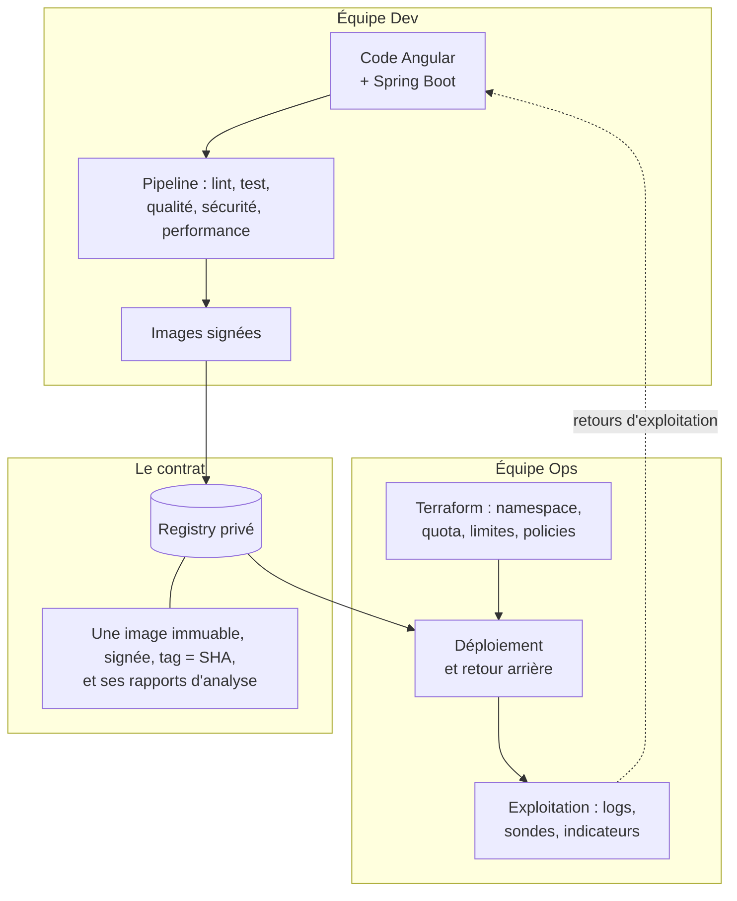
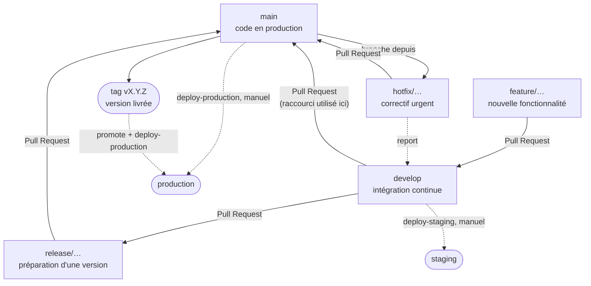
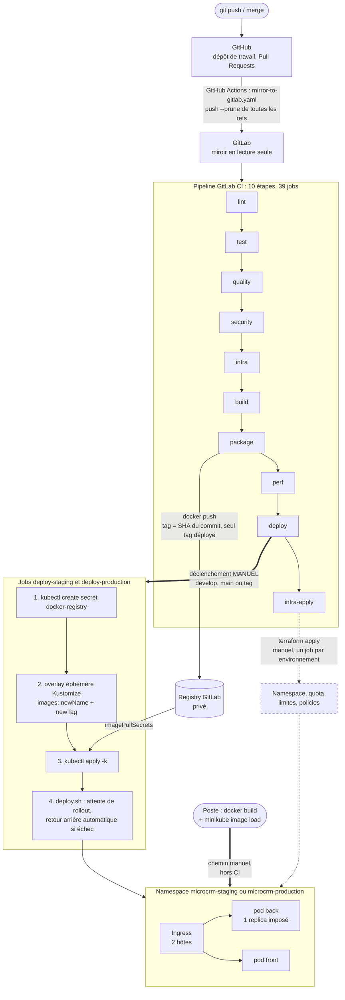
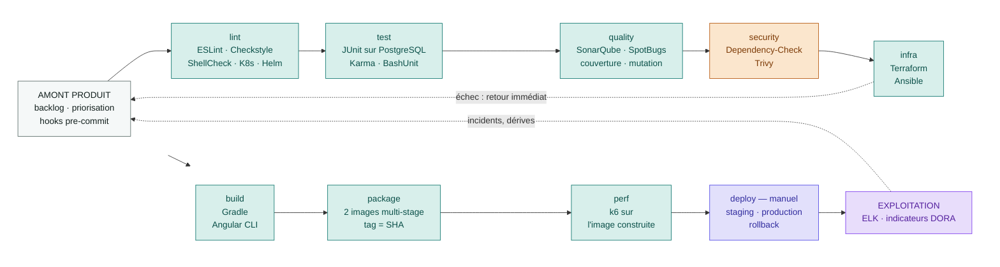
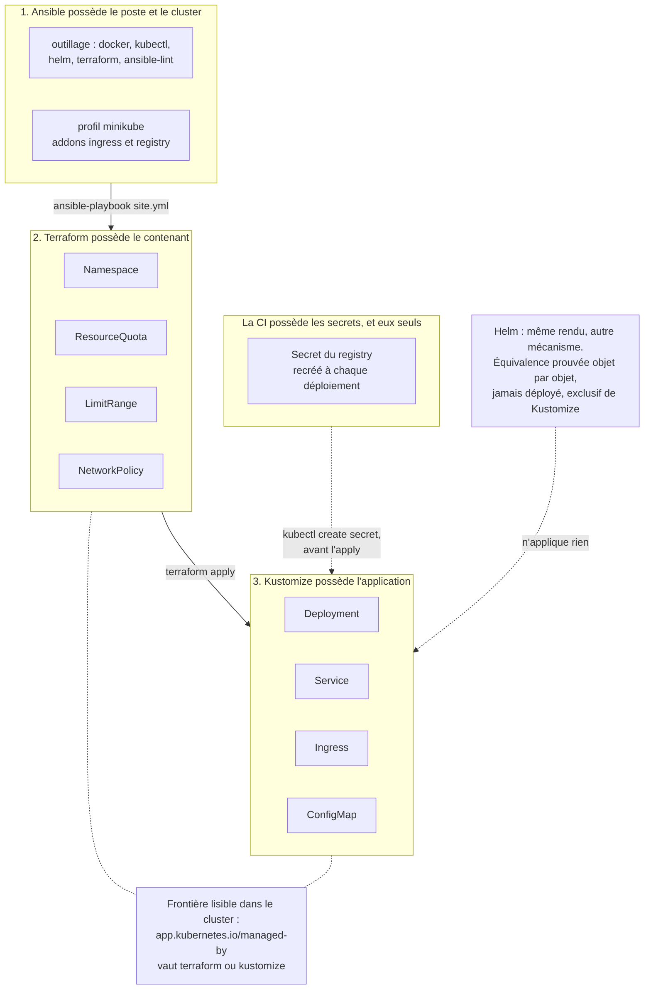
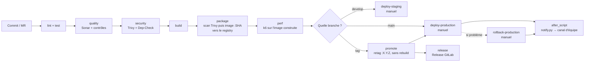

# Documentation CI/CD complète — MicroCRM / Orion

> **Ce que ce document est.** La synthèse en un seul endroit de la chaîne CI/CD
> de MicroCRM : le point de départ audité, ce que la chaîne fait, pourquoi elle
> le fait ainsi, et ce qu'elle ne fait pas. Il assemble une quinzaine de
> documents du dépôt, listés en §8.1. Il décrit l'état livré : version 1.0.1 en
> production depuis le 5 octobre 2026.
>
> Chaque case sans réponse porte « non implémenté » ou « non mesuré » avec sa
> raison, jamais une valeur plausible. Les chiffres viennent du dépôt ; ceux qui
> viennent d'une exécution disent laquelle et quand.

---

## 1. Introduction

### 1.1 Présentation du document

MicroCRM est une application de démonstration : un CRM réduit à la création, à
l'édition et à la consultation de personnes rattachées à des organisations. Ce
document décrit sa chaîne CI/CD : le workflow de branches, la stratégie de
tests, l'infrastructure décrite en code, les conteneurs, les contrôles de
sécurité, l'automatisation des releases et du retour arrière, la supervision.

**Le dépôt.**

- Dépôt GitLab, où s'exécute le pipeline :
  [gitlab.com/pasquietted/G-rez-le-cycle-de-vie-de-d-veloppement-logiciel](https://gitlab.com/pasquietted/G-rez-le-cycle-de-vie-de-d-veloppement-logiciel)
  (projet public n° 84606666 ; pipelines, registry, environnements et Releases).
- Dépôt GitHub, où vivent les branches et les Pull Requests, recopié vers GitLab
  à chaque push :
  [github.com/TedPasquiet/G-rez-le-cycle-de-vie-de-d-veloppement-logiciel](https://github.com/TedPasquiet/G-rez-le-cycle-de-vie-de-d-veloppement-logiciel).

**Où trouver chaque plan.**

| Plan ou volet                                          | Section     |
| ------------------------------------------------------ | ----------- |
| Contexte, audit de départ, objectifs alignés sur Orion | §2.1, §2.2  |
| Collaboration Dev / Intégration / Ops                  | §2.3        |
| Stratégie de branches                                  | §3          |
| Plan de tests automatisés                              | §4          |
| Architecture IaC                                       | §5.1 à §5.4 |
| Plan de conteneurs                                     | §5.5        |
| Plan de sécurité                                       | §6          |
| Plan d'automatisation des releases et rollback         | §7.1 à §7.5 |
| Sauvegarde et reconstruction                           | §7.6        |
| Supervision et alerting                                | §7.7        |
| Limites                                                | §8.4        |
| Accessibilité                                          | §8.5        |

Son pendant est le **plan d'optimisation des releases**
(`docs/plan-optimisation-release.md`), qui dit dans quel ordre la chaîne doit
encore progresser.

### 1.2 Technologies principales

| Catégorie           | Outil                                                      | Rôle                                                                                                                                                   |
| ------------------- | ---------------------------------------------------------- | ------------------------------------------------------------------------------------------------------------------------------------------------------ |
| **CI/CD**           | GitLab CI (+ GitHub Actions pour le miroir)                | 10 étapes, 39 jobs, 14 fichiers. GitHub porte le code et les Pull Requests, GitLab exécute                                                             |
| **Qualité**         | SonarQube / SonarCloud, SpotBugs, JaCoCo, PIT              | Dette et Quality Gate, bugs de bytecode, couverture de lignes, force des assertions                                                                    |
| **Conteneurs**      | Docker multi-stage, Kubernetes, Kustomize, Helm            | Une image par application, déploiement par overlays ; Helm est rendu et comparé, jamais appliqué                                                       |
| **Cloud**           | **aucun fournisseur — minikube local**                     | Décision assumée, argumentée en §5.1 et transposée fournisseur par fournisseur en `ARCHITECTURE.md` §10                                                |
| **IaC**             | Terraform (provider `hashicorp/kubernetes`), Ansible       | Terraform possède les namespaces, quotas, limites et policies ; Ansible possède le poste et le cluster                                                 |
| Sécurité            | OWASP Dependency-Check, Trivy                              | CVE des dépendances Java ; CVE d'image, secrets et misconfigurations ; rapports JSON en artefacts                                                      |
| Performance         | k6                                                         | Trois scénarios contre l'image qui vient d'être construite                                                                                             |
| Supervision         | Elasticsearch, Filebeat, Kibana, APM Server, OpenTelemetry | Logs centralisés, 5 tableaux de bord et 8 règles d'alerte versionnés, traces de l'API en staging et en production ; **pas de métriques de ressources** |
| Discipline de dépôt | husky, lint-staged, commitlint, Prettier, Spotless         | Contrôles locaux avant le push                                                                                                                         |

**Coût de licence : nul.** Tous ces outils sont gratuits dans l'usage qui en est
fait ici ; l'investissement est en temps de mise en place et en montée en
compétence (`VEILLE.md` §7).

---

## 2. Contexte et objectifs du projet

### 2.1 Contexte

**L'entreprise et les équipes.** Orion développe MicroCRM, une application
full-stack — back Java / Spring Boot exposant une API REST, front Angular. Deux
équipes s'en partagent le cycle de vie, et les deux ont répondu au sondage
« pratiques et technologies » :

| Équipe  | Membres                                                                | Terrain                                                                   |
| ------- | ---------------------------------------------------------------------- | ------------------------------------------------------------------------- |
| **Dev** | Roubina (lead), Sylvain (senior), Temim (junior), Josefina (stagiaire) | Angular/TypeScript, Spring Boot/Java, Gradle, NPM, JUnit, Karma, HyperSQL |
| **Ops** | Nico (lead), Maïa (senior)                                             | Bash, Ansible, Apt/Debian, TestInfra, BashUnit, Docker, PostgreSQL        |

**Le niveau déclaré n'est pas uniforme, et c'est structurant.** L'équipe Dev se
dit « bonne » en TypeScript/Angular, NPM, Karma et Docker, mais **débutante en
Java/Spring Boot, Gradle, JUnit et HyperSQL** — c'est-à-dire sur toute la partie
serveur. L'équipe Ops est « très bonne » en Bash, « bonne » partout ailleurs, et
« moyenne » en PostgreSQL. **Aucune des deux équipes ne déclare de compétence
Kubernetes**, alors que c'est la cible retenue : c'est une absence, pas une
lacune mineure, et elle est traitée comme telle (§2.2, irritant I8).

**Le cycle décrit par les équipes.** Côté Dev, sept étapes du backlog à la
génération des images. Côté Ops, trois : réception d'un numéro de version,
analyse Trivy de l'image, déploiement manuel en commandes Docker sur
l'environnement de démonstration. Entre les deux, **un email**.

**Les points de douleur, tels qu'ils sont formulés.**

| Source             | Ce qui est dit                                                                                                                                              |
| ------------------ | ----------------------------------------------------------------------------------------------------------------------------------------------------------- |
| Sondage Ops, Q3    | « La majorité des opérations sont aujourd'hui manuelles et mériteraient d'être automatisées, notamment les contrôles de sécurité ainsi que le déploiement » |
| Sondage Dev, Q2    | « Nous avons reçu dès le début un retour sur des CVEs présentes dans l'image, ce qui a retardé le premier déploiement » — le fameux _retour à l'envoyeur_   |
| Sondage Dev, Q3    | Projet au second sprint, opérations encore majoritairement manuelles                                                                                        |
| Sondage Ops, Q4    | Besoin d'un **dépôt d'images interne**, pour ne plus dépendre de DockerHub                                                                                  |
| Sondage Ops, Q4    | Besoin d'une **analyse de sécurité des images en amont**, avant transmission à l'équipe Ops                                                                 |
| Sondage Dev, Q4    | Besoin d'**analyse statique et d'aide à la conception**, précisément parce que l'équipe est débutante en Java                                               |
| Sondage Dev, Q3bis | **Trois artefacts produits**, dont une image « tout en un » embarquant front et back                                                                        |

**Ce que l'audit du dépôt ajoute** (`AUDIT.md` §1-2). Le dépôt livré par
OpenClassrooms (commits `0b1e7fc` du 13 mai 2024 et `4298760` du 29 mai 2024)
contient :

- un `.gitlab-ci.yml` de **2 étapes et 4 jobs** : `test-front`, `test-back`,
  `build-front`, `build-back`. C'est de l'intégration au sens strict : ça
  compile, ça teste, et ça s'arrête là ;
- **un Dockerfile unique à la racine**, multi-étapes, à trois cibles : `front`
  (Caddy sur Alpine), `back` (JRE 21 sur Alpine) et `standalone` (les deux dans
  un même conteneur, sous supervisord), avec un `.dockerignore` et un
  `README.md` qui documente les commandes `docker build --target …`.

Ce Dockerfile a quatre défauts : des images de base non figées (`node`,
`gradle:jdk17`), une compilation en JDK 17 pour une exécution en JRE 21, un
`EXPOSE 4200` pour un back qui écoute sur 8080, et aucun utilisateur non
privilégié. Surtout, **la CI ne s'en sert pas** : aucune image n'est construite
ni poussée, et il n'y a aucun registry. Sont absents par ailleurs : toute
analyse statique, toute mesure de couverture, tout contrôle de sécurité, tout
déploiement, tout rollback, tout versionnage, tout hook local, toute règle de
branche.

**Les six frictions retenues** (`AUDIT.md` §4) :

| #   | Friction                                              | Effet                                                    |
| --- | ----------------------------------------------------- | -------------------------------------------------------- |
| 1   | Aucun retour qualité avant la revue humaine           | Le temps de revue part dans le style et les bugs simples |
| 2   | Détection tardive : tout remonte en CI, rien en local | Boucle de retour longue, minutes de calcul gaspillées    |
| 3   | Mise en production manuelle                           | Non reproductible, dépendante d'une personne             |
| 4   | Pas de rollback outillé                               | Temps de rétablissement non maîtrisé                     |
| 5   | Pas d'environnement de validation                     | Les régressions sont découvertes par les utilisateurs    |
| 6   | Documentation réduite au `README.md`                  | Onboarding lent, dépendance aux personnes                |

**Le goulot principal est l'absence totale d'automatisation après le `build`** :
tout le travail de vérification en amont n'est pas capitalisé, puisque la
livraison repose ensuite sur des gestes manuels.

### 2.2 Objectifs

Cinq objectifs, chacun relié à une priorité exprimée par Orion (§2.1) et doté
d'une mesure. Les valeurs « mesuré » viennent de `scripts/ci/collect_dora.py`
(exécution du 2026-10-05 à 14 h 39 UTC, fenêtre de 30 jours, 67 pipelines,
après le dernier déploiement de la release 1.0.1) ou d'une exécution des suites
du dépôt.

| #      | Objectif                                                                                                      | Priorité d'Orion à laquelle il répond                                                   | Comment il se mesure                                      | Cible                         | Mesuré (2026-10-05)                                                                                                    |
| ------ | ------------------------------------------------------------------------------------------------------------- | --------------------------------------------------------------------------------------- | --------------------------------------------------------- | ----------------------------- | ---------------------------------------------------------------------------------------------------------------------- |
| **O1** | Faire aboutir la chaîne de déploiement depuis la CI, sans geste manuel autre que la décision                  | Sondage Ops Q3 : automatiser le déploiement ; frictions 3 et 5                          | `deployment_frequency` de `collect_dora.py`               | > 0 / jour                    | **0,2667 / jour** — 8 déploiements réussis sur 30 jours : **atteint**                                                  |
| **O2** | Ramener le délai entre la découverte d'une CVE et son retour à l'auteur de plusieurs jours à quelques minutes | Sondage Dev Q2 et Ops Q4 : le « retour à l'envoyeur », l'analyse des images en amont    | Durée du job `package-*` / `dependency-check-back`        | minutes                       | **Atteint** : Trivy (dépôt et image) et Dependency-Check (82 dépendances) bloquent dans le pipeline de l'auteur (§6.4) |
| **O3** | Rendre la qualité du back pilotable par un seuil opposable                                                    | Sondage Dev Q4 : analyse statique, équipe débutante en Java ; friction 1                | `coverage-gate` (JaCoCo) et `mutation-back` (PIT)         | ≥ 90 % lignes, ≥ 80 % mutants | **97 % lignes, 100 % branches, 96 % mutants** : **atteint**                                                            |
| **O4** | Maîtriser le temps de rétablissement : le rollback doit être une commande, pas une improvisation              | Friction 4 : pas de rollback outillé                                                    | `time_to_restore_service`, et un rollback réellement joué | mesurable                     | **2,21 h de médiane sur 4 observations** ; rollback de production joué le 2026-09-23 (§7.4)                            |
| **O5** | Faire descendre le taux d'échec des changements sous 50 %                                                     | Sondage Ops Q3 et friction 3 : une mise en production fiable, qui ne dépend de personne | `change_failure_rate` de `collect_dora.py`                | < 50 %                        | **60 % sur 15 tentatives** : _non atteint_ ; 3 échecs sont des déploiements tombés sur un cluster arrêté               |

> ⚠️ **Valeur statistique faible.** Quinze tentatives, quatre observations de
> rétablissement, huit réussites concentrées sur trois journées : ce sont des
> faits, pas des tendances. La ligne de base existe parce qu'il en faut une
> (`MONITORING.md` §9.1, `docs/plan-optimisation-release.md` §5).
>
> ⚠️ **O5 compte des pannes de la plateforme.** Trois `deploy-production` en
> échec du 2026-10-05 sont tombés sur un minikube arrêté par un redémarrage de
> Docker Desktop, sans rien écrire en production. DORA les compte comme des
> échecs de changement, et le collecteur ne sait pas les distinguer (GitLab les
> classe en `script_failure`). Sans eux, le taux serait de 50 % (6 sur 12) ; il
> est publié à 60 %, parce que c'est ce que mesure l'indicateur. Le poste de
> développement, utilisé comme environnement, est la première cause d'échec de
> livraison mesurée.

Le chemin détaillé — cinq vagues, un porteur et une preuve d'atteinte par action
— est dans `docs/plan-optimisation-release.md` §4.

### 2.3 Ce que la chaîne change à la collaboration entre développement, intégration et exploitation

Une chaîne CI/CD n'est pas qu'un automate : c'est l'endroit où trois métiers se
rencontrent. Le **développement** écrit le code. L'**intégration** l'assemble,
le vérifie et en fait un artefact livrable — chez Orion ce rôle n'a pas d'équipe
à lui, il était tenu par la dernière étape du cycle Dev (« génération des images
et envoi des références »). L'**exploitation** déploie cet artefact et le
maintient en service.

#### Ce que chacun faisait seul

Le cycle déclaré par les équipes (§2.1, `AUDIT.md` §2.3) est une suite de
travaux menés chacun de son côté, reliés par un email :

| Métier        | Ce qu'il faisait seul                                                                             | Ce que les autres n'en voyaient pas                                             |
| ------------- | ------------------------------------------------------------------------------------------------- | ------------------------------------------------------------------------------- |
| Développement | Coder, tester sur son poste, corriger après la démonstration                                      | Ni la couverture, ni la qualité : rien ne les mesurait (`AUDIT.md` §2.2)        |
| Intégration   | Générer trois artefacts à la main, envoyer leurs références par email                             | Quelle image correspond à quel commit : aucun tag, aucun registry interne       |
| Exploitation  | Recevoir un numéro de version, scanner l'image avec Trivy, déployer à la main en commandes Docker | Le résultat du scan arrivait après la remise : c'est le « retour à l'envoyeur » |

Les frictions n° 1, 2, 3 et 6 de l'audit (`AUDIT.md` §4) en découlent : un
retour tardif, une mise en production qui dépend d'une personne, une
connaissance qui n'est écrite nulle part.

#### Ce que la chaîne met en commun



_Source : `docs/schemas/frontiere-dev-ops.mmd`, reprise sans modification. Ce
schéma est celui de l'architecture **cible** : il écrit « images signées », et
la signature n'est pas implémentée (§6.2). Tout le reste du schéma est en
place._

Le schéma se lit ainsi : l'équipe Dev produit, par le pipeline, une image
immuable ; cette image et ses rapports d'analyse, rangés dans un registry privé,
sont le contrat entre les deux équipes ; l'équipe Ops prépare l'infrastructure,
déploie cette image et l'exploite ; ce qu'elle observe revient au développement.
**Ce qui traverse la frontière est un fait, pas un message.**

Cinq mécanismes rendent cela concret :

| Ce qui est mis en commun                                                   | Ce que ça change entre les équipes                                                                                                                                                                                                                                               | Où le vérifier                                                  |
| -------------------------------------------------------------------------- | -------------------------------------------------------------------------------------------------------------------------------------------------------------------------------------------------------------------------------------------------------------------------------- | --------------------------------------------------------------- |
| **Un dépôt unique** pour le code, l'infrastructure et les tableaux de bord | Le Dockerfile, les manifestes, Terraform, Ansible, les tableaux de bord Kibana et les règles d'alerte sont versionnés à côté du code. Une même merge request montre à la fois le changement applicatif et ce qu'il demande à l'exploitation                                      | `back/`, `front/`, `k8s/`, `terraform/`, `ansible/`, `k8s/elk/` |
| **Des portes de qualité qui renvoient le retour à l'auteur, en minutes**   | Le scan Trivy que l'équipe Ops faisait après remise tourne dans le pipeline de l'auteur, **avant** que l'image n'atteigne le registry. Une CVE arrête le job de celui qui l'a introduite, pas la journée de celui qui la reçoit                                                  | §6.4 ; durées par étape dans `docs/pipeline-ci.md` §5           |
| **Des environnements GitLab et des notifications visibles de tous**        | Les jobs de déploiement déclarent leur environnement (`staging`, `production`) : GitLab en garde l'historique, lisible sans demander à personne. Chaque déploiement, réussi ou non, est annoncé sur le canal d'équipe dès que le webhook est configuré ; un tag crée une Release | `.gitlab/ci/deploy.yml` ; §7.2, §7.7                            |
| **Un retour arrière en une commande**                                      | Revenir en arrière n'est pas le savoir d'une personne : c'est `rollback.sh`, ou le job `rollback-production`, que quiconque a le droit de déployer peut lancer                                                                                                                   | §7.4 — joué en production le 2026-09-23                         |
| **Des indicateurs DORA partagés**                                          | Les deux équipes lisent les mêmes quatre chiffres, calculés depuis l'API et non déclarés. Un taux d'échec de 60 % n'est ni « un problème de dev » ni « un problème d'ops » : c'est celui de la chaîne — et de la plateforme qui la porte                                         | §2.2 ; `MONITORING.md` §9 ; tableau de bord `dora.ndjson`       |

**Pourquoi c'est de la collaboration, et pas seulement de l'outillage.** Chaque
ligne remplace un échange entre personnes — un email, une question, une demande —
par un fait consultable par tous au même endroit. L'équipe Dev n'attend pas
qu'un collègue Ops ait le temps de scanner ; l'équipe Ops ne devine pas ce que
contient une version. Et la boucle se referme dans l'autre sens :
les tableaux de bord et les règles d'alerte (§7.7) sont des fichiers du dépôt,
qu'un développeur peut lire et modifier par merge request.

> ⚠️ **Ce que ce dépôt ne peut pas prouver.** Il a un seul contributeur : les
> équipes Dev et Ops d'Orion sont celles du cas d'étude. La collaboration est
> donc **outillée**, pas **observée** — aucune merge request n'a été relue par un
> tiers, aucune règle d'approbation n'est en place (§3.2), et l'action A1.5 du
> plan (« aucun échange de version par email sur une itération complète ») ne
> peut pas être mesurée ici. Deux mécanismes restent en outre incomplets : les
> alertes applicatives ne sortent pas de Kibana (§7.7), et les deux déploiements
> restent déclenchés à la main.

---

## 3. Workflow de branches

### 3.1 Modèle de branching choisi

**GitFlow**, avec `main` et `develop` permanentes et des branches de travail
éphémères. Le modèle a été retenu parce qu'il donne une branche d'intégration
distincte de la branche de production — condition nécessaire pour avoir un
environnement de staging qui reçoive autre chose que ce qui part en production
— et parce que `hotfix/` offre un chemin explicite pour corriger la production
sans emporter ce qui traîne sur `develop`. Le coût assumé est sa lourdeur : sur
un dépôt à un seul contributeur, la branche `release/` n'est pas utilisée (§3.2).

### 3.2 Structure des branches



**Ce que chaque branche déclenche** (`ARCHITECTURE.md` §7, règles réelles dans
`.gitlab/ci/templates.yml`) :

| Branche                        | Rôle                                                         | Jobs déclenchés                                                                                      |
| ------------------------------ | ------------------------------------------------------------ | ---------------------------------------------------------------------------------------------------- |
| `main`                         | Code en production                                           | Tous, jusqu'au déploiement production                                                                |
| `develop`                      | Intégration continue                                         | Tous, jusqu'au staging                                                                               |
| `feature/…`, `fix/…`, `docs/…` | Travail en cours : fonctionnalité, correction, documentation | lint, test, quality, security, validation d'infra — filtrés par périmètre ; aucune image construite  |
| `release/…`                    | Préparation d'une version                                    | Vérification, build, images, performance ; aucun déploiement                                         |
| `hotfix/…`                     | Correctif urgent en production                               | Vérification, build, images, performance ; aucun déploiement                                         |
| Tag `vX.Y.Z`                   | Version livrée                                               | Tous **sauf `package-*`** : un tag promeut, il ne reconstruit pas ; `release` crée la Release GitLab |

**L'écart entre le modèle et la pratique, parce qu'il se lit dans `git log`.**
Le dépôt porte deux tags, `v1.0.0` (sans image ni Release) et `v1.0.1`
(version en production) : §7.3. **Aucune branche `release/*`
n'existe** : les livraisons passent directement de `develop` à `main` par Pull
Request (PR #36 pour la version 1.0.1). Des branches de correction sont
fusionnées directement dans `main` : c'est un raccourci par rapport au modèle,
pas une application de GitFlow.

**Politique de merge.**

| Point                                 | État                                                                                                                                                                                             |
| ------------------------------------- | ------------------------------------------------------------------------------------------------------------------------------------------------------------------------------------------------ |
| Mécanisme                             | Pull Request GitHub — `main` et `develop` ne reçoivent que des merges, jamais de commit direct                                                                                                   |
| Condition technique                   | Le pipeline GitLab du miroir doit être vert : toutes les portes de `lint`, `test`, `quality`, `security`, `infra`, `build` et `package` sont bloquantes                                          |
| Approbations                          | **Non formalisé.** Aucune règle de protection de branche n'est versionnée ni documentée, et le dépôt a un seul contributeur : les Pull Requests sont ouvertes et fusionnées par la même personne |
| Arbitrage d'une exception de sécurité | Passe obligatoirement par la revue de MR, parce qu'une exception n'existe que sous forme d'entrée dans un fichier versionné (`AUDIT.md` §7.4.4)                                                  |
| Protection de `main`                  | **Non vérifiable depuis le dépôt.** Les réglages de protection vivent dans l'interface GitHub/GitLab et ne sont pas exportés ici                                                                 |

> Sur un vrai dépôt d'équipe, deux réglages manquent et ils se posent en cinq
> minutes : exiger une approbation d'un tiers sur `main`, et exiger le statut
> vert du pipeline avant fusion. Ce ne sont pas des oublis de conception, ce sont
> des réglages d'interface qu'un dépôt à un contributeur ne fait pas ressentir.

### 3.3 Conventions de nommage

**Branches.** Le nommage n'est pas cosmétique : le pipeline filtre les jobs sur
le **préfixe**, donc une branche mal nommée ne déclenche rien.

- Séparateur **slash**, jamais underscore : la règle est
  `$CI_COMMIT_BRANCH =~ /^feature\//`. `feature_ma-fonctionnalite` ne correspond
  à aucune règle.
- Mots composés en tiret, en minuscules : `feature/initial-documentation`.
- Préfixes reconnus : `feature/`, `fix/`, `docs/`, `release/`, `hotfix/`, plus
  `main` et `develop` (`.gitlab/ci/templates.yml`, règle
  `/^(feature|fix|docs)\//` pour les branches de travail).

> ⚠️ **Piège : un préfixe proche ne suffit pas.** La branche
> `feat/gestion-des-erreurs-http` existe et **ne correspond à aucune règle de
> branche** : `feat/` n'est pas `feature/`. Poussée seule, elle ne déclenche
> aucun job ; elle n'est vérifiée qu'une fois ouverte en merge request, où la
> règle `$CI_MERGE_REQUEST_ID` s'applique (`ARCHITECTURE.md` §7).

**Commits.** **Conventional Commits**, imposés par `commitlint` via le hook
`.husky/commit-msg`, donc **avant le push** et non en CI. Onze types autorisés
(`commitlint.config.js`) :

```
feat · fix · docs · style · refactor · perf · test · build · ci · chore · revert
```

Forme : `type(portée): description à l'impératif`. Exemples réels du dépôt :

```
feat(release): propage la version SemVer jusqu'à l'image et vérifie sa concordance
fix(deploy): échoue si le namespace de destination est vide au lieu de viser default
ci(securite): rend les trois scans Trivy bloquants
```

L'intérêt dépasse le style : un historique exploitable par machine ouvre la
génération automatique de changelog et le versionnage sémantique automatisé —
deux évolutions identifiées mais **non implémentées** (`RELEASE.md` §8). La
Release GitLab créée sur chaque tag (§7.2) décrit les images et le commit, pas
la liste des changements.

---

## 4. Stratégie de tests automatisés

### 4.1 Les types de tests

| Type de test    | Outil                                                                       | Déclenchement                                                                      | Couverture cible                                                                 | État réel                                                                                                                                                                                                         |
| --------------- | --------------------------------------------------------------------------- | ---------------------------------------------------------------------------------- | -------------------------------------------------------------------------------- | ----------------------------------------------------------------------------------------------------------------------------------------------------------------------------------------------------------------- |
| **Unitaires**   | JUnit 5 (back), Karma/Jasmine (front)                                       | Étape `test`, à chaque push et MR ; filtrés par périmètre sur `feature/`           | ≥ 90 % de lignes                                                                 | **97 % lignes / 100 % branches** (back) · **100 % lignes / 90 % branches**, 112 tests (front : 37 branches sur 41)                                                                                                |
| **Intégration** | JUnit + Spring Boot, sur **PostgreSQL réel** (service `postgres:16-alpine`) | Étape `test`, jobs `test-back` et `mutation-back`                                  | incluse dans le seuil ci-dessus                                                  | Repositories, cascades, contrat HTTP de Spring Data REST, CORS, Actuator                                                                                                                                          |
| **E2E**         | —                                                                           | —                                                                                  | —                                                                                | **Non implémenté.** Aucun stage `integration`, aucun Cypress ni Playwright. C'est la lacune nommément identifiée en `VEILLE.md` §8 et `schema.md` : rien ne vérifie que le front et le back fonctionnent ensemble |
| **Sécurité**    | OWASP Dependency-Check, Trivy (`fs` et `image`)                             | Étape `security` (dépôt) et `package-*` (images, **avant** le push)                | zéro CVE HIGH/CRITICAL non arbitrée                                              | **Bloquant.** Seuil `failBuildOnCVSS = 7.0`. Dependency-Check lit 82 dépendances, avec 12 CVE exceptées (§6.4). Les images de la version 1.0.1 portent 0 CVE HIGH ou CRITICAL (§6.2)                              |
| **SonarQube**   | SonarQube / SonarCloud + SpotBugs                                           | Étape `quality`, jobs `sonar-back`, `sonar-front`, `quality-gate`, `spotbugs-back` | Quality Gate franchie sur le **code nouveau**                                    | Quality Gate opposable (§4.3). `spotbugs-back` est en `ignoreFailures = true` : il publie, il ne bloque pas                                                                                                       |
| **Performance** | k6 (`grafana/k6:2.1.0`, version figée)                                      | Étape `perf`, **pipeline enfant**, après `package`                                 | p95 lecture < 500 ms, p95 écriture < 800 ms, erreurs < 1 %, p95 smoke < 1 500 ms | `k6-smoke` bloquant · `k6-load` en `allow_failure` (runners mutualisés) · `k6-stress` sur demande (`K6_STRESS=true`)                                                                                              |

**S'y ajoutent deux suites que le template ne prévoit pas et qui pèsent lourd
ici**, parce que toute la logique du pipeline vit dans des scripts :

| Suite                           | Ce qu'elle couvre                                                                                                 | Vérifié                     |
| ------------------------------- | ----------------------------------------------------------------------------------------------------------------- | --------------------------- |
| `scripts/tests/run_tests.sh`    | Tous les scripts du pipeline, avec `kubectl`, `docker`, `trivy` remplacés par des faux binaires en tête de `PATH` | **430 assertions**, 0 échec |
| `scripts/tests/validate_k8s.sh` | Les manifestes Kustomize et le chart Helm, sans cluster, y compris l'équivalence des deux rendus                  | **151 assertions**, 0 échec |

> **Pourquoi tester des scripts de déploiement.** Un script qui échoue mal est
> plus dangereux qu'un script absent. Les faux `kubectl` permettent de vérifier
> les chemins d'échec — rollback automatique déclenché, refus de pousser une
> image vulnérable — sans cluster ni registry (`VEILLE.md` §5).

**Sur quel moteur de base les tests tournent, et pourquoi ce n'est pas une
inconséquence.** En CI, un **PostgreSQL réel** démarré comme service du job ; en
local, **HSQLDB en mémoire**, sans rien à installer. La bascule ne passe par
aucun profil Spring : elle tient aux trois variables `SPRING_DATASOURCE_URL`,
`SPRING_DATASOURCE_USERNAME` et `SPRING_DATASOURCE_PASSWORD`. Absentes, HSQLDB ;
présentes, PostgreSQL. Le schéma de MicroCRM n'est écrit nulle part — Hibernate
le déduit des entités — donc personne ne le relit avant qu'il n'existe, et ce
qu'un moteur tolère l'autre le refuse. Une suite verte sur HSQLDB ne dit rien de
PostgreSQL (`QUALITY.md` §7).

### 4.2 Intégration dans le pipeline

Le pipeline compte **10 étapes et 39 jobs**, définis dans `.gitlab-ci.yml` et
**14 fichiers** au total (la racine, qui ne contient aucun job, et 13 fichiers de
`.gitlab/ci/`, un par domaine).

| Étape         | Jobs                                                                                           | Ce qu'elle décide                                          | Bloquante                                                       |
| ------------- | ---------------------------------------------------------------------------------------------- | ---------------------------------------------------------- | --------------------------------------------------------------- |
| `lint`        | `lint-front`, `lint-back`, `shellcheck`, `lint-k8s`, `lint-helm`, `version-consistency`        | Forme du code, manifestes, chart, concordance des versions | oui                                                             |
| `test`        | `test-scripts`, `test-front`, `test-back`                                                      | Comportement                                               | oui                                                             |
| `quality`     | `sonar-back`, `sonar-front`, `spotbugs-back`, `coverage-gate`, `mutation-back`, `quality-gate` | Tenue du code, couverture, force des assertions            | oui, sauf `spotbugs-back` ; `quality-gate` sur `main` seulement |
| `security`    | `dependency-check-back`, `trivy-fs`                                                            | Surface d'attaque du dépôt                                 | oui                                                             |
| `infra`       | `terraform-validate`, `terraform-plan`, `ansible-lint`                                         | L'infrastructure se valide **avant** qu'on ne compile      | oui                                                             |
| `build`       | `build-front`, `build-back`                                                                    | Artefacts                                                  | oui                                                             |
| `package`     | `package-back`, `package-front`, `promote-back`, `promote-front`, `release`                    | Images taguées par SHA, scannées, poussées                 | oui                                                             |
| `perf`        | `perf` → pipeline enfant (`k6-smoke`, `k6-load`, `k6-stress`)                                  | Tenue en charge de l'image construite                      | `k6-smoke` seul                                                 |
| `deploy`      | `deploy-staging`, `deploy-production`, `rollback-production`, `dora-metrics`                   | Mise en service et retour arrière                          | manuels                                                         |
| `infra-apply` | `terraform-apply-{staging,logging,production}`, `notify-echec`                                 | `terraform apply` par environnement, notification d'échec  | manuels, bloquants                                              |

**Trois choix d'ordonnancement méritent leur explication.**

1. **`security` avant `build`.** C'est le shift-left rendu littéral : on ne
   compile pas ce dont on sait déjà qu'il ne sera pas livrable.
2. **`infra` avant `build`.** Un plan Terraform ou un manifeste cassé n'a pas
   besoin d'attendre une compilation Gradle pour être signalé.
3. **`infra-apply` en dernier.** Un job manuel **sans** `allow_failure` est un
   job bloquant : « the pipeline stops at the stage where the job is defined ».
   Placés dans l'étape `infra`, les trois `terraform-apply-*` arrêteraient tout
   pipeline de `main` avant `build`, `package`, `perf` et `deploy`, tant que
   personne ne clique.

**Conditions de déclenchement.**

| Régime                                   | Ce qui tourne                                                                                                                                                  |
| ---------------------------------------- | -------------------------------------------------------------------------------------------------------------------------------------------------------------- |
| Merge request                            | Toute la vérification, **filtrée par périmètre** : un commit qui ne touche que `front/` ne relance pas `test-back`, `mutation-back` ni `dependency-check-back` |
| Branche `feature/…`, `fix/…`, `docs/…`   | Idem, avec `compare_to: refs/heads/develop` pour que le filtre réponde « ce que cette branche change », pas « ce que ce push change »                          |
| `develop`, `main`, `release/`, `hotfix/` | Tout, sans filtre de périmètre — avant une livraison, on ne saute rien. Les déploiements ne sont proposés que sur `develop` (staging) et `main` (production)   |
| Tag `vX.Y.Z`                             | Tout **sauf `package-*`** : `promote-back` et `promote-front` retaguent l'image déjà publiée, puis `release` crée la Release GitLab                            |

> **Ce que le filtrage n'ose pas franchir.** `build-*`, `package-*` et les jobs
> de déploiement gardent leurs règles **sans** `changes:`. Les images sont
> taguées par `$CI_COMMIT_SHORT_SHA`, et `deploy` comme les services k6 les
> réclament sous ce tag : sauter `package-back` parce que le back n'a pas bougé
> produirait un tag qui n'existe pas. Le filtrage s'arrête à la vérification.

### 4.3 Quality Gate SonarQube

**Le principe : _Clean as You Code_.** La porte ne s'applique pas à l'ensemble du
code existant — exigence décourageante et jamais atteinte — mais au **code
nouveau ou modifié**. La dette se résorbe à mesure que le code est touché.

**Comment le verdict est récupéré.** Les jobs `sonar-back` et `sonar-front`
envoient l'analyse ; ils ne lisent pas le verdict. C'est un job séparé,
`quality-gate`, qui appelle `scripts/ci/quality_gate.py` : le script interroge
l'API jusqu'à obtenir le résultat de l'analyse, affiche les règles fautives, et
**sort en 2** si la porte n'est pas franchie. Il est lancé deux fois, une par
projet Sonar. **Ce job ne tourne que sur `main`** : l'offre gratuite de
SonarCloud n'expose le verdict que pour la branche principale (l'API répond
`403` ailleurs). Les analyses, elles, partent de toutes les branches.

**Les critères effectivement opposables**, tous contrôlés dans l'étape `quality` :

| Critère                             | Seuil                       | Job                        | Où le seuil est écrit                                                   |
| ----------------------------------- | --------------------------- | -------------------------- | ----------------------------------------------------------------------- |
| Quality Gate Sonar sur le code neuf | verdict `OK`                | `quality-gate`             | Côté serveur Sonar                                                      |
| Couverture de lignes (back)         | **90 %** (`COVERAGE_MIN`)   | `coverage-gate`            | `.gitlab/ci/variables.yml`, appliqué par `scripts/ci/check_coverage.py` |
| Couverture de branches (back)       | 90 %                        | `./gradlew check` en local | `jacocoTestCoverageVerification` dans `back/build.gradle`               |
| Couverture (front)                  | 90 % lignes / 80 % branches | `test-front`               | bloc `check.global` de `front/karma.conf.js`                            |
| Score de mutation (back)            | **80 %** (`MUTATION_MIN`)   | `mutation-back`            | `.gitlab/ci/variables.yml` et `back/build.gradle`                       |

> **Pourquoi deux seuils qui ne mesurent pas la même chose.** La couverture dit
> quelles lignes les tests traversent ; **PIT dit si les tests vérifient quelque
> chose**. Un test sans aucune assertion affiche 100 % de couverture. PIT modifie
> le bytecode — inverse une condition, remplace un retour par `null`, supprime un
> appel — puis relance les tests qui couvrent la ligne mutée. Si aucun ne devient
> rouge, le mutant survit : la ligne est exécutée, mais rien ne l'observe.

**Action en cas d'échec.**

1. **Le pipeline s'arrête.** `quality-gate`, `coverage-gate` et `mutation-back`
   sont bloquants : rien n'est construit, rien n'est packagé, rien n'est
   déployable. Le seul contrôle de l'étape `quality` qui ne bloque pas est
   `spotbugs-back` (`ignoreFailures = true`), qui publie ses findings en
   artefact.
2. **La correction se fait dans la branche**, pas dans le seuil. Les seuils sont
   calés **sous** les valeurs tenues, avec assez de marge pour ne pas se
   déclencher sur une ligne de plus et assez peu pour qu'une vraie régression se
   voie. Un seuil qu'on abaisse à la première gêne ne protège plus rien.
3. **Le doublon local est voulu.** `jacocoTestCoverageVerification` rejoue le
   seuil dans `./gradlew check` : un seuil qui ne se déclenche qu'en CI se
   découvre toujours après le push.
4. **Une seule exclusion, nommée** : `MicroCRMApplication`, dont la méthode
   `main` ne contient que l'amorçage Spring Boot — pas un motif large qui
   absorberait du code métier au passage.

---

## 5. Architecture IaC et Cloud

### 5.1 Vue d'ensemble

**Il n'y a pas de fournisseur cloud, et c'est une décision, pas un manque.**

Le brief propose AWS ou Azure et **autorise nommément l'environnement local**, y
compris pour Terraform. La décision D2 a retenu le tout-local : **minikube
v1.38.1, Kubernetes v1.35.1, un nœud, Docker Desktop**, aucun compte, aucune
ressource payante. Les raisons, développées dans `ARCHITECTURE.md` §9 :

1. **Aucun coût, donc aucune ressource oubliée.** Le mode de défaillance le plus
   banal d'un projet d'école en cloud n'est pas technique : c'est un compte qui
   facture parce qu'une ressource a survécu au projet — ou l'inverse, une
   infrastructure supprimée trop tôt qui rend la démonstration impossible.
2. **L'environnement existait déjà**, addons `ingress` et `registry` compris. Le
   temps épargné a servi à ce que le projet devait démontrer.
3. **Le livrable reste vérifiable par un tiers, indéfiniment.** Un cluster cloud
   éteint après la démonstration ne se constate plus ; un dépôt qui se rejoue se
   constate toujours.
4. **Le local n'est pas une simulation.** Le provider `hashicorp/kubernetes`
   parle à un vrai serveur d'API et crée de vraies ressources — 6 par
   environnement. Il n'y a ni plan simulé, ni dry-run présenté comme une preuve.
5. **Gratuit ne veut pas dire sans limite.** Le quota de minutes partagées de
   l'offre gratuite de GitLab ne suffit pas à ce pipeline (`ci_quota_exceeded`) :
   les jobs tournent sur un **runner auto-hébergé**, sur le poste. La contrainte
   de ressource ne disparaît pas, elle se déplace vers la machine, qui porte à la
   fois le runner et le cluster.

**Type d'architecture.** Microservices au sens faible : **deux services** (front
et back) déployés séparément, chacun avec son image, son Deployment, son Service
et sa règle d'Ingress. Pas de service mesh, pas de passerelle applicative, pas de
file de messages.

**Services « managés » — aucun.** La table de transposition complète, brique par
brique, figure dans `ARCHITECTURE.md` §10. En résumé :

| Brique                                     | Aujourd'hui (local)                                         | AWS                     | Azure                            |
| ------------------------------------------ | ----------------------------------------------------------- | ----------------------- | -------------------------------- |
| Le cluster                                 | minikube, 1 nœud, créé par Ansible                          | EKS                     | AKS                              |
| `Namespace`, `ResourceQuota`, `LimitRange` | objets K8s créés par Terraform                              | **inchangés**           | **inchangés**                    |
| `Deployment`, `Service`, `ConfigMap`       | Kustomize, overlays par environnement                       | **inchangés**           | **inchangés**                    |
| Exposition publique, DNS, TLS              | **aucune** — `kubectl port-forward` et en-tête `Host:`      | Route 53 + ACM          | Azure DNS + Key Vault            |
| Registry                                   | registry GitLab pour la CI, `minikube image load` en local  | ECR                     | ACR                              |
| `Secret` du registry                       | recréé par la CI à chaque déploiement                       | **disparaît** (IRSA)    | **disparaît** (identité managée) |
| État Terraform                             | backend `http` — état managé GitLab, un par env, verrouillé | S3 + verrouillage       | Azure Storage + lease            |
| Stack de logs et de traces                 | Elasticsearch, Kibana, Filebeat, APM Server dans `logging`  | OpenSearch / CloudWatch | Log Analytics / Azure Monitor    |

> **Ce que le local ne démontre pas, et qu'aucune phrase ne remplace**
> (`ARCHITECTURE.md` §11) : la haute disponibilité (un seul nœud), un
> LoadBalancer réel, le stockage managé et sauvegardé, l'IAM et la gestion fine
> des droits, les coûts et leur maîtrise, la montée en charge automatique. Le
> cloisonnement réseau lui-même est **décrit, pas prouvé** : les `NetworkPolicy`
> existent et sont correctes, mais le CNI par défaut de minikube ne les
> implémente pas et les **ignore sans rien signaler**. Un `apply` réussi ne
> permet donc pas de conclure que le namespace est cloisonné.

### 5.2 Les schémas

#### 5.2.1 Schéma d'infrastructure

Du commit au pod : la plateforme réelle, registry et namespaces compris. Le trait
plein marque le chemin suivi par le pipeline, le trait épais un déclenchement
manuel, le pointillé l'`apply` Terraform, geste manuel placé dans la dernière
étape.



_Source : `docs/schemas/plateforme-deploiement.mmd`, reprise sans modification.
Rendu vérifié avec `mermaid-cli`._

**Trois conditions pour qu'un job de déploiement atteigne le cluster.** L'accès
passe par l'**agent GitLab pour Kubernetes** et non par un kubeconfig : celui
d'un poste désigne le serveur d'API en `127.0.0.1`, injoignable depuis un
conteneur de job. Le **RBAC de l'agent** couvre les objets applicatifs
(Deployment, Service, Ingress, ConfigMap, Secret du registry), pas seulement
ceux de Terraform. Et le **namespace est obligatoire** : `exige_namespace` fait
échouer le job sur une variable vide, au lieu de laisser `kubectl` retomber sur
`default` (§5.3).

#### 5.2.2 Schéma du pipeline CI/CD

La chaîne complète, de l'amont produit à l'exploitation. La sécurité s'exécute
**avant** la construction des artefacts : c'est le shift-left, et c'est ce que la
disposition doit rendre lisible.



_Source : `docs/schemas/chaine-cicd.mmd`, reprise sans modification. Rendu
vérifié avec `mermaid-cli`._

| Couleur    | Nature                            |
| ---------- | --------------------------------- |
| Gris       | Amont produit (hors CI)           |
| Vert d'eau | Vérification et livraison         |
| Orange     | Sécurité — shift-left / DevSecOps |
| Indigo     | Déploiement                       |
| Violet     | Exploitation                      |

### 5.3 Les environnements

| Environnement   | Branche(s)                 | Type de déploiement                           | URL                                                                                                                        | Particularités                                                                                                                                                                                                    |
| --------------- | -------------------------- | --------------------------------------------- | -------------------------------------------------------------------------------------------------------------------------- | ----------------------------------------------------------------------------------------------------------------------------------------------------------------------------------------------------------------- |
| **Development** | —                          | **Non implémenté**                            | `http://localhost:4200` (front) et `:8080` (API) via `docker compose up`                                                   | **Il n'existe aucun environnement de développement déployé.** Le développement se fait sur le poste, avec Docker Compose ou `ng serve` ; aucun namespace, aucune cible de déploiement, aucun job de CI ne le vise |
| **Staging**     | `develop`                  | Kubernetes, **manuel** (`when: manual`)       | `http://microcrm.staging.example.com` et `http://api.microcrm.staging.example.com` — **hôtes fictifs, résolus nulle part** | Namespace `microcrm-staging`. Accès de test par `kubectl port-forward` vers le contrôleur d'Ingress, avec l'hôte en en-tête `Host:`. Le passage en `on_success` est une ligne (`RELEASE.md` §6)                   |
| **Production**  | `main` **ou** tag `vX.Y.Z` | Kubernetes, **manuel — garde-fou volontaire** | `http://microcrm.example.com` et `http://api.microcrm.example.com` — **hôtes fictifs**                                     | Namespace `microcrm-production`. **Vise le même minikube dans un autre namespace** : il démontre qu'un second environnement se décrit par les mêmes modules et d'autres valeurs, pas qu'une production existe     |

**Trois précisions qui changent la lecture de ce tableau.**

- **Aucune URL n'est jointe depuis l'extérieur.** Il n'y a ni `Service` de type
  `LoadBalancer`, ni adresse publique, ni DNS, ni certificat. Les hôtes
  d'Ingress sont là pour que le routage soit décrit et vérifiable, pas pour être
  résolus.
- **Le namespace vient d'une variable, jamais du manifeste**
  (`$STAGING_NAMESPACE`, `$PROD_NAMESPACE`). Sur une variable vide,
  `kubectl apply -n ""` retombe sur `default` **sans rien signaler** : le
  garde-fou `exige_namespace` fait donc échouer le job. Il ne couvre pas la
  divergence entre deux noms tous les deux renseignés, qui reste à la charge de
  la relecture.
- **Un quatrième namespace existe, hors application** : `logging`, créé par
  Terraform comme tout autre contenant, qui héberge Elasticsearch, Kibana,
  Filebeat et APM Server (§5.5).

### 5.4 Structure du code IaC

La règle centrale, celle qui décide de tout le reste : **un objet a un
propriétaire, et un seul**. Deux outils qui écrivent la même ressource
produisent un `terraform plan` qui propose sans fin de défaire ce que le dernier
`kubectl apply` a posé.



_Source : `docs/schemas/iac-frontiere.mmd`, reprise sans modification. Rendu
vérifié avec `mermaid-cli`._

**L'arborescence réelle.**

```
terraform/
├── modules/
│   ├── namespace/              namespace + ResourceQuota + LimitRange
│   └── network-policy/         default-deny + deux autorisations
└── environments/
    ├── staging/                versions.tf · providers.tf · variables.tf
    │                           terraform.tfvars ← la seule chose qui distingue
    │                           main.tf · outputs.tf
    ├── production/             mêmes fichiers, autres valeurs
    └── logging/                la stack ELK, même modèle

ansible/
├── site.yml                    le point d'entrée
├── inventory/local.yml         le poste, et lui seul
├── group_vars/all.yml
└── roles/
    ├── outillage/              docker, kubectl, helm, terraform, ansible-lint
    └── cluster/                profil minikube, addons ingress et registry

k8s/
├── base/                       Deployment ×2, Service ×2, Ingress, ConfigMap
├── overlays/staging/           patches de ConfigMap et d'Ingress
├── overlays/production/        + patch de ressources du back
└── elk/                        Elasticsearch, Kibana, Filebeat, APM Server, RBAC,
                                dashboards

helm/microcrm/                  chart équivalent, values par environnement
```

**Quatre règles de structure, et ce qu'elles achètent.**

1. **Les environnements ne déclarent aucune ressource, ils composent des
   modules.** C'est ce qui garantit que staging et production ne peuvent pas
   diverger autrement que par leurs valeurs — sans quoi le premier cesserait de
   valider quoi que ce soit du second.
2. **`terraform.tfvars` est le seul fichier qui distingue deux environnements.**
   Si une différence de comportement ne se lit pas là, c'est qu'elle s'est
   glissée ailleurs.
3. **`.terraform.lock.hcl` est versionné**, pour les quatre plateformes qui
   exécutent le projet. Un lock qui ne couvre que le poste se laisse compléter en
   CI, donc ne verrouille rien.
4. **Les manifestes ne contiennent ni namespace ni chemin de registry.** Ces
   coordonnées viennent de la CI, via un **overlay éphémère** fabriqué au moment
   du déploiement. C'est ce qui permet à `lint-k8s` de valider les manifestes
   sans coordonnées, et c'est aussi ce qui rend les manifestes portables tels
   quels vers un autre fournisseur.

**L'état Terraform.** Backend `http`, état managé par GitLab, **un par
environnement et verrouillé**. En CI, le backend s'authentifie avec
`gitlab-ci-token` / `$CI_JOB_TOKEN` (`.gitlab/ci/templates.yml`) ; sur un poste,
avec un jeton personnel. `terraform-plan` le lit à chaque pipeline de `develop`
et de `main`, et l'`apply` de production a été joué depuis la CI le 2026-09-23
(`TERRAFORM.md` §4 et §9.4).

> ⚠️ **La couture que le schéma ne montre pas, parce qu'elle n'existe nulle
> part.** Le nom du namespace est écrit à deux endroits — le `terraform.tfvars`
> de l'environnement et la variable GitLab — et **rien ne compare les deux**.
> Terraform crée le namespace, la CI y déploie, et les deux ne se parlent pas.

### 5.5 Plan de conteneurs

**Ce que cette section réunit.** Tout ce qui concerne les conteneurs du projet,
en un seul endroit : quelles images, construites comment, rangées où et sous
quels noms, contrôlées par quoi, configurées et orchestrées de quelle façon, et
ce qui tourne réellement dans chaque environnement. Le raisonnement détaillé
reste dans `ARCHITECTURE.md` §3, `docs/documentation-infrastructure.md` §3 et
`K8S.md`. Son pendant est le **plan d'optimisation des releases**
(`docs/plan-optimisation-release.md`) : ce plan-ci décrit ce qui est livré, l'autre
la façon de le livrer mieux.

#### 5.5.1 Inventaire des images

**Les deux images du projet.** Une par application, jamais une image commune
(`ARCHITECTURE.md` §3). Chacune est construite en plusieurs étapes : les outils
de compilation restent dans les étapes intermédiaires, et l'image livrée ne
reçoit que l'artefact.

| Image   | Étapes de construction (`FROM`)                                                                                                                  | Ce que l'image livrée contient                                                 | Utilisateur     | Port   |
| ------- | ------------------------------------------------------------------------------------------------------------------------------------------------ | ------------------------------------------------------------------------------ | --------------- | ------ |
| `back`  | 1. `gradle:8.14.5-jdk21` compile le jar · 2. `alpine:3.24` télécharge l'agent OpenTelemetry et vérifie son SHA-256 · 3. `alpine:3.24`, exécution | `openjdk21-jre-headless`, `microcrm.jar`, `opentelemetry-javaagent.jar` 2.31.1 | `app`, UID 1000 | `8080` |
| `front` | 1. `node:22-alpine` construit le bundle Angular · 2. `caddy:2.11.4-builder-alpine` recompile Caddy 2.11.4 · 3. `alpine:3.24`, exécution          | le binaire Caddy, le bundle (`/app/front`), le `Caddyfile`, `ca-certificates`  | `app`, UID 1000 | `80`   |

**Les tailles.**

| Image                              | Décompressée, sur le poste (arm64, 2026-10-02) | Compressée, au registry (2026-10-05) |
| ---------------------------------- | ---------------------------------------------- | ------------------------------------ |
| `back`, avec l'agent OpenTelemetry | **446 Mo** (390 Mo sans l'agent)               | **146 Mo** (`back:1.0.1`)            |
| `front`                            | **85,8 Mo**                                    | **23 Mo** (`front:1.0.1`)            |

L'agent pèse 25 Mo en jar et alourdit l'image de 56 Mo sur disque.

Les versions de base sont figées, jamais `latest`, surchargeables par
`--build-arg`, et alignées sur celles de `.gitlab/ci/variables.yml` : le code est
compilé avec la version qui l'a testé. Les deux images d'exécution commencent
par `apk upgrade`, parce que l'image Alpine officielle n'est reconstruite qu'à
chaque version mineure.

**Les images tierces de la supervision**, tirées telles quelles de
`docker.elastic.co` et épinglées **ensemble** à la même version — une assertion
de `validate_k8s.sh` échoue si l'une des quatre diverge :

| Image                   | Rôle                  | Utilisateur        | Port           | Racine en lecture seule   |
| ----------------------- | --------------------- | ------------------ | -------------- | ------------------------- |
| `elasticsearch:8.19.7`  | Stockage et recherche | UID 1000           | `9200`, `9300` | **non** — seule exception |
| `kibana:8.19.7`         | Tableaux de bord, APM | UID 1000           | `5601`         | oui                       |
| `beats/filebeat:8.19.7` | Collecte des logs     | UID 1000, groupe 0 | —              | oui                       |
| `apm/apm-server:8.19.7` | Réception des traces  | UID 1000           | `8200`         | oui                       |

**Les images d'outillage du pipeline** (Gradle, Node, Trivy, kubectl, Terraform,
k6…) sont elles aussi figées, dans `.gitlab/ci/variables.yml`. Elles ne tournent
jamais en production.

#### 5.5.2 Registry et convention de tags

| Élément          | Ce qui est fait                                                                                                                          |
| ---------------- | ---------------------------------------------------------------------------------------------------------------------------------------- |
| Registry         | Le registry **GitLab** du projet, privé : `$CI_REGISTRY_IMAGE/back` et `$CI_REGISTRY_IMAGE/front`                                        |
| Tag de travail   | **Le SHA court du commit** (`back:08a216b0`), posé par `package-*`. Immuable : c'est lui que les environnements déploient                |
| Tag de version   | **SemVer** (`back:1.4.0`, sans le « v »), posé par `promote-*` sur un pipeline de tag, **par retag** de l'image du commit — même digest  |
| Tag mobile       | `latest` est aussi poussé par `build_and_push.sh` (son défaut `--moving-tag`). **Il n'est jamais déployé** : `validate_k8s.sh` le refuse |
| Accès du cluster | `imagePullSecrets: gitlab-registry`, un `Secret` recréé par la CI à chaque déploiement ; jamais versionné                                |
| Hors CI          | `docker build` puis `minikube image load` : les images sont chargées dans le nœud, sans registry                                         |

L'ordre compte : **le SHA d'abord, la version ensuite, par promotion**. Une
image n'est construite qu'une fois ; lui donner un numéro de version ne la
reconstruit pas (§7.2 et §7.3).

#### 5.5.3 Scan

| Contrôle                        | Ce qu'il regarde                                                                       | Seuil                 | Effet                                                                                                         |
| ------------------------------- | -------------------------------------------------------------------------------------- | --------------------- | ------------------------------------------------------------------------------------------------------------- |
| Trivy `image`, dans `package-*` | L'image qui vient d'être construite, **avant** son `push` (`build_and_push.sh --scan`) | `HIGH,CRITICAL`       | Code 2 : le push est annulé, rien n'est publié ; rapport en artefact (`reports/trivy-image-*.json` et `.txt`) |
| Trivy `fs`, job `trivy-fs`      | Le dépôt : vulnérabilités, secrets, Dockerfiles et manifestes                          | `HIGH,CRITICAL`       | Bloquant (code 2) ; rapport en artefact (`reports/trivy-fs.json` et `.txt`)                                   |
| OWASP Dependency-Check          | Les 82 dépendances Java du `runtimeClasspath` (§6.2)                                   | `failBuildOnCVSS = 7` | Bloquant ; rapport HTML, XML et JSON en artefact                                                              |

Les exceptions vivent dans deux fichiers : `.trivyignore.yaml` — **7 entrées**,
chacune limitée à un fichier — et
`back/config/dependency-check/suppressions.xml` — **12 CVE** de Spring Framework
6.2.19. Toutes sont justifiées et expirent le 2026-12-31 (§6.4). Deux
précisions. L'agent OpenTelemetry est vu par Trivy comme **un seul
paquet** : ses dépendances embarquées sont invisibles au scan d'image, et c'est
le SBOM publié avec l'agent qui a été scanné à part (93 paquets, 0 HIGH ou
CRITICAL pour la 2.31.1, relevé du 2026-09-29 consigné dans `back/Dockerfile`).
Et **les quatre images Elastic ne sont scannées par aucun job** : le pipeline ne
scanne que ce qu'il construit.

#### 5.5.4 Configuration à l'exécution

**Une seule image pour tous les environnements** : rien de ce qui distingue
staging de production n'est compilé dedans. Tout entre au démarrage, par la
ConfigMap `microcrm-config` — le back la reçoit entière (`envFrom`), le front n'en
prend qu'une clé.

| Clé                             | Lue par | Rôle                                                     | Varie selon l'environnement     |
| ------------------------------- | ------- | -------------------------------------------------------- | ------------------------------- |
| `MICROCRM_CORS_ALLOWED_ORIGINS` | back    | Origine autorisée à appeler l'API                        | oui                             |
| `FRONT_API_BASE_URL`            | front   | URL de l'API, servie par Caddy dans `/config.json`       | oui                             |
| `SPRING_PROFILES_ACTIVE`        | back    | `container` : bascule les logs en JSON ECS               | non                             |
| `JAVA_TOOL_OPTIONS`             | back    | Charge l'agent OpenTelemetry — l'interrupteur des traces | non                             |
| `OTEL_*` (7 clés)               | back    | Destination, protocole et étiquetage des traces          | `OTEL_RESOURCE_ATTRIBUTES` seul |

Il n'y a **aucun `Secret` applicatif** : la base vit en mémoire, donc aucun mot
de passe à fournir. La racine des deux conteneurs est en lecture seule ; ce qui
doit s'écrire passe par des volumes `emptyDir` (`/tmp` pour le back, `/config`
et `/data` pour Caddy).

#### 5.5.5 Orchestration

Deux `Deployment`, `back` et `front`, décrits une fois dans `k8s/base/` et
ajustés par overlay. Mise à jour en `RollingUpdate`, `maxSurge: 1`,
`maxUnavailable: 0`, trois révisions conservées pour le retour arrière.

| Réglage                        | staging                  | production                |
| ------------------------------ | ------------------------ | ------------------------- |
| Replicas `back`                | 1                        | 1 — plafonné, voir §5.5.7 |
| Replicas `front`               | 1                        | 2                         |
| `back`, requests → limits      | 200m / 512Mi → 1 / 768Mi | 500m / 768Mi → 2 / 1Gi    |
| `front`, requests → limits     | 10m / 32Mi → 200m / 64Mi | 10m / 32Mi → 200m / 64Mi  |
| Quota : pods                   | 10                       | 20                        |
| Quota : requests CPU / mémoire | 1 / 1536Mi               | 2 / 2Gi                   |
| Quota : limits CPU / mémoire   | 3 / 2Gi                  | 6 / 3Gi                   |
| Plafond par conteneur          | 2 CPU / 1Gi              | 2 CPU / 1Gi               |

| Sonde       | `back` (Actuator)                                        | `front` (Caddy)                 |
| ----------- | -------------------------------------------------------- | ------------------------------- |
| `startup`   | `/actuator/health/liveness`, 30 essais × 5 s, soit 150 s | `/`, 15 essais × 2 s, soit 30 s |
| `liveness`  | `/actuator/health/liveness`, toutes les 10 s, 3 échecs   | `/`, toutes les 10 s, 3 échecs  |
| `readiness` | `/actuator/health/readiness`, toutes les 5 s, 3 échecs   | `/`, toutes les 5 s, 3 échecs   |

Le socle de sécurité est le même pour les deux : `runAsNonRoot`, UID 1000,
`allowPrivilegeEscalation: false`, toutes les capabilities retirées (le front
reprend la seule `NET_BIND_SERVICE`, pour écouter sur le port 80), profil
seccomp `RuntimeDefault`, aucun jeton de `ServiceAccount` monté. Les quotas et
les limites par défaut sont posés par Terraform, pas par les manifestes : ils
sont calés sur le **pic d'un déploiement** (un pod de plus pendant le rollout),
pas sur le régime permanent.

#### 5.5.6 Ce qui tourne où

| Namespace             | Créé par  | Conteneurs                                                                | Images venues de                         |
| --------------------- | --------- | ------------------------------------------------------------------------- | ---------------------------------------- |
| `microcrm-staging`    | Terraform | `back` × 1, `front` × 1                                                   | registry GitLab, job `deploy-staging`    |
| `microcrm-production` | Terraform | `back` × 1, `front` × 2                                                   | registry GitLab, job `deploy-production` |
| `logging`             | Terraform | Elasticsearch × 1, Kibana × 1, APM Server × 1, Filebeat × 1 (un par nœud) | `docker.elastic.co`                      |

**Relevé du cluster, le 2026-10-05** (`kubectl get deploy,ds -o wide`), après
la release 1.0.1 :

| Namespace             | Charge          | Prêts | Image                  |
| --------------------- | --------------- | ----- | ---------------------- |
| `microcrm-staging`    | `back`          | 1/1   | `…/back:5296658a`      |
| `microcrm-staging`    | `front`         | 1/1   | `…/front:5296658a`     |
| `microcrm-production` | `back`          | 1/1   | `…/back:1.0.1`         |
| `microcrm-production` | `front`         | 2/2   | `…/front:1.0.1`        |
| `logging`             | `elasticsearch` | 1/1   | `elasticsearch:8.19.7` |
| `logging`             | `kibana`        | 1/1   | `kibana:8.19.7`        |
| `logging`             | `apm-server`    | 1/1   | `apm-server:8.19.7`    |
| `logging`             | `filebeat`      | 1/1   | `filebeat:8.19.7`      |

Consommation des quotas au même moment : staging `pods 2/10`,
`requests.memory 544Mi/1536Mi` ; production `pods 3/20`,
`requests.memory 832Mi/2Gi` ; `logging` `pods 4/12`, `limits.memory 4Gi/6Gi`.

**Le dépôt et le cluster sont alignés.** La ConfigMap de production porte ses
onze clés, dont `JAVA_TOOL_OPTIONS` et les sept `OTEL_*`, et `back:1.0.1` porte
l'agent : le plan des §5.5.1 et §5.5.4 décrit ce qui tourne. `back:1.0.1` et
`back:08a216b0` ont le même digest : la version en production est l'image du
commit, promue sans reconstruction (§7.2).

Les trois namespaces vivent sur **le même minikube à un nœud**, à côté de
namespaces d'autres projets. « Production » désigne donc un second
environnement décrit par les mêmes modules et d'autres valeurs, pas une
production isolée.

#### 5.5.7 Limites

- **Le back est plafonné à un replica.** La base HSQLDB vit dans la mémoire du
  processus : deux pods tiendraient deux bases. Aucune haute disponibilité du
  back, donc, tant que la base n'est pas externalisée (§7.6).
- **L'image du back est lourde**, parce qu'elle embarque un JRE complet :
  390 Mo, 446 Mo avec l'agent. Un runtime réduit par `jlink` est la première
  optimisation à faire ; elle n'est pas faite.
- **Les images ne sont pas signées**, et aucun SBOM n'est publié avec elles
  (§6.2).
- **`latest` est poussé au registry**, même s'il n'est jamais déployé : un tag
  mobile de plus à ne pas utiliser par mégarde.
- **Aucune politique de nettoyage du registry n'est versionnée** : les images
  taguées par SHA s'accumulent, y compris d'anciennes images vulnérables jamais
  déployées (§6.2). Le réglage vit dans l'interface GitLab et n'est pas relevé
  ici.
- **Les images Elastic ne sont pas scannées** par le pipeline (§5.5.3).
- **Les `resources` sont estimées, pas mesurées** : sans `metrics-server`, rien
  ne relève la consommation réelle des pods (§7.7). Il n'y a pas non plus de
  montée en charge automatique.
- **Les `NetworkPolicy` ne sont pas appliquées** par le CNI par défaut de
  minikube (§5.1).

---

## 6. Sécurité et qualité du code

### 6.1 Approche DevSecOps / shift-left

**Une vulnérabilité détectée à l'écriture coûte quelques minutes ; détectée en
production, elle coûte un incident.** Chaque contrôle est donc placé au plus tôt
dans la chaîne : les hooks `husky` filtrent avant le push, l'étape `security`
s'exécute **avant** `build` — on ne compile pas ce dont on sait déjà qu'il ne
sera pas livrable — et le scan d'image est accolé à sa construction, dans
`package-*`, **entre le build et le push** : une image refusée n'atteint pas le
registry.

**Le deuxième pilier : un contrôle qui signale sans arrêter finit par être lu
comme du bruit.** Les quatre portes de sécurité sont donc bloquantes, sans
`allow_failure`. C'est ce qui transforme une intention en processus (§6.4).

**Le troisième : une porte bloquante ne vaut que par ce qu'elle lit.** Une porte
qui n'analyse rien est verte, comme une porte qui n'a rien trouvé. Chaque scan
publie donc un rapport en artefact, qui permet de vérifier ce qu'il a regardé,
pas seulement son verdict (§6.2).

**Le plan de sécurité, en une table.** Le détail est dans `AUDIT.md` §7.

| Volet                | Ce qui est en place                                                                                     | Où               |
| -------------------- | ------------------------------------------------------------------------------------------------------- | ---------------- |
| Risques identifiés   | Huit risques, de R1 (CVE des dépendances) à R8 (vulnérabilités applicatives)                            | `AUDIT.md` §7.1  |
| Outils               | Sonar, SpotBugs, Dependency-Check, Trivy (`fs` et `image`), linters                                     | §6.2             |
| Secrets              | Variables masquées, agent Kubernetes, aucun secret versionné                                            | §6.3             |
| Processus            | Portes bloquantes au score 7 ; trois issues (corriger, excepter, arrêter) ; arbitrage en merge request  | §6.4             |
| Exceptions           | Deux registres versionnés, datés ; 7 entrées Trivy, 12 CVE Dependency-Check                             | §6.4             |
| Traçabilité          | Rapports JSON en artefacts, tableau de bord « sécurité », Release GitLab par version                    | §6.2, §7.2, §7.7 |
| Détection en service | Deux règles d'alerte de sécurité : chemins sensibles demandés au front, rafale de réponses 4xx de l'API | §7.7             |

### 6.2 Les outils d'analyse

| Outil                                                  | Type d'analyse                                   | Rôle                                                                                                                                                                                                             | Étape                                                       | Bloquant                                                                                      |
| ------------------------------------------------------ | ------------------------------------------------ | ---------------------------------------------------------------------------------------------------------------------------------------------------------------------------------------------------------------- | ----------------------------------------------------------- | --------------------------------------------------------------------------------------------- |
| **SonarQube / SonarCloud**                             | **SAST** + dette technique                       | Bonnes pratiques, bugs, duplication, complexité, code mort ; agrège la couverture back et front ; porte la Quality Gate                                                                                          | `quality`                                                   | **oui** (`quality-gate`)                                                                      |
| **SpotBugs**                                           | **SAST** sur le **bytecode**                     | Ce qu'aucun linter de texte ne voit : déréférencement null sur un chemin précis, comparaison de `String` avec `==`, flux non fermés. Find-Sec-Bugs (motifs de sécurité) n'est pas branché : piste d'amélioration | `quality`                                                   | **non** — `ignoreFailures = true`, publie en artefact                                         |
| **ESLint, Checkstyle, Spotless, Prettier, ShellCheck** | **Linting** et mise en forme                     | Forme du code TypeScript, Java et Bash ; les deux premiers aussi en local via `lint-staged`                                                                                                                      | `lint` + hooks pre-commit                                   | **oui**                                                                                       |
| **`lint-k8s`, `lint-helm`**                            | Linting d'infrastructure                         | Rendu des overlays Kustomize et du chart Helm, et leur équivalence objet par objet                                                                                                                               | `lint`                                                      | **oui**                                                                                       |
| **OWASP Dependency-Check**                             | **SCA**                                          | Confronte les jars du `runtimeClasspath` à la base NVD. C'est le contrôle qui détecte un Log4Shell, à condition de lire les jars : voir `skipTestGroups` ci-dessous                                              | `security`                                                  | **oui**, `failBuildOnCVSS = 7.0` ; rapport HTML, XML et JSON en artefact                      |
| **Trivy (`image`)**                                    | **Container scanning**                           | CVE de l'image finale : couches système (Alpine, JRE, Caddy) et jar applicatif                                                                                                                                   | `package-back` / `package-front`, entre le build et le push | **oui**, sur HIGH,CRITICAL (code 2) ; rapport JSON et tableau en artefact                     |
| **Trivy (`fs`)**                                       | **Secrets detection** + misconfig + CVE du dépôt | Secrets commités, mauvaises configurations de Dockerfile et de manifestes                                                                                                                                        | `security`                                                  | **oui**, avec `--ignorefile .trivyignore.yaml` (code 2) ; rapport JSON et tableau en artefact |

**Trois lacunes de couverture, nommées plutôt que tues.**

- **Aucun `npm audit`.** Il n'existe pas d'équivalent de Dependency-Check côté
  front : les dépendances npm ne sont couvertes que par `trivy-fs`, qui lit le
  `package-lock.json`. C'est une piste identifiée, pas un contrôle en place.
- **`spotbugs-back` ne bloque pas.** Le flag se passe à `false` dans
  `back/build.gradle` le jour où l'équipe le décide.
- **Aucune signature d'image.** Les images sont taguées par SHA, pas signées ;
  il n'y a pas d'attestation de provenance (`schema.md`).

**Comment les scans s'exécutent.** Les trois scans Trivy passent par
`scripts/ci/trivy_scan.sh`, qui fait deux passages : un **relevé** en JSON, sans
porte, puis la **porte**, au format tableau. Le script sort en `2` sur un
constat bloquant et en `1` quand le scan n'a pas pu avoir lieu, pour qu'une
panne ne se lise pas comme une vulnérabilité. Le job échoue dans les deux cas.

| Job                     | Rapports publiés en artefact (`when: always`, une semaine)           |
| ----------------------- | -------------------------------------------------------------------- |
| `trivy-fs`              | `reports/trivy-fs.json`, `reports/trivy-fs.txt`                      |
| `package-back`          | `reports/trivy-image-back.json`, `reports/trivy-image-back.txt`      |
| `package-front`         | `reports/trivy-image-front.json`, `reports/trivy-image-front.txt`    |
| `dependency-check-back` | `back/build/reports/dependency-check-report.html`, `.xml` et `.json` |

Les rapports Trivy sont **filtrés comme la porte** : HIGH et CRITICAL seulement,
exclusions appliquées. Ils décrivent ce que la porte a vu, pas tout ce que Trivy
sait.

**Le scan d'image a lieu avant le push.** La promotion par tag ne demande que
l'existence de l'image `:SHA` : une image refusée mais déjà poussée pourrait être
promue sous un numéro de version. Le scan est donc fait dans
`build_and_push.sh --scan`, entre la construction et l'envoi, et un test de
`run_tests.sh` en vérifie l'ordre.

**Dependency-Check analyse le `runtimeClasspath` avec `skipTestGroups = false`.**
Le plugin Gradle écarte par défaut les configurations « de test », qu'il
reconnaît à leur nom, et le plugin Spring Boot fait hériter `runtimeClasspath`
de `testAndDevelopmentOnly`. Sans ce réglage, expliqué dans `back/build.gradle`,
l'analyse porte sur une liste vide et conclut « 0 vulnérabilité ». Le rapport en
artefact donne le nombre de dépendances lues : 82.

**Ce que les scans trouvent**, relu dans les artefacts des pipelines
`#2909284076` (`develop`, commit `5296658a`) et `#2912362926` (`main`, commit
`08a216b0`, dont les images sont celles de la version 1.0.1) :

| Scan                              | Résultat                                                                                                                                                                                 |
| --------------------------------- | ---------------------------------------------------------------------------------------------------------------------------------------------------------------------------------------- |
| Trivy `fs`, dépôt                 | **0** constat HIGH ou CRITICAL, les 7 exclusions appliquées                                                                                                                              |
| Trivy `image`                     | **0** HIGH ou CRITICAL sur `back` et `front`, aux deux commits                                                                                                                           |
| Dependency-Check                  | 82 dépendances ; **0** CVE ouverte de score 7 ou plus. 12 CVE de Spring Framework 6.2.19 exceptées (§6.4), Log4j forcé à 2.25.5 ; 6 CVE de score inférieur à 7, visibles, non bloquantes |
| Images plus anciennes au registry | `back:5bf1d6a2` porte 5 CVE HIGH (`jackson-core`, `jackson-databind` 2.21.4) ; elle n'est déployée nulle part                                                                            |

### 6.3 Gestion des secrets

**Le principe : un secret ne descend jamais dans le dépôt, et l'historique Git
ne pardonne pas.** Un secret commité y reste pour toujours, même après
correction.

| Secret                           | Où il vit                                         | Comment il atteint le job                                                                    |
| -------------------------------- | ------------------------------------------------- | -------------------------------------------------------------------------------------------- |
| `SONAR_TOKEN`                    | Variable CI/CD GitLab, **masquée**                | Variable d'environnement du job                                                              |
| `NVD_API_KEY`                    | Variable CI/CD GitLab, masquée (facultative)      | Variable d'environnement                                                                     |
| `NOTIFY_WEBHOOK_URL`             | Variable CI/CD GitLab, masquée (facultative)      | Lue par `scripts/ci/notify.py`                                                               |
| `CI_REGISTRY_USER` / `_PASSWORD` | **Fournies automatiquement par GitLab**           | Utilisées pour créer le `Secret` Kubernetes du registry                                      |
| Accès au cluster                 | **Agent Kubernetes GitLab**, aucune variable      | Tunnel sortant de l'agent ; `kubectl config use-context "$CI_PROJECT_PATH:$KUBE_AGENT_NAME"` |
| `GITLAB_TOKEN` (miroir)          | Secret GitHub Actions, scope `write_repository`   | Workflow `mirror-to-gitlab.yaml`                                                             |
| `Secret` du registry dans K8s    | **Jamais versionné**, recréé à chaque déploiement | `kubectl create secret docker-registry … --dry-run=client -o yaml \| kubectl apply -f -`     |

**Cinq décisions valent d'être détaillées.**

1. **Un `Secret` Kubernetes n'est pas chiffré.** Son champ `data` est du base64,
   un encodage et non une protection. Le commiter reviendrait à publier le mot de
   passe du registry. Il est donc la troisième valeur — après le namespace et le
   chemin du registry — que les manifestes **référencent sans la contenir**.
2. **Le mot de passe ne doit jamais atteindre le journal, et c'est
   contre-intuitif.** La sortie de `-o yaml` contient le mot de passe encodé en
   base64, or **le masquage GitLab travaille sur la valeur littérale** et ne
   reconnaît pas cette forme encodée. Le flux va donc directement dans le tube :
   pas de `tee`, pas de `cat`, et surtout pas de `kubectl get secret -o yaml`
   ajouté « pour vérifier ». Un commentaire le rappelle à l'endroit exact où la
   tentation se présente.
3. **Aucun kubeconfig en variable.** Un kubeconfig de poste désigne le serveur
   d'API en `127.0.0.1`, ce qui est structurellement injoignable depuis un
   conteneur de job. Les jobs de déploiement passent par l'agent Kubernetes,
   comme les jobs Terraform.
4. **Ce qui n'est _pas_ un secret ne doit pas être traité comme tel.** Les
   identifiants du PostgreSQL de test sont écrits en clair dans le pipeline : la
   base naît et meurt avec le job, n'est joignable que depuis son réseau, et ne
   contient que ce que les tests y écrivent. En faire une variable masquée
   laisserait croire à un secret là où il n'y en a pas — et le vrai risque des
   secrets est qu'on cesse de distinguer ceux qui en sont.
5. **`terraform.tfstate` ne contiendra jamais le `Secret` du registry.** L'état
   contient en clair tout ce que les providers ont lu, y compris les attributs
   `sensitive` : le masquage ne vaut que pour l'affichage. C'est l'une des
   raisons de la frontière du §5.4.

> ### Politique de rotation — **non formalisée**
>
> **Il n'existe aucune politique de rotation des secrets dans ce projet.** Ni
> périodicité, ni procédure, ni inventaire des porteurs.
>
> Deux faits atténuent partiellement le risque, sans tenir lieu de politique :
> les identifiants du registry sont **fournis et renouvelés par GitLab à chaque
> job** (`CI_REGISTRY_PASSWORD` est un jeton de job, à durée de vie limitée à
> celle du job), et le `Secret` Kubernetes correspondant est **recréé à chaque
> déploiement** par une commande idempotente qui l'actualise si le mot de passe a
> changé. Les secrets réellement statiques sont `SONAR_TOKEN`, `NVD_API_KEY`,
> `NOTIFY_WEBHOOK_URL` et le `GITLAB_TOKEN` du miroir : **rien n'impose ni ne
> trace leur renouvellement.**
>
> Ce qu'une politique devrait fixer, et qui reste à écrire : une périodicité par
> type de secret, un porteur nommé, une procédure de révocation immédiate en cas
> de suspicion, et une trace datée du dernier renouvellement.

### 6.4 Processus de traitement des vulnérabilités

**Ce processus n'est pas une intention : il est imposé par la chaîne**, dont les
quatre portes de sécurité sont bloquantes.

#### Ce qui déclenche

| Porte                            | Ce qu'elle voit                                   | Seuil          | Étape      |
| -------------------------------- | ------------------------------------------------- | -------------- | ---------- |
| `dependency-check-back`          | CVE des 82 dépendances Java du `runtimeClasspath` | **CVSS ≥ 7**   | `security` |
| `trivy-fs`                       | Secrets commités, misconfigurations, CVE du dépôt | HIGH, CRITICAL | `security` |
| `package-back` / `package-front` | CVE de l'image, couches système et jar applicatif | HIGH, CRITICAL | `package`  |

Le seuil de Dependency-Check est `failBuildOnCVSS = 7` (`back/build.gradle`),
soit la borne basse de la sévérité HIGH du CVSS v3 : les deux familles d'outils
s'arrêtent au même niveau de gravité, ce qui évite qu'une CVE bloque d'un côté et
passe de l'autre.

#### Les délais selon la criticité

| Criticité                   | Délai de traitement                   | Ce qui l'impose                                                                             |
| --------------------------- | ------------------------------------- | ------------------------------------------------------------------------------------------- |
| **CRITICAL** (CVSS ≥ 9,0)   | **Zéro — immédiat, par construction** | Porte bloquante : rien n'est livré tant que la découverte n'a pas été arbitrée              |
| **HIGH** (CVSS 7,0 – 8,9)   | **Zéro — immédiat, par construction** | Même porte, même seuil                                                                      |
| **MEDIUM** (CVSS 4,0 – 6,9) | **Aucun délai défini**                | Sous le seuil des portes : ces CVE ne sont **pas remontées** par les jobs, donc pas suivies |
| **LOW**                     | **Aucun délai défini**                | Idem                                                                                        |

> **Ce tableau dit deux choses, et la seconde est la plus importante.** Au-dessus
> du seuil, le délai est nul et il n'y a pas d'arbitrage entre traiter et
> remettre à plus tard : c'est tout l'intérêt d'avoir retiré les
> `allow_failure`. **En dessous du seuil, il n'y a rien** — ni suivi, ni
> inventaire, ni échéance. Fixer le seuil à 7 est un choix cohérent entre les
> deux familles d'outils ; il laisse néanmoins les CVE MEDIUM hors de toute
> gestion, et ce n'est écrit nulle part ailleurs que dans ce paragraphe.
>
> La contrepartie du délai nul est assumée : une CVE publiée dans une dépendance
> transitive peut bloquer une livraison sans rapport avec le changement en cours.
> C'est le prix, et il est préférable à une livraison qui ignore ce qu'elle
> emporte.

#### Les trois issues, dont une seule est la voie normale

1. **Corriger** — monter la version de la dépendance ou de l'image de base.
   C'est la voie par défaut, et celle qui doit être tentée en premier.
2. **Inscrire une exception motivée** — uniquement quand la vulnérabilité ne
   s'applique pas au contexte, ou quand aucun correctif n'existe et que le risque
   résiduel est acceptable **et écrit**.
3. **Arrêter la livraison** — quand ni l'un ni l'autre n'est possible. Ne rien
   livrer reste une décision valable.

**Le processus appliqué : une ligne par issue.**

| Date       | Ce qui a déclenché                                                      | Issue    | Réponse                                                                                                                                                                                                                       |
| ---------- | ----------------------------------------------------------------------- | -------- | ----------------------------------------------------------------------------------------------------------------------------------------------------------------------------------------------------------------------------- |
| 2026-09-19 | Trivy `image` : CVE des couches système                                 | Corriger | Spring Boot 3.2.5 → 3.5.16, Caddy recompilé                                                                                                                                                                                   |
| 2026-10-01 | `package-back`, pipeline `#2902337581` : 5 CVE HIGH de Jackson 2.21.4   | Arrêter  | Aucune image publiée pour ce commit. Jackson forcé à 2.21.7 : `package-back` vert dans `#2909284076`, version en production le 2026-10-05                                                                                     |
| 2026-10-02 | Dependency-Check : 12 CVE de Spring Framework 6.2.19, 1 de Log4j 2.24.3 | Corriger | Log4j forcé à 2.25.5                                                                                                                                                                                                          |
| 2026-10-02 | Les mêmes 12 CVE de Spring Framework                                    | Excepter | Aucune version gratuite ne les corrige : la 6.2.20 est réservée au support payant de Spring, le correctif ouvert est Spring Framework 7.0.9, donc Spring Boot 4. Chaque exception repose sur un fait vérifiable dans le dépôt |

Les versions forcées au-dessus de celles que gère Spring Boot (Tomcat 10.1.59,
Jackson 2.21.7, Log4j 2.25.5) sont écrites et justifiées dans
`back/build.gradle`.

#### Qui arbitre, et où s'écrit une exception

**L'arbitrage passe par la revue de merge request, jamais par une décision
individuelle.** C'est une conséquence du format retenu : une exception n'existe
que sous la forme d'une entrée dans un fichier versionné. Elle arrive donc dans
une MR, avec sa justification, et ne peut pas être posée en silence par la
personne que le pipeline dérange.

| Registre                                        | Ce qu'il couvre                                  | État                                               |
| ----------------------------------------------- | ------------------------------------------------ | -------------------------------------------------- |
| `.trivyignore.yaml`                             | Misconfigurations et CVE relevées par Trivy      | **7 entrées**, revue au 2026-12-31                 |
| `back/config/dependency-check/suppressions.xml` | CVE de dépendances relevées par Dependency-Check | **3 entrées couvrant 12 CVE**, jusqu'au 2026-12-31 |
| `.trivyignore` (format historique)              | —                                                | **conservé vide délibérément**                     |

**Les exceptions en cours.** Les deux fichiers font foi ; ce tableau en est le
résumé.

| Identifiant                                       | Où                                                  | Pourquoi l'exception est accordée                                                                                                                           |
| ------------------------------------------------- | --------------------------------------------------- | ----------------------------------------------------------------------------------------------------------------------------------------------------------- |
| `KSV-0056`, `KSV-0041`                            | `.gitlab/agents/microcrm/rbac.yaml`                 | Droits de l'agent GitLab sur les ressources réseau et sur les Secrets : assumés, à l'échelle du cluster, sans `list` ni `delete` sur les Secrets            |
| `KSV-0014`                                        | `k8s/elk/elasticsearch-deployment.yaml`             | Elasticsearch ne démarre pas avec une racine en lecture seule                                                                                               |
| `KSV-0014`, `KSV-0118`                            | `k8s/overlays/production/back-resources-patch.yaml` | Un patch partiel, que Trivy lit comme un manifeste complet                                                                                                  |
| `DS-0031`                                         | `back/Dockerfile`                                   | Faux positif : deux variables dont le nom contient `KEY` désignent une clé de MDC                                                                           |
| `KSV-0109`                                        | `k8s/elk/apm-server-config.yaml`                    | Faux positif : le mot « secret » figure dans un commentaire                                                                                                 |
| CVE-2026-47885, 47888, 47889, 47891, 47892, 47893 | Spring Framework 6.2.19                             | Spring WebFlux et RSocket : ces modules ne sont pas sur le `runtimeClasspath`                                                                               |
| CVE-2026-47884, 47890, 59313                      | Spring Framework 6.2.19                             | `XsltView`, Server-Sent Events, framework web fonctionnel : l'application n'a aucun contrôleur                                                              |
| CVE-2026-47886, 59282, 59283                      | Spring Framework 6.2.19                             | SpEL et liaison de données : au moins une condition de chaque avis de Spring manque. Contrôlé par exécution sur staging — trois `PATCH` forgés, trois `400` |

> ⚠️ **La dernière ligne est une analyse, pas une preuve que Spring 6.2.19 est
> sain.** Ces trois CVE, dont une de score 9,1, appellent la prudence :
> l'application expose ses dépôts par Spring Data REST, dont le `PATCH` JSON
> Patch traduit en SpEL des chemins fournis par le client.
> L'exception tombe le jour où le modèle reçoit un champ `BigDecimal` ou
> `BigInteger`, une liste auto-peuplée, où le compilateur SpEL est activé, ou où
> du code applicatif évalue une expression venue d'une requête. **La sortie
> propre est la migration vers Spring Boot 4**, qui n'est pas planifiée.

Trois règles de forme, et elles ne sont pas décoratives :

- **Une exception est bornée à un chemin.** Le format historique `.trivyignore`
  applique un identifiant à tout le dépôt : ignorer `KSV-0014` pour un manifeste
  masquerait le jour où un autre perdrait vraiment son `readOnlyRootFilesystem`.
  D'où le fichier vide et le `--ignorefile .trivyignore.yaml` explicite.
- **Une exception porte une justification écrite**, qui dit pourquoi la
  vulnérabilité ne s'applique pas — pas qu'elle dérange.
- **Une exception porte une date de revue** (`expiredAt`). Le fichier est relu à
  chaque release, et **une entrée expirée redevient bloquante d'elle-même**.

#### Politique de mise à jour des dépendances

Trois registres se mettent à jour séparément, et les confondre est la première
cause de mise à jour oubliée :

| Registre                 | Où                                        | Contrôlé par                   |
| ------------------------ | ----------------------------------------- | ------------------------------ |
| Dépendances applicatives | `back/build.gradle`, `front/package.json` | `dependency-check-back`        |
| Images de base           | `back/Dockerfile`, `front/Dockerfile`     | Trivy, à l'étape `package`     |
| Images d'outillage de CI | `.gitlab/ci/variables.yml`                | **aucun contrôle automatique** |

**Règle commune : aucune version flottante.** Ni `latest`, ni plage ouverte. Une
montée de version se fait dans un **commit dédié qui dit pourquoi**.

**Cadence :** à chaque pipeline (automatique, c'est le mécanisme principal), à
chaque release (relecture des exceptions dont la date approche), et sur
publication d'une CVE majeure sans attendre le pipeline suivant.

#### Ce que ce processus ne couvre pas encore

- **Le troisième registre n'est surveillé par rien.** Les images d'outillage de
  la CI sont figées — la bonne décision — mais aucun contrôle ne signale qu'une
  version figée a vieilli. Elles ne tournent pas en production, donc le risque est
  indirect ; il n'est pas nul, puisqu'elles manipulent les identifiants du
  registry.
- **Aucun outil de mise à jour automatique.** Ni Dependabot, ni Renovate. Ce
  n'est pas un choix argumenté, c'est une absence. Renovate est l'option adaptée,
  parce qu'il couvre Gradle, npm **et** les images Docker d'un fichier CI GitLab
  — les trois registres, là où Dependabot ignorerait le troisième.
- **Rien ne vérifie automatiquement qu'un scan a lu quelque chose.** Le nombre
  de dépendances analysées se lit dans le rapport, mais aucun test ne le
  contrôle (§6.2). Ce contrôle reste à écrire.
- **Les CVE sous le seuil ne sont suivies par rien** : le dernier rapport de
  Dependency-Check en porte six, de score 3,7 à 6,5.
- **Les rapports ne sont pas indexés par la CI.** `collect_security.py` sait
  les envoyer au tableau de bord « sécurité », mais aucun job ne l'appelle :
  l'Elasticsearch du cluster n'est pas joignable depuis un conteneur de job.

---

## 7. Automatisation des releases et rollback

### 7.1 Stratégie de déploiement

**Rolling update, avec `maxSurge: 1` et `maxUnavailable: 0`.** Ni blue/green, ni
canary.

**La justification tient en trois points, et le premier est une contrainte, pas
une préférence.**

1. **La base de MicroCRM vit en mémoire (HSQLDB), donc le back est plafonné à un
   replica.** Un blue/green ou un canary supposent deux versions servant du
   trafic en même temps ; avec deux pods back, on aurait deux bases distinctes et
   une requête sur deux ne verrait pas ce que l'autre a écrit, **sans qu'aucune
   erreur ne soit levée**. La stratégie progressive n'est donc pas coûteuse ici :
   elle est structurellement impossible tant que l'état n'est pas sorti du
   processus.
2. **`maxUnavailable: 0` impose que le nouveau pod soit prêt avant que l'ancien
   ne parte.** C'est ce qui donne une mise à jour sans interruption perceptible —
   et c'est aussi ce qui oblige à dimensionner le `ResourceQuota` sur le **pic
   d'un déploiement**, pas sur le régime permanent, sous peine de voir le
   déploiement suivant bloqué sur un `exceeded quota` qui ne dit pas qu'il s'agit
   d'un problème de dimensionnement.
3. **Kubernetes conserve nativement l'historique des révisions.** C'est
   l'argument qui a fait retenir Kubernetes plutôt que Docker Compose : le
   rollback devient une commande au lieu d'une procédure d'urgence improvisée
   (`VEILLE.md` §4).

> **Le déploiement progressif est donc « non implémenté », avec sa raison.** Il
> figure au plan sous l'action A4.1 (`docs/plan-optimisation-release.md` §4), en
> vague 4, et **après** la vague 2 qui sort la base du processus : un canary sur
> une base non persistante ne prouverait rien.

### 7.2 Pipeline de release — du tag jusqu'à la notification

**Le plan d'automatisation des releases, en une table.** Chaque ligne est
détaillée dans la suite de ce chapitre et dans `RELEASE.md`.

| Volet          | Ce qui est automatisé                                                                                               | Ce qui reste un geste humain                    | Où         |
| -------------- | ------------------------------------------------------------------------------------------------------------------- | ----------------------------------------------- | ---------- |
| Construction   | Une image par application, scannée puis poussée sous le SHA du commit                                               | —                                               | §5.5, §6.2 |
| Versioning     | Le tag Git SemVer est contrôlé contre trois fichiers, puis posé sur l'image **par retag**                           | Poser le tag                                    | §7.3       |
| Publication    | Le job `release` crée la Release GitLab : commit, pipeline, les deux tags de chaque image                           | —                                               | ci-dessous |
| Déploiement    | Overlay éphémère, `apply`, attente du rollout                                                                       | Cliquer `deploy-staging` ou `deploy-production` | §7.1, §5.3 |
| Retour arrière | Automatique si le rollout n'aboutit pas ; outillé (`rollback-production`) après un déploiement réussi               | Décider du rollback manuel                      | §7.4       |
| Traçabilité    | Image immuable par SHA, Release par version, environnements GitLab, rapports de scan en artefacts, indicateurs DORA | —                                               | §7.7       |
| Notification   | Chaque déploiement et chaque pipeline en échec sont annoncés sur le webhook d'équipe, s'il est configuré            | —                                               | §7.7       |



Le schéma se lit de gauche à droite : un commit traverse la vérification, la
construction, le scan et l'envoi de l'image, puis la mesure de performance. La
suite dépend de la branche : `develop` propose le déploiement en staging, `main`
celui de production, et un tag promeut l'image, crée la Release GitLab, puis
propose la production. Un déploiement ou un rollback se termine par une
notification.

**Deux préalables** (`RELEASE.md` §7.1) : les trois fichiers de version portent
déjà le numéro visé — ce changement se fait sur `develop`, avant la fusion — et
le pipeline de `develop` est vert jusqu'à `package`.

**Les sept étapes d'une mise en production** (`RELEASE.md` §7.2) :

1. **Merger sur `main`** par une Pull Request. **C'est ce pipeline qui construit
   l'image**, la scanne et la pousse sous le SHA du commit. Il ne passe jamais
   « success » : il s'arrête sur `deploy-production`, manuel et bloquant. Ce
   qu'il faut voir en vert, ce sont `package-back`, `package-front` et `perf`.
2. **Créer le tag sur ce commit**, une fois les deux images présentes au
   registry : `git tag -a vX.Y.Z -m "MicroCRM X.Y.Z" && git push origin vX.Y.Z`.
3. **`version-consistency` s'exécute dès la première étape** du pipeline de tag,
   avant qu'on ait construit ou scanné quoi que ce soit.
4. **`promote-back` et `promote-front` retaguent** l'image déjà publiée pour ce
   commit, puis le job **`release`** crée la Release GitLab correspondante
   (`RELEASE.md` §2.2). Si l'étape 1 n'a pas abouti, le `docker pull` échoue et le job avec —
   c'est voulu : on ne publie pas un numéro de version qui ne désigne aucun
   artefact.
5. **Lancer `deploy-production` à la main** et valider. Le job résout
   `DEPLOY_IMAGE_TAG` = le numéro de version sur un pipeline de tag, le SHA
   partout ailleurs, puis pose ce tag dans l'overlay éphémère.
6. **`deploy.sh` attend le rollout** et revient de lui-même en arrière s'il
   n'aboutit pas dans `$DEPLOY_TIMEOUT`.
7. **Notification.** L'`after_script` de `.deploy_template` appelle
   `scripts/ci/notify.py` avec `$CI_JOB_STATUS` — donc **dans les deux cas**,
   succès comme échec.

**Un pipeline de tag ne reconstruit rien, et c'est le cœur du dispositif.**
`package-back` et `package-front` n'y tournent pas (`.rules_package`). Deux
builds du même commit ne produisent pas les mêmes couches — horodatages,
résolution de paquets — donc une image reconstruite au moment du tag aurait les
mêmes sources mais ne serait plus celle que Trivy a scannée ni celle que k6 a
mise sous charge. **En retaguant, `1.4.0` _est_ l'artefact éprouvé, pas un
jumeau.**

**La Release GitLab, et ce qu'elle apporte à la traçabilité.** Un tag Git dit
« cette version existe » ; il ne dit ni quelles images la portent, ni depuis
quel commit. Le job `release` (étape `package`, sur tag seulement) crée donc la
Release correspondante. Il ne tourne qu'**après** `promote-back` **et**
`promote-front` — une Release qui annoncerait des images absentes serait pire
que pas de Release. Sa description est écrite par `scripts/ci/release_notes.sh` :
le commit, le pipeline, et pour chaque image ses deux tags, `:X.Y.Z` et `:SHA`.
Il s'authentifie avec le jeton du job, sans secret à créer ; l'outil est `glab`,
dans une image figée (`GLAB_IMAGE`). La mise en production n'en est pas une
condition : la Release dit « la version est publiée », le déploiement reste un
geste séparé (`RELEASE.md` §2.2).

**Ce qui fait échouer une promotion** (`RELEASE.md` §7.3). `promote-*` échoue
sur « image introuvable » dès que le commit taggué n'a pas d'image `:SHA` : tag
posé avant la fin du pipeline de `main`, tag posé sur une branche de travail,
pipeline de `main` rouge avant `package`, ou image refusée par Trivy. Une seule
réponse : ne jamais reconstruire à la main, reposer le tag au bon endroit.

**Preuve : la release 1.0.1, jouée de bout en bout le 2026-10-05.** Horaires
UTC relevés dans l'API GitLab du projet public ; compte rendu complet en
`RELEASE.md` §7.5.

| Pipeline      | Référence                          | Résultat                                                                                                                                                                      |
| ------------- | ---------------------------------- | ----------------------------------------------------------------------------------------------------------------------------------------------------------------------------- |
| `#2909284076` | `develop`, commit `5296658a`       | Tous les jobs automatiques verts ; `deploy-staging` réussi                                                                                                                    |
| `#2912362926` | `main`, commit `08a216b0` (PR #36) | Construction, scan Trivy (0 HIGH ou CRITICAL), push, `perf`, `quality-gate` verts ; `deploy-production` réussi                                                                |
| `#2913490784` | tag `v1.0.1` sur `08a216b0`        | `version-consistency`, `promote-back`, `promote-front`, `release` verts : **Release `v1.0.1` créée à 12 h 44** ; aucun job `package-*` ; `deploy-production` réussi à 14 h 10 |
| —             | cluster, après le déploiement      | `back:1.0.1` × 1, `front:1.0.1` × 2 ; `/actuator/health` à `UP`, `GET /persons` en `200`, ConfigMap avec les clés OpenTelemetry                                               |

**La traçabilité tient en deux paires d'empreintes**, lues dans le registry
après la promotion :

| Images                            | Digest commun                                                             |
| --------------------------------- | ------------------------------------------------------------------------- |
| `back:1.0.1` et `back:08a216b0`   | `sha256:6d62a515d6d7bc6d27af9b8c2a8e6ae58eeb816836724b9bac0b0ede6337f32f` |
| `front:1.0.1` et `front:08a216b0` | `sha256:74474e9b81ebc2c8241bf04d2095b0729de5e31b62418b8419edc0dbe5e0e99e` |

De la version en production, on remonte ainsi sans table de correspondance à
l'image, au commit `08a216b0`, au pipeline `#2912362926` qui l'a construite, à
son rapport Trivy en artefact et à la PR #36. La Release GitLab, écrite par le
job et non à la main, porte ces mêmes liens.

> ⚠️ **Limite de la plateforme, pas de la release.** Ce jour-là, trois
> `deploy-production` ont échoué sur un minikube arrêté par un redémarrage de
> Docker Desktop, puis sont passés sans modification une fois le cluster
> relancé. Rien dans la chaîne ne vérifie que le cluster répond avant de
> déployer : c'est la première amélioration à apporter (§8.4).

### 7.3 Système de versioning

**La source de vérité est le tag Git**, au format **SemVer** : `git tag v1.4.0`
déclare la version.

**Trois fichiers la répètent** — `front/package.json`, `back/build.gradle` et
l'`appVersion` de `helm/microcrm/Chart.yaml` — pour qu'un artefact puisse dire sa
propre version sans qu'on interroge Git. Répéter une valeur, c'est accepter
qu'elle diverge : le job **`version-consistency`** la contrôle dès la première
étape (`scripts/ci/check_version.sh`). Restent volontairement à l'écart le
`package.json` de la racine, qui décrit l'outillage et non l'application, et le
champ `version` du chart, que la convention Helm distingue de l'`appVersion`.

| Forme                               | Verdict      | Raison                                                                                                   |
| ----------------------------------- | ------------ | -------------------------------------------------------------------------------------------------------- |
| `v1.4.0`, `1.4.0`, `v1.4.0-alpha.1` | **acceptée** | SemVer valide                                                                                            |
| `v1.4`, `v1.4.0.1`, `latest`        | refusée      | ce n'est pas du SemVer                                                                                   |
| `v01.4.0`                           | refusée      | SemVer interdit les zéros de tête : `01.4.0` et `1.4.0` seraient la même version sous deux tags          |
| `v1.4.0+exp.sha.5114f85`            | refusée      | un tag Docker n'accepte pas le `+` ; le traduire en `_` casserait l'égalité entre tag Git et tag d'image |
| tag sur un commit jamais construit  | refusée      | le `docker pull` échoue                                                                                  |

**Deux conventions à retenir.** Le **tag d'image ne porte pas le « v »** — le tag
Git est `v1.4.0`, l'image est `back:1.4.0`, comme `node:22-alpine`. Et
**`back:1.4.0` et `back:a1b2c3d` désignent le même digest**, puisque la promotion
est un retag : déployer la version plutôt que le SHA ne change rien à ce qui
tourne, ça change ce que le cluster affiche. Un `kubectl describe pod` en
production nomme la version annoncée, sans table de correspondance à tenir.

**Les tags du dépôt.**

| Tag      | État                                                                                                                                                                                                                                |
| -------- | ----------------------------------------------------------------------------------------------------------------------------------------------------------------------------------------------------------------------------------- |
| `v1.0.0` | Commit `5d459fb` : aucune image `1.0.0`, aucune Release. La première version livrée est 1.0.1. Un tag ne se déplace pas : `v1.0.0` reste où il est (`RELEASE.md` §7.4)                                                              |
| `v1.0.1` | Publiée et en production depuis le 2026-10-05. Les trois fichiers de version la portaient avant la fusion, `version-consistency` l'a confirmé sur le tag, et les images `1.0.1` ont le digest de celles du commit `08a216b0` (§7.2) |

Le mécanisme est aussi testé hors ligne (`run_tests.sh`, bloc
`ci/promote_image.sh`, y compris l'assertion qui échoue si une promotion se met
à construire). **La génération automatique du changelog depuis les Conventional
Commits n'est pas implémentée** (`RELEASE.md` §8, action A4.2 du plan).

### 7.4 Procédure de rollback

**Deux niveaux, et ils ne répondent pas à la même situation.**

| Niveau          | Outil                                                   | Déclencheur                                                                              |
| --------------- | ------------------------------------------------------- | ---------------------------------------------------------------------------------------- |
| **Automatique** | `scripts/deploy/deploy.sh`                              | Le rollout n'aboutit pas dans `$DEPLOY_TIMEOUT`, ou échoue. Rien à faire, rien à décider |
| **Manuel**      | `scripts/deploy/rollback.sh`, job `rollback-production` | Un bug est repéré **après** un déploiement qui avait pourtant réussi                     |

**Les étapes du rollback automatique**, dans `deploy.sh` :

1. `kubectl set image` vers la version visée — sans effet, puisque l'overlay
   éphémère pose déjà la bonne image à l'`apply` ; il est conservé pour l'attente
   et le garde-fou ;
2. `kubectl rollout status`, borné par `$DEPLOY_TIMEOUT` ;
3. si ça rate ou traîne, `kubectl rollout undo` — désactivable par
   `--no-auto-rollback`.

**Le rollback manuel :**

```bash
# Revenir à la version d'avant
bash scripts/deploy/rollback.sh -n "$PROD_NAMESPACE" -d back

# Revenir à une révision précise (liste : kubectl rollout history)
bash scripts/deploy/rollback.sh -n "$PROD_NAMESPACE" -d back --to-revision 7
```

**Les vérifications.**

- **Avant.** Le job commence par `exige_namespace` : un namespace de destination
  vide fait échouer le job au lieu de viser `default`.
- **Pendant.** `rollback.sh` attend lui aussi le rollout, et **prévient si le
  rollback lui-même échoue** — le cas le plus désagréable, et le seul qui doive
  réveiller quelqu'un.
- **Après.** `kubectl rollout history` indique vers quoi on est revenu. Comme
  chaque révision correspond à une image fixe taguée par SHA, on sait exactement
  ce qui tourne.
- **En continu.** Les deux mécanismes sont testés **à chaque commit** par
  `test-scripts`, avec un faux `kubectl` qui simule un déploiement raté : on
  vérifie que le `rollout undo` est bien déclenché, qu'il ne l'est **pas** quand
  tout va bien, et qu'on est prévenu si le rollback échoue.

> **Pourquoi l'overlay éphémère est indispensable au rollback.** Appliquer les
> manifestes avec leur image `PLACEHOLDER`, puis poser la vraie image par
> `kubectl set image`, insérerait **deux** révisions par déploiement : « la
> révision précédente » d'un déploiement sain serait toujours le placeholder, et
> `rollback-production` casserait la production au lieu de la réparer.
> L'overlay pose l'image réelle dès l'`apply` : une révision par déploiement
> (`K8S.md` §6).

> ⚠️ **Un réflexe à retenir, issu d'une observation sur cluster.** Enchaîner
> `rollback.sh` sans argument juste après un échec **redéploie l'image cassée** :
> le rollback automatique a déjà ramené la version saine, donc « la précédente »
> est redevenue la mauvaise.

**Ce qui a été exercé.**

| Date       | Ce qui a été joué                                              | Résultat                                                    |
| ---------- | -------------------------------------------------------------- | ----------------------------------------------------------- |
| 2026-09-23 | `rollback-production` depuis la CI, à 13:34 UTC                | Réussi ; redéploiement de la version courante à 13:42       |
| hors CI    | `deploy.sh` sur une image volontairement cassée (`K8S.md` §14) | Rollback automatique déclenché, version précédente rétablie |

**Le rollback _automatique_ n'a jamais été déclenché par un incident
applicatif depuis la CI** : les échecs mesurés en CI portent sur l'accès au
cluster ou sa disponibilité, pas sur l'application.

### 7.5 Les scripts d'automatisation

Toute la logique du pipeline vit dans `scripts/`, jamais dans des blocs YAML : un
script est testable en local, relu par ShellCheck, et doublé de faux binaires qui
permettent d'éprouver ses chemins d'échec.

| Script                        | Langage         | Objectif                                                                                                                              | Emplacement                                 |
| ----------------------------- | --------------- | ------------------------------------------------------------------------------------------------------------------------------------- | ------------------------------------------- |
| `common.sh`                   | Bash            | Fonctions communes : `log_info/warn/error`, `die`, `require_cmd`, `require_env`, `retry`                                              | `scripts/lib/common.sh`                     |
| `build_and_push.sh`           | Bash            | Construit une image Docker, la **scanne avant de la pousser** (`--scan`), puis l'envoie au registry sous deux tags (SHA + tag mobile) | `scripts/ci/build_and_push.sh`              |
| `promote_image.sh`            | Bash            | Pose le numéro SemVer sur une image **déjà construite** : pull, retag, push. Ne construit rien                                        | `scripts/ci/promote_image.sh`               |
| `trivy_scan.sh`               | Bash            | Scan Trivy en deux passages : rapport JSON, puis porte bloquante. Sort en **2** sur un constat, en 1 sur une panne                    | `scripts/ci/trivy_scan.sh`                  |
| `release_notes.sh`            | sh POSIX        | Écrit la description de la Release GitLab : commit, pipeline, les deux tags de chaque image                                           | `scripts/ci/release_notes.sh`               |
| `check_version.sh`            | Bash            | Vérifie que les trois fichiers de version concordent avec le tag Git                                                                  | `scripts/ci/check_version.sh`               |
| `terraform_check.sh`          | Bash            | `fmt`, `validate`, `plan` et `apply` par environnement, avec `--require-plan`                                                         | `scripts/ci/terraform_check.sh`             |
| `ansible_check.sh`            | Bash            | Contrôle les playbooks et les rôles (`ansible-lint`)                                                                                  | `scripts/ci/ansible_check.sh`               |
| `deploy.sh`                   | Bash            | Déploie sur Kubernetes, attend le rollout, **revient en arrière tout seul** si besoin                                                 | `scripts/deploy/deploy.sh`                  |
| `rollback.sh`                 | Bash            | Revient à la révision précédente, ou à une révision nommée                                                                            | `scripts/deploy/rollback.sh`                |
| `quality_gate.py`             | Python (stdlib) | Interroge l'API Sonar jusqu'au verdict, sort en **2** si la porte n'est pas franchie                                                  | `scripts/ci/quality_gate.py`                |
| `check_coverage.py`           | Python (stdlib) | Vérifie le taux de couverture du back contre `COVERAGE_MIN`                                                                           | `scripts/ci/check_coverage.py`              |
| `collect_dora.py`             | Python (stdlib) | Calcule les quatre indicateurs DORA depuis l'API GitLab ; injecte dans Elasticsearch                                                  | `scripts/ci/collect_dora.py`                |
| `collect_security.py`         | Python (stdlib) | Transforme les rapports Trivy et Dependency-Check en documents pour le tableau de bord « sécurité »                                   | `scripts/ci/collect_security.py`            |
| `install_alerting.py`         | Python (stdlib) | Installe le modèle d'index et les huit règles d'alerte Kibana, de façon idempotente ; crée le Secret de la clé de chiffrement         | `scripts/monitoring/install_alerting.py`    |
| `notify.py`                   | Python (stdlib) | Annonce le résultat d'une étape sur un webhook d'équipe                                                                               | `scripts/ci/notify.py`                      |
| `run_tests.sh`                | Bash            | **430 assertions** sur tous les scripts ci-dessus, sans cluster ni registry                                                           | `scripts/tests/run_tests.sh`                |
| `validate_k8s.sh`             | Bash            | **151 assertions** sur les manifestes et le chart, sans cluster                                                                       | `scripts/tests/validate_k8s.sh`             |
| `run_k6.sh`                   | Bash            | Lance les scénarios de performance en local, écrit un rapport JSON                                                                    | `scripts/tests/run_k6.sh`                   |
| `check_accessibilite_docs.py` | Python (stdlib) | Contrôle mécanique de l'accessibilité des documents livrables                                                                         | `scripts/tests/check_accessibilite_docs.py` |
| `build_pdf.sh`                | Bash            | Produit les PDF balisés des livrables et vérifie leur balisage                                                                        | `scripts/docs/build_pdf.sh`                 |

**Deux partis pris expliquent ce tableau.** **Bash et Python stdlib**, parce que
les deux sont présents dans presque toutes les images CI, ne demandent aucune
compilation, et restent lisibles par n'importe quel membre de l'équipe — et
parce que se limiter à la bibliothèque standard évite tout `pip install` en CI,
donc toute dépendance supplémentaire à auditer. Et **`set -euo pipefail`
systématique** côté Bash, des codes de sortie distincts côté Python : un script
de déploiement qui échoue mal est plus dangereux qu'un script absent.

### 7.6 Stratégie de backup

> **Il n'y a rien à sauvegarder, et ce n'est pas un oubli de procédure.**

**La base de MicroCRM vit dans la mémoire du processus.** HSQLDB est démarrée en
mode `mem:` et alimentée à chaque démarrage par `InitialDataFixture`. Il
n'existe ni fichier, ni volume, ni instantané : un pod qui redémarre repart d'une
base vide, aussitôt regarnie des mêmes données de démonstration.

Autrement dit, **une procédure de sauvegarde n'aurait rien à copier**. Écrire un
`CronJob` de `pg_dump` sur cette application ne serait pas une sécurité, ce
serait **un décor** — et c'est le genre de décor qu'un jury repère.

| Élément                           | Fréquence             | Rétention                      | Justification                                                                                                                                       |
| --------------------------------- | --------------------- | ------------------------------ | --------------------------------------------------------------------------------------------------------------------------------------------------- |
| Données applicatives              | **sans objet**        | **sans objet**                 | La base vit en mémoire ; il n'existe aucun fichier à copier                                                                                         |
| Code, manifestes, IaC, dashboards | à chaque commit       | historique Git complet         | Tout vit dans le dépôt, y compris les tableaux de bord Kibana exportés en NDJSON                                                                    |
| Images applicatives               | à chaque pipeline     | registry GitLab, tag = SHA     | Immuables, donc restaurer une version = redéployer un tag existant                                                                                  |
| État Terraform                    | à chaque `apply`      | versions conservées par GitLab | Backend `http`, un état par environnement, verrouillé                                                                                               |
| Données Elasticsearch (logs)      | **aucune sauvegarde** | **aucune rétention**           | PVC de 5 Gio sur le disque du poste, pas d'ILM. Les seuils disque (85/90/95 %) mettent l'index en lecture seule bien avant que le volume soit plein |

**La vraie garantie de ce projet n'est pas une sauvegarde de données : c'est que
l'environnement se reconstruit intégralement depuis le seul dépôt**
(`RELEASE.md` §9.4 et §9.5, `docs/documentation-infrastructure.md` §8.4) :

```shell
kubectl delete namespace "$NAMESPACE"                 # 0. destruction réelle
cd ansible && ansible-playbook site.yml               # 1. poste et cluster
cd terraform/environments/staging && terraform apply  # 2. namespace, quota, policies
kubectl apply -k k8s/overlays/staging -n "$NAMESPACE" # 3. application (image : overlay éphémère, §5.4)
curl -s http://127.0.0.1:18081/persons                # 4. vérification
```

| Date       | Ce qui a été joué                                                 | Résultat                                                                                                                                                      |
| ---------- | ----------------------------------------------------------------- | ------------------------------------------------------------------------------------------------------------------------------------------------------------- |
| 2026-09-22 | Destruction réelle du namespace de staging, puis les étapes 1 à 4 | `ansible ok=23 changed=0 failed=0`, **6 ressources Terraform créées**, rollout des deux Deployments en **11 s**, `/persons` répond, `/actuator/health` à `UP` |

| Objectif | Valeur            | Pourquoi                                                                                                                                                                                                                  |
| -------- | ----------------- | ------------------------------------------------------------------------------------------------------------------------------------------------------------------------------------------------------------------------- |
| **RTO**  | **Non formalisé** | Aucune cible de temps de rétablissement n'est écrite dans le dépôt. La seule mesure approchante est le `time_to_restore_service` DORA : **médiane 2,21 h sur 4 observations** (2026-10-05), un constat, pas un engagement |
| **RPO**  | **Sans objet**    | Une perte de données maximale tolérée suppose des données à perdre. Il n'y en a pas : la base est jetable et recréée à l'identique à chaque démarrage                                                                     |

**Ce qu'il faudrait pour qu'il y ait quelque chose à sauvegarder**, chiffré
plutôt que laissé en intention (`RELEASE.md` §9.2) : remplacer HSQLDB par
PostgreSQL (S), déployer la base en `StatefulSet` + PVC (M), sortir les
identifiants dans un `Secret` (S), **introduire Flyway ou Liquibase** (M),
lever le plafond de replicas (S), recalculer les quotas (S). Le point le moins
évident est le quatrième : tant que la base est jetable, `hibernate.ddl-auto`
peut la recréer à chaque démarrage ; **dès qu'elle persiste, cette commodité
devient un danger.**

Et trois règles vaudraient dès le premier jour : la sauvegarde part **hors du
cluster** (un instantané qui vit sur le volume qu'il sauvegarde ne sauvegarde
rien), elle est **chiffrée** puisqu'elle contient des données personnelles, et
**elle est restaurée périodiquement**. Une sauvegarde jamais restaurée n'est pas
une sauvegarde, c'est une croyance.

### 7.7 Monitoring et alerting

**Il faut distinguer deux choses que le mot « alerting » confond : la
surveillance de la chaîne, et la surveillance de l'application.** Les deux
existent, et aucune des deux n'est complète.

#### Ce qui existe : logs, tableaux de bord, règles d'alerte, traces

| Brique                               | Rôle                                                                                                                                                                                 |
| ------------------------------------ | ------------------------------------------------------------------------------------------------------------------------------------------------------------------------------------ |
| **Filebeat**                         | DaemonSet, provider `autodiscover kubernetes`. Filtre **deux fois** sur le namespace observé : ce cluster héberge aussi des namespaces tiers. **Ne collecte que `microcrm-staging`** |
| **Elasticsearch**                    | Data stream `microcrm-logs-AAAA.MM.JJ`, PVC de 5 Gio ; index `microcrm-dora`, `microcrm-security` et `microcrm-alerts`                                                               |
| **Kibana — tableaux de bord**        | **Cinq tableaux de bord** exportés en NDJSON et **versionnés dans `k8s/elk/dashboards/`** (69 objets) : supervision, DORA, sécurité, disponibilité, suivi des alertes                |
| **Kibana — règles d'alerte**         | **Huit règles** en ES\|QL, versionnées dans `k8s/elk/alerting/`, installées par `scripts/monitoring/install_alerting.py`                                                             |
| **`collect_dora.py`**                | Les 4 indicateurs DORA, calculés depuis l'API GitLab, injectables dans l'index `microcrm-dora`. Exécuté par le job `dora-metrics`, qui publie `reports/dora.json`                    |
| **`collect_security.py`**            | Transforme les rapports JSON de Trivy et de Dependency-Check en documents de l'index `microcrm-security`. Lancé depuis un poste ; aucun job ne l'appelle                             |
| **Agent OpenTelemetry + APM Server** | Traces de l'API : latence, débit et taux d'échec par route, logs reliés par `trace.id`. Traces reçues de staging et de production (`MONITORING.md` §10)                              |
| **Sondes K8s**                       | `startupProbe`, `livenessProbe`, `readinessProbe` sur les deux Deployments, via Actuator                                                                                             |

**Les cinq tableaux de bord** (`k8s/elk/dashboards/README.md` en donne le détail
panneau par panneau, chaque valeur confrontée à Elasticsearch) :

| Fichier                | Ce qu'il montre                                                                 | Ce qu'il ne faut pas lui faire dire                                                                   |
| ---------------------- | ------------------------------------------------------------------------------- | ----------------------------------------------------------------------------------------------------- |
| `microcrm.ndjson`      | Volume de logs, latence du front, erreurs applicatives et HTTP, logs récents    | La latence est celle du serveur web, pas de l'API                                                     |
| `dora.ndjson`          | Les quatre indicateurs, sur 30 jours, lus sur la dernière collecte              | L'index est alimenté à la main ; quinze tentatives ne font pas une tendance                           |
| `securite.ndjson`      | Constats par sévérité, par cible et dans le temps ; exceptions et leur échéance | L'historique est **rejoué** sur huit commits, pas vécu ; aucun rapport de la CI n'est collecté        |
| `disponibilite.ndjson` | Sondes servies par le front, démarrages du back, débit et latence vus par APM   | C'est une présence de logs, en staging, sur un minikube éteint la nuit — pas un taux de disponibilité |
| `alertes.ndjson`       | Déclenchements par famille et par règle, journal des changements d'état         | Un écran vide ne prouve rien si Kibana est arrêté                                                     |

#### L'alerting applicatif : huit règles, trois familles

Huit règles Kibana natives surveillent l'application (`MONITORING.md` §11,
`k8s/elk/alerting/README.md`). Elles s'évaluent chaque
minute et écrivent, à chaque changement d'état, un document dans l'index
`microcrm-alerts` et une ligne dans le journal de Kibana.

| Règle                          | Famille       | Source                | Seuil                                              | Justification du seuil                                                              |
| ------------------------------ | ------------- | --------------------- | -------------------------------------------------- | ----------------------------------------------------------------------------------- |
| `dispo-front-muet`             | disponibilité | logs Caddy, staging   | moins de 1 requête en 3 min                        | Les sondes en produisent 54 en 3 minutes : zéro n'est jamais un creux               |
| `dispo-back-redemarrages`      | disponibilité | logs du back, staging | 2 démarrages ou plus en 15 min                     | 12 démarrages en 47 jours, un seul par déploiement normal                           |
| `dispo-back-echecs-requetes`   | disponibilité | logs du back, staging | 1 exception ou plus en 5 min                       | 0 ligne `ERROR` en 47 jours                                                         |
| `dispo-api-5xx`                | disponibilité | traces APM            | 1 réponse 5xx ou plus en 5 min                     | 0 sur 401 transactions relevées                                                     |
| `perf-front-p95`               | performance   | logs Caddy, staging   | p95 > 100 ms en 5 min, sur 20 requêtes ou plus     | p95 médian de 1,54 ms sur 624 tranches de 5 minutes                                 |
| `perf-api-p95`                 | performance   | traces APM            | p95 > 250 ms en 5 min, sur 20 transactions ou plus | Maximum observé 97 ms sur 401 transactions — échantillon petit, **seuil à recaler** |
| `secu-front-chemins-sensibles` | sécurité      | logs Caddy, staging   | 1 requête ou plus en 5 min                         | Sur 68 493 requêtes en 30 jours, le seul chemin demandé est `/`                     |
| `secu-api-rafale-4xx`          | sécurité      | traces APM            | 20 réponses 4xx ou plus en 5 min                   | 0 en trafic nominal ; 40 et 64 lors d'une énumération                               |

**Trois choix expliquent ce dispositif.** Des **règles natives** plutôt
qu'ElastAlert : elles s'exécutent sur cette stack sans composant de plus. De
l'**ES|QL** plutôt que le seuil sur index, qui ne calcule pas de percentile. Et
des **fichiers** plutôt que des règles créées à la souris : une règle qui ne vit
que dans une instance disparaît avec elle, et une alerte disparue ne prévient
pas qu'elle a disparu. La clé de chiffrement que Kibana exige pour l'alerting
est dans un Secret créé hors dépôt, jamais dans un fichier.

**Preuve.**

| Date       | Ce qui a été joué                                                                                                                                | Résultat                                                                                             |
| ---------- | ------------------------------------------------------------------------------------------------------------------------------------------------ | ---------------------------------------------------------------------------------------------------- |
| 2026-10-02 | Déclenchement des 8 règles, de 19:37 à 19:54 UTC : les 5 règles sur logs en staging, les 3 règles sur traces sur un conteneur lancé sur le poste | 8 déclenchements puis 8 rétablissements, 16 documents dans `microcrm-alerts` (`MONITORING.md` §11.3) |

Les trois règles sur traces portent sur les traces de staging et de production
(elles regroupent par `service.environment`), mais n'y ont pas été déclenchées.
L'essai a révélé un défaut de l'application : `GET /persons/abc` répond `500`
au lieu de `400`.

**Les métriques et seuils réellement disponibles :**

| Métrique                       | Source                    | Valeur observée                                                                                                      | Seuil                                                                               |
| ------------------------------ | ------------------------- | -------------------------------------------------------------------------------------------------------------------- | ----------------------------------------------------------------------------------- |
| Latence du front (p50/p95/p99) | Journal d'accès de Caddy  | **0,14 ms / 1,60 ms / 3,11 ms** (105 requêtes, à la mise en service)                                                 | alerte au-delà de **100 ms** de p95 (`perf-front-p95`)                              |
| Requêtes servies par le front  | Journal d'accès de Caddy  | 18 par minute en temps normal, toutes des sondes du kubelet                                                          | alerte à **zéro** en 3 minutes (`dispo-front-muet`)                                 |
| Erreurs applicatives           | `log.level` du back (ECS) | 325 `INFO`, 49 `WARN`, 0 `ERROR` en 47 jours                                                                         | alerte à la **première** exception (`dispo-back-echecs-requetes`)                   |
| p95 des lectures / écritures   | k6, en CI                 | —                                                                                                                    | **500 ms / 800 ms** — bloquants en pipeline, pas en exploitation                    |
| DORA (4 indicateurs)           | `collect_dora.py`         | 0,2667/j · 4,76 h · 2,21 h · 60 % (2026-10-05, 67 pipelines)                                                         | cibles au §2.2 ; collecte automatisée, sans seuil                                   |
| Latence de l'API (p50/p95/p99) | Traces OpenTelemetry      | **4,20 / 5,65 / 8,60 ms** sur `GET /{repository}` (200 requêtes, **conteneur local**, 2026-10-02)                    | alerte au-delà de **250 ms** de p95 ; traces du cluster reçues, latence non relevée |
| Constats de sécurité ouverts   | `collect_security.py`     | images 1.0.1 : 0 HIGH ou CRITICAL (artefacts de la CI) ; l'index, alimenté depuis un poste, porte un lot plus ancien | aucun seuil d'alerte : la porte est dans le pipeline (§6.4)                         |

> ⚠️ **La latence mesurée en service est celle du serveur web, pas de l'API.**
> Caddy sert le bundle Angular et `/config.json` ; les appels à l'API partent du
> navigateur vers un hôte distinct et ne passent pas par lui. La latence de
> l'API, elle, vient des traces. Elles arrivent des pods du cluster, sur des
> requêtes provoquées : la seule latence chiffrée sort d'un conteneur lancé sur
> le poste. **Le CPU et la mémoire des pods ne sont mesurés par rien.**

#### Ce qui n'existe pas, ou pas encore complètement

| Volet                                                                         | État                | Raison                                                                                                                                                        |
| ----------------------------------------------------------------------------- | ------------------- | ------------------------------------------------------------------------------------------------------------------------------------------------------------- |
| Notification des alertes applicatives                                         | **Non implémenté**  | Les alertes s'écrivent dans un index et un journal : il faut ouvrir Kibana pour les voir. Les connecteurs webhook, Slack et e-mail exigent une licence `gold` |
| Surveillance de l'alerting lui-même                                           | **Non implémenté**  | Si Kibana ou Elasticsearch tombe, les règles ne s'évaluent plus et rien ne le dit                                                                             |
| Supervision de la production                                                  | **Partielle**       | Les traces de `microcrm-production` arrivent ; ses logs non, Filebeat ne collecte que staging. Les cinq règles sur logs ne la voient pas                      |
| Métriques de ressources (CPU, mémoire, JVM)                                   | **Non implémenté**  | Ni Prometheus, ni `metrics-server` (`kubectl top` : `Metrics API not available`), et les métriques de l'agent OpenTelemetry sont coupées                      |
| Règles d'alerte sur traces, en conditions réelles                             | **Non déclenchées** | Les trois règles APM portent sur les pods, mais n'ont sonné que sur un conteneur local                                                                        |
| Installation de l'alerting par la CI                                          | **Manuelle**        | Aucun job ne lance `install_alerting.py`                                                                                                                      |
| Montée en charge automatique                                                  | **Non implémenté**  | Sans métriques de ressources, il manque jusqu'au signal sur lequel un autoscaler déciderait                                                                   |
| Rétention des logs et des alertes (ILM)                                       | **Non implémenté**  | Les données s'accumulent jusqu'aux seuils disque d'Elasticsearch                                                                                              |
| Sécurité de la stack ELK                                                      | **Désactivée**      | `xpack.security.enabled: false`, aucun Ingress sur Kibana, accès par `port-forward`. Assumé pour une stack locale, inacceptable ailleurs                      |
| Injection des indicateurs DORA et des rapports de sécurité dans Elasticsearch | **Manuelle**        | Les jobs publient des artefacts (`dora-metrics` : `reports/dora.json`) ; ils n'atteignent pas l'Elasticsearch du cluster                                      |
| Traces du front (navigateur)                                                  | **Non implémenté**  | L'agent OpenTelemetry n'instrumente que le back                                                                                                               |

#### La notification de pipeline

C'est le seul mécanisme du projet qui **pousse** une information vers l'équipe,
et il porte sur la **chaîne**, pas sur l'application.

| Mécanisme                                | Quand il se déclenche                                                                             | Vers où                                                     |
| ---------------------------------------- | ------------------------------------------------------------------------------------------------- | ----------------------------------------------------------- |
| Job **`notify-echec`**                   | `when: on_failure`, dans la **dernière** étape (`infra-apply`), sur `develop`, `main` et les tags | Webhook `$NOTIFY_WEBHOOK_URL` (Slack, Mattermost, Discord…) |
| `after_script` de **`.deploy_template`** | **Chaque** déploiement, succès **comme** échec                                                    | Même webhook                                                |

**Trois partis pris, et chacun a sa raison** (`scripts/ci/notify.py`) :

1. **On ne notifie que les échecs — sauf les déploiements.** Un canal qui
   annonce chaque pipeline vert devient un canal qu'on n'ouvre plus, et le jour
   où il annonce un échec, personne ne le lit. Les déploiements font exception
   parce qu'une mise en production réussie est une information que l'équipe
   attend, pas du bruit.
2. **Webhook absent = rien à faire, et surtout pas un échec.** Le script sort en
   0 avec une trace dans le journal. Sans cela, un dépôt cloné sans la variable
   verrait tous ses pipelines rougir sur une notification non configurée — et on
   apprendrait à ignorer les jobs rouges.
3. **Une notification qui échoue ne fait jamais échouer le pipeline.** Un canal
   indisponible ne dit rien sur la qualité du déploiement. `allow_failure: true`
   est la ceinture, le code de sortie 0 les bretelles.

**`notify-echec` est placé dans la dernière étape délibérément** : un
`when: on_failure` y attrape l'échec de **n'importe laquelle** des étapes
précédentes. Placé plus tôt, il ne verrait que ce qui le précède, et un
déploiement raté passerait sous silence.

> **En résumé, la distinction à ne pas perdre.** Un pipeline qui casse prévient
> quelqu'un. **Une application qui tombe est détectée et consignée — en
> staging — mais ne prévient personne** : l'alerte attend dans
> Kibana qu'on vienne la lire. Le pont entre les deux, un programme qui relirait
> `microcrm-alerts` et passerait par `notify.py`, n'est pas fait. C'est la suite
> logique, et elle est écrite comme telle.

---

## 8. Annexes

### 8.1 Les documents détaillés du dépôt

| Document                               | Ce qu'on y trouve                                                                                                                                                                                |
| -------------------------------------- | ------------------------------------------------------------------------------------------------------------------------------------------------------------------------------------------------ |
| `AUDIT.md`                             | Audit du processus initial, retours des équipes (§2.3), SWOT, frictions, **plan de sécurité** (§7), traitement des vulnérabilités et exceptions en cours (§7.4), politique de dépendances (§7.5) |
| `VEILLE.md`                            | Veille technologique : chaque outil comparé, justifié, chiffré                                                                                                                                   |
| `schema.md`                            | Chaîne cible, table de normalisation cycle → GitLab CI, et **ce que la chaîne ne fait pas encore**                                                                                               |
| `QUALITY.md`                           | Plan de tests et de sécurité : Sonar, SpotBugs, Dependency-Check, Trivy, k6, couverture et mutation                                                                                              |
| `ARCHITECTURE.md`                      | Architecture applicative et plateforme, schémas IaC, **option locale (§9) et transposition cloud (§10-11)**                                                                                      |
| `RELEASE.md`                           | Versionnage SemVer, déploiement, rollback, **sauvegarde et restauration (§9)**                                                                                                                   |
| `K8S.md`                               | Manifestes, overlays, sondes, sécurité des conteneurs, accès au registry (§12), **campagnes de déploiement réel (§14)**                                                                          |
| `HELM.md`                              | Le chart, et pourquoi il vient en plus de Kustomize                                                                                                                                              |
| `TERRAFORM.md`                         | Modules, état partagé, frontière de responsabilité, limites assumées                                                                                                                             |
| `ANSIBLE.md`                           | Provisionnement du poste et du cluster                                                                                                                                                           |
| `MONITORING.md`                        | Stack ELK, tableaux de bord (§8), **indicateurs DORA (§9)**, **traces OpenTelemetry et Elastic APM (§10)**, **alerting (§11)**                                                                   |
| `SCRIPTS.md`                           | Chaque script : but, fonctionnement, paramètres, codes de sortie                                                                                                                                 |
| `VARIABILISATION.md`                   | Ce qui est externalisé, et pourquoi                                                                                                                                                              |
| `GUIDE.md`                             | Prise en main rapide du dépôt                                                                                                                                                                    |
| `k8s/elk/alerting/README.md`           | Les huit règles d'alerte, leurs requêtes, leurs seuils, leur installation                                                                                                                        |
| `k8s/elk/dashboards/README.md`         | Les cinq tableaux de bord, panneau par panneau, confrontés à Elasticsearch                                                                                                                       |
| `docs/pipeline-ci.md`                  | Le découpage du pipeline et les pièges de `include:` / `extends:`                                                                                                                                |
| `docs/plan-optimisation-release.md`    | Plan d'optimisation par vagues, avec porteur, effort et preuve d'atteinte                                                                                                                        |
| `docs/documentation-infrastructure.md` | Livrable d'infrastructure (PDF associé)                                                                                                                                                          |
| `docs/rapport-performance.md`          | Livrable de performance : DORA, tests, sécurité, supervision, gains (PDF associé)                                                                                                                |
| `docs/schema-architecture.md`          | Les huit schémas de l'**architecture cible**, à ne pas confondre avec l'état implémenté : PostgreSQL, staging automatique, images signées, tests post-déploiement n'existent pas (§8.4)          |

**Sources des schémas.** `docs/schemas/*.mmd`, un fichier par schéma. Les rendre
isolément :

```shell
docker run --rm -v "$PWD:/data" minlag/mermaid-cli \
  -i /data/docs/schemas/<nom>.mmd -o /data/<nom>.svg
```

### 8.2 Glossaire

| Terme                          | Définition dans ce projet                                                                                                                   |
| ------------------------------ | ------------------------------------------------------------------------------------------------------------------------------------------- |
| **Clean as You Code**          | Principe Sonar : la Quality Gate ne s'applique qu'au code nouveau ou modifié, jamais à l'existant                                           |
| **DORA (4 indicateurs)**       | Fréquence de déploiement, délai de mise en production, temps de rétablissement, taux d'échec des changements                                |
| **Mutant / score de mutation** | PIT modifie le bytecode ; si aucun test ne devient rouge, le mutant « survit » et la ligne est couverte sans être vérifiée                  |
| **Overlay éphémère**           | `kustomization.yaml` écrit à la volée par le job de déploiement, qui ajoute le chemin de registry et le tag d'image aux manifestes du dépôt |
| **Promotion**                  | Poser un tag SemVer sur une image déjà construite et scannée, par retag — jamais par reconstruction                                         |
| **Quality Gate**               | Verdict binaire de Sonar sur le code neuf, récupéré par `quality_gate.py` qui sort en 2 s'il est rouge                                      |
| **SCA**                        | _Software Composition Analysis_ — analyse des dépendances tierces (ici OWASP Dependency-Check)                                              |
| **SAST**                       | _Static Application Security Testing_ — analyse statique orientée sécurité (ici Sonar et SpotBugs)                                          |
| **Shift-left**                 | Placer un contrôle au plus tôt : ici `security` s'exécute **avant** `build`                                                                 |
| **Stub / faux binaire**        | Faux `kubectl`, `docker` ou `trivy` placés en tête de `PATH` par la suite de tests, pour éprouver les chemins d'échec sans cluster          |

**Les sigles employés dans ce document**, développés ici une fois pour toutes —
une synthèse vocale les épelle, et un sigle non développé reste alors une suite
de lettres :

| Sigle           | Développé                                                                                                                  |
| --------------- | -------------------------------------------------------------------------------------------------------------------------- |
| **APM**         | _Application Performance Monitoring_ — suivi des performances d'une application, ici par ses traces                        |
| **CI/CD**       | _Continuous Integration / Continuous Delivery_ — intégration et livraison continues                                        |
| **CNI**         | _Container Network Interface_ — le module réseau d'un cluster Kubernetes, qui applique ou non les `NetworkPolicy`          |
| **CVE / CVSS**  | _Common Vulnerabilities and Exposures_ : identifiant d'une vulnérabilité publiée ; CVSS en est le score de gravité, sur 10 |
| **ECS**         | _Elastic Common Schema_ — la convention de nommage des champs de logs d'Elasticsearch                                      |
| **ELK**         | Elasticsearch, Logstash, Kibana — ici sans Logstash, remplacé par Filebeat                                                 |
| **IaC**         | _Infrastructure as Code_ — l'infrastructure décrite dans des fichiers versionnés                                           |
| **ILM**         | _Index Lifecycle Management_ — la politique de rétention des index Elasticsearch                                           |
| **MR / PR**     | _Merge Request_ (GitLab) et _Pull Request_ (GitHub) : la demande de fusion d'une branche                                   |
| **OTLP**        | _OpenTelemetry Protocol_ — le protocole par lequel l'agent envoie ses traces                                               |
| **PSH**         | Personne en situation de handicap                                                                                          |
| **PVC**         | _PersistentVolumeClaim_ — la demande de volume persistant d'un pod                                                         |
| **RBAC**        | _Role-Based Access Control_ — les droits accordés par rôle dans Kubernetes                                                 |
| **RGAA / WCAG** | Référentiel général d'amélioration de l'accessibilité, et _Web Content Accessibility Guidelines_ dont il découle           |
| **RTO / RPO**   | _Recovery Time Objective_ : durée d'interruption tolérée ; _Recovery Point Objective_ : perte de données tolérée           |

### 8.3 Reproduire les vérifications de ce document

```shell
# Les scripts du pipeline — 430 assertions, sans cluster ni registry
bash scripts/tests/run_tests.sh

# Les manifestes et le chart — 151 assertions, sans cluster
bash scripts/tests/validate_k8s.sh

# La couverture et la mutation du back
cd back && ./gradlew test jacocoTestReport pitest

# Les indicateurs DORA, contre l'API GitLab (projet miroir public, sans jeton)
python3 scripts/ci/collect_dora.py --project 84606666 --days 30

# L'infrastructure, hors cluster
cd terraform/environments/staging && terraform init -backend=false && terraform validate

# Les dépendances Java du back — 82 jars, exceptions comprises
cd back && ./gradlew dependencyCheckAnalyze

# Le scan du dépôt, par le script du pipeline, rapport JSON compris
bash scripts/ci/trivy_scan.sh --mode fs --target . --report reports/trivy-fs.json \
  --scanners vuln,secret,misconfig --severity HIGH,CRITICAL --ignorefile .trivyignore.yaml

# Les fichiers de règles d'alerte, sans réseau ; puis leur état sur le cluster
python3 scripts/monitoring/install_alerting.py --dry-run
python3 scripts/monitoring/install_alerting.py --etat   # port-forward Kibana requis

# L'accessibilité des documents livrables
python3 scripts/tests/check_accessibilite_docs.py
```

### 8.4 Les limites que ce document n'a pas contournées

Récapitulatif de tout ce qui porte « non implémenté », « non déployé » ou « non
mesuré » dans les pages précédentes, avec le renvoi vers sa justification.

| Sujet                                                                                   | État                                                                            | Où c'est justifié |
| --------------------------------------------------------------------------------------- | ------------------------------------------------------------------------------- | ----------------- |
| Collaboration entre équipes                                                             | **Outillée, non observée** (un contributeur)                                    | §2.3              |
| Tests E2E (Cypress, Playwright)                                                         | Non implémenté                                                                  | §4.1              |
| Environnement de développement déployé                                                  | Non implémenté                                                                  | §5.3              |
| Fournisseur cloud, VPC, subnets, services managés                                       | Volontairement absent                                                           | §5.1              |
| `npm audit` / SCA côté front                                                            | Non implémenté                                                                  | §6.2              |
| Signature d'images et attestation de provenance                                         | Non implémenté                                                                  | §6.2              |
| Contrôle automatique qu'un scan a lu quelque chose                                      | Non implémenté                                                                  | §6.4              |
| Politique de rotation des secrets                                                       | **Non formalisée**                                                              | §6.3              |
| Délais de traitement des CVE MEDIUM et LOW                                              | **Non définis**                                                                 | §6.4              |
| 12 CVE de Spring Framework 6.2.19                                                       | **Exceptées jusqu'au 2026-12-31** ; sortie : Spring Boot 4                      | §6.4              |
| Mise à jour automatisée des dépendances (Renovate)                                      | Non implémenté                                                                  | §6.4              |
| Déploiement progressif (blue/green, canary)                                             | Non implémenté                                                                  | §7.1              |
| Génération automatique du changelog                                                     | Non implémenté                                                                  | §7.3              |
| Release par tag (promotion, job `release`)                                              | En place ; une seule release publiée (`v1.0.1`), runner et cluster sur un poste | §7.2, §7.3        |
| Déploiement staging automatique (`on_success`)                                          | Non implémenté                                                                  | §5.3, §7.2        |
| RTO                                                                                     | **Non formalisé**                                                               | §7.6              |
| RPO                                                                                     | Sans objet                                                                      | §7.6              |
| Sauvegarde de données applicatives                                                      | Sans objet                                                                      | §7.6              |
| Notification des alertes applicatives hors de Kibana                                    | Non implémenté (licence `gold`)                                                 | §7.7              |
| Surveillance de l'alerting lui-même                                                     | Non implémenté                                                                  | §7.7              |
| Supervision de la production                                                            | **Partielle** : traces oui, logs et règles sur logs non                         | §7.7              |
| Règles d'alerte sur traces, sur les pods déployés                                       | **Non re-déclenchées** (prouvées sur conteneur local)                           | §7.7              |
| Métriques de ressources : CPU, mémoire, JVM                                             | Non implémenté                                                                  | §7.7              |
| Traces du front (navigateur)                                                            | Non implémenté                                                                  | §7.7              |
| Installation de l'alerting et indexation des rapports par la CI                         | Manuelles                                                                       | §7.7              |
| Injection des indicateurs DORA dans Elasticsearch                                       | Manuelle ; le job `dora-metrics` publie un artefact                             | §7.7              |
| Rétention des logs et des alertes (ILM)                                                 | Non implémenté                                                                  | §7.7              |
| Scan des images Elastic, SBOM publié                                                    | Non implémenté                                                                  | §5.5              |
| Essai avec un lecteur d'écran, validation PDF/UA                                        | **Non vérifié**                                                                 | §8.5              |
| Approbations et protection de branche                                                   | Non formalisées                                                                 | §3.2              |
| Branches `release/*`                                                                    | Non utilisées                                                                   | §3.2              |
| Architecture cible (PostgreSQL persistant, staging automatique, tests post-déploiement) | Non implémentée : `docs/schema-architecture.md` décrit la cible                 | §7.6, §5.3        |
| `NetworkPolicy` effectives                                                              | Décrites, non prouvées (CNI minikube)                                           | §5.1              |
| Chart Helm déployé                                                                      | Rendu et comparé, jamais appliqué                                               | §5.4              |
| Vérification de la disponibilité du cluster avant un déploiement                        | Non implémenté — un cluster arrêté fait échouer le déploiement                  | §2.2, §7.2        |
| Runner et cluster indépendants du poste de développement                                | Non implémenté — runner unique (`concurrent = 1`), minikube sur Docker Desktop  | §7.2              |

### 8.5 Accessibilité de ce document

Ce document et les quatre autres livrables de `docs/` doivent rester lisibles
par toutes les parties prenantes, y compris les collaborateurs en situation de
handicap (PSH). La démarche complète, critère par critère, est dans
`RELEASE.md` §10 ; en voici l'essentiel.

**Le référentiel** : RGAA 4.1 / WCAG 2.1 niveau AA, pour les critères qui ont un
sens dans un document — images, couleurs, tableaux, liens, langue et titre,
structure.

**Ce qui est vérifié, par deux outils versionnés :**

| Outil                                       | Ce qu'il contrôle                                                                                                                                                  | Résultat                                                                                                         |
| ------------------------------------------- | ------------------------------------------------------------------------------------------------------------------------------------------------------------------ | ---------------------------------------------------------------------------------------------------------------- |
| `scripts/tests/check_accessibilite_docs.py` | Sur les sources Markdown : titres sans saut de niveau, texte alternatif des images, en-tête des tableaux, libellé des liens, schémas commentés, pictogrammes seuls | 6 documents : **0 défaut** (exécution du 2026-10-06) ; les phrases longues sont signalées à relire, sans bloquer |
| `scripts/docs/build_pdf.sh`                 | Sur le PDF produit : arbre de structure, marquage, langue `fr`, signets — le script échoue s'il en manque un                                                       | PDF balisé, constaté sur les documents de test                                                                   |

**Les formats** : le Markdown source, lisible tel quel par un lecteur d'écran ;
un PDF balisé, avec sa langue, son titre et ses signets ; le HTML intermédiaire,
qui s'agrandit dans un navigateur.

**Ce qui n'est pas vérifié** : aucun essai avec un lecteur d'écran réel, aucun
validateur PDF/UA. Les schémas sont commentés par le texte voisin, pas tous
décrits boîte par boîte. Les interfaces de GitLab et de Kibana, et les captures
d'écran qui en sont tirées, ne sont pas sous notre contrôle.

**Pour demander une adaptation** : une _issue_ sur le dépôt, libellé
`accessibilité` (`RELEASE.md` §10.5).
