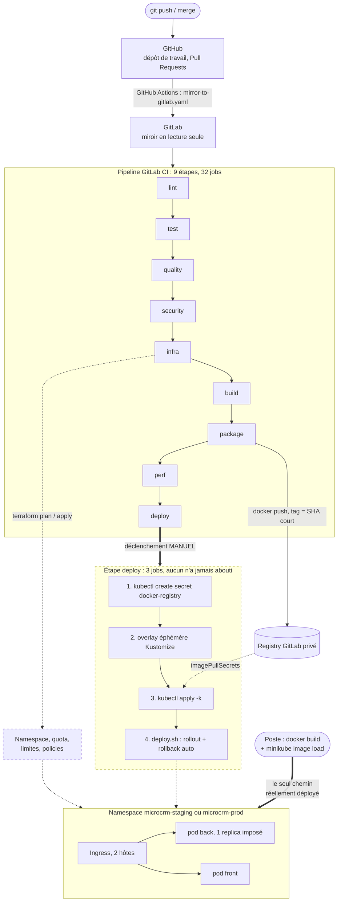
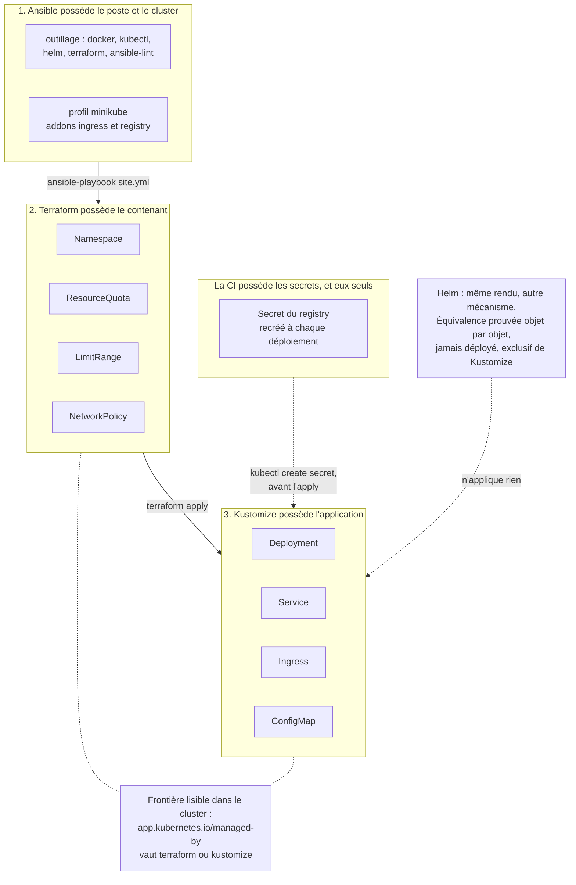

# Documentation d'infrastructure — MicroCRM

**Projet** : MicroCRM — P5, Expert DevOps, « Gérez le cycle de vie de développement logiciel »
**Date** : 18 août 2026 · **Périmètre** : architecture, conteneurisation, infrastructure as code, exploitation

Ce document décrit comment MicroCRM est construit, décrit et déployé, et par
quelles procédures on le met à jour, on revient en arrière et on le reconstruit.
Il s'adresse à quelqu'un qui reprendrait le projet sans explication orale.

Il synthétise les documents techniques du dépôt et y renvoie systématiquement :
ce qui est ici résumé y est détaillé, avec les commandes et les sorties
observées. Le document jumeau, `rapport-performance.md`, porte les mesures et
les résultats.

⚠️ **À lire avant tout le reste.** L'application a été déployée et exercée sur un
cluster Kubernetes local, à la main, depuis un poste. **Elle n'a jamais été
déployée depuis la CI** : sept déploiements déclenchés, sept échecs, aucun
`deploy-production` lancé, et un quota de minutes GitLab épuisé. Tout ce qui
suit décrit donc un dispositif dont le mécanisme est éprouvé et dont le chemin
automatisé ne l'est pas. Le détail est dans `rapport-performance.md` §2.3.

## 1. L'application et ses composants

MicroCRM est une implémentation simplifiée d'un CRM : création, édition et
consultation d'individus rattachés à des organisations. Le dépôt est un
**monorepo** contenant deux applications au cycle de vie distinct.

| Brique | Technologie                               | Port   | Rôle                                 |
| ------ | ----------------------------------------- | ------ | ------------------------------------ |
| Front  | Angular 20 (statique) servi par **Caddy** | `80`   | Sert l'interface au navigateur       |
| Back   | **Spring Boot 3** (Tomcat intégré)        | `8080` | Expose l'API REST (Spring Data REST) |
| Base   | **HSQLDB en mémoire**                     | —      | Stockage, recréé à chaque démarrage  |

Le modèle de données tient en deux entités liées en many-to-many, `Person` et
`Organization`, dont le schéma est généré par Hibernate au démarrage à partir
des classes annotées. Il n'y a aucun DDL SQL dans le dépôt et aucun outil de
migration : c'est tenable tant que la base est jetable, et cela cesse de l'être
le jour où elle persiste (§8.2).

⚠️ **Le navigateur parle directement au back.** Caddy ne fait _pas_ de
reverse-proxy vers l'API : le front et l'API sont exposés sur **deux hôtes
distincts** par le même Ingress. Deux conséquences structurantes :

- le **CORS n'est pas décoratif** — `MICROCRM_CORS_ALLOWED_ORIGINS` doit
  contenir l'hôte du front de chaque environnement, sinon le navigateur bloque
  les requêtes. Vérifié sur cluster : l'origine déclarée passe, une origine
  inconnue reçoit `403` ;
- il n'existe **aucun flux réseau pod front → pod back**, ce qui explique
  l'absence d'une règle de `NetworkPolicy` que l'on s'attendrait à trouver
  (§6.3).

**Ce que la base en mémoire impose au reste de l'infrastructure.** Les données
disparaissent à chaque redémarrage de pod, recréées par `InitialDataFixture`.
Surtout, **le back ne peut pas dépasser un seul replica** : à deux pods, chacun
aurait sa base, une écriture sur l'un serait invisible depuis l'autre, et aucune
erreur ne serait levée. Ce plafond est écrit en dur dans le template Helm et
commenté dans les manifestes, à l'endroit exact où quelqu'un serait tenté de
changer le chiffre. Il explique aussi pourquoi il n'existe aucun
`PersistentVolumeClaim` applicatif : un volume ne servirait à rien tant que la
base vit dans le tas de la JVM.

## 2. L'architecture de la plateforme de déploiement

<!-- schema: plateforme-deploiement -->



_Source versionnée : `docs/schemas/plateforme-deploiement.mmd`, reprise dans
`ARCHITECTURE.md` §8.1._

**Les cadres en tirets ne sont pas une coquetterie graphique** : ils marquent ce
qui est écrit, testé, et jamais mené à son terme. Le trait épais du bas est le
seul chemin qui a réellement produit des pods en marche.

### 2.1 Du dépôt au pipeline

Le dépôt de travail est **GitHub** — c'est là que vivent les branches et les
Pull Requests — mais le pipeline tourne sur **GitLab CI**. Un workflow GitHub
Actions recopie toutes les références à chaque push.

⚠️ **GitLab est un miroir en lecture seule.** Le push utilise `--prune` : toute
branche absente de GitHub y est supprimée. Committer directement sur GitLab
revient à perdre le travail au push suivant.

### 2.2 Les neuf étapes

| Étape      | Jobs                                                                               | Rôle                                                |
| ---------- | ---------------------------------------------------------------------------------- | --------------------------------------------------- |
| `lint`     | `lint-front`, `lint-back`, `shellcheck`, `lint-k8s`, `lint-helm`                   | Forme du code, des scripts, des manifestes          |
| `test`     | `test-scripts`, `test-front`, `test-back`                                          | Scripts d'automatisation, Karma, JUnit              |
| `quality`  | `sonar-back`, `sonar-front`, `spotbugs-back`, `coverage-gate`, `quality-gate`      | Analyse statique, bugs, seuil de couverture         |
| `security` | `dependency-check-back`, `trivy-fs`                                                | CVE des dépendances, secrets, misconfigurations     |
| `infra`    | `terraform-validate`, `ansible-lint`, `terraform-plan`, 3× `terraform-apply-<env>` | L'infrastructure se valide **avant** la compilation |
| `build`    | `build-front`, `build-back`                                                        | Compilation des artefacts                           |
| `package`  | `package-back`, `package-front`                                                    | Images Docker taguées par SHA + scan Trivy          |
| `perf`     | `k6-smoke`, `k6-load`, `k6-stress`                                                 | Tests de performance sur l'image construite         |
| `deploy`   | `deploy-staging`, `deploy-production`, `rollback-production`                       | Déploiement Kubernetes et retour arrière            |

L'ordre n'est pas cosmétique. `infra` passe **avant** `build` parce qu'un chart,
un manifeste ou un plan Terraform cassé n'a pas besoin d'attendre une
compilation Gradle pour être signalé — mais après `security`, pour que les scans
tournent sur du code encore chaud dans le cache. Et `perf` passe **après**
`package` : GitLab démarre l'image qui vient d'être construite comme un service
et k6 l'interroge, de sorte qu'on mesure l'artefact qui partirait réellement en
production.

**Toutes les images d'outillage sont figées**, jamais en `latest` : un tag
flottant fait casser une construction sans qu'aucun commit ne l'explique, et
rend deux analyses incomparables.

### 2.3 Environnements et branches

| Environnement  | Namespace            | Déclencheur           | Déploiement            |
| -------------- | -------------------- | --------------------- | ---------------------- |
| **staging**    | `$STAGING_NAMESPACE` | branche `develop`     | **manuel**             |
| **production** | `$PROD_NAMESPACE`    | branche `main` ou tag | **manuel** (garde-fou) |

Les deux déploiements sont en `when: manual` : ils ne partent pas tout seuls.
Passer staging en automatique ne demande que de remplacer `when: manual` par
`when: on_success`.

Le projet suit **GitFlow**, et le nommage des branches n'est pas cosmétique :
`.gitlab-ci.yml` filtre les jobs sur le préfixe, donc **une branche mal nommée
ne déclenche aucun pipeline**. Le séparateur est un slash — `feature/ma-fonction`
part, `feature_ma-fonction` ne correspond à aucune règle.

| Branche                 | Jobs déclenchés                          |
| ----------------------- | ---------------------------------------- |
| `main`                  | tous, jusqu'au déploiement en production |
| `develop`               | tous, jusqu'au staging                   |
| `feature/…`             | lint, test, quality, security            |
| `release/…`, `hotfix/…` | tous                                     |
| Tag `vX.Y.Z`            | tous, déploiement production             |

## 3. La conteneurisation

### 3.1 Une image par application, pas une image commune

Le front et le back n'ont ni le même cycle de vie, ni les mêmes dépendances, ni
la même charge. Les fusionner obligerait à redéployer l'un pour corriger
l'autre, et imposerait un superviseur de processus dans le conteneur — donc un
conteneur qui ne meurt plus quand son application meurt, ce qui **prive
Kubernetes de son principal signal de panne**. Il n'y a donc pas de Dockerfile à
la racine du dépôt : chaque application a le sien, dans son dossier.

### 3.2 Construction en deux étapes

Chaque Dockerfile compile dans une image outillée (Gradle, Node) puis ne copie
que l'artefact dans une image d'exécution minimale. Ni le JDK, ni npm, ni les
sources ne se retrouvent dans l'image livrée.

| Image   | Taille livrée | Base                     | Dont l'application |
| ------- | ------------- | ------------------------ | ------------------ |
| `back`  | **377 Mo**    | `alpine:3.19` (11,9 Mo)  | ~365 Mo (le JRE)   |
| `front` | **85 Mo**     | `caddy:2-alpine` (85 Mo) | ~0,2 Mo            |

Le front est à quelques centaines de kilo-octets près sa propre image de base :
un bundle Angular optimisé pèse peu, et Caddy est un binaire unique. Le back est
dominé par `openjdk21-jre-headless` — c'est le prix d'un JRE complet. Un runtime
taillé avec `jlink` ramènerait l'image autour de 150 Mo ; la complexité ajoutée
ne se justifie pas encore, mais c'est la première optimisation à envisager si la
taille devient un sujet.

### 3.3 Le contexte de build, et pourquoi il y a deux `.dockerignore`

Les jobs `package-*` construisent avec `--context ./back` et `--context ./front`,
or **Docker ne lit que le `.dockerignore` situé à la racine du contexte** :
celui du dépôt ne s'applique jamais à ces builds. L'effet est loin d'être
cosmétique.

| Contexte | Avant    | Après      |
| -------- | -------- | ---------- |
| `front`  | 1 195 Mo | **0,6 Mo** |
| `back`   | 51 Mo    | **0,1 Mo** |

Côté front, l'essentiel venait du cache de compilation Angular (920 Mo) et de
`node_modules` (329 Mo) — deux répertoires que l'image régénère de toute façon.

### 3.4 Des versions figées, jamais `latest`

Les images de base sont épinglées (`gradle:8.14.5-jdk21`, `node:22-alpine`,
`caddy:2-alpine`, `alpine:3.19`) et **alignées sur les variables du
`.gitlab-ci.yml`** : le code est compilé avec la version exacte qui a servi à le
tester. Elles restent surchargeables au build par `--build-arg`. Cette exigence
d'alignement a corrigé un défaut réel : le back se construisait en `jdk17`,
s'exécutait sur un JRE 21 et était testé en CI sur `jdk21` — l'image livrée
n'était pas produite par la chaîne qui la valide.

### 3.5 Un utilisateur non privilégié dans les deux images

Les deux conteneurs tournent en **UID 1000**, le même que celui déclaré dans les
manifestes Kubernetes, pour que le comportement soit identique sous Docker et
sous Kubernetes. Deux points ont demandé une vérification plutôt qu'une
supposition :

- **le back** crée son utilisateur avec `adduser -D -H app`, sans UID explicite.
  La commande a été exécutée dans `alpine:3.19` pour lever le doute : `adduser`
  attribue le premier UID libre à partir de 1000. C'est cette valeur qui est
  figée dans le manifeste ;
- **Caddy** ne démarre pas du tout en non-root avec toutes les capabilities
  retirées : `exec /usr/bin/caddy: operation not permitted`. La cause n'est pas
  le port 80 mais le binaire, qui porte la capability de fichier
  `cap_net_bind_service=ep` ; quand elle ne figure pas dans l'ensemble limitant
  du conteneur, le noyau refuse l'`exec` lui-même. **Passer le Caddyfile en
  `:8080` ne résoudrait rien** — vérifié en root comme en non-root, sur port
  haut comme sur port 80. La seule solution à image inchangée est de rendre
  `NET_BIND_SERVICE`.

### 3.6 La configuration entre au démarrage, pas à la construction

C'est le choix de conteneurisation le plus structurant du projet. L'URL de l'API
n'est **pas** compilée dans le bundle : Caddy la sert dans un `/config.json` que
l'application Angular lit avant de démarrer.

```caddyfile
handle /config.json {
	header Content-Type application/json
	respond `{"apiBaseUrl":"{$FRONT_API_BASE_URL:http://localhost:8080}"}`
}
```

Une seule image est donc construite, testée, scannée, puis déployée telle quelle
en staging comme en production — seule la variable d'environnement change.
Reconstruire une image pour changer d'environnement reviendrait à déployer autre
chose que ce qui a été testé. Aucun script d'entrée n'a été nécessaire : le
serveur qui sert déjà le front s'en charge.

La chaîne complète a été vérifiée sur cluster, maillon par maillon : ConfigMap →
variable d'environnement du conteneur → substitution Caddy → fichier servi en
`application/json` à travers l'Ingress.

Le prix, mineur et assumé : l'application émet une requête `GET /config.json`
avant de démarrer, et **elle ne démarre pas** si la configuration est illisible.
C'est délibéré — un repli silencieux sur `localhost:8080` reproduirait
exactement la panne que ce mécanisme supprime, en la rendant invisible.

### 3.7 Stack locale

`docker compose up --build` démarre les deux services sans aucune configuration
préalable : le front sur `4200`, l'API sur `8080`. Ports, noms d'images et
origines CORS se règlent par un fichier `.env` documenté par `.env.example`,
chaque valeur ayant un défaut inline.

## 4. L'infrastructure as code

<!-- schema: iac-frontiere -->



_Source versionnée : `docs/schemas/iac-frontiere.mmd`, reprise dans
`ARCHITECTURE.md` §8.2._

### 4.1 La règle centrale : un objet, un propriétaire

C'est la décision qui gouverne tout le reste. **Deux outils qui écrivent la même
ressource produisent un `terraform plan` qui propose sans fin de défaire ce que
le dernier `kubectl apply` a posé.**

| Objet                                                       | Propriétaire  | Pourquoi                                                 |
| ----------------------------------------------------------- | ------------- | -------------------------------------------------------- |
| Outillage du poste, profil minikube                         | **Ansible**   | tout ce qui existe avant qu'il y ait un cluster          |
| `Namespace`, `ResourceQuota`, `LimitRange`, `NetworkPolicy` | **Terraform** | contenants et garde-fous, cycle de vie lent              |
| `Deployment`, `Service`, `Ingress`, `ConfigMap`             | **Kustomize** | change à chaque commit, appliqué par la CI               |
| `Secret` du registry                                        | **la CI**     | un mot de passe n'entre ni dans le dépôt ni dans un état |

Les numéros du schéma sont un ordre d'exécution autant qu'une hiérarchie.
**Ansible sait parfaitement appliquer un manifeste Kubernetes, et c'est
précisément pour cela qu'il est écrit qu'il ne le fera pas.**

La frontière est **interrogeable, pas seulement documentée** : les ressources
Terraform portent `app.kubernetes.io/managed-by: terraform`, celles de Kustomize
`managed-by: kustomize`. La question « qu'est-ce que je casse en faisant un
`destroy` ? » se répond sans ouvrir l'état.

⚠️ **La couture que rien ne vérifie.** Le nom du namespace est écrit à deux
endroits — le `terraform.tfvars` de l'environnement et la variable GitLab
`$STAGING_NAMESPACE` / `$PROD_NAMESPACE` — et **rien ne compare les deux**. En
cas de divergence, le job de déploiement échoue sur un namespace inexistant, ou
pire en crée un second, sans quota ni policy. La refermer consisterait à faire
lire à la CI `terraform output -raw namespace`.

### 4.2 Ansible — le poste et le cluster

Deux rôles, qui transforment en code exécutable les prérequis que deux documents
énonçaient en prose.

- **`outillage`** installe les formules Homebrew déclarées et vérifie que les
  versions obtenues atteignent le minimum attendu (kubectl 1.36.2 pour un
  plancher à 1.30, helm 4.2.2 pour 3.14, terraform 1.15.7 pour 1.5, minikube
  1.38.1 pour 1.30). Des versions **minimales et non exactes** : Homebrew
  installe toujours la dernière version d'une formule et ne sait pas revenir en
  arrière proprement ; exiger l'exactitude donnerait un rôle qui échoue le
  lendemain de la première mise à jour du miroir. Les versions exactes sont
  figées là où elles comptent — les images d'outillage de la CI.
- **`cluster`** garantit que le profil minikube tourne avec ses addons `ingress`
  et `registry`, et affiche le **contexte kubectl** au récapitulatif : c'est lui
  qui décide de la cible réelle d'un `terraform apply` comme d'un
  `kubectl apply -k`, et aucune de ces deux commandes ne le rappelle.

**Résultat vérifié : `ok=23 changed=0` sur deux exécutions consécutives**, et
`ansible-lint` en `0 failure(s), 0 warning(s)` au profil `production`.

⚠️ **Le rôle `cluster` ne détruit jamais rien.** minikube ne sait pas
redimensionner un profil existant : converger vers une cible de CPU ou de
mémoire supposerait un `minikube delete`, donc la perte du namespace et de
l'application. Un tel rôle serait destructeur avec cette particularité perverse
qu'**il ne détruirait que sur les postes déjà en service**. Le rôle signale
l'écart et continue ; ni `minikube delete` ni `minikube start` sur un profil
déjà démarré n'apparaissent nulle part.

Deux choses qu'Ansible n'installe pas, et c'est délibéré : **Docker Desktop**
(application graphique souvent installée par un canal d'entreprise — le rôle
vérifie sa présence et échoue en affichant la raison, plutôt que d'agir à la
place de quelqu'un) et **Ansible lui-même**.

### 4.3 Terraform — les environnements

Terraform possède le _contenant_. Avant lui, créer un environnement voulait dire
`kubectl create namespace` tapé par quelqu'un : le namespace n'était décrit
nulle part, il n'avait aucun garde-fou de consommation, et le recréer n'était
pas reproductible.

L'arborescence sépare des **modules** (`namespace`, `network-policy`) et des
**environnements** qui ne déclarent aucune ressource : ils composent les modules.
C'est ce qui garantit que staging et production ne peuvent pas diverger
autrement que par leurs valeurs — sans quoi le premier cesserait de valider quoi
que ce soit du second. Trois environnements existent : `staging`, `production`
et `logging` (la stack ELK).

|                            | staging            | production            |
| -------------------------- | ------------------ | --------------------- |
| Namespace                  | `microcrm-staging` | `microcrm-production` |
| `pods`                     | 10                 | 20                    |
| `requests.cpu` / `.memory` | 1 / 1536Mi         | 2 / 2Gi               |
| `limits.cpu` / `.memory`   | 3 / 2Gi            | 6 / 3Gi               |
| `LimitRange`               | identique          | identique             |

Le `LimitRange` est volontairement identique : si la production tolérait des
conteneurs que staging refuse, staging cesserait de valider quoi que ce soit.

**Le quota est dimensionné sur le pic d'un déploiement, pas sur l'état stable**,
et c'est le piège silencieux de cette ressource. Les Deployments sont en
`maxSurge: 1, maxUnavailable: 0` : le nouveau pod doit être prêt avant que
l'ancien ne parte, il existe donc un instant où les deux coexistent. Un quota
calé sur le régime permanent laisse l'application tourner parfaitement, puis
bloque le déploiement suivant sur un `exceeded quota` qui ne dit pas qu'il
s'agit d'un problème de dimensionnement. Le calcul ligne à ligne est en
commentaire dans chaque `terraform.tfvars`, et il a été **confronté à une charge
réelle sur le namespace `logging`** : les valeurs observées pendant un rollout
correspondaient au mégaoctet près à celles calculées.

**L'état vit dans l'état managé GitLab (backend `http`), un état par
environnement, verrouillé.** Il a commencé en backend `local`, ce que l'option
locale rendait naturel — aucun bucket, aucune base, aucun compte cloud pour
l'héberger. Deux défauts ont imposé la bascule dès l'ouverture du dépôt à
plusieurs personnes : **aucun verrou**, donc deux `apply` simultanés qui
corrompent l'état, et surtout un plan de CI **muet sur la dérive** — l'état
n'étant jamais commité, la CI repartait d'un état vide et annonçait « tout à
créer » quel que soit le contenu du cluster. GitLab héberge ces états
gratuitement, sur le même service que le dépôt, et la bascule n'a touché qu'un
bloc `backend` suivi d'un `terraform init -migrate-state`.

Les états restent **séparés par environnement**, ce qui empêche une erreur de
répertoire d'emporter la production : l'adresse est composée à partir du nom de
l'environnement, jamais écrite en dur. Ce que cela coûte : l'état dépend
maintenant du projet GitLab, et aucune sauvegarde n'est organisée hors de lui.

L'accès au cluster depuis la CI ne passe pas par un kubeconfig stocké en
variable — il n'aurait servi à rien, le cluster n'ayant aucune adresse joignable
depuis Internet — mais par l'**agent GitLab pour Kubernetes**, qui ouvre une
connexion sortante depuis le cluster. Son ServiceAccount est lié à un
`ClusterRole` restreint aux quatre types d'objets que Terraform manipule, et non
au `cluster-admin` que propose le chart Helm par défaut. Voir `TERRAFORM.md`
§4.1.

Enfin, ce qui est appliqué est le plan **relu** : `terraform-plan` publie son
plan binaire en artefact, et les jobs d'apply appliquent ce fichier au lieu d'en
recalculer un au moment du clic — Terraform refusant de lui-même un plan devenu
obsolète. Le résumé du même plan alimente le widget des merge requests, ce qui
rend l'écart lisible sans ouvrir les journaux du job (`TERRAFORM.md` §4.2).

**Ce qui a été vérifié** : `validate` et `plan` sortent en `0` sur les
environnements, contre le vrai cluster (6 ressources à créer par environnement
vierge). L'`apply` a été joué sur `logging`.

⚠️ **Deux mises en garde à l'exécution.**

- Sur un namespace qui existe déjà — c'est le cas de `microcrm-staging`, créé à
  la main pendant la campagne de déploiement — `terraform apply` échoue sur
  `already exists`. L'adoption se fait **une fois**, par
  `terraform import 'module.namespace.kubernetes_namespace_v1.this' <ns>` ; le
  plan montre alors `1 to change` (Terraform pose ses labels) et `5 to add`. Un
  bloc `import` dans le code aurait été le mauvais outil : permanent et
  inconditionnel, il ferait échouer le `plan` sur un cluster vierge.
- `terraform destroy` **détruit le namespace, donc tout ce qu'il contient**, y
  compris ce que Terraform n'a jamais créé. C'est la conséquence directe du
  partage des responsabilités : détruire un contenant emporte son contenu.

**Et pourquoi pas le provider `docker`.** Le brief parle de « gestion de
ressources conteneurisées à l'aide de Terraform ». La construction des images
appartient à la CI et, en local, à `docker compose`. Faire de Terraform un
troisième chemin de build créerait un état qui suit des identifiants d'image
qu'il ne sait pas reconstruire de façon reproductible, et deux façons
concurrentes de produire la même chose. Les ressources conteneurisées que gère
Terraform ici sont **les objets Kubernetes qui les hébergent**, pas les images.

### 4.4 Kustomize et Helm — l'application

**Kustomize fait foi.** Le choix se joue sur deux points : il est **déjà là** —
l'image `alpine/kubectl` figée dans le pipeline sait faire `kubectl apply -k`
sans rien installer — et **Helm résout un problème que ce projet n'a pas**. La
force de Helm est de _distribuer_ un composant paramétrable à des gens qui ne le
connaissent pas ; ici les manifestes ne sortent pas du dépôt et ne servent qu'à
une application. Le prix des templates — du YAML qu'on ne peut plus relire
directement ni valider sans le rendre — n'achèterait rien. Un troisième argument
compte en revue : avec Kustomize, une différence entre staging et production se
lit comme du Kubernetes, pas comme une expression de template.

**Le chart Helm existe malgré tout**, parce que le brief nomme Helm et le liste
dans les outils attendus. Il produit exactement les mêmes six objets, à un seul
label près. Ce doublon a un coût qu'il faut nommer : **deux descriptions de la
même application, c'est deux occasions de diverger.** D'où l'assertion
d'équivalence qui compare les deux rendus objet par objet à chaque commit, et
qui échoue à la moindre différence autre que `managed-by`.

⚠️ **Les deux mécanismes ne peuvent pas cohabiter sur un même namespace**, et ce
n'est pas une précaution théorique : Helm refuse explicitement d'adopter des
objets qu'il n'a pas créés (`invalid ownership metadata`). Le choix se fait
**avant** le premier déploiement, pas après. Le chart n'a jamais rien déployé.

Trois réflexes Helm sont délibérément refusés, et un relecteur habitué les
signalera à tort comme des erreurs : **aucun préfixe de nom de release** (les
objets s'appellent littéralement `back` et `front`, parce que `deploy.sh`
exécute `kubectl set image deployment/back back=…`), **aucun `instance` dans
`matchLabels`** (le sélecteur d'un Deployment est immuable après création), et
**aucun `namespace:` dans les templates**.

### 4.5 Ce qui n'est volontairement pas dans le dépôt

| Valeur absente              | D'où elle vient                               | Pourquoi                                                    |
| --------------------------- | --------------------------------------------- | ----------------------------------------------------------- |
| Le **namespace**            | `$STAGING_NAMESPACE` / `$PROD_NAMESPACE`      | coordonnée d'infrastructure ; `PROD_NAMESPACE` est protégée |
| Le **chemin du registry**   | `$CI_REGISTRY_IMAGE` + `$CI_COMMIT_SHORT_SHA` | dépend du projet GitLab, et le tag dépend du commit         |
| Le **`Secret` du registry** | la CI, à chaque déploiement                   | un `Secret` n'est que du base64, pas un chiffrement         |
| L'**état Terraform**        | le poste                                      | contient en clair tout ce que les providers ont lu          |

La règle est donc : **Kustomize décrit la forme, la CI fournit les coordonnées.**
Ce n'est pas un détail d'hygiène — c'est ce qui rend les manifestes portables
d'un cluster à l'autre sans les modifier (§9).

## 5. Le déploiement Kubernetes

### 5.1 La séquence, dans cet ordre

Les jobs `deploy-staging` et `deploy-production` enchaînent quatre étapes :

1. **le `Secret` du registry** est recréé, par la forme idempotente
   `kubectl create secret … --dry-run=client -o yaml | kubectl apply -f -` — un
   simple `create` échouerait sur `already exists` au deuxième déploiement ;
2. **un overlay Kustomize éphémère** est composé, qui pose l'image réelle
   (`newName` + `newTag`) par-dessus l'overlay d'environnement ;
3. `kubectl apply -k` applique cet overlay dans le namespace ;
4. `deploy.sh` attend la fin du rollout et **revient tout seul à la version
   précédente** si le déploiement échoue ou traîne.

**L'étape 2 est un correctif, pas un raffinement.** Avant elle, `apply -k`
posait l'image _placeholder_ à chaque application, puis `deploy.sh` posait la
vraie : chaque déploiement insérait **deux** révisions, si bien que la
« révision précédente » d'un déploiement sain était toujours un placeholder
inexistant. Le job `rollback-production`, qui n'a aucun moyen de viser une
révision explicite, ne pouvait donc **jamais** fonctionner — et l'état cassé ne
se voyait pas : `kubectl get deploy` affichait `READY 1/1 AVAILABLE 1` parce que
l'ancien pod sain était compté. Vérifié après correction : deux déploiements,
deux révisions, zéro placeholder, rollback sans argument en `0`.

### 5.2 Sondes de santé

Kubernetes a besoin de savoir deux choses qui ne sont pas la même : le processus
est-il vivant (_liveness_), et peut-on lui envoyer du trafic (_readiness_).
Interroger `/` ne répond ni à l'une ni à l'autre — une JVM accepte une connexion
TCP bien avant que le contexte Spring soit chargé. Actuator fournit la vraie
réponse, avec une exposition réduite au strict nécessaire
(`management.endpoints.web.exposure.include=health`, `show-details=never`) :
vérifié, `/actuator/env`, `/actuator/beans` et `/actuator/configprops` renvoient
`404`.

| Sonde       | Chemin                       | Cadence | Seuil | Budget    |
| ----------- | ---------------------------- | ------- | ----- | --------- |
| `startup`   | `/actuator/health/liveness`  | 5 s     | 30    | **150 s** |
| `liveness`  | `/actuator/health/liveness`  | 10 s    | 3     | 30 s      |
| `readiness` | `/actuator/health/readiness` | 5 s     | 3     | 15 s      |

**Un `startupProbe` plutôt qu'un `initialDelaySeconds` long.** Un délai initial
s'applique une seule fois, alors que la tolérance qu'il achète n'est utile
qu'au démarrage ; pour couvrir le pire cas il faut le surdimensionner, et l'on
choisit alors de détecter les blocages plus tard qu'on ne le pourrait pendant
toute la vie du pod. Le `startupProbe` sépare les deux régimes : tant qu'il n'a
pas réussi une fois, liveness et readiness sont suspendues ; dès qu'il réussit,
il ne s'exécute plus jamais. Observé sous kubelet : une tentative a réellement
échoué en attendant que la JVM ouvre son port, et le pod n'est devenu `Ready`
qu'après le succès du `startupProbe`.

### 5.3 Socle de sécurité des conteneurs

Les deux Deployments appliquent le même socle : `runAsNonRoot`,
`allowPrivilegeEscalation: false`, `capabilities: drop: [ALL]`,
`readOnlyRootFilesystem: true`, `seccompProfile: RuntimeDefault`, et
`automountServiceAccountToken: false` — rien dans l'application n'appelle l'API
Kubernetes, un jeton monté ne serait qu'une surface d'attaque.

Deux exceptions, chacune motivée par une contrainte technique vérifiée : le
front conserve `NET_BIND_SERVICE` (§3.5), et un `emptyDir` est monté sur le
`/tmp` du back — `readOnlyRootFilesystem` empêche sinon le Tomcat embarqué de
créer son répertoire de travail, et l'application ne démarre pas.

Chaque point de ce socle est vérifié **au niveau conteneur** par
`validate_k8s.sh`, parce qu'une valeur posée là écrase celle du pod.

### 5.4 Ce que le déploiement local n'a pas pu vérifier

- **Le registry privé et `imagePullSecrets`** : les images étant chargées par
  `minikube image load` et déjà présentes sur le nœud, le kubelet a signalé le
  Secret manquant puis a poursuivi. Ce n'est pas une preuve que le chemin
  fonctionne.
- **L'overlay `production`**, vérifié seulement par construction et assertions.
- **Le multi-nœud** : un seul nœud, donc ni éviction, ni contrainte de
  placement, ni comportement en pénurie.
- **Les valeurs de `resources`**, faute de `metrics-server`.
- **Le TLS** : l'Ingress est en clair, les URL de la ConfigMap sont en `https://`
  et servies telles quelles.

## 6. Réseau et exposition

Un seul `Ingress` porte **deux hôtes** : celui du front et celui de l'API. Ce
choix — plutôt qu'un préfixe `/api` sur un hôte unique — a été retenu parce que
le navigateur appelle directement l'API (§1).

Vérifié sur cluster à travers `kubectl port-forward` vers le contrôleur, les
hôtes étant fictifs et passés en en-tête `Host:` :

| Requête                    | Résultat                                      |
| -------------------------- | --------------------------------------------- |
| hôte du front → `/`        | `200`, `text/html`, `<title>MicroCRM</title>` |
| hôte de l'API → `/`        | `200`, `application/hal+json`                 |
| hôte de l'API → `/persons` | `200`, la fixture attendue                    |
| **hôte inconnu → `/`**     | **`404`** (default backend)                   |

La dernière ligne compte autant que les autres : elle montre que le routage se
fait bien **par hôte** et non par défaut sur le premier service venu.

Aucun `ingressClassName` n'a été nécessaire, l'addon minikube installant sa
classe par défaut. Le champ appartiendrait à l'overlay et non à la base : le
contrôleur est une propriété du cluster cible, donc de l'environnement.

**Les `NetworkPolicy`** posent un refus global du trafic entrant, puis
rouvrent les deux seuls flux dont l'architecture a besoin : ingress-nginx →
front (80) et ingress-nginx → back (8080). Il n'y a **pas** de règle « front
vers back », parce que ce flux n'existe pas ; une règle qui l'autoriserait
serait sans effet et surtout trompeuse pour qui lit ces policies pour comprendre
l'architecture. L'egress n'est pas restreint : le restreindre casserait la
résolution DNS pour un gain nul, aucune des deux applications n'émettant
d'appel sortant.

⚠️ **Ces policies sont créées mais inertes sur ce cluster.** L'application d'une
NetworkPolicy appartient au CNI, pas à la ressource : celui de minikube par
défaut ne l'implémente pas et **ignore ces objets sans rien signaler**. Un
`apply` réussi ne permet donc pas de conclure que le namespace est cloisonné. Un
point restera à vérifier le jour où un CNI les appliquera : le sort des sondes
du kubelet, qui interroge les pods depuis le nœud sans qu'aucune règle
n'autorise cette source.

## 7. Supervision

La stack ELK — Elasticsearch, Kibana et Filebeat — vit dans un namespace
`logging` **créé par Terraform**, comme tout autre contenant : la frontière du
§4.1 ne souffre pas d'exception. Filebeat est un DaemonSet qui lit les fichiers
de log du nœud, décode le JSON et ajoute les métadonnées Kubernetes.

Un point de configuration mérite d'être connu par quiconque exploite cette
plateforme : **la bascule texte → JSON du back tient à la seule clé
`SPRING_PROFILES_ACTIVE` de la ConfigMap.** Sans elle, le pod journalise en
texte sans que rien ne le signale, les documents arrivent quand même, et Kibana
n'a plus rien à filtrer.

Le flux, les résultats de collecte et ce que la supervision ne couvre pas sont
détaillés dans `rapport-performance.md` §6 et dans `MONITORING.md`.

## 8. Procédures d'exploitation

### 8.1 Mettre à jour l'application

Les principes d'abord, parce qu'ils expliquent les commandes.

- **L'image ne change plus une fois construite.** Chaque image est taguée avec
  le SHA du commit. On déploie toujours un tag précis, jamais `latest`.
- **On promeut, on ne reconstruit pas.** La même image passe de staging à
  production. Reconstruire reviendrait à déployer autre chose que ce qui a été
  testé et scanné.
- **On vérifie avant de déployer.** Une image n'arrive à l'étape de déploiement
  qu'après les tests, l'analyse statique, les scans de sécurité et le test de
  fumée k6 — le seul contrôle bloquant.

Mise en production, pas à pas :

1. Merger sur `main` via une MR au pipeline vert.
2. Créer un tag de version : `git tag vX.Y.Z && git push origin vX.Y.Z`.
3. Le pipeline construit l'image et la pousse sur le registry.
4. Lancer **à la main** le job `deploy-production`.
5. Vérifier que l'application répond.
6. En cas de problème : `rollback-production`.

Une modification de la ConfigMap ne redémarre **pas** les pods : `configmap.yaml`
est une ressource ordinaire et non un `configMapGenerator`, choix fait pour la
lisibilité en revue. Après avoir changé une origine CORS, il faut donc
`kubectl -n "$NAMESPACE" rollout restart deployment/back`.

### 8.2 Revenir en arrière

Deux niveaux, et ils ne répondent pas au même problème.

| Niveau          | Déclenchement                            | Quand                                             |
| --------------- | ---------------------------------------- | ------------------------------------------------- |
| **Automatique** | `deploy.sh`, sans intervention           | le déploiement échoue ou dépasse son délai        |
| **Manuel**      | `rollback.sh`, job `rollback-production` | un bug est repéré **après** un déploiement réussi |

Comme chaque révision correspond à une image fixe taguée par SHA, on sait
toujours exactement vers quoi l'on revient. Les deux mécanismes sont **testés à
chaque commit** avec un faux `kubectl` qui simule un déploiement raté : on
vérifie que le `rollout undo` est déclenché, qu'il ne l'est **pas** quand tout va
bien, et qu'on est prévenu si le rollback lui-même échoue.

⚠️ **Un réflexe à retenir, issu d'une observation sur cluster.** Le rollback
automatique ne supprime pas la révision fautive : il en crée une nouvelle
portant l'image saine. La « révision précédente » devient donc l'image cassée.
**Enchaîner `rollback.sh` sans argument juste après un échec redéploie l'image
défaillante.** Après un échec de `deploy.sh`, il faut lire
`kubectl rollout history` et viser explicitement une révision saine avec `-r`.
Le service reste protégé pendant ce temps — `maxUnavailable: 0` fait que le pod
en place n'est jamais touché — mais la procédure de secours mène sinon à une
impasse.

### 8.3 Sauvegarder — et pourquoi il n'y a rien à sauvegarder

**La base de MicroCRM vit dans la mémoire du processus.** HSQLDB démarre en mode
`mem:` et est alimentée à chaque démarrage par `InitialDataFixture`. Il n'existe
ni fichier, ni volume, ni instantané.

Autrement dit, **une procédure de sauvegarde n'aurait rien à copier**. Écrire un
`CronJob` de `pg_dump` sur cette application ne serait pas une sécurité, ce
serait un décor. C'est un fait structurel, pas un oubli de procédure — et c'est
le même fait qui impose le plafond à un replica.

**Ce qu'il faudrait pour qu'il y ait quelque chose à sauvegarder** — chantier
délimité, chiffré plutôt que laissé en intention vague :

| Étape                            | Effort | Ce qui change                                                                                     |
| -------------------------------- | ------ | ------------------------------------------------------------------------------------------------- |
| Remplacer HSQLDB par PostgreSQL  | S      | une dépendance, une URL JDBC, un dialecte                                                         |
| Déployer la base                 | M      | `StatefulSet` + `PersistentVolumeClaim` + `Service`, ou base managée                              |
| Sortir les identifiants du dépôt | S      | un `Secret`, comme celui du registry                                                              |
| **Gérer le schéma**              | **M**  | Hibernate génère aujourd'hui les tables au démarrage ; en persistant, il faut Flyway ou Liquibase |
| Lever le plafond de replicas     | S      | le back peut enfin monter en charge                                                               |
| Recalculer les quotas            | S      | un pod de plus à financer dans les `terraform.tfvars`                                             |

**Le point le moins évident est le quatrième.** Tant que la base est jetable,
`hibernate.ddl-auto` peut la recréer à chaque démarrage. Dès qu'elle persiste,
cette commodité devient un danger : c'est le moment où un outil de migration
cesse d'être un luxe.

La procédure qui s'appliquerait alors n'est pas mise en œuvre, mais elle est
écrite — sans quoi la bascule s'accompagnerait d'improvisation :

```shell
# Sauvegarde : un CronJob quotidien dans le namespace de l'application
kubectl -n "$NAMESPACE" exec deploy/postgres -- \
  pg_dump -U microcrm -Fc microcrm > microcrm-$(date +%F).dump

# Restauration
kubectl -n "$NAMESPACE" exec -i deploy/postgres -- \
  pg_restore -U microcrm -d microcrm --clean < microcrm-2026-08-18.dump
```

Trois règles vaudraient dès le premier jour : la sauvegarde part **hors du
cluster** — un instantané qui vit sur le volume qu'il sauvegarde ne sauvegarde
rien —, elle est **chiffrée** puisqu'elle contient des données personnelles, et
**elle est restaurée périodiquement**. Une sauvegarde jamais restaurée n'est pas
une sauvegarde, c'est une croyance.

### 8.4 Reconstruire l'environnement depuis le dépôt

C'est ici que se joue l'intérêt de tout le travail d'infrastructure. Les données
sont jetables, mais **l'environnement se reconstruit intégralement à partir du
seul dépôt**, dans l'ordre imposé par la frontière des responsabilités :

```shell
# 0. Détruire l'environnement — c'est le point de départ de l'exercice
kubectl delete namespace "$NAMESPACE"

# 1. Le poste et le cluster (Ansible)
cd ansible && ansible-playbook site.yml

# 2. Le namespace, son quota, ses limites, ses policies (Terraform)
cd terraform/environments/staging && terraform apply

# 3. L'application (Kustomize)
kubectl apply -k k8s/overlays/staging -n "$NAMESPACE"
kubectl -n "$NAMESPACE" rollout status deployment/back  --timeout=300s
kubectl -n "$NAMESPACE" rollout status deployment/front --timeout=300s

# 4. Vérifier que l'API répond et que les données de démonstration sont là
kubectl -n "$NAMESPACE" port-forward svc/back 18081:8080 &
curl -s http://127.0.0.1:18081/persons | head -c 200
```

⚠️ **Cette procédure n'a PAS été exécutée de bout en bout.** Chacune de ses
étapes l'a été séparément — playbook Ansible idempotent et rejoué, application
déployée et rollback observé, Terraform ayant créé et peuplé le namespace
`logging` — mais l'enchaînement complet, à partir d'une destruction réelle,
reste à jouer. **Tant qu'il ne l'a pas été, la reconstruction est une conviction
raisonnable, pas une preuve.**

Deux points de vigilance connus pour le jour où elle sera jouée : le namespace
doit être **absent**, sinon `terraform apply` s'arrête sur `already exists` et
demande l'import du §4.3 ; et **les images doivent être disponibles pour le
cluster** — en local par `minikube image load`, depuis la CI par le registry
dont le `Secret` est recréé par le job.

### 8.5 Variables à créer dans GitLab

Seules celles-ci restent hors du dépôt. Tout le reste vit dans le bloc
`variables:` du `.gitlab-ci.yml`, où c'est versionné et relisible en revue.

| Variable            | Type             | Protected | Rôle                      |
| ------------------- | ---------------- | --------- | ------------------------- |
| `SONAR_HOST_URL`    | Variable         | non       | URL du serveur SonarQube  |
| `SONAR_TOKEN`       | Variable, masked | non       | Token d'analyse           |
| `NVD_API_KEY`       | Variable, masked | non       | Accélère Dependency-Check |
| `KUBE_CONFIG`       | **File**         | **oui**   | Connexion au cluster      |
| `STAGING_NAMESPACE` | Variable         | non       | Namespace de staging      |
| `PROD_NAMESPACE`    | Variable         | **oui**   | Namespace de production   |
| `CI_REGISTRY*`      | automatiques     | —         | Fournies par GitLab       |

Le type **File** n'est pas un détail : GitLab écrit la valeur dans un fichier
temporaire et la variable contient _le chemin_. C'est pour cette raison que
`KUBECONFIG: '$KUBE_CONFIG'` fonctionne — `kubectl` attend un chemin, pas un
contenu YAML. Et `PROD_NAMESPACE` doit être **protégée** : sans cela, n'importe
quelle branche `feature/*` lirait les coordonnées de production.

Côté GitHub, un secret `GITLAB_TOKEN` est nécessaire au workflow de miroir.

## 9. L'option locale, et sa transposition au cloud

### 9.1 Pourquoi le local a été retenu

Le brief propose AWS ou Azure et **autorise nommément l'environnement local**, y
compris pour Terraform. Autoriser n'est pas dispenser d'argumenter.

**Aucun coût, donc aucune ressource oubliée.** Le mode de défaillance le plus
banal d'un projet d'école en cloud n'est pas technique : c'est un compte qui
continue de facturer parce qu'une ressource a survécu au projet, ou une
infrastructure supprimée trop tôt qui rend la démonstration impossible.

**Le livrable reste vérifiable par un tiers, indéfiniment.** Un cluster cloud
éteint après la démonstration ne se constate plus ; un dépôt qui se rejoue se
constate toujours. C'est pourquoi chaque document technique se termine par une
section « Rejouer », et pourquoi les tableaux de bord Kibana sont versionnés en
NDJSON plutôt que laissés dans une instance.

**Le local n'est pas une simulation.** Le provider `hashicorp/kubernetes` parle à
un vrai serveur d'API et crée de vrais objets. Il n'y a ni plan simulé ni
dry-run présenté comme une preuve : ce qui manque est le fournisseur, pas la
mécanique.

⚠️ **Une nuance, et elle s'est vérifiée : gratuit ne veut pas dire sans limite.**
Le dernier pipeline du projet s'est arrêté sur `ci_quota_exceeded`. L'option
locale supprime la facture, pas la contrainte de ressource — elle la déplace
vers le poste et vers les quotas gratuits, où elle finit par se manifester
aussi.

### 9.2 Ce qui bougerait chez un fournisseur

| Brique                                     | Aujourd'hui (local)                        | AWS                                              | Azure                              |
| ------------------------------------------ | ------------------------------------------ | ------------------------------------------------ | ---------------------------------- |
| Le cluster                                 | minikube, 1 nœud, créé par Ansible         | EKS                                              | AKS                                |
| `Namespace`, `ResourceQuota`, `LimitRange` | provider `hashicorp/kubernetes`            | **inchangés** — autre `kube_context`             | **inchangés**                      |
| `Deployment`, `Service`, `ConfigMap`       | Kustomize, overlays par environnement      | **inchangés**                                    | **inchangés**                      |
| `Ingress`                                  | ingress-nginx (addon minikube)             | ingress-nginx derrière un NLB, ou ALB Controller | ingress-nginx, ou AGIC             |
| Exposition publique, DNS, TLS              | aucune — `port-forward` et en-tête `Host:` | Route 53 + certificat ACM                        | Azure DNS + Key Vault              |
| Registry d'images                          | registry GitLab ; `minikube image load`    | ECR                                              | ACR                                |
| `Secret` du registry                       | recréé par la CI                           | **disparaît** — identité IRSA                    | **disparaît** — identité managée   |
| État Terraform                             | backend `http` GitLab, **verrouillé**      | S3 + verrouillage, ou inchangé                   | Azure Storage + lease, ou inchangé |
| Stockage persistant (PVC ELK)              | provisionneur `standard` de minikube       | EBS via CSI, snapshots                           | Azure Disk via CSI, snapshots      |
| Stack de logs                              | ELK dans le namespace `logging`            | OpenSearch, ou CloudWatch Logs                   | Log Analytics, ou Elastic Cloud    |
| Indicateurs DORA                           | `collect_dora.py` contre l'API GitLab      | **inchangé** — la source est GitLab              | **inchangé**                       |

**Ce que la table montre vraiment, c'est où passe la frontière du portable.** Les
lignes « inchangées » sont le cœur du projet, et ce n'est pas un hasard : c'est
le résultat de la règle du §4.5 — **les manifestes ne contiennent ni namespace
ni chemin de registry**. Un manifeste qui ne connaît pas son environnement ne
s'oppose pas à en changer.

Ce qui bougerait se résume à trois choses : **le cluster lui-même** (un bloc
Terraform qui n'existe pas, avec un second provider et le réseau qui va avec),
**la façon dont le trafic entre**, et **la façon dont l'identité circule**. La
dernière est la plus intéressante : en cloud, le `Secret` du registry ne se
remplace pas par un autre secret, il **disparaît**, absorbé par l'identité de la
charge de travail. C'est un cas rare où le passage au cloud retire une pièce du
dispositif au lieu d'en ajouter une.

### 9.3 Ce que le local ne démontre pas

Aucun de ces points ne se corrige par une phrase mieux tournée ; chacun se
corrigerait par un compte chez un fournisseur, c'est-à-dire par le coût que le
projet a délibérément refusé de payer.

| Ce qui n'est pas démontré        | Pourquoi, précisément                                                                                                                                                                                                      |
| -------------------------------- | -------------------------------------------------------------------------------------------------------------------------------------------------------------------------------------------------------------------------- |
| La haute disponibilité           | Un seul nœud : aucune anti-affinité à exercer, aucun `drain` à observer, aucun `PodDisruptionBudget` qui ait un sens. Et le back étant plafonné à un replica, **la limite applicative masque la limite d'infrastructure**. |
| Un LoadBalancer réel             | Aucune adresse publique, aucun certificat, aucun DNS. Tout ce qui se joue entre Internet et le cluster est hors périmètre.                                                                                                 |
| Le stockage managé et sauvegardé | Le seul PVC est celui d'Elasticsearch, servi par le disque du poste : pas de snapshot, pas de réplication, pas de restauration éprouvée.                                                                                   |
| L'IAM et les droits fins         | Un seul kubeconfig, celui de l'administrateur du poste, avec tous les droits. Le seul RBAC du projet est celui de Filebeat, écrit parce qu'`autodiscover` interroge l'API — pas parce qu'on aurait modélisé des droits.    |
| La maîtrise des coûts            | Zéro dépense, donc zéro arbitrage. Les quotas sont dimensionnés contre la capacité du nœud (7,75 Gio d'allocatable, partagés avec des projets voisins), jamais contre un budget.                                           |
| La montée en charge automatique  | Ni HPA, ni `metrics-server`, ni autoscaler de nœuds — il manque jusqu'au signal sur lequel un autoscaler déciderait.                                                                                                       |
| Le cloisonnement réseau          | Décrit, mais inerte faute d'un CNI qui l'implémente (§6).                                                                                                                                                                  |
| **Une production**               | L'environnement `production` vise le même minikube dans un autre namespace. Il démontre qu'un second environnement se décrit par les mêmes modules et d'autres valeurs — pas qu'une production existe.                     |

## 10. Reprendre le projet

### 10.1 Depuis un poste nu

```shell
# 1. L'outillage et le cluster
cd ansible && ansible-playbook site.yml

# 2. Les environnements (namespace, quota, limites, policies)
cd terraform/environments/staging && terraform init && terraform apply

# 3. L'application
kubectl apply -k k8s/overlays/staging -n microcrm-staging
```

### 10.2 Vérifier sans rien déployer

```shell
# Ce que Kustomize enverra réellement au cluster
kubectl kustomize k8s/overlays/staging

# La différence entre les deux environnements
diff <(kubectl kustomize k8s/overlays/staging) \
     <(kubectl kustomize k8s/overlays/production)

# Les assertions de la CI, manifestes et chart Helm compris
scripts/tests/validate_k8s.sh --autotest

# Les scripts d'automatisation, sans cluster ni registry
scripts/tests/run_tests.sh

# L'infrastructure, hors cluster
scripts/ci/terraform_check.sh
scripts/ci/ansible_check.sh
```

⚠️ **Ce qu'un `terraform plan` ne prouve pas.** Mesuré : avec un kubeconfig
valide pointant sur un cluster **éteint**, `terraform plan` sort en `0` et
annonce « 6 to add ». L'état étant local et jamais commité, la CI repart d'un
état vide à chaque exécution. Ce mode contrôle que la configuration se résout,
pas l'écart avec la réalité.

### 10.3 Les invariants à ne pas casser

Chacun est protégé par une assertion qui échouera si la règle est violée.

1. Les Deployments s'appellent `back` et `front` et portent un conteneur du même
   nom — `deploy.sh` exécute `kubectl set image deployment/back back=…`. Aucun
   préfixe de nom, ni `namePrefix` Kustomize, ni helper `fullname` Helm.
2. Aucune image en `latest` ni sans tag, nulle part.
3. Aucun secret dans le dépôt ; les identifiants viennent de variables
   d'environnement et ne transitent jamais par les logs d'un job.
4. Chaque conteneur porte `runAsNonRoot: true` et
   `allowPrivilegeEscalation: false`.
5. Le namespace et le chemin du registry ne sont pas dans les manifestes.
6. Toute valeur dépendant de l'environnement garde un défaut fonctionnel, pour
   que le projet démarre en local sans configuration.
7. **Le back reste à un seul replica** tant que la base vit en mémoire.

### 10.4 Où chercher le détail

| Document                 | Ce qu'il porte                                                    |
| ------------------------ | ----------------------------------------------------------------- |
| `README.md`              | Démarrer avec les sources, les images, la stack locale            |
| `ARCHITECTURE.md`        | Vue d'ensemble, les trois schémas, l'option locale et le cloud    |
| `K8S.md`                 | Les manifestes, la séquence de déploiement, les campagnes réelles |
| `TERRAFORM.md`           | Les modules, la frontière, l'état, les limites                    |
| `ANSIBLE.md`             | Les deux rôles, l'idempotence, les pièges rencontrés              |
| `HELM.md`                | Le chart, l'équivalence avec Kustomize, ce qui fait foi           |
| `MONITORING.md`          | La stack ELK, les tableaux de bord, les indicateurs DORA          |
| `QUALITY.md`             | Les six outils de qualité et de sécurité, et leurs seuils         |
| `SCRIPTS.md`             | Les scripts, leurs options, leurs codes de sortie, leurs tests    |
| `RELEASE.md`             | Les releases, le rollback, la sauvegarde et la restauration       |
| `VARIABILISATION.md`     | Ce qui a été externalisé, et ce qu'il ne faut pas externaliser    |
| `DATABASE.md`            | Le modèle de données et ses conséquences                          |
| `rapport-performance.md` | Le document jumeau : mesures, résultats, gains et pistes          |
