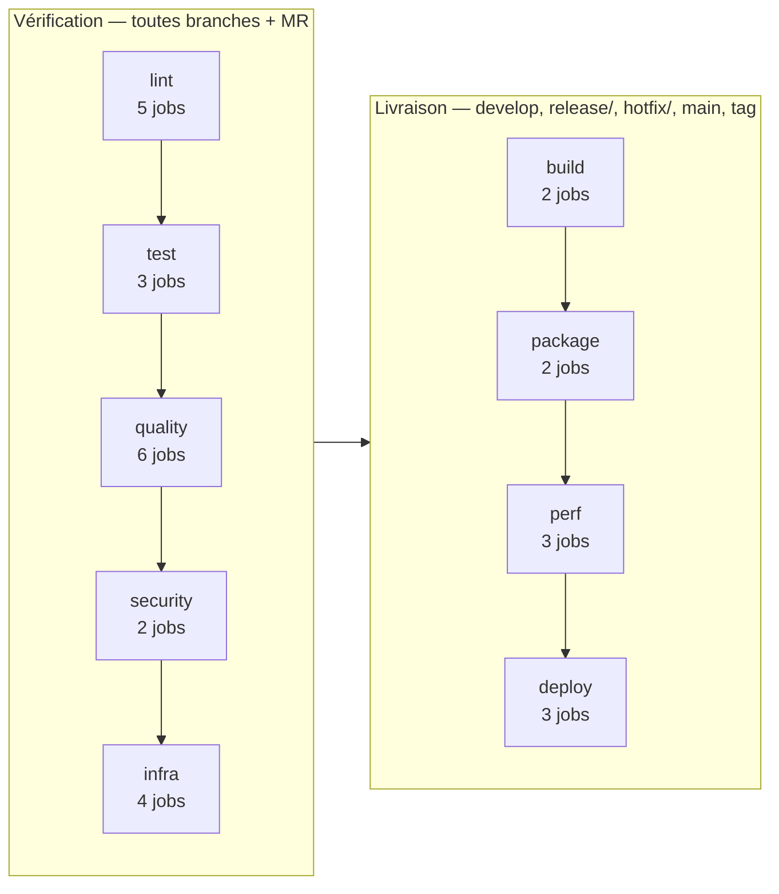
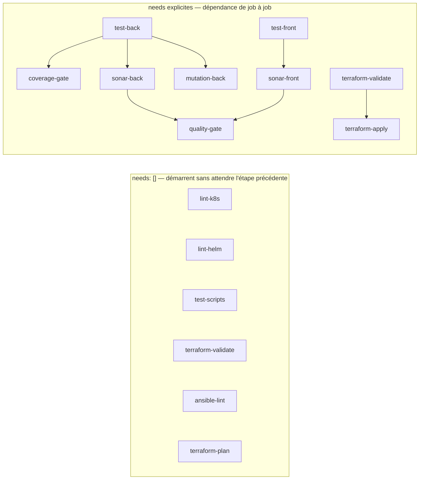
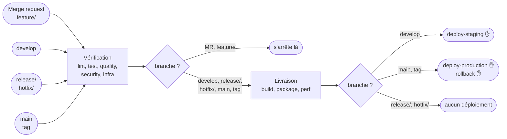

# Le pipeline CI — cartographie et pistes de restructuration

**Étape 1 du chantier « templeter la CI ».** Ce document cartographie
`.gitlab-ci.yml` avant d'y toucher : ce qu'il contient, comment ses jobs
dépendent les uns des autres, et ce que permettraient `include`, `extends` et
`trigger`.

---

## 1. Ce que pèse réellement le fichier

| Mesure               | Valeur                   |
| -------------------- | ------------------------ |
| Lignes totales       | **980**                  |
| dont commentaires    | **421 (43 %)**           |
| dont lignes vides    | 44 (4 %)                 |
| **YAML réel**        | **515 (53 %)**           |
| Jobs                 | 30, répartis en 9 étapes |
| Ancres YAML définies | 8                        |
| `extends:`           | **0**                    |
| `include:`           | **0**                    |
| `trigger:`           | **0**                    |

**Le fichier est long, mais pas pour la raison qu'on croit.** 515 lignes de YAML
pour 30 jobs font 17 lignes par job — c'est ordinaire. Ce qui gonfle le fichier,
c'est sa documentation : 43 % de commentaires, qui expliquent des pièges réels
(l'alias d'un service, l'ordre INSERT/DELETE d'Hibernate, la raison d'une image
figée). Les découper ne les fera pas disparaître ; les supprimer ferait perdre
ce que le projet a de plus difficile à reconstituer.

La vraie anomalie est ailleurs : **aucun des trois mécanismes de modularité de
GitLab n'est utilisé**. Les 8 ancres YAML sont le seul outil de factorisation en
place, et c'est précisément celui qui ne survit pas à un découpage en fichiers.

---

## 2. Le squelette : neuf étapes, deux régimes



Les étapes s'exécutent **strictement dans l'ordre** : aucune ne démarre avant
que la précédente ne soit entièrement terminée. C'est le régime par défaut de
GitLab, et il gouverne 18 des 30 jobs.

---

## 3. Les interdépendances réelles

Douze jobs sortent de l'ordre des étapes, dans les deux sens.



**À gauche**, six jobs déclarent `needs: []` : ils ne dépendent de rien et
démarrent dès le début du pipeline. Ce sont ceux qui n'ont besoin ni de
compilation ni d'artefact — validation de manifestes, de chart, de scripts.

**À droite**, six jobs déclarent une dépendance précise plutôt que d'attendre
toute l'étape. `coverage-gate` n'a besoin que du rapport JaCoCo de `test-back` ;
il n'a aucune raison d'attendre `test-front`.

Les dix-huit autres jobs n'expriment rien et subissent l'ordre des étapes.

---

## 4. Le déclenchement conditionnel



Deux familles de règles couvrent 26 jobs (`rules_test` et `rules_build`).
Quatre jobs portent des règles écrites en propre : `quality-gate` (seulement
`main`, le plan gratuit de SonarCloud ne livrant pas le verdict des autres
branches), `terraform-plan`, `terraform-apply` et `k6-stress`.

⚠️ **Seuls `feature/`, `release/`, `hotfix/`, `develop`, `main` et les tags
déclenchent quoi que ce soit.** Une branche nommée `fix/…` ou `ci/…` ne lance
aucun job — le nommage n'est pas cosmétique.

---

## 5. Séquentiel ou conditionnel : ce que coûte l'ordre actuel

Durées relevées sur le pipeline de `develop`, en prenant le job le plus long de
chaque étape :

| Étape                | Job le plus long        | Durée           |
| -------------------- | ----------------------- | --------------- |
| lint                 | `lint-back`             | 40 s            |
| test                 | `test-front`            | 1 min 14        |
| quality              | `mutation-back`         | 1 min 46        |
| security             | `dependency-check-back` | 3 min 41        |
| infra                | `ansible-lint`          | 34 s            |
| build                | `build-back`            | 54 s            |
| package              | `package-back`          | **5 min 00**    |
| perf                 | `k6-load`               | 1 min 45        |
| **Total séquentiel** |                         | **≈ 15 min 30** |

Passer en graphe complet (`needs` sur tous les jobs) ferait tomber le chemin
critique autour de **13 minutes**. Le gain est réel mais modeste, et il faut le
dire : `package-back` pèse 5 minutes à lui seul, et rien ne le parallélise.

**Le levier qui rapporterait le plus n'est pas le DAG, c'est `rules:changes`.**
Un commit qui ne touche que `front/` déclenche aujourd'hui `test-back`,
`mutation-back`, `dependency-check-back` et `package-back` — soit plus de dix
minutes pour du code que personne n'a modifié. Sur un projet dont le quota CI a
déjà été épuisé une fois, c'est l'économie la plus directe.

---

## 6. `include`, `extends`, `trigger` : ce qu'ils permettent ici

### 6.1 Le piège à connaître avant tout découpage

**Les ancres YAML ne franchissent pas les frontières de fichier.** Les huit
ancres du projet (`&cache_gradle`, `&rules_test`, `&postgres_service`…) sont
résolues à la lecture d'un seul document YAML. Découper le fichier avec
`include:` sans rien changer d'autre casserait les 30 jobs d'un coup.

Cela impose l'ordre des travaux : **convertir les ancres en `extends:` d'abord,
découper ensuite.** L'inverse ne fonctionne pas.

| Mécanisme                  | Franchit un `include` ? | Usage ici                          |
| -------------------------- | ----------------------- | ---------------------------------- |
| Ancre YAML `&`/`*`         | **non**                 | les 8 actuelles, à convertir       |
| `extends:`                 | oui                     | remplaçant direct des ancres       |
| `!reference [job, script]` | oui                     | réutiliser un fragment de `script` |

### 6.2 Découpage proposé

```
.gitlab-ci.yml              stages, variables, include
.gitlab/ci/templates.yml    les 8 ancres converties en jobs cachés extensibles
.gitlab/ci/lint.yml         5 jobs
.gitlab/ci/test.yml         3 jobs
.gitlab/ci/quality.yml      6 jobs
.gitlab/ci/security.yml     2 jobs
.gitlab/ci/infra.yml        4 jobs
.gitlab/ci/package.yml      build + package, 4 jobs
.gitlab/ci/perf.yml         3 jobs
.gitlab/ci/deploy.yml       3 jobs
```

Le fichier racine tomberait sous les 50 lignes, et chaque fichier de domaine
resterait sous les 120 — commentaires compris, qui suivent leurs jobs.

### 6.3 `trigger` : utile, mais pas pour découper

`trigger:` ne sert pas à modulariser un pipeline, il crée un **pipeline enfant**
distinct. C'est un outil différent d'`include`, et il a un coût : les `needs` ne
traversent pas la frontière parent/enfant, et le passage d'artefacts se
complique.

Le seul emploi qui se justifierait ici est celui du §5 : deux pipelines enfants,
front et back, déclenchés conditionnellement par `rules:changes`. On paierait la
complexité pour une économie mesurable de minutes CI. À évaluer **après** le
découpage par `include`, pas en même temps.

---

## 7. Ordre de travail proposé

1. **Convertir les 8 ancres en `extends:`** — aucun découpage encore, le
   pipeline doit rester identique. C'est l'étape qui se vérifie le plus
   facilement : même graphe, mêmes durées.
2. **Découper en `include: local:`** selon le §6.2.
3. **Ajouter `needs:` aux 18 jobs qui n'en ont pas**, pour passer du régime
   séquentiel au graphe.
4. **Évaluer `rules:changes`**, front et back séparés.
5. **N'envisager `trigger:`** qu'ensuite, et seulement si le §5 le justifie
   encore.

Les étapes 1 et 2 ne changent rien au comportement observable : c'est ce qui
permet de les vérifier en comparant deux exécutions. Les étapes 3 et 4 changent
le comportement et demandent chacune leur propre vérification.
