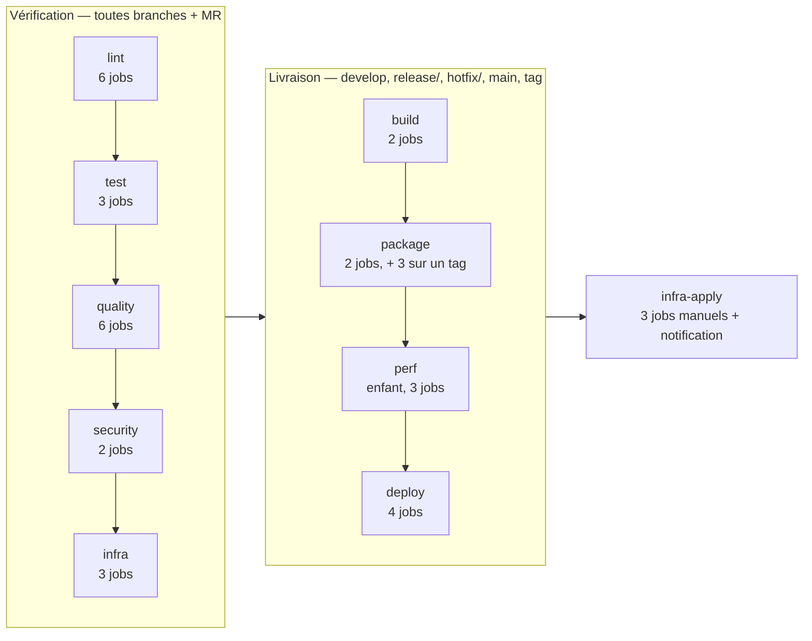
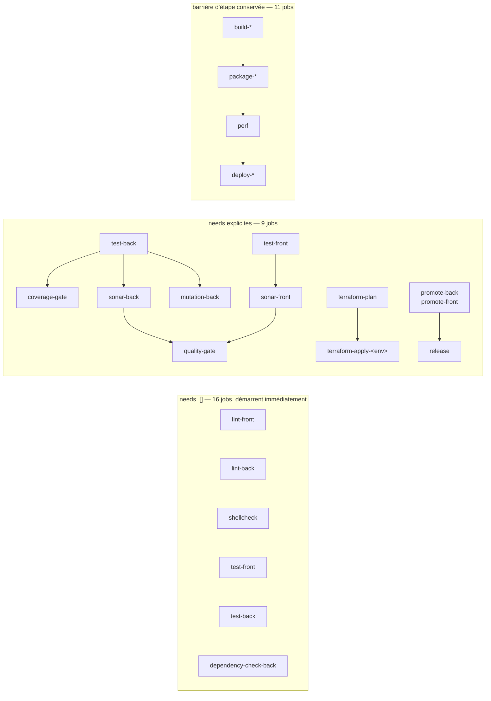
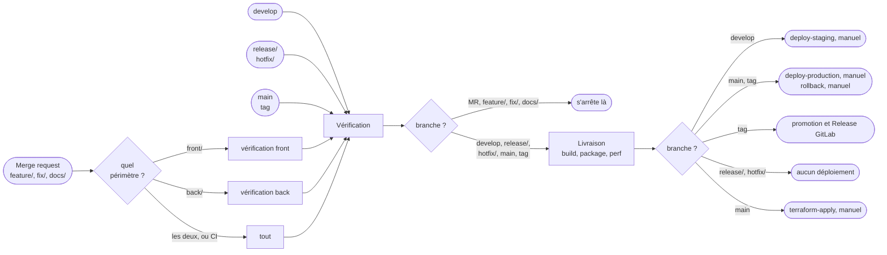

# Le pipeline CI — structure, et ce que la restructuration a changé

Ce document a commencé comme une **cartographie avant travaux** : décrire
`.gitlab-ci.yml` avant d'y toucher. Les travaux ont eu lieu. Il décrit donc
maintenant la structure en place, et garde de l'état précédent tout ce qui
explique pourquoi elle est ainsi — les mesures, et les deux pistes écartées.

**Mis à jour le 2026-10-02**, d'après les fichiers de `.gitlab/ci/` de la copie
de travail : six jobs ont été ajoutés depuis la restructuration
(`version-consistency`, `promote-back`, `promote-front`, `release`,
`dora-metrics`, `notify-echec`), et les branches `fix/` et `docs/` sont
désormais reconnues. Les jobs `release` et `dora-metrics` n'ont encore tourné
dans aucun pipeline.

---

## 1. Ce que pèse le pipeline

| Mesure            | Avant      | Après la restructuration  | Au 2026-10-02                          |
| ----------------- | ---------- | ------------------------- | -------------------------------------- |
| Fichiers          | 1          | **13**                    | 14 (la racine + 13 dans `.gitlab/ci/`) |
| Lignes totales    | 1071       | 1431                      | 1924                                   |
| dont commentaires | 484 (45 %) | 754 (53 %)                | 1100 (57 %)                            |
| **YAML réel**     | **540**    | **626**                   | **768** (hors lignes vides)            |
| Jobs              | 32         | 33 (30 parent + 3 enfant) | **39** (36 parent + 3 enfant)          |
| Étapes            | 9          | **10**                    | 10                                     |
| Ancres YAML       | 10         | **0**                     | 0                                      |
| `extends:`        | **0**      | 30 jobs                   | 35 jobs                                |
| `include:`        | **0**      | 12 fichiers, 2 racines    | 12 fichiers, 2 racines                 |
| `trigger:`        | **0**      | 1                         | 1                                      |

**Le fichier n'a pas maigri, et c'est normal.** Le YAML réel a augmenté de 86
lignes — les règles par périmètre (§4) et le pipeline enfant (§6.3) coûtent ce
qu'ils coûtent. Ce qui a changé, c'est qu'aucun fichier ne dépasse 300 lignes et
que chacun porte un domaine — à une exception près : `templates.yml` a grossi
avec les gabarits et dépasse aujourd'hui 400 lignes, dont la moitié de
commentaires. Les commentaires, eux, sont passés de 45 % à 53 % :
la restructuration a produit des décisions, et une décision non écrite se paie
plus tard.

```
.gitlab-ci.yml                 étapes + include, aucun job
.gitlab/ci/variables.yml       les variables globales
.gitlab/ci/templates.yml       les 13 gabarits (ex-ancres, et ceux ajoutés depuis)
.gitlab/ci/lint.yml            6 jobs        .gitlab/ci/package.yml   7 jobs
.gitlab/ci/test.yml            3 jobs        .gitlab/ci/deploy.yml    4 jobs
.gitlab/ci/quality.yml         6 jobs        .gitlab/ci/security.yml  2 jobs
.gitlab/ci/infra.yml           6 jobs        .gitlab/ci/notify.yml    1 job
.gitlab/ci/perf-trigger.yml    le pont vers le pipeline enfant (1 job)
.gitlab/ci/perf-pipeline.yml   la racine de l'enfant
.gitlab/ci/perf.yml            3 jobs, dans l'enfant
```

---

## 2. Le squelette : dix étapes, deux régimes


```mermaid
flowchart LR
    subgraph V["Vérification — toutes branches + MR"]
        l["lint<br/>6 jobs"] --> t["test<br/>3 jobs"] --> q["quality<br/>6 jobs"] --> s["security<br/>2 jobs"] --> i["infra<br/>3 jobs"]
    end
    subgraph C["Livraison — develop, release/, hotfix/, main, tag"]
        b["build<br/>2 jobs"] --> p["package<br/>2 jobs, + 3 sur un tag"] --> f["perf<br/>enfant, 3 jobs"] --> d["deploy<br/>4 jobs"]
    end
    V --> C
    C --> a["infra-apply<br/>3 jobs manuels + notification"]
```

Le schéma se lit de gauche à droite : la vérification, qui tourne partout,
puis la livraison, réservée aux branches qui produisent un artefact, puis
l'application de l'infrastructure. `package` compte deux jobs sur une branche
(`package-back`, `package-front`) et trois autres sur un tag (`promote-back`,
`promote-front`, `release`) ; `deploy` compte les trois déploiements et
`dora-metrics`.

**La dixième étape, `infra-apply`, est un correctif.** Les trois
`terraform-apply-<env>` sont manuels et **sans** `allow_failure` — un apply
interrompu laisse l'infrastructure dans un état intermédiaire, le pipeline doit
le dire. Or un job manuel non-`allow_failure` est _bloquant_ : la documentation
GitLab est explicite, « the pipeline stops at the stage where the job is
defined ». Tant que ces jobs vivaient dans l'étape `infra`, **tout pipeline de
`main` s'arrêtait là** : `build`, `package`, `perf` et `deploy` n'étaient jamais
atteints tant que personne ne cliquait. Les placer en dernier garde le caractère
bloquant sans rien bloquer en amont.

`deploy-production` et `rollback-production` sont dans le même cas, et déjà dans
la dernière étape utile : leur blocage ne coûte rien.

---

## 3. Les interdépendances


```mermaid
flowchart LR
    subgraph A["needs: [] — 16 jobs, démarrent immédiatement"]
        a1["lint-front"] ~~~ a2["lint-back"] ~~~ a3["shellcheck"] ~~~ a4["test-front"] ~~~ a5["test-back"] ~~~ a6["dependency-check-back"]
    end
    subgraph B["needs explicites — 9 jobs"]
        tb["test-back"] --> cg["coverage-gate"]
        tb --> sb["sonar-back"]
        tb --> mb["mutation-back"]
        tf["test-front"] --> sf["sonar-front"]
        sb --> qg["quality-gate"]
        sf --> qg
        tpl["terraform-plan"] --> tap["terraform-apply-&lt;env&gt;"]
        pro["promote-back<br/>promote-front"] --> rel["release"]
    end
    subgraph C["barrière d'étape conservée — 11 jobs"]
        bu["build-*"] --> pk["package-*"] --> pf["perf"] --> dp["deploy-*"]
    end
```

Le schéma range les 36 jobs du pipeline parent en trois groupes : ceux qui
démarrent tout de suite, ceux qui attendent un job nommé, et ceux qui attendent
la fin de l'étape précédente.

**16 jobs démarrent sans rien attendre.** Toute la phase de vérification qui ne
lit que les sources — lint, tests, SpotBugs, sécurité, validation
d'infrastructure — et `dora-metrics`, qui ne lit que l'API GitLab. Un `lint-back` qui échoue n'empêche plus de voir dans la même exécution
qu'un test échoue aussi — c'est la règle qui gouverne déjà
`terraform_check.sh` : deux erreurs se lisent en une exécution au lieu de deux.

**11 jobs gardent la barrière d'étape, et c'est délibéré** : `build-*`,
`package-*`, `promote-*`, `perf`, les trois déploiements et `notify-echec`.
`build`, `package`, `perf` et `deploy` n'ont pas de `needs:` : ils attendent donc que **toute** la
phase de vérification soit verte. C'est la garantie « on ne construit, ne
package ni ne déploie rien qui n'ait pas été vérifié ». Un DAG complet la
ferait sauter : `package-back` démarrerait en parallèle des tests et pousserait
l'image d'un code dont la suite échoue — cinq minutes de build pour rien, et une
image publiée dans le registry. Le gain de parallélisme ne vaut pas cette
perte.

---

## 4. Le déclenchement conditionnel


```mermaid
flowchart LR
    mr(["Merge request<br/>feature/, fix/, docs/"]) --> F{"quel<br/>périmètre ?"}
    F -->|"front/"| vf["vérification front"]
    F -->|"back/"| vb["vérification back"]
    F -->|"les deux, ou CI"| vt["tout"]
    dev(["develop"]) --> V
    rel(["release/<br/>hotfix/"]) --> V
    main(["main<br/>tag"]) --> V
    vf --> V["Vérification"]
    vb --> V
    vt --> V
    V --> G{"branche ?"}
    G -->|"MR, feature/, fix/, docs/"| stop(["s'arrête là"])
    G -->|"develop, release/,<br/>hotfix/, main, tag"| L["Livraison<br/>build, package, perf"]
    L --> H{"branche ?"}
    H -->|"develop"| st(["deploy-staging, manuel"])
    H -->|"main, tag"| pr(["deploy-production, manuel<br/>rollback, manuel"])
    H -->|"tag"| rl(["promotion et Release GitLab"])
    H -->|"release/, hotfix/"| rien(["aucun déploiement"])
    H -->|"main"| ia(["terraform-apply, manuel"])
```

Le schéma suit un commit : sur une branche de travail ou en merge request, la
vérification est filtrée par périmètre puis s'arrête ; sur une branche de
livraison, elle est complète et suivie de la construction, puis d'un
déploiement proposé selon la branche.

Cinq familles de règles couvrent 24 jobs ; les 15 autres écrivent les leurs :

| Famille             | Jobs | Ce qu'elle dit                                                                                                                                                                           |
| ------------------- | ---- | ---------------------------------------------------------------------------------------------------------------------------------------------------------------------------------------- |
| `.rules_test`       | 7    | toute branche de travail + MR, sans condition de contenu                                                                                                                                 |
| `.rules_test_front` | 3    | idem, mais en MR et sur `feature/`, `fix/`, `docs/` : seulement si `front/` a bougé                                                                                                      |
| `.rules_test_back`  | 7    | idem pour `back/`                                                                                                                                                                        |
| `.rules_build`      | 5    | `develop`, `release/`, `hotfix/`, `main`, tags                                                                                                                                           |
| `.rules_package`    | 2    | les mêmes, **sans les tags** : un tag promeut, il ne reconstruit pas                                                                                                                     |
| règles propres      | 15   | tag seul (`version-consistency`, `promote-*`, `release`), `main` seul (`quality-gate`, `terraform-apply-*`), déploiements, `terraform-plan`, `dora-metrics`, `notify-echec`, `k6-stress` |

⚠️ **Seuls `feature/`, `fix/`, `docs/`, `release/`, `hotfix/`, `develop`,
`main` et les tags déclenchent quoi que ce soit.** Une branche nommée `feat/…`
ou `ci/…` ne lance aucun job — le nommage n'est pas cosmétique. `fix/` et
`docs/` ont été ajoutés à la règle parce que le dépôt les employait : ses
branches de correction ne déclenchaient rien jusque-là.

⚠️ **Le filtrage par périmètre s'arrête à la vérification.** `build-*`,
`package-*` et les déploiements n'ont pas de `changes:`, et ce n'est pas un
oubli : les images sont taguées par `$CI_COMMIT_SHORT_SHA`, et `deploy` comme
les services k6 les réclament sous **ce** tag. Sauter `package-back` parce que
le back n'a pas bougé produirait un tag inexistant, donc un déploiement en
échec sur une image introuvable.

Et les fichiers de CI eux-mêmes (`.gitlab-ci.yml`, `.gitlab/ci/**`) figurent
dans les deux listes de `changes:` : une modification du pipeline doit être
éprouvée par tout le pipeline.

---

## 5. Les durées, et où est vraiment l'économie

Durées relevées sur `develop` avant restructuration, en prenant le job le plus
long de chaque étape :

| Étape                | Job le plus long        | Durée           |
| -------------------- | ----------------------- | --------------- |
| lint                 | `lint-back`             | 40 s            |
| test                 | `test-front`            | 1 min 14        |
| quality              | `mutation-back`         | 1 min 46        |
| security             | `dependency-check-back` | 3 min 41        |
| infra                | `ansible-lint`          | 34 s            |
| build                | `build-back`            | 54 s            |
| package              | `package-back`          | **5 min 00**    |
| perf                 | `k6-load`               | 1 min 45        |
| **Total séquentiel** |                         | **≈ 15 min 30** |

La phase de vérification coûtait ≈ 7 min 55 en séquentiel ; avec les `needs: []`
du §3, elle se réduit au plus long de ses jobs, soit ≈ 3 min 41 —
`dependency-check-back` domine et rien ne le parallélise. Chemin critique attendu
autour de **13 minutes**, contre 15 min 30.

**Mais le levier qui rapporte le plus n'est pas le DAG, c'est `rules:changes`.**
Un commit qui ne touchait que `front/` déclenchait `test-back`, `mutation-back`
et `dependency-check-back` — près de sept minutes pour du code que personne
n'avait modifié. Sur un projet dont le quota CI a déjà été épuisé une fois,
c'est l'économie la plus directe, et elle ne coûte aucune complexité de graphe.

---

## 6. `include`, `extends`, `trigger` : ce qui a été fait

### 6.1 L'ordre des travaux n'était pas libre

**Les ancres YAML ne franchissent pas les frontières de fichier.** Elles sont
résolues à la lecture d'un seul document. Découper le fichier avec `include:`
sans rien changer d'autre aurait cassé les 32 jobs d'un coup.

| Mécanisme                  | Franchit un `include` ? | Usage ici       |
| -------------------------- | ----------------------- | --------------- |
| Ancre YAML `&`/`*`         | **non**                 | plus aucune     |
| `extends:`                 | oui                     | les 12 gabarits |
| `!reference [job, script]` | oui                     | non utilisé     |

D'où l'ordre : **convertir d'abord, découper ensuite.** La conversion a été
vérifiée exacte avant le découpage — aucun job ne redéfinissait une clé que son
gabarit définit, et les gabarits combinés (`extends: [.cache_gradle,
.rules_test]`) ont des clés disjointes. C'est ce qui autorisait la traduction :
`<<:` fusionne à plat, `extends:` fusionne en profondeur, et les deux ne
diffèrent que si une clé est définie des deux côtés.

Le pipeline assemblé depuis 13 fichiers a été comparé job par job à l'ancien
fichier unique : **zéro écart sur les 42 clés**, `stages` et `variables`
compris.

### 6.2 Le découpage

Un fichier par domaine, tous inclus par une racine qui ne contient plus aucun
job (73 lignes, dont 49 de commentaire). Les gabarits et les variables sont dans
leurs propres fichiers, parce que le pipeline enfant les inclut aussi.

### 6.3 `trigger` : un seul, et pas là où on l'attendait

`trigger:` ne sert pas à modulariser — c'est le travail d'`include`. Il crée un
**pipeline enfant**, et cette frontière a un coût précis : les `needs:` ne la
traversent pas, et le passage d'artefacts se complique. Trois candidats ont été
examinés :

- **front / back**, la piste envisagée à l'origine : **écartée**. `quality-gate`
  a besoin de `sonar-back` ET de `sonar-front` ; un `needs:` ne franchit pas la
  frontière. Et l'économie visée est déjà obtenue par `rules:changes` (§4), sans
  aucune frontière.
- **infra** : **écartée**. `terraform-apply-<env>` applique le `plan.cache`
  produit par `terraform-plan` — un artefact, précisément ce qui passe mal d'un
  pipeline à l'autre. En faire un enfant casserait la garantie « on applique le
  plan qui a été relu » (TERRAFORM.md §4.2).
- **perf** : **retenue**. Les trois jobs k6 ne produisent aucun artefact, n'en
  consomment aucun, et personne ne les `needs:`. Leur seule entrée est l'image
  du back, tirée du registry par son tag de commit — pas du pipeline. La
  frontière ne coupe rien.

Le job `perf` du parent porte `strategy: depend` : sans lui, il passerait au
vert dès que l'enfant est _créé_, sans attendre son résultat.

⚠️ **Un pipeline enfant n'hérite pas des variables globales de son parent.**
C'est la raison d'être de `variables.yml` : les deux racines l'incluent.

---

## 7. Ce qui reste

- **Les autres périmètres.** `lint-k8s`, `lint-helm`, `test-scripts` et
  `ansible-lint` tournent encore sur tout commit. Leur donner un `changes:`
  (`k8s/**`, `helm/**`, `scripts/**`, `ansible/**`) se fait sur le modèle du §4.
  `terraform-plan`, lui, doit rester inconditionnel : il ne détecte la dérive du
  cluster que s'il tourne même quand le dépôt n'a pas bougé.
- **`!reference`** n'est pas utilisé. Il permettrait de réemployer un fragment de
  `script:` — par exemple le `build_deploy_overlay()` de `.deploy_template` —
  sans hériter du reste du gabarit.
- **Mesurer à nouveau.** Les durées du §5 datent d'avant. Le chemin critique
  annoncé (≈ 13 min) est une prévision, pas un relevé. Et `dependency-check-back`,
  qui dominait la phase de vérification, ne lisait alors aucun jar : sa durée
  réelle, maintenant qu'il analyse 82 dépendances, n'a pas été mesurée en CI.
- **Lint GitLab de la copie de travail.** Les modifications du 2026-10-02 ont été
  contrôlées par un chargement YAML et un résolveur local des `extends` et des
  `rules`, pas par l'API de lint de GitLab, qui ne valide que la configuration
  commitée.
