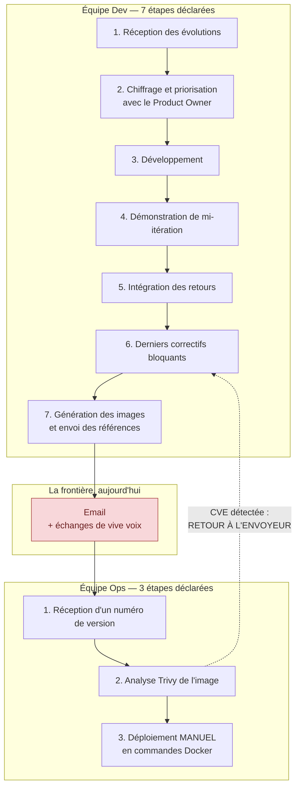
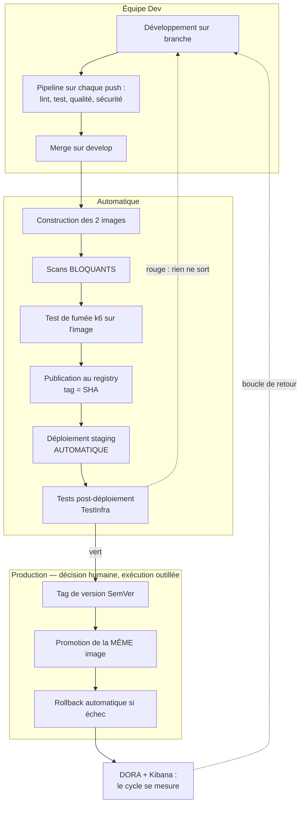
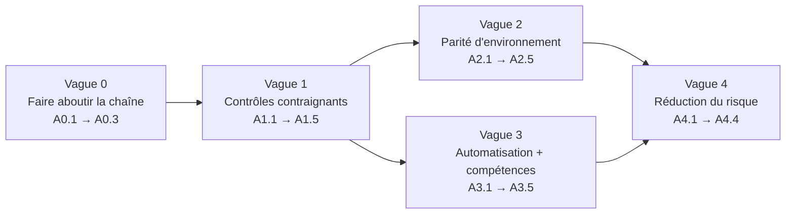

# Plan d'optimisation du cycle de release — équipe Orion

**Livrable 2/2 de l'itération.** Ce document part du cycle décrit par les deux
équipes dans leurs sondages, nomme ce qui coûte, et propose un ordre de travaux
avec un porteur, un effort et une preuve d'atteinte pour chaque action.

Il se lit avec son jumeau, [schema-architecture.md](schema-architecture.md),
qui décrit la cible. Ici on décrit **le chemin**.

> **Principe directeur.** Une optimisation qui ne se mesure pas est une opinion.
> Chaque action porte donc une preuve observable — un job qui échoue, un chiffre
> qui bouge, une commande qui rend un résultat — et non un état d'esprit.

---

## 1. Le point de départ, tel que les équipes le décrivent

### 1.1 Le cycle actuel

Ce cycle a une qualité qu'il faut reconnaître avant de le critiquer : **il
existe et il est décrit**. Une démonstration de mi-itération, un chiffrage avec
le Product Owner, un contrôle de sécurité avant déploiement — beaucoup d'équipes
au deuxième sprint n'ont pas cela.

Ce qu'il n'a pas, c'est un **point de jonction outillé**. Tout ce qui traverse la
frontière traverse une boîte mail.

### 1.2 Le chiffre qui cadre tout le reste

Le collecteur d'indicateurs DORA (`scripts/ci/collect_dora.py`), mesuré sur les
**44 pipelines** de l'histoire du projet :

| Indicateur DORA              | Valeur mesurée | Lecture                                            |
| ---------------------------- | -------------- | -------------------------------------------------- |
| Fréquence de déploiement     | **0,0** / jour | Zéro déploiement réussi depuis la CI               |
| Délai de mise en production  | **`null`**     | Aucune arrivée en production vers laquelle mesurer |
| Temps de rétablissement      | **`null`**     | Aucun rétablissement à mesurer                     |
| Taux d'échec des changements | **100 %**      | 7 déploiements déclenchés, 7 échecs                |

`null` et `0` ne disent pas la même chose, et le collecteur refuse de les
confondre : un délai rendu en `0` afficherait la performance parfaite là où il
n'y a jamais eu de mise en production.

**Conséquence directe sur ce plan :** tant que le taux d'échec vaut 100 %,
optimiser la vitesse du cycle n'a aucun sens. On n'accélère pas une chaîne qui
n'a jamais abouti — on la fait aboutir une fois, puis on l'accélère. C'est
l'objet de la vague 0.

---

## 2. Les irritants, et ce qu'ils coûtent

Les huit irritants ci-dessous sont soit cités par les équipes, soit établis en
lisant le dépôt. La colonne « établi par » distingue les deux, parce qu'un
irritant vécu et un irritant constaté ne se traitent pas de la même façon : le
premier a déjà l'adhésion de l'équipe, le second doit d'abord être partagé.

| #      | Irritant                                                        | Établi par                     | Ce qu'il coûte aujourd'hui                                                                                                                                      |
| ------ | --------------------------------------------------------------- | ------------------------------ | --------------------------------------------------------------------------------------------------------------------------------------------------------------- |
| **I1** | Aucun déploiement n'a jamais abouti depuis la CI                | Dépôt — DORA                   | Toute la chaîne est une conviction argumentée, pas une preuve. 7 tentatives, 7 échecs, quota CI épuisé.                                                         |
| **I2** | Les CVE se découvrent **chez Ops**, après remise                | Les deux sondages              | Le premier déploiement de démonstration a été retardé. Retravail non planifié en fin d'itération, au pire moment.                                               |
| **I3** | Les scans existent dans la CI mais **ne bloquent rien**         | Dépôt                          | `trivy-fs` et les scans d'image tournent en `--exit-code 0`. Une image vulnérable est publiée comme une image saine. I2 semble traité alors qu'il ne l'est pas. |
| **I4** | Le déploiement est **manuel**, en commandes Docker              | Sondage Ops                    | Non reproductible, non traçable, indisponible quand la personne qui sait ne l'est pas. Cité comme irritant n°1 par l'équipe Ops.                                |
| **I5** | **Rupture de parité** : HyperSQL en dev, PostgreSQL en prod     | Croisement des deux sondages   | Le code n'a jamais vu sa base de production. Le schéma est généré par Hibernate sans migration. Le back est plafonné à 1 replica.                               |
| **I6** | La frontière Dev↔Ops est un **email**                           | Sondage Ops                    | Aucune traçabilité, aucun horodatage, aucune réponse rapide à « quelle version tourne ? ».                                                                      |
| **I7** | **Trois artefacts** dont une image tout-en-un                   | Sondage Dev                    | Couple les cadences front et back, empêche la montée en charge, triple la surface à scanner.                                                                    |
| **I8** | **Aucune compétence Kubernetes** déclarée dans les deux équipes | Absence dans les deux sondages | La cible repose sur une compétence que personne n'a. Risque non pas de lenteur, mais d'incident non diagnosticable.                                             |

**Deux irritants sont déjà traités et il serait malhonnête de les recompter.**
I7 est réglé : l'image tout-en-un a été scindée au commit `2931df3` puis
supprimée au commit `f125ef0`. I2 est **partiellement** traité — les outils sont
descendus dans le pipeline Dev, mais I3 explique pourquoi le résultat n'est pas
encore là. C'est exactement le genre de demi-mesure qui donne l'illusion du
progrès, et c'est pourquoi I3 est en tête du plan.

---

## 3. Le cycle cible

Trois différences de nature avec le cycle du §1.1, et une seule qui compte
vraiment :

1. La sécurité **arrête** le pipeline au lieu de le commenter.
2. Le déploiement en staging est **déclenché par le pipeline**, pas par une
   personne.
3. **Le seul acte humain restant est la décision de mettre en production.** Ce
   n'est pas une automatisation incomplète, c'est le point d'arrêt voulu :
   l'automatisation doit supprimer le geste répétitif, pas la décision.

---

## 4. Le plan, par vagues

Chaque action porte un identifiant, l'irritant traité, un porteur, un effort
(S ≤ 1 j, M ≤ 3 j, L > 3 j) et **une preuve d'atteinte** — ce qu'on regarde pour
dire que c'est fait.

### Vague 0 — Faire aboutir la chaîne une fois (bloquant pour tout le reste)

Tant que cette vague n'est pas close, les suivantes optimisent quelque chose
dont on ne sait pas si cela fonctionne.

| ID   | Action                                                                                                          | Irritant | Porteur      | Effort | Preuve d'atteinte                                                      |
| ---- | --------------------------------------------------------------------------------------------------------------- | -------- | ------------ | ------ | ---------------------------------------------------------------------- |
| A0.1 | Rétablir une capacité d'exécution CI : runner auto-hébergé sur le poste Ops, ou remise à niveau du quota GitLab | I1       | Nico         | M      | Un pipeline complet se termine sans `ci_quota_exceeded`                |
| A0.2 | Obtenir **un** déploiement staging réussi depuis la CI, de bout en bout                                         | I1       | Nico + Temim | M      | `deploy-staging` en vert, `kubectl rollout status` à `0`, l'API répond |
| A0.3 | Rejouer le collecteur DORA après A0.2                                                                           | I1       | Josefina     | S      | `deployment_frequency` > 0 et `lead_time` cesse de valoir `null`       |

> **Pourquoi A0.2 est confiée à un binôme Ops + junior.** C'est le premier
> déploiement réussi du projet : le faire à deux met Temim au contact du seul
> geste que personne dans l'équipe n'a encore accompli, et donne à Nico un
> témoin de ce qui casse. La montée en compétence I8 commence ici, pas en
> vague 3.

### Vague 1 — Rendre les contrôles contraignants

| ID   | Action                                                                                                                   | Irritant           | Porteur        | Effort | Preuve d'atteinte                                                             |
| ---- | ------------------------------------------------------------------------------------------------------------------------ | ------------------ | -------------- | ------ | ----------------------------------------------------------------------------- |
| A1.1 | Passer les scans Trivy à `--exit-code 1` sur `HIGH,CRITICAL` (`trivy-fs`, `package-back`, `package-front`)               | I3, I2             | Maïa           | S      | Une image porteuse d'une CVE critique fait échouer `package-*`                |
| A1.2 | Tenir un `.trivyignore` **daté et justifié** : une ligne = une CVE, une raison, une date de réexamen                     | I3                 | Maïa + Roubina | S      | Aucune entrée sans raison ni date ; revue à chaque itération                  |
| A1.3 | Rendre `dependency-check-back` bloquant au-delà d'un score CVSS convenu                                                  | I2                 | Sylvain        | S      | Le job échoue sur une dépendance vulnérable introduite volontairement en test |
| A1.4 | Miroiter les images de base dans le registry interne et n'y référencer qu'elles                                          | I6, souhait Ops C8 | Nico           | M      | Aucun `FROM` ne pointe vers DockerHub ; le build passe DockerHub coupé        |
| A1.5 | Remplacer l'email par le pipeline comme canal : un déploiement se désigne par un tag d'image, jamais par un numéro dicté | I6                 | Roubina + Nico | S      | Aucun échange de version par email sur une itération complète                 |

> **A1.1 tient en un caractère, et c'est précisément le piège.** Le travail
> n'est pas la modification, c'est A1.2 : sans une liste d'exceptions tenue
> honnêtement, un scan bloquant devient un scan qu'on contourne, et l'équipe
> apprend à ignorer un signal rouge. Les deux actions sont indissociables ; les
> livrer séparément serait pire que ne rien faire.

### Vague 2 — Réparer la parité d'environnement

| ID   | Action                                                                                       | Irritant | Porteur           | Effort | Preuve d'atteinte                                                                   |
| ---- | -------------------------------------------------------------------------------------------- | -------- | ----------------- | ------ | ----------------------------------------------------------------------------------- |
| A2.1 | Faire tourner les tests d'intégration du back contre un **PostgreSQL réel** en service de CI | I5       | Sylvain           | M      | `test-back` échoue si une requête ne passe pas sur PostgreSQL                       |
| A2.2 | Introduire Flyway ou Liquibase et **retirer `ddl-auto`** en environnement persistant         | I5       | Sylvain + Roubina | L      | Une évolution d'entité produit un script de migration, pas une recréation de schéma |
| A2.3 | Déployer PostgreSQL en `StatefulSet` + PVC, identifiants en `Secret`                         | I5       | Nico              | M      | La base survit à la suppression du pod applicatif                                   |
| A2.4 | Lever le plafond de 1 replica sur le back et le vérifier sous charge k6                      | I5       | Maïa + Temim      | S      | 2 replicas servent des données cohérentes sous `k6-load`                            |
| A2.5 | Écrire et **jouer** la procédure de sauvegarde/restauration                                  | I5       | Nico              | M      | Une restauration effective, pas un `CronJob` jamais rejoué                          |

> **L'ordre est contraint et ne se négocie pas.** A2.2 avant A2.3 : mettre en
> place une base persistante en gardant `ddl-auto` revient à installer un
> mécanisme qui détruira des données à la première évolution d'entité. La
> commodité tolérable sur une base jetable devient un danger dès qu'elle
> persiste.

### Vague 3 — Automatiser le déploiement et combler l'angle mort

| ID   | Action                                                                                       | Irritant | Porteur                      | Effort | Preuve d'atteinte                                                                       |
| ---- | -------------------------------------------------------------------------------------------- | -------- | ---------------------------- | ------ | --------------------------------------------------------------------------------------- |
| A3.1 | Passer `deploy-staging` de `when: manual` à `when: on_success`                               | I4       | Nico                         | S      | Un merge sur `develop` met à jour staging sans intervention                             |
| A3.2 | Tests post-déploiement en **TestInfra** — l'outil que l'équipe Ops maîtrise déjà             | I4, I8   | Maïa                         | M      | Un déploiement fonctionnel mais cassé fait échouer le job                               |
| A3.3 | Exécuter le collecteur DORA **dans la CI** au lieu de le lancer à la main                    | I1       | Josefina                     | S      | Les indicateurs s'actualisent sans commande manuelle                                    |
| A3.4 | Montée en compétence Kubernetes : deux ateliers, un incident simulé, une astreinte en binôme | I8       | Nico (anime), toute l'équipe | L      | Chaque membre a diagnostiqué seul un pod en `CrashLoopBackOff` et déclenché un rollback |
| A3.5 | Documenter les décisions structurantes en ADR courtes                                        | I8       | Josefina                     | S      | Une ADR par décision d'architecture non triviale                                        |

> **Sur A3.2 et le choix de TestInfra.** Le réflexe serait d'écrire ces tests
> dans l'outillage du pipeline. On les écrit en TestInfra parce que l'équipe Ops
> le note « bon » et qu'elle sera celle qui les lira à 3 h du matin. Un test de
> production que son lecteur ne sait pas déchiffrer ne sera pas maintenu — et un
> test non maintenu finit désactivé.
>
> **Sur A3.4 et son critère de sortie.** « Se former à Kubernetes » n'est pas un
> critère ; « avoir diagnostiqué seul un `CrashLoopBackOff` et déclenché un
> rollback » en est un. C'est la seule ligne du plan dont l'effort est en
> semaines, et c'est aussi celle qui protège de l'incident le plus coûteux :
> celui que personne ne sait lire.

### Vague 4 — Réduire le risque de la mise en production

| ID   | Action                                                   | Irritant | Porteur     | Effort | Preuve d'atteinte                                       |
| ---- | -------------------------------------------------------- | -------- | ----------- | ------ | ------------------------------------------------------- |
| A4.1 | Déploiement progressif — canary ou blue/green            | I4       | Nico + Maïa | L      | Une version fautive n'atteint qu'une fraction du trafic |
| A4.2 | Changelog généré depuis les Conventional Commits         | I6       | Josefina    | S      | Chaque tag porte son changelog, sans rédaction manuelle |
| A4.3 | Notification d'échec de déploiement sur un canal partagé | I6       | Temim       | S      | Un échec est visible sans consulter GitLab              |
| A4.4 | Signature des images et attestation de provenance        | I2       | Maïa        | M      | Une image non signée est refusée au déploiement         |

---

## 5. Comment on saura que le plan a produit un effet

Quatre indicateurs DORA, plus quatre propres aux irritants d'Orion. La colonne
« aujourd'hui » n'est pas une estimation : c'est ce qui est mesuré, ou
l'indication franche qu'il n'y a pas de mesure.

| Indicateur                                     | Aujourd'hui                     | Après vague 1               | Après vague 3          | Comment on le mesure                            |
| ---------------------------------------------- | ------------------------------- | --------------------------- | ---------------------- | ----------------------------------------------- |
| Fréquence de déploiement                       | **0,0 / j**                     | > 0                         | ≥ 1 / j sur staging    | `collect_dora.py`                               |
| Délai de mise en production                    | `null`                          | mesurable                   | < 1 j                  | `collect_dora.py`                               |
| Temps de rétablissement                        | `null`                          | mesurable                   | < 1 h                  | `collect_dora.py`                               |
| Taux d'échec des changements                   | **100 %**                       | < 50 %                      | < 15 %                 | `collect_dora.py`                               |
| Délai entre remise et retour CVE               | **jours** (retour à l'envoyeur) | **minutes** (le job échoue) | idem                   | Durée du job `package-*`                        |
| Part d'opérations de déploiement manuelles     | **100 %**                       | 100 %                       | staging à 0 %          | Comptage des gestes `when: manual`              |
| Artefacts publiés par release                  | **2** (3 avant `f125ef0`)       | 2                           | 2                      | `docker images` du registry                     |
| Environnements où le code voit sa base de prod | **0**                           | 0                           | **1** (CI, après A2.1) | Présence du service PostgreSQL dans `test-back` |

Deux honnêtetés à maintenir dans ce tableau. **Un indicateur sans donnée se
rend `null`, jamais `0`** — c'est la règle du collecteur, et l'afficher en `0`
transformerait une absence de mesure en performance parfaite. Et **la part
d'opérations manuelles reste à 100 % après la vague 1** : rendre un scan
bloquant ne déploie rien. Une case qui ne bouge pas au bon moment est le signe
que le tableau mesure quelque chose de réel.

---

## 6. Ce que le plan ne traite pas, et pourquoi

- **L'authentification de l'application.** MicroCRM n'en a aucune. C'est un
  sujet produit, pas un sujet de cycle de release ; il doit être ouvert
  ailleurs, et avant tout usage réel.
- **Le passage au cloud.** L'architecture reste locale. Le chiffrage AWS/Azure
  n'existe pas, et un plan qui promettrait une bascule sans coût connu ne serait
  pas un plan.
- **La sécurisation de la stack ELK.** `xpack.security` est désactivé et Kibana
  n'a pas d'Ingress ; assumé pour une stack de démonstration locale,
  inacceptable ailleurs. À rouvrir si elle sort du poste.
- **La vérification des sources Mermaid dupliquées.** Rien ne compare les blocs
  des documents et les fichiers `docs/schemas/*.mmd`. Le coût d'un test dépasse
  aujourd'hui celui d'une relecture — mais c'est un choix, pas un oubli.

---

## 7. Les risques du plan lui-même

Un plan qui n'énonce pas ses propres risques demande qu'on lui fasse confiance.

| Risque                                                                               | Probabilité      | Impact       | Ce qu'on fait                                                                                                 |
| ------------------------------------------------------------------------------------ | ---------------- | ------------ | ------------------------------------------------------------------------------------------------------------- |
| **A1.1 sans A1.2** : le blocage devient un obstacle qu'on contourne                  | élevée           | fort         | Les deux actions sont livrées ensemble, et la liste d'exceptions est relue à chaque itération                 |
| **La charge repose sur deux personnes** côté Ops                                     | élevée           | fort         | A3.2 et A3.4 transfèrent volontairement du travail vers l'équipe Dev ; A0.2 est en binôme dès le premier jour |
| **La vague 2 déborde.** Flyway sur une base existante est un chantier, pas une tâche | moyenne          | moyen        | A2.1 seule apporte déjà l'essentiel du bénéfice et se livre indépendamment                                    |
| **La compétence Kubernetes ne monte pas** faute de temps dédié                       | moyenne          | **critique** | A3.4 porte un critère de sortie observable ; sans lui, le sujet se reporte indéfiniment                       |
| **Le quota CI se ré-épuise** et A0.1 est à refaire                                   | moyenne          | fort         | Privilégier un runner auto-hébergé, qui met la contrainte sous le contrôle de l'équipe                        |
| **Josefina termine son stage** avant la fin des actions qui lui sont confiées        | certaine à terme | faible       | Ses actions sont toutes en effort S et documentées par des ADR (A3.5)                                         |

---

## 8. Ordre d'exécution résumé

Les vagues 2 et 3 sont **parallélisables** : la première est un chantier back
porté par Sylvain, la seconde un chantier plateforme porté par Nico. Elles se
rejoignent avant la vague 4, parce qu'un déploiement progressif sur une base non
persistante ne prouverait rien.

La vague 0, elle, ne se parallélise pas — et c'est le seul point du plan sur
lequel il n'y a pas d'arbitrage possible. **Tant qu'aucun déploiement n'a
abouti, tout le reste optimise une chaîne dont on ignore si elle fonctionne.**
