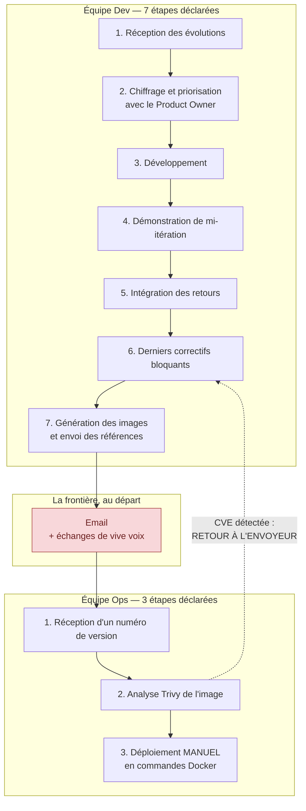
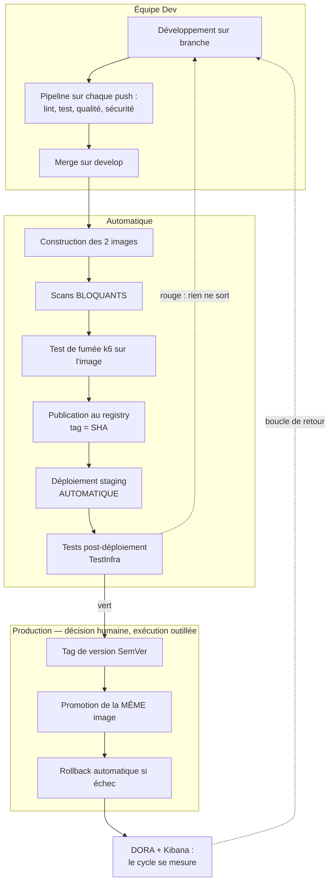
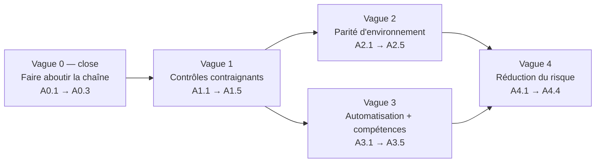

# Plan d'optimisation du cycle de release — équipe Orion

**Livrable 2/2 de l'itération.** Ce document part du cycle décrit par les deux
équipes dans leurs sondages, nomme ce qui coûte, et propose un ordre de travaux
avec un porteur, un effort et une preuve d'atteinte pour chaque action.

Il se lit avec son jumeau, [schema-architecture.md](schema-architecture.md),
qui décrit la cible. Ici on décrit **le chemin**.

> **Principe directeur.** Une optimisation qui ne se mesure pas est une opinion.
> Chaque action porte donc une preuve observable — un job qui échoue, un chiffre
> qui bouge, une commande qui rend un résultat — et non un état d'esprit. Une
> preuve d'atteinte inclut ce que le contrôle a regardé, pas seulement son
> verdict : une porte bloquante qui ne lit rien ne se distingue pas, à l'œil,
> d'une porte qui n'a rien trouvé.

---

## 1. Le point de départ, tel que les équipes le décrivent

### 1.1 Le cycle déclaré

```mermaid
flowchart TB
    subgraph DEV["Équipe Dev — 7 étapes déclarées"]
        direction TB
        d1["1. Réception des évolutions"]
        d2["2. Chiffrage et priorisation<br/>avec le Product Owner"]
        d3["3. Développement"]
        d4["4. Démonstration de mi-itération"]
        d5["5. Intégration des retours"]
        d6["6. Derniers correctifs bloquants"]
        d7["7. Génération des images<br/>et envoi des références"]
        d1 --> d2 --> d3 --> d4 --> d5 --> d6 --> d7
    end

    subgraph MUR["La frontière, au départ"]
        m1["Email<br/>+ échanges de vive voix"]:::pain
    end

    subgraph OPS["Équipe Ops — 3 étapes déclarées"]
        direction TB
        o1["1. Réception d'un numéro de version"]
        o2["2. Analyse Trivy de l'image"]
        o3["3. Déploiement MANUEL<br/>en commandes Docker"]
        o1 --> o2 --> o3
    end

    d7 --> m1 --> o1
    o2 -. "CVE détectée :<br/>RETOUR À L'ENVOYEUR" .-> d6
    classDef pain fill:#f8d7da,stroke:#a94442,color:#6b2020
```

Ce cycle a une qualité qu'il faut reconnaître avant de le critiquer : **il
existe et il est décrit**. Une démonstration de mi-itération, un chiffrage avec
le Product Owner, un contrôle de sécurité avant déploiement — beaucoup d'équipes
au deuxième sprint n'ont pas cela.

Ce qu'il n'a pas, c'est un **point de jonction outillé**. Tout ce qui traverse la
frontière traverse une boîte mail.

### 1.2 Les indicateurs DORA, ligne de base

Valeurs calculées par `scripts/ci/collect_dora.py` sur les pipelines des trente
derniers jours. La référence est le premier relevé où les quatre indicateurs ont
une valeur ; la valeur actuelle suit la release 1.0.1.

| Indicateur DORA              | Référence (2026-09-23, 50 pipelines) | Actuel (2026-10-05, 67 pipelines) | Lecture                                                                                    |
| ---------------------------- | ------------------------------------ | --------------------------------- | ------------------------------------------------------------------------------------------ |
| Fréquence de déploiement     | 0,1667 / jour                        | **0,2667 / jour**                 | 8 déploiements réussis, sur trois journées                                                 |
| Délai de mise en production  | 1,38 h                               | **4,76 h** (médiane)              | 8 observations ; le déclenchement est manuel, et le maximum (40,88 h) contient un week-end |
| Temps de rétablissement      | 2,14 h                               | **2,21 h** (médiane)              | 4 observations, dont deux mesurent la relance d'un cluster                                 |
| Taux d'échec des changements | 66,67 %                              | **60 %**                          | 9 échecs sur 15 tentatives, dont 2 comptés comme annulés et 3 sur un cluster arrêté        |

Un indicateur sans donnée se rend `null`, jamais `0` : un délai rendu en `0`
afficherait la performance parfaite là où il n'y a pas eu de mise en
production.

**Conséquence directe sur ce plan :** la chaîne aboutit, mais **six tentatives
sur dix échouent** — dont trois, le 2026-10-05, sur un cluster arrêté par un
redémarrage de Docker Desktop, sans rapport avec le code. Optimiser la vitesse
du cycle reste prématuré : on fiabilise d'abord, on accélère ensuite. La
vague 1 est donc l'entrée du plan, et ces quatre chiffres en sont la ligne de
base.

---

## 2. Les irritants, et ce qu'ils coûtent

Les huit irritants ci-dessous sont soit cités par les équipes, soit établis en
lisant le dépôt. La colonne « établi par » distingue les deux, parce qu'un
irritant vécu et un irritant constaté ne se traitent pas de la même façon : le
premier a déjà l'adhésion de l'équipe, le second doit d'abord être partagé. La
colonne « coût » décrit l'irritant à l'état initial ; la colonne « état » dit
s'il est traité.

| #      | Irritant                                                        | Établi par                     | Coût à l'état initial                                                                                                             | État                                                                     |
| ------ | --------------------------------------------------------------- | ------------------------------ | --------------------------------------------------------------------------------------------------------------------------------- | ------------------------------------------------------------------------ |
| **I1** | Les déploiements depuis la CI échouent                          | Dépôt — DORA                   | La chaîne n'aboutit pas, ou aboutit sans fiabilité                                                                                | **Ouvert** — taux d'échec à 60 % (§1.2) ; A1.6, A3.1                     |
| **I2** | Les CVE se découvrent **chez Ops**, après remise                | Les deux sondages              | Le premier déploiement de démonstration est retardé. Retravail non planifié en fin d'itération, au pire moment.                   | **Traité** — portes bloquantes dans le pipeline de l'auteur (A1.1, A1.3) |
| **I3** | Les scans existent dans la CI mais **ne bloquent rien**         | Dépôt                          | Une image vulnérable est publiée comme une image saine. I2 semble traité alors qu'il ne l'est pas.                                | **Traité** — A1.1, A1.2, A1.3                                            |
| **I4** | Le déploiement est **manuel**, en commandes Docker              | Sondage Ops                    | Non reproductible, non traçable, indisponible quand la personne qui sait ne l'est pas. Irritant n°1 de l'équipe Ops.              | **En partie** — scripté et outillé en CI, déclenché par un clic (A3.1)   |
| **I5** | **Rupture de parité** : HyperSQL en dev, PostgreSQL en prod     | Croisement des deux sondages   | Le code n'a jamais vu sa base de production. Le schéma est généré par Hibernate sans migration. Le back est plafonné à 1 replica. | **En partie** — tests CI sur PostgreSQL (A2.1) ; A2.2 à A2.5 ouvertes    |
| **I6** | La frontière Dev↔Ops est un **email**                           | Sondage Ops                    | Aucune traçabilité, aucun horodatage, aucune réponse rapide à « quelle version tourne ? ».                                        | **En partie** — Release GitLab par tag, notification d'échec (A4.3)      |
| **I7** | **Trois artefacts** dont une image tout-en-un                   | Sondage Dev                    | Couple les cadences front et back, empêche la montée en charge, triple la surface à scanner.                                      | **Traité** — deux images, une par service                                |
| **I8** | **Aucune compétence Kubernetes** déclarée dans les deux équipes | Absence dans les deux sondages | La cible repose sur une compétence que personne n'a. Risque non pas de lenteur, mais d'incident non diagnosticable.               | **Ouvert** — A3.4                                                        |

---

## 3. Le cycle cible

```mermaid
flowchart TB
    subgraph DEV["Équipe Dev"]
        direction TB
        d1["Développement sur branche"]
        d2["Pipeline sur chaque push :<br/>lint, test, qualité, sécurité"]
        d3["Merge sur develop"]
        d1 --> d2 --> d3
    end

    subgraph AUTO["Automatique"]
        direction TB
        a1["Construction des 2 images"]
        a2["Scans BLOQUANTS"]
        a3["Test de fumée k6 sur l'image"]
        a4["Publication au registry<br/>tag = SHA"]
        a5["Déploiement staging<br/>AUTOMATIQUE"]
        a6["Tests post-déploiement<br/>TestInfra"]
        a1 --> a2 --> a3 --> a4 --> a5 --> a6
    end

    subgraph PROD["Production — décision humaine, exécution outillée"]
        direction TB
        p1["Tag de version SemVer"]
        p2["Promotion de la MÊME image"]
        p3["Rollback automatique si échec"]
        p1 --> p2 --> p3
    end

    d3 --> a1
    a6 -->|"vert"| p1
    a6 -. "rouge : rien ne sort" .-> d1
    p3 --> obs["DORA + Kibana :<br/>le cycle se mesure"]
    obs -. "boucle de retour" .-> d1
```

Trois différences de nature avec le cycle du §1.1, et une seule qui compte
vraiment :

1. La sécurité **arrête** le pipeline au lieu de le commenter.
2. Le déploiement en staging est **déclenché par le pipeline**, pas par une
   personne.
3. **Le seul acte humain restant est la décision de mettre en production.** Ce
   n'est pas une automatisation incomplète, c'est le point d'arrêt voulu :
   l'automatisation doit supprimer le geste répétitif, pas la décision.

---

## 4. Le plan, par vagues

Chaque action porte un identifiant, l'irritant traité, un porteur, un effort
(S ≤ 1 j, M ≤ 3 j, L > 3 j) et **une preuve d'atteinte** — ce qu'on regarde pour
dire que c'est fait.

**État des vagues** (version 1.0.1 en production) :

| Vague | Faites           | En partie                     | À faire                               |
| ----- | ---------------- | ----------------------------- | ------------------------------------- |
| 0     | A0.1, A0.2, A0.3 | —                             | — (**close**)                         |
| 1     | A1.1, A1.2, A1.3 | —                             | A1.4, A1.6 ; A1.5 n'est pas mesurable |
| 2     | A2.1             | —                             | A2.2, A2.3, A2.4, A2.5                |
| 3     | A3.3             | —                             | A3.1, A3.2, A3.4, A3.5                |
| 4     | A4.3             | A4.2 (Release sans changelog) | A4.1, A4.4                            |

Hors plan, la supervision complète les vagues 3 et 4 : huit règles d'alerte
Kibana couvrent disponibilité, performance et sécurité, sans notification hors
de Kibana (`MONITORING.md` §11), et les traces de l'API sont en service en
staging et en production (`MONITORING.md` §10).

### Vague 0 — Faire aboutir la chaîne une fois — **close**

Le préalable à tout le reste : tant que la chaîne n'aboutit pas, les vagues
suivantes optimisent quelque chose dont on ignore si cela fonctionne.

| ID   | Action                                                                                                          | Irritant | Porteur      | Effort | Preuve d'atteinte                                                                              |
| ---- | --------------------------------------------------------------------------------------------------------------- | -------- | ------------ | ------ | ---------------------------------------------------------------------------------------------- |
| A0.1 | Rétablir une capacité d'exécution CI : runner auto-hébergé sur le poste Ops, ou remise à niveau du quota GitLab | I1       | Nico         | M      | **Fait** — runner auto-hébergé enregistré ; aucun pipeline ne s'arrête sur `ci_quota_exceeded` |
| A0.2 | Obtenir **un** déploiement staging réussi depuis la CI, de bout en bout                                         | I1       | Nico + Temim | M      | **Fait** — `deploy-staging` vert sur `develop` le 2026-09-22                                   |
| A0.3 | Rejouer le collecteur DORA après A0.2                                                                           | I1       | Josefina     | S      | **Fait** — relevé du 2026-09-23 : plus aucun indicateur à `null` (§1.2)                        |

A0.2 est confiée à un binôme Ops + junior parce que c'est le premier
déploiement du projet : le faire à deux met Temim au contact du geste et donne
à Nico un témoin de ce qui casse. La montée en compétence I8 commence là.

### Vague 1 — Rendre les contrôles contraignants

| ID   | Action                                                                                                                             | Irritant           | Porteur        | Effort | Preuve d'atteinte                                                                                                                                                               |
| ---- | ---------------------------------------------------------------------------------------------------------------------------------- | ------------------ | -------------- | ------ | ------------------------------------------------------------------------------------------------------------------------------------------------------------------------------- |
| A1.1 | Passer les scans Trivy en mode bloquant sur `HIGH,CRITICAL` (`trivy-fs`, `package-back`, `package-front`)                          | I3, I2             | Maïa           | S      | **Fait** — une CVE HIGH ou CRITICAL fait échouer `package-*` ; le scan a lieu **avant** le push, et chaque scan publie un rapport JSON en artefact (`scripts/ci/trivy_scan.sh`) |
| A1.2 | Tenir un fichier d'exceptions **daté et justifié** : une entrée = un identifiant, un chemin, une raison, une date                  | I3                 | Maïa + Roubina | S      | **Fait** — `.trivyignore.yaml` (7 entrées, bornées par chemin) et `suppressions.xml` pour Dependency-Check (12 CVE de Spring Framework), revue au 2026-12-31                    |
| A1.3 | Rendre `dependency-check-back` bloquant au-delà d'un score CVSS convenu                                                            | I2                 | Sylvain        | S      | **Fait** — bloquant à CVSS ≥ 7, sur les 82 dépendances du `runtimeClasspath` (le rapport en artefact les liste). Reste à vérifier automatiquement ce nombre dans le job         |
| A1.4 | Miroiter les images de base dans le registry interne et n'y référencer qu'elles                                                    | I6, souhait Ops C8 | Nico           | M      | Aucun `FROM` ne pointe vers DockerHub ; le build passe DockerHub coupé                                                                                                          |
| A1.5 | Remplacer l'email par le pipeline comme canal : un déploiement se désigne par un tag d'image, jamais par un numéro dicté           | I6                 | Roubina + Nico | S      | Aucun échange de version par email sur une itération complète                                                                                                                   |
| A1.6 | Vérifier que le cluster répond (`kubectl get --raw /readyz`) en tête des jobs de déploiement ; passer le runner à `concurrent` > 1 | I1                 | Nico           | S      | Un cluster arrêté fait échouer le job avec un message qui le nomme, avant tout `apply` ; un runner figé ne bloque plus tous les pipelines                                       |

> **Pourquoi A1.6.** Trois des neuf échecs comptés au §1.2 viennent d'un
> cluster arrêté, et un runner à `concurrent = 1` figé retient tous les
> pipelines. Le taux d'échec mesure aussi la fiabilité du poste qui porte la
> chaîne ; A1.6 vise cette part.
>
> **A1.1 tient en un caractère, et c'est précisément le piège.** Le travail
> n'est pas la modification, c'est A1.2 : sans une liste d'exceptions tenue
> honnêtement, un scan bloquant devient un scan qu'on contourne, et l'équipe
> apprend à ignorer un signal rouge. Les deux actions sont indissociables ; les
> livrer séparément serait pire que ne rien faire.

### Vague 2 — Réparer la parité d'environnement

| ID   | Action                                                                                       | Irritant | Porteur           | Effort | Preuve d'atteinte                                                                                        |
| ---- | -------------------------------------------------------------------------------------------- | -------- | ----------------- | ------ | -------------------------------------------------------------------------------------------------------- |
| A2.1 | Faire tourner les tests d'intégration du back contre un **PostgreSQL réel** en service de CI | I5       | Sylvain           | M      | **Fait** — `test-back` et `mutation-back` tournent sur un service `postgres:16-alpine` (`QUALITY.md` §7) |
| A2.2 | Introduire Flyway ou Liquibase et **retirer `ddl-auto`** en environnement persistant         | I5       | Sylvain + Roubina | L      | Une évolution d'entité produit un script de migration, pas une recréation de schéma                      |
| A2.3 | Déployer PostgreSQL en `StatefulSet` + PVC, identifiants en `Secret`                         | I5       | Nico              | M      | La base survit à la suppression du pod applicatif                                                        |
| A2.4 | Lever le plafond de 1 replica sur le back et le vérifier sous charge k6                      | I5       | Maïa + Temim      | S      | 2 replicas servent des données cohérentes sous `k6-load`                                                 |
| A2.5 | Écrire et **jouer** la procédure de sauvegarde/restauration                                  | I5       | Nico              | M      | Une restauration effective, pas un `CronJob` jamais rejoué                                               |

> **L'ordre est contraint et ne se négocie pas.** A2.2 avant A2.3 : mettre en
> place une base persistante en gardant `ddl-auto` revient à installer un
> mécanisme qui détruira des données à la première évolution d'entité. La
> commodité tolérable sur une base jetable devient un danger dès qu'elle
> persiste.

### Vague 3 — Automatiser le déploiement et combler l'angle mort

| ID   | Action                                                                                       | Irritant | Porteur                      | Effort | Preuve d'atteinte                                                                                                                                                                                |
| ---- | -------------------------------------------------------------------------------------------- | -------- | ---------------------------- | ------ | ------------------------------------------------------------------------------------------------------------------------------------------------------------------------------------------------ |
| A3.1 | Passer `deploy-staging` de `when: manual` à `when: on_success`                               | I4       | Nico                         | S      | Un merge sur `develop` met à jour staging sans intervention                                                                                                                                      |
| A3.2 | Tests post-déploiement en **TestInfra** — l'outil que l'équipe Ops maîtrise déjà             | I4, I8   | Maïa                         | M      | Un déploiement fonctionnel mais cassé fait échouer le job                                                                                                                                        |
| A3.3 | Exécuter le collecteur DORA **dans la CI** au lieu de le lancer à la main                    | I1       | Josefina                     | S      | **Fait** — job `dora-metrics` sur `develop`, `main` et les tags, artefact `reports/dora.json`. Elasticsearch étant injoignable depuis un job, l'injection dans le tableau de bord reste manuelle |
| A3.4 | Montée en compétence Kubernetes : deux ateliers, un incident simulé, une astreinte en binôme | I8       | Nico (anime), toute l'équipe | L      | Chaque membre a diagnostiqué seul un pod en `CrashLoopBackOff` et déclenché un rollback                                                                                                          |
| A3.5 | Documenter les décisions structurantes en ADR courtes                                        | I8       | Josefina                     | S      | Une ADR par décision d'architecture non triviale                                                                                                                                                 |

> **Sur A3.2 et le choix de TestInfra.** Le réflexe serait d'écrire ces tests
> dans l'outillage du pipeline. On les écrit en TestInfra parce que l'équipe Ops
> le note « bon » et qu'elle sera celle qui les lira à 3 h du matin. Un test de
> production que son lecteur ne sait pas déchiffrer ne sera pas maintenu — et un
> test non maintenu finit désactivé.
>
> **Sur A3.4 et son critère de sortie.** « Se former à Kubernetes » n'est pas un
> critère ; « avoir diagnostiqué seul un `CrashLoopBackOff` et déclenché un
> rollback » en est un. C'est la seule ligne du plan dont l'effort est en
> semaines, et c'est aussi celle qui protège de l'incident le plus coûteux :
> celui que personne ne sait lire.

### Vague 4 — Réduire le risque de la mise en production

| ID   | Action                                                   | Irritant | Porteur     | Effort | Preuve d'atteinte                                                                                                                                    |
| ---- | -------------------------------------------------------- | -------- | ----------- | ------ | ---------------------------------------------------------------------------------------------------------------------------------------------------- |
| A4.1 | Déploiement progressif — canary ou blue/green            | I4       | Nico + Maïa | L      | Une version fautive n'atteint qu'une fraction du trafic                                                                                              |
| A4.2 | Changelog généré depuis les Conventional Commits         | I6       | Josefina    | S      | **En partie** — le job `release` crée une Release GitLab par tag, avec le commit, le pipeline et les images ; pas la liste des changements           |
| A4.3 | Notification d'échec de déploiement sur un canal partagé | I6       | Temim       | S      | **Fait** — `notify-echec` et l'`after_script` des déploiements, vers `NOTIFY_WEBHOOK_URL`. Sans la variable, le message reste dans le journal du job |
| A4.4 | Signature des images et attestation de provenance        | I2       | Maïa        | M      | Une image non signée est refusée au déploiement                                                                                                      |

---

## 5. Comment on saura que le plan a produit un effet

Quatre indicateurs DORA, plus quatre propres aux irritants d'Orion. La colonne
« actuel » n'est pas une estimation : c'est ce qui est mesuré, ou l'indication
franche qu'il n'y a pas de mesure. La référence est le relevé DORA du
2026-09-23 pour les quatre premières lignes, l'état initial du dépôt pour les
quatre autres.

| Indicateur                                     | Référence                | Actuel (2026-10-05)         | Après vague 1               | Après vague 3       | Comment on le mesure                            |
| ---------------------------------------------- | ------------------------ | --------------------------- | --------------------------- | ------------------- | ----------------------------------------------- |
| Fréquence de déploiement                       | 0,1667 / j               | **0,2667 / j**              | > 0,33 / j                  | ≥ 1 / j sur staging | `collect_dora.py`                               |
| Délai de mise en production                    | 1,38 h                   | **4,76 h**                  | < 1,38 h                    | < 1 j, sans clic    | `collect_dora.py`                               |
| Temps de rétablissement                        | 2,14 h                   | **2,21 h**, 4 cas           | mesurable sur plus de 4 cas | < 1 h               | `collect_dora.py`                               |
| Taux d'échec des changements                   | 66,67 %                  | **60 %**                    | < 50 %                      | < 15 %              | `collect_dora.py`                               |
| Délai entre remise et retour CVE               | après remise, non mesuré | **minutes** (le job échoue) | minutes                     | minutes             | Durée du job `package-*`                        |
| Part d'opérations de déploiement manuelles     | 100 %                    | **100 %**                   | 100 %                       | staging à 0 %       | Comptage des gestes `when: manual`              |
| Artefacts publiés par release                  | 3                        | **2**                       | 2                           | 2                   | `docker images` du registry                     |
| Environnements où le code voit sa base de prod | 0                        | **1** (CI)                  | 1                           | 1                   | Présence du service PostgreSQL dans `test-back` |

Trois honnêtetés à maintenir dans ce tableau. **Un indicateur sans donnée se
rend `null`, jamais `0`** — c'est la règle du collecteur. **La part
d'opérations manuelles reste à 100 % après la vague 1** : rendre un scan
bloquant ne déploie rien, et le déclenchement des deux jobs de déploiement reste
un clic. Une case qui ne bouge pas au bon moment est le signe que le tableau
mesure quelque chose de réel.

Et la troisième, qui porte sur la colonne « actuel » elle-même : **ces valeurs
reposent sur quinze tentatives étalées sur trois jours**. Elles constituent une
ligne de base parce qu'il en faut une, pas parce qu'elles seraient stables. Le
délai de 4,76 h ne dit pas que la chaîne a ralenti : un commit fusionné un
samedi est déployé le lundi. La cible « après vague 1 » ne vaut donc que
comparée à un nombre d'observations comparable. S'y ajoute une limite du
collecteur, documentée en `MONITORING.md` §9.3 : un rollback qui a échoué
compte quand même comme une annulation, donc le taux d'échec est plutôt
au-dessus de la réalité qu'en dessous.

---

## 6. Ce que le plan ne traite pas, et pourquoi

- **L'authentification de l'application.** MicroCRM n'en a aucune. C'est un
  sujet produit, pas un sujet de cycle de release ; il doit être ouvert
  ailleurs, et avant tout usage réel.
- **Le passage au cloud.** L'architecture reste locale. Le chiffrage AWS/Azure
  n'existe pas, et un plan qui promettrait une bascule sans coût connu ne serait
  pas un plan.
- **La sécurisation de la stack ELK.** `xpack.security` est désactivé et Kibana
  n'a pas d'Ingress ; assumé pour une stack de démonstration locale,
  inacceptable ailleurs. À rouvrir si elle sort du poste.
- **La vérification des sources Mermaid dupliquées.** Rien ne compare les blocs
  des documents et les fichiers `docs/schemas/*.mmd`. Le coût d'un test dépasse
  celui d'une relecture — mais c'est un choix, pas un oubli.

---

## 7. Les risques du plan lui-même

Un plan qui n'énonce pas ses propres risques demande qu'on lui fasse confiance.

| Risque                                                                                          | Probabilité      | Impact       | Ce qu'on fait                                                                                                 |
| ----------------------------------------------------------------------------------------------- | ---------------- | ------------ | ------------------------------------------------------------------------------------------------------------- |
| **A1.1 sans A1.2** : le blocage devient un obstacle qu'on contourne                             | élevée           | fort         | Les deux actions sont livrées ensemble, et la liste d'exceptions est relue à chaque itération                 |
| **La charge repose sur deux personnes** côté Ops                                                | élevée           | fort         | A3.2 et A3.4 transfèrent volontairement du travail vers l'équipe Dev ; A0.2 est en binôme dès le premier jour |
| **La vague 2 déborde.** Flyway sur une base existante est un chantier, pas une tâche            | moyenne          | moyen        | A2.1 seule apporte déjà l'essentiel du bénéfice et se livre indépendamment                                    |
| **La compétence Kubernetes ne monte pas** faute de temps dédié                                  | moyenne          | **critique** | A3.4 porte un critère de sortie observable ; sans lui, le sujet se reporte indéfiniment                       |
| **Le runner auto-hébergé tombe ou change de poste** — la contrainte est déplacée, pas supprimée | moyenne          | fort         | Le runner est sous le contrôle de l'équipe ; reste à ne pas dépendre d'une seule machine, et de qui l'allume  |
| **Josefina termine son stage** avant la fin des actions qui lui sont confiées                   | certaine à terme | faible       | Ses actions sont toutes en effort S et documentées par des ADR (A3.5)                                         |

---

## 8. Ordre d'exécution résumé

```mermaid
flowchart LR
    V0["Vague 0 — close<br/>Faire aboutir la chaîne<br/>A0.1 → A0.3"] --> V1["Vague 1<br/>Contrôles contraignants<br/>A1.1 → A1.5"]
    V1 --> V2["Vague 2<br/>Parité d'environnement<br/>A2.1 → A2.5"]
    V1 --> V3["Vague 3<br/>Automatisation + compétences<br/>A3.1 → A3.5"]
    V2 --> V4["Vague 4<br/>Réduction du risque<br/>A4.1 → A4.4"]
    V3 --> V4
```

Les vagues 2 et 3 sont **parallélisables** : la première est un chantier back
porté par Sylvain, la seconde un chantier plateforme porté par Nico. Elles se
rejoignent avant la vague 4, parce qu'un déploiement progressif sur une base non
persistante ne prouverait rien.

La vague 0 ne se parallélise pas : c'est le seul point du plan sans arbitrage
possible. Elle rappelle ce qui vaut pour la suite : **une chaîne qu'on n'exécute
pas ne révèle pas ses défauts, elle les conserve.** Chaque vague qui rend un
contrôle bloquant peut en découvrir d'autres.
