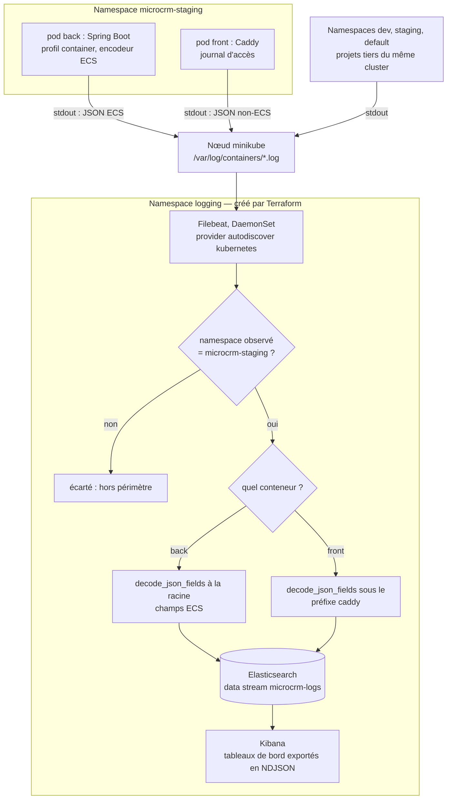

# Rapport de performance — MicroCRM

**Projet** : MicroCRM — P5, Expert DevOps, « Gérez le cycle de vie de développement logiciel »
**Date** : 18 août 2026 · **Périmètre** : chaîne CI/CD, qualité, déploiement Kubernetes, supervision

Ce rapport synthétise ce que le projet a produit, ce qu'il a mesuré, et ce qu'il
n'a pas atteint. Il est destiné à un lecteur qui n'ouvrira pas le dépôt : chaque
affirmation renvoie au document technique qui la porte, et tous les chiffres
cités ont été relevés sur cette installation, jamais estimés.

Le document jumeau, `documentation-infrastructure.md`, décrit l'architecture et
les procédures. Celui-ci décrit les résultats.

## 1. L'essentiel, y compris ce qui fâche

Le projet livre une chaîne complète : deux images Docker construites en
multi-étapes, un pipeline GitLab CI de 9 étapes et 30 jobs, des manifestes
Kubernetes en overlays Kustomize doublés d'un chart Helm, l'infrastructure
décrite en Terraform et le poste provisionné par Ansible, une stack ELK qui
collecte réellement les logs de l'application, et un collecteur d'indicateurs
DORA écrit pour ce projet.

**Cette chaîne n'a jamais abouti en déploiement depuis la CI.** Sur les 44
pipelines de l'histoire du projet, sept déploiements ont été déclenchés et les
sept ont échoué. `deploy-production` et `rollback-production` n'ont **jamais**
été lancés une seule fois. Le dernier pipeline ne s'est pas arrêté sur un test
rouge mais sur `ci_quota_exceeded` : les minutes du Free Tier GitLab sont
épuisées et aucun job ne démarre plus.

**L'application a bien été déployée, mais sur un cluster local et à la main.**
Le 10 août 2026, l'overlay `staging` a été appliqué sur minikube : les deux
Deployments ont atteint `rollout status` en `0`, les sondes ont été observées
sous kubelet, l'Ingress a routé ses deux hôtes, le rollback automatique a été
déclenché sur un échec réel, et un défaut sérieux de la séquence de déploiement
a été trouvé puis corrigé. Le compte rendu est dans `K8S.md` §14.

La distinction entre ces deux phrases est le sujet même de ce rapport, et elle
est développée au §2.3. Elle se résume ainsi : **le mécanisme est éprouvé, le
chemin de livraison automatisé ne l'est pas.** Ce qui manque est le runner, pas
la mécanique — mais tant qu'aucun pipeline ne l'a parcouru, c'est une conviction
argumentée et non une preuve.

### Tableau de bord du projet

| Domaine                        | Résultat mesuré                                                 | Où c'est établi            |
| ------------------------------ | --------------------------------------------------------------- | -------------------------- |
| Pipeline                       | 30 jobs, 9 étapes, toutes images d'outillage figées             | `ARCHITECTURE.md` §4       |
| Tests back                     | 115 tests · **97,40 %** lignes · 100 % branches                 | `back/`, job `test-back`   |
| Tests front                    | 73 tests · **100 %** lignes · 88,6 % branches                   | `front/`, job `test-front` |
| Tests des scripts              | 151 assertions, sans cluster ni registry                        | `SCRIPTS.md`               |
| Validation des manifestes      | 108 assertions, dont l'équivalence Kustomize ↔ Helm             | `SCRIPTS.md`, `HELM.md` §6 |
| Playbook Ansible               | `ok=23 changed=0` sur deux exécutions consécutives              | `ANSIBLE.md` §7            |
| Terraform                      | 3 environnements, `validate` et `plan` en `0`                   | `TERRAFORM.md`             |
| Latence du front               | p50 **0,14 ms** · p95 **1,60 ms** · p99 **3,11 ms** (105 req.)  | `MONITORING.md` §5         |
| Logs collectés                 | 50 documents, dont 36 du conteneur back, **100 %** du namespace | `MONITORING.md`            |
| Disponibilité en déploiement   | **99,75 %** sur 1 615 requêtes, coupure ≤ 0,20 s                | `K8S.md` §14.10            |
| **Déploiements réussis en CI** | **0** sur 7 tentatives                                          | `MONITORING.md` §9         |

## 2. Les indicateurs DORA

### 2.1 Comment ils sont produits

Les quatre indicateurs sont calculés par `scripts/ci/collect_dora.py`, en Python
standard et sans aucune dépendance — le job qui l'exécuterait tourne dans une
image qui n'a pas `pip install`. Les métriques DORA natives de GitLab sont
réservées aux offres payantes ; sur le Free Tier, il faut les calculer soi-même
depuis l'API. Le projet est mesurable **sans jeton**, parce que le dépôt GitHub
se miroite vers un projet GitLab public où le pipeline tourne réellement.

Le collecteur est testé sur des **fixtures**, c'est-à-dire des réponses d'API
enregistrées, et non contre le réseau : un test qui dépend d'un service tiers
échoue les jours où ce service est lent, et on finit par ne plus le croire. Deux
jeux coexistent, et la distinction est délibérée — un jeu réel, enregistré
verbatim (les 44 pipelines et les jobs des 7 pipelines ayant déclenché un
déploiement), et un jeu explicitement nommé `dora-scenario-fabrique`, qui
contient ce que le réel n'offre pas : des déploiements réussis. Sans lui, les
formules du délai et du temps de rétablissement ne seraient empruntées par aucun
test, et on ne vérifierait qu'une chose — la capacité du collecteur à dire
« je n'ai rien ».

### 2.2 Les valeurs, mesurées sur 44 pipelines réels

| Indicateur                     | Valeur           | Observations |
| ------------------------------ | ---------------- | ------------ |
| Fréquence de déploiement       | **0,0** par jour | 0            |
| Délai de mise en production    | **`null`**       | 0            |
| Temps de rétablissement (MTTR) | **`null`**       | 0            |
| Taux d'échec des changements   | **100 %**        | 7            |

**Zéro mesuré et absence de donnée ne sont pas la même chose.** C'est la règle
qui gouverne tout le collecteur, et la seule qui le rende utile plutôt que
décoratif. `deployment_frequency` vaut `0.0` : c'est une mesure — zéro
déploiement a bien eu lieu, sur une fenêtre connue, après sept tentatives. En
revanche `lead_time_for_changes` vaut `null`, accompagné de sa raison : il
n'existe aucune arrivée en production vers laquelle mesurer un délai. Le rendre
en `0` afficherait un délai de mise en production nul, c'est-à-dire **la
performance parfaite**, là où il n'y a simplement jamais eu de mise en
production. Un test de `run_tests.sh` échoue si un indicateur sans donnée se met
à ressortir en `0`.

Deux limites à connaître sur cette collecte : **aucun job de CI ne l'exécute**
— elle se lance à la main, et l'automatiser se heurterait de toute façon au
quota épuisé — et le taux d'échec de 100 % porte sur 7 observations seulement,
ce qui est un effectif trop faible pour parler de tendance. Il décrit un fait,
pas une statistique.

### 2.3 « Ça marche sur un cluster local » n'est pas « ça arrive en production »

C'est la différence que ces quatre chiffres mesurent, et il vaut mieux l'énoncer
que la laisser deviner.

Ce qui a été **prouvé sur un cluster** : les manifestes s'appliquent, les pods
démarrent, les sondes se comportent comme prévu sous un vrai kubelet, l'Ingress
route par hôte, le CORS discrimine, un déploiement vers une image inexistante
déclenche bien le rollback automatique, et un rollback ramène la version
précédente réellement déployée. Tout cela a été observé, commande par commande.

Ce qui n'a **jamais eu lieu** : qu'un commit poussé sur `develop` ou `main`
traverse le pipeline et se retrouve en marche sur un cluster sans intervention
humaine. Entre les deux se trouve tout ce qu'un déploiement local ne peut pas
exercer : un runner GitLab, un registry privé authentifié — le tirage d'image
avec `imagePullSecrets` reste **non testé**, les images ayant été chargées par
`minikube image load` —, des variables protégées, un `KUBE_CONFIG` injecté, et
un enchaînement qui n'est piloté par personne.

La différence n'est donc pas de degré mais de nature. Un mécanisme qui
fonctionne quand un humain le lance dans le bon ordre, sur sa machine, avec son
kubeconfig, ne dit rien de sa capacité à fonctionner sans lui. **Les indicateurs
DORA sont précisément l'instrument qui refuse de confondre les deux**, et c'est
la raison pour laquelle ils sont présentés ici tels quels, sans correctif ni
explication de rattrapage.

## 3. Tests et couverture

### 3.1 Les quatre suites

| Suite                    | Volume             | Couverture                          | Job CI                           |
| ------------------------ | ------------------ | ----------------------------------- | -------------------------------- |
| Back (JUnit, JaCoCo)     | **115 tests**      | **97,40 %** lignes · 100 % branches | `test-back`                      |
| Front (Karma, LCOV)      | **73 tests**       | **100 %** lignes · 88,6 % branches  | `test-front`                     |
| Scripts d'automatisation | **151 assertions** | —                                   | `test-scripts`                   |
| Manifestes et chart      | **108 assertions** | —                                   | `lint-helm` (60 dans `lint-k8s`) |

L'écart entre lignes et branches était le chiffre intéressant du back ; il est
refermé : **100 % des embranchements** sont désormais empruntés, contre 62,5 %
auparavant. Une couverture de lignes élevée ne dit rien des chemins d'erreur, et
c'est là que se logeait le risque. Le seuil dur du pipeline (`COVERAGE_MIN`) est
fixé à **90 %** de lignes, contrôlé par `scripts/ci/check_coverage.py` dans le job
`coverage-gate`, désormais **bloquant** — un contrôle rapide, indépendant de la
disponibilité de Sonar. Les tests de mutation (`MUTATION_MIN`, 80 %) posent la
question que la couverture ne sait pas poser : ces tests vérifient-ils quelque
chose ?

### 3.2 Ce que les tests d'infrastructure vérifient réellement

Deux suites ne testent pas du code applicatif, et ce sont celles qui ont le plus
de valeur ici.

**Les 151 assertions de `run_tests.sh`** exercent les scripts de déploiement
sans cluster ni registry : les vraies commandes `kubectl`, `docker`, `trivy` et
`k6` sont remplacées par de faux programmes qui notent ce qu'on leur demande et
renvoient le code de sortie voulu. On vérifie ainsi qu'un `rollout undo` est
réellement déclenché quand un déploiement échoue, qu'il ne l'est **pas** quand
tout va bien, qu'aucune image n'est poussée si Trivy trouve une CVE critique, et
qu'aucun secret n'apparaît dans les logs.

**Les 108 assertions de `validate_k8s.sh`** portent sur ce que Kustomize et Helm
produisent réellement. La plus importante est la dernière : **le rendu du chart
Helm est comparé objet par objet à celui de l'overlay Kustomize correspondant**,
et l'écart n'est toléré que sur le seul label `app.kubernetes.io/managed-by`.
Deux descriptions de la même application, c'est deux occasions de diverger ;
c'est cette assertion qui rend la divergence visible en revue plutôt qu'au
déploiement.

Les deux suites sont **auto-testées** : l'option `--autotest` rejoue chaque
assertion sur des rendus volontairement abîmés — Deployment renommé, ConfigMap
fantôme, sonde sur un port inconnu, `runAsNonRoot` retiré, image en `latest` —
et vérifie qu'elles échouent bien. Une assertion qui ne se déclenche jamais ne
prouve rien.

### 3.3 Ce que les tests ont trouvé

Trois trouvailles méritent d'être citées, parce qu'elles justifient le coût de
ces suites.

- **`POST /persons` renvoyait un corps vide.** Signalé dès la première exécution
  du test de fumée k6. Ce n'était pas un bug de l'API : Spring Data REST ne
  renvoie la ressource créée que si le client envoie un en-tête `Accept`. Le
  front Angular l'envoie, k6 non. Le scénario a été corrigé pour se comporter
  comme le vrai client — un test qui n'aurait vérifié que le code HTTP aurait
  laissé passer l'écart.
- **`rollback-production` ne pouvait pas fonctionner.** Découvert lors de la
  campagne sur cluster réel : chaque déploiement insérait **deux** révisions —
  un `apply -k` posant l'image _placeholder_, puis `deploy.sh` posant la vraie —
  si bien que la « révision précédente » d'un déploiement sain était toujours le
  placeholder. Le seul geste de secours prévu par le pipeline visait donc une
  image inexistante. Corrigé par un overlay Kustomize éphémère qui pose l'image
  réelle **avant** l'`apply`, et vérifié sur cluster : deux déploiements, deux
  révisions, zéro placeholder, rollback sans argument en `0`.
- **La suppression d'un pod `back` coupe l'API 16,1 secondes.** Non détecté par
  la première campagne, qui décrivait l'état avant et après sans mesurer
  l'intervalle. Voir §5.3.

## 4. Qualité et sécurité du code

Six outils sont branchés sur le cycle de vie, chacun voyant ce que les autres ne
voient pas : un test unitaire ne détecte pas une CVE, un scan de CVE ne détecte
pas une mauvaise pratique de code, et aucun des deux ne dit si l'application
tient la charge.

| Outil                                              | Question à laquelle il répond                        | Étape      | Bloquant ?      |
| -------------------------------------------------- | ---------------------------------------------------- | ---------- | --------------- |
| Checkstyle, Spotless, ESLint, Prettier, ShellCheck | La forme est-elle tenue ?                            | `lint`     | oui             |
| SonarQube                                          | Bonnes pratiques, dette, couverture agrégée          | `quality`  | non             |
| SpotBugs + Find-Sec-Bugs                           | Bugs latents dans le bytecode (~140 motifs sécurité) | `quality`  | non             |
| OWASP Dependency-Check                             | CVE des dépendances Java (base NVD)                  | `security` | **oui**         |
| Trivy                                              | CVE d'images, secrets, misconfigurations             | `security` | non             |
| k6                                                 | L'API répond-elle, et assez vite ?                   | `perf`     | **oui** (smoke) |

⚠️ **Une partie de ces contrôles n'est pas bloquante.** Six jobs de qualité et de
sécurité restent en `allow_failure: true`, et les scans Trivy tournent en
`--exit-code 0` : ils informent sans arrêter le pipeline. C'est un choix
de démarrage assumé, à lever contrôle par contrôle une fois le processus de
traitement des vulnérabilités rodé — pas un état à présenter comme final. La
seule exception est `k6-smoke`, bloquant parce qu'il ne mesure pas une tendance
mais un fait binaire : l'image qu'on s'apprête à déployer répond, ou elle ne
répond pas.

Deux constats connus et non corrigés : Find-Sec-Bugs remonte `PERMISSIVE_CORS`
dans `SpringDataRestCustomization.java`, et **aucun job ne lance `npm audit`** —
les dépendances du front ne sont couvertes que par `trivy-fs`, qui lit le
`package-lock.json`. C'est une piste identifiée, pas un contrôle en place.

Le script `build_and_push.sh` sait pourtant refuser de pousser une image
porteuse d'une CVE critique (option `--scan`, code de sortie 2) : rendre ce
contrôle bloquant ne demande qu'à activer l'option dans les jobs `package-*`.

## 5. Performance mesurée

### 5.1 Le budget de performance et les scénarios k6

Trois scénarios, écrits en JavaScript et versionnés à côté du reste, s'exécutent
**après** l'étape `package` : GitLab démarre l'image Docker qui vient d'être
construite comme un service, et k6 l'interroge. On mesure donc l'artefact qui
partirait réellement en production, pas une compilation locale.

| Scénario    | Charge                                      | Rôle                        | Bloquant            |
| ----------- | ------------------------------------------- | --------------------------- | ------------------- |
| `smoke.js`  | 1 utilisateur, 5 parcours complets          | « est-ce que ça marche ? »  | **oui**             |
| `load.js`   | 10 utilisateurs en lecture + 2 écritures/s  | garde-fou des temps réponse | non                 |
| `stress.js` | paliers jusqu'à 50 utilisateurs, sans pause | trouver le point de rupture | déclenché à la main |

| Seuil                             | Valeur par défaut |
| --------------------------------- | ----------------- |
| p95 des lectures                  | 500 ms            |
| p95 des écritures                 | 800 ms            |
| Taux de requêtes en erreur        | < 1 %             |
| p95 du smoke (application froide) | 1 500 ms          |

Deux choix structurent ces seuils. **Des percentiles et pas des moyennes** :
une moyenne correcte peut très bien cacher 5 % d'utilisateurs qui attendent
trois secondes. Et **un seuil par endpoint** plutôt qu'un seuil global, ce qui
permet de dire « c'est la recherche par email qui décroche » au lieu de « c'est
lent ». Chaque réponse est en outre vérifiée fonctionnellement, statut _et_
contenu : un serveur qui renvoie 500 en 3 ms est très rapide et totalement
cassé.

Les seuils vivent dans le dépôt et **ne sont pas exposés en variables GitLab** :
un garde-fou dont on desserre le seuil depuis une interface pour faire passer un
pipeline rouge n'est plus un garde-fou. Les variables CI règlent la charge, pas
le budget.

`k6-load` n'est pas bloquant parce que les runners GitLab partagés sont
mutualisés : leurs mesures varient d'une exécution à l'autre, et un seuil dur y
produirait des échecs aléatoires sans rapport avec le code — le meilleur moyen
de faire perdre confiance dans un contrôle.

⚠️ **Ces mesures dépendent de la machine.** Elles servent à détecter une
régression entre deux exécutions comparables, pas à annoncer une capacité
absolue. La base étant une HSQLDB en mémoire, plus rapide qu'une base réseau,
les chiffres sont optimistes en valeur absolue. Le front n'est pas testé en
charge : seul le back l'est, parce que c'est lui qui porte le risque de
saturation.

### 5.2 La latence réellement observée

Il n'existait au départ **aucune donnée de latence dans toute la chaîne**. Les
logs applicatifs du back portent ce que l'application raconte, pas le temps
qu'elle met ; et le Caddyfile n'avait aucune directive `log`. Un écran
« latence » construit là-dessus aurait été décoratif. Le journal d'accès de
Caddy a donc été activé — c'est la seule source qui voit passer le trafic, et
elle porte les trois mesures d'un coup.

| Percentile | Latence mesurée (105 requêtes) |
| ---------- | ------------------------------ |
| p50        | **0,14 ms**                    |
| p95        | **1,60 ms**                    |
| p99        | **3,11 ms**                    |

⚠️ **C'est la latence vue par le serveur web, pas par l'API.** Caddy sert le
bundle Angular et `/config.json` ; les appels à l'API partent du navigateur vers
un hôte distinct et ne passent pas par lui. Mesurer la latence de l'API
demanderait de l'instrumenter elle-même — c'est le domaine des métriques, pas
des logs, et ces métriques n'existent pas dans ce projet (§6.3).

⚠️ **Le front ne produira quasiment jamais de 4xx**, parce que toute route
inconnue renvoie `200` avec `index.html`, à charge pour le routeur Angular de
décider. Vérifié : 12 requêtes vers des chemins inexistants, 12 réponses `200`.
Les erreurs réelles se lisent côté back, dans `log.level`.

### 5.3 Comportement sous déploiement et sous panne

Deux campagnes sur cluster ont mesuré ce qu'un utilisateur subit pendant les
opérations, en interrogeant l'API en continu à travers l'Ingress.

| Situation                                        | Mesure                                                            |
| ------------------------------------------------ | ----------------------------------------------------------------- |
| Rollout initial du back                          | `rollout status` en `0`, ~10,5 s                                  |
| Déploiement + rollback (180 s d'observation)     | **1 615 requêtes**, 1 611 en `200` — **99,75 %**                  |
| Fenêtre d'indisponibilité pendant un déploiement | **≤ 0,20 s**, un seul échantillon en erreur                       |
| **Suppression du pod `back`**                    | **16,1 s d'indisponibilité totale** (98 × `503` sur 350 requêtes) |
| Démarrage applicatif du back                     | 6,7 s à 9,8 s selon l'exécution (±45 %)                           |
| Délai jusqu'à `Ready`                            | 10 s à 15 s ; 2 tentatives de `startupProbe` sur 30               |

Ces chiffres disent deux choses distinctes, qu'il ne faut pas confondre.

**Un déploiement ne coupe pas.** Le réglage `maxUnavailable: 0` impose que le
nouveau pod soit prêt avant que l'ancien ne parte ; un déploiement vers une
image inexistante n'a jamais touché le pod en service (`RESTARTS 0`, âge
inchangé, API à `200` pendant toute la fenêtre). Le correctif de l'overlay
éphémère n'a d'ailleurs **rien amélioré sur la disponibilité** — l'ancien
mécanisme ne coupait pas non plus — il a corrigé la justesse de l'historique des
révisions, donc la fiabilité du rollback.

**Une perte de pod coupe seize secondes.** C'est la conséquence directe du
`replicas: 1` imposé par une base en mémoire : à un seul pod, il n'y a rien pour
absorber la perte, et aucun `PodDisruptionBudget` ne protège d'une éviction. Le
front, statique et à deux replicas en production, n'a pas été affecté. La levée
de cette limite passe par la sortie de HSQLDB, pas par un réglage.

La variance du démarrage (6,7 s à 9,8 s sur une machine identique et non
chargée) renforce le choix d'un `startupProbe` plutôt que d'un
`initialDelaySeconds` fixe : si le délai bouge de moitié sans qu'aucune variable
ne change, un délai figé serait le mauvais outil. Le budget actuel — 150 s — est
très surdimensionné (2 tentatives consommées sur 30) ; son vrai prix est
l'autre bout, une JVM réellement bloquée occupant un slot 150 s avant d'être
abandonnée.

## 6. Supervision

### 6.1 Le flux des logs

<!-- schema: flux-logs -->

_Source versionnée : `docs/schemas/flux-logs.mmd`, reprise dans
`ARCHITECTURE.md` §8.3._

Le chemin lui-même est banal — un pod écrit sur `stdout`, le runtime en fait un
fichier sur le nœud, un agent le lit. **Les deux losanges sont l'intérêt du
schéma**, parce qu'ils portent les deux décisions sans lesquelles la chaîne ne
tient pas.

**Le premier filtre est une question de périmètre, pas de volume.** Ce cluster
n'est pas dédié à MicroCRM : il héberge les namespaces `dev` et `staging`
d'autres projets, et quatre pods dans `default`. Un Filebeat non filtré y
ingérerait les logs de tiers. Le filtre est posé deux fois — sur ce que
l'autodiscover _observe_, et en condition sur ce qu'il _traite_ — pour que
l'élargissement de l'un ne fasse pas tomber l'autre.

**Le second embranchement évite une panne irréversible.** Le back produit de
l'ECS, décodé à la racine ; le front produit lui aussi du JSON, mais non-ECS,
dont les champs portent les mêmes noms sans avoir la même forme. Un décodage
uniforme faisait rejeter ses documents, et une collision de mapping ne se répare
pas : une fois le champ typé dans l'index, aucun document contradictoire n'y
entrera plus.

### 6.2 Ce qui a été vérifié

| Vérification                              | Résultat                                                              |
| ----------------------------------------- | --------------------------------------------------------------------- |
| Rollout Elasticsearch / Kibana / Filebeat | les trois `Running`                                                   |
| Documents indexés                         | **50**, dont **36 du conteneur `back`**                               |
| Provenance                                | **100 % `microcrm-staging`** — aucun projet voisin collecté           |
| Champs ECS décodés                        | `log.level`, `log.logger`, `service.name`, `process.thread.name`      |
| Métadonnées Kubernetes                    | `kubernetes.pod.name`, `kubernetes.namespace`, `container.image.name` |
| Réimportation des tableaux de bord        | `successCount: 8`, sur une instance vidée au préalable                |

Six panneaux composent le tableau de bord : volume par conteneur, latence
p50/p95/p99, erreurs applicatives, erreurs HTTP, répartition des statuts, table
des logs récents. **Le livrable n'est pas « des écrans dans Kibana », c'est un
fichier** : les huit objets sauvegardés sont exportés en NDJSON et versionnés
dans le dépôt, vue de données comprise. Un tableau de bord qui n'existe que dans
une instance disparaît avec elle — et celle-ci tourne sur un poste de
développement. Chaque panneau a été confronté à la même agrégation jouée
directement contre Elasticsearch : mêmes chiffres des deux côtés.

Le dimensionnement de la stack a été confronté à une charge réelle, ce qui n'est
pas la même chose qu'un plan validé. Pendant le rollout de Kibana, le quota du
namespace affichait `limits.memory 5376Mi/6Gi`, `requests.memory 3200Mi/4Gi`,
`pods 4/12` — **exactement les valeurs calculées dans le `terraform.tfvars`, au
mégaoctet près**. La règle qui les gouverne mérite d'être retenue : la limite
mémoire vaut le double du tas, parce qu'un conteneur JVM dont la limite égale le
tas est tué par l'OOM killer au premier pic hors-tas. C'est la cause la plus
banale d'une stack ELK qui « ne démarre pas » sans message utile.

### 6.3 Ce que la supervision ne fait pas

| Volet                                     | État                                                                   |
| ----------------------------------------- | ---------------------------------------------------------------------- |
| Sondes de santé (Actuator)                | fait, vérifiées sous kubelet                                           |
| Centralisation des logs                   | fait                                                                   |
| Tableaux de bord versionnés               | fait                                                                   |
| **Métriques (CPU, mémoire, latence API)** | **absent** — ni Prometheus ni `metrics-server`                         |
| **Alerting**                              | **absent** — la supervision se consulte, elle ne réveille personne     |
| **Rétention des logs**                    | **absente** — sans ILM, les données s'accumulent jusqu'au PVC de 5 Gio |
| **Sécurité d'Elasticsearch**              | **désactivée** (`xpack.security.enabled: false`)                       |
| Exposition de Kibana                      | aucun Ingress ; accès par `port-forward` uniquement                    |
| Automatisation                            | aucun job de CI ne déploie ni ne teste cette stack                     |

L'absence de métriques a une conséquence directe qu'il faut nommer : **il manque
jusqu'au signal sur lequel un autoscaler déciderait**, et les valeurs de
`resources` des manifestes restent des estimations — `kubectl top` répond
`Metrics API not available`. Aucun `OOMKill` n'a été observé, ce qui est un
indice, pas une mesure.

La sécurité désactivée d'Elasticsearch est assumée pour une stack locale de
démonstration ; elle serait inacceptable ailleurs, et c'est la première chose à
reprendre si cette stack devait sortir du poste. C'est aussi pourquoi il n'y a
pas d'Ingress : exposer une console d'administration sans authentification
serait cohérent avec le point précédent, c'est-à-dire une mauvaise idée.

## 7. Les gains obtenus

Chaque ligne ci-dessous est un état antérieur réel du dépôt, corrigé et
vérifié — pas une amélioration théorique.

| Sujet                          | Avant                                                      | Après                                                                               |
| ------------------------------ | ---------------------------------------------------------- | ----------------------------------------------------------------------------------- |
| Contexte de build du front     | **1 195 Mo** envoyés au démon Docker                       | **0,6 Mo** (`.dockerignore` par application)                                        |
| Contexte de build du back      | 51 Mo                                                      | **0,1 Mo**                                                                          |
| Images d'outillage du pipeline | 9 images flottantes ou en `latest`                         | toutes figées, déclarées une seule fois                                             |
| Chaîne de compilation du back  | trois JDK pour un même artefact (17 / 21 / 21)             | une seule version, alignée Dockerfile ↔ pipeline                                    |
| URL de l'API du front          | compilée dans le bundle → `localhost:8080` en prod         | lue au démarrage depuis `/config.json` — **une image pour tous les environnements** |
| Utilisateur des conteneurs     | le front tournait en `root`                                | UID 1000 des deux côtés, aligné sur les manifestes                                  |
| Port déclaré par le back       | `EXPOSE 4200` pour une application sur `8080`              | corrigé                                                                             |
| Création d'un environnement    | `kubectl create namespace` tapé par quelqu'un              | décrit en Terraform, avec quota, limites et policies                                |
| Prérequis du poste             | deux phrases dans deux documents                           | playbook Ansible idempotent (`ok=23 changed=0`)                                     |
| Capacité de retour arrière     | `rollback-production` ramenait un _placeholder_ inexistant | ramène la version précédente réellement déployée, vérifié sur cluster               |
| Lecture des logs               | `kubectl logs`, un pod à la fois, sans historique          | data stream Elasticsearch + 6 panneaux Kibana versionnés                            |
| Mesure de la livraison         | aucune                                                     | 4 indicateurs DORA calculés sur 44 pipelines                                        |

Deux de ces gains valent plus que les autres, parce qu'ils changent une propriété
et pas seulement un chiffre.

**« Construire une fois, déployer partout » est devenu vrai.** Tant que l'URL de
l'API était compilée dans le bundle, il fallait une image par environnement :
l'image testée n'était pas celle déployée. Aujourd'hui Caddy fabrique un
`/config.json` à partir de son environnement et le bundle le lit avant de
démarrer. La même image, construite et scannée une fois, passe de staging à
production sans être reconstruite.

**La capacité de retour arrière est passée de nulle à réelle.** Avant
correction, `kubectl get deploy` affichait `READY 1/1 UP-TO-DATE 1 AVAILABLE 1`
pendant que le Deployment pointait sur une image inexistante — une supervision
branchée sur ce résumé n'aurait levé aucune alerte. C'est le genre de défaut
qu'aucune relecture de YAML ne trouve, et que seule une campagne sur cluster
révèle.

## 8. Ce qui manque, sans détour

Cette liste est donnée sans enrobage : elle est ce qu'un jury est en droit
d'attaquer, et il vaut mieux qu'elle vienne du rapport que de la lecture.

- **Aucune capture d'écran de la chaîne de livraison.** Le brief en demande
  explicitement. Il n'y en a pas, pour une raison simple : **il n'existe aucune
  exécution réussie à montrer.** Sept déploiements déclenchés, sept échecs, et
  un quota de minutes désormais épuisé qui empêche d'en tenter un huitième.
- **Aucune métrique système.** Ni CPU, ni mémoire, ni latence d'API. Le projet
  collecte des logs, pas des métriques.
- **Aucun alerting.** Rien ne prévient personne.
- **Aucune rétention des logs.** Pas d'ILM ; les seuils disque d'Elasticsearch
  (85 / 90 / 95 %) mettront l'index en lecture seule bien avant que le volume de
  5 Gio ne soit plein.
- **Sécurité d'Elasticsearch désactivée**, et Kibana accessible sans
  authentification derrière un simple `port-forward`.
- **La restauration complète d'un environnement est documentée, jamais jouée.**
  La procédure commence par un `kubectl delete namespace` ; chacune de ses
  étapes a été exécutée séparément, mais l'enchaînement complet à partir d'une
  destruction réelle reste à faire. Tant qu'il ne l'a pas été, la reconstruction
  est une conviction raisonnable, pas une preuve.
- **Le tirage d'image depuis un registry privé n'est pas testé.** Les images ont
  été chargées par `minikube image load` ; le chemin `imagePullSecrets` n'a
  jamais été exercé face à un registry authentifié.
- **Les `NetworkPolicy` sont décrites, pas prouvées.** Le CNI par défaut de
  minikube ne les implémente pas et les ignore sans rien signaler : l'API les
  accepte, `kubectl get networkpolicy` les affiche, et aucun paquet n'est
  filtré.
- **Le chart Helm n'a jamais déployé.** Il est rendu, linté, comparé au rendu
  Kustomize et accepté en `--dry-run=server`. Rien de plus.
- **La production n'existe pas.** L'environnement `production` vise le même
  minikube dans un autre namespace ; il démontre qu'un second environnement se
  décrit par les mêmes modules et d'autres valeurs, pas qu'une production
  existe.

## 9. Pistes d'amélioration

Classées par ce qu'elles débloquent, et non par leur difficulté.

### 9.1 Ce qui débloque la mesure elle-même

| Piste                                                              | Effort | Ce que ça change                                                                                                             |
| ------------------------------------------------------------------ | ------ | ---------------------------------------------------------------------------------------------------------------------------- |
| Un runner disponible (Free Tier renouvelé, ou runner auto-hébergé) | S      | **Prérequis de tout le reste** : sans minutes, aucun job ne démarre.                                                         |
| Un premier `deploy-staging` mené à son terme                       | M      | Fait passer la fréquence de déploiement de `0,0` à une valeur, et donne au délai de mise en production une donnée à mesurer. |
| Un job exécutant `collect_dora.py`                                 | S      | Les indicateurs cessent d'être un geste manuel.                                                                              |
| `metrics-server`, puis Prometheus + Micrometer                     | M      | Donne CPU, mémoire et latence d'API — et donc de quoi vérifier les `resources`, aujourd'hui estimées.                        |

### 9.2 Ce qui rend les contrôles réellement bloquants

| Piste                                                  | Effort | Ce que ça change                                                                                                        |
| ------------------------------------------------------ | ------ | ----------------------------------------------------------------------------------------------------------------------- |
| Retirer `allow_failure` contrôle par contrôle          | S      | Les sept jobs de qualité cessent d'informer pour arbitrer.                                                              |
| Activer `--scan` dans `package-back` / `package-front` | S      | Une image porteuse d'une CVE critique n'est plus poussée ; le code existe déjà.                                         |
| Ajouter `npm audit` au stage `security`                | S      | Comble le seul angle mort de dépendances du projet.                                                                     |
| `kubeconform` dans `lint-k8s`                          | S      | Valide les manifestes contre le schéma de l'API, hors ligne — ce que `--dry-run=client` ne peut pas faire sans cluster. |
| Un runner dédié pour `k6-load`                         | M      | Rend le seuil de charge défendable, donc bloquant.                                                                      |

### 9.3 Ce qui lève les limites structurelles

| Piste                                            | Effort | Ce que ça change                                                                                                              |
| ------------------------------------------------ | ------ | ----------------------------------------------------------------------------------------------------------------------------- |
| Remplacer HSQLDB par PostgreSQL persistant       | M      | Lève **deux** limites d'un coup : le plafond à 1 replica et les 16 s de coupure sur perte de pod. Impose Flyway ou Liquibase. |
| Alerting sur les erreurs applicatives            | S      | La supervision cesse d'être purement consultative.                                                                            |
| ILM sur le data stream                           | S      | Borne la croissance de l'index.                                                                                               |
| Activer la sécurité d'Elasticsearch              | M      | Condition pour que la stack sorte d'un poste de développement.                                                                |
| Jouer la reconstruction complète d'environnement | S      | Transforme une procédure écrite en résultat vérifié.                                                                          |
| `jlink` sur l'image du back                      | M      | 377 Mo → ~150 Mo, en ne gardant que les modules réellement utilisés.                                                          |
| Un CNI qui implémente les NetworkPolicy          | S      | Le cloisonnement cesse d'être décrit pour devenir effectif.                                                                   |

## 10. Où retrouver les preuves

Ce rapport ne remplace pas les documents techniques du dépôt : il les résume.
Chaque chiffre cité y est accompagné de la commande qui l'a produit et de la
sortie observée.

| Document                                | Ce qu'il porte                                                           |
| --------------------------------------- | ------------------------------------------------------------------------ |
| `MONITORING.md`                         | La stack ELK, les tableaux de bord, et les indicateurs DORA (§9)         |
| `K8S.md` §14                            | Les deux campagnes de déploiement réel, commandes et sorties             |
| `QUALITY.md`                            | Les six outils, leurs seuils, et ce qu'ils ont trouvé                    |
| `SCRIPTS.md`                            | Les scripts, leurs codes de sortie, et comment ils sont testés           |
| `TERRAFORM.md`, `ANSIBLE.md`, `HELM.md` | L'infrastructure, ses frontières et ses limites assumées                 |
| `ARCHITECTURE.md` §9 à §11              | Pourquoi l'option locale, sa transposition au cloud, et ses angles morts |
| `RELEASE.md` §9                         | Sauvegarde, restauration, et reconstruction depuis le dépôt              |
| `documentation-infrastructure.md`       | Le document jumeau : architecture et procédures                          |
