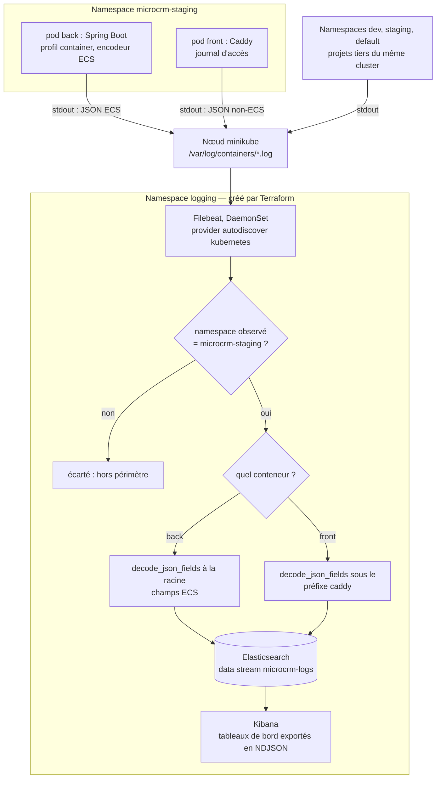

# Rapport de performance — MicroCRM

| Fiche du document | Valeur                                                                                                          |
| ----------------- | --------------------------------------------------------------------------------------------------------------- |
| Projet            | MicroCRM (Orion) — P5, Expert DevOps, « Gérez le cycle de vie de développement logiciel »                       |
| Première version  | 18 août 2026                                                                                                    |
| Mise à jour       | 5 octobre 2026                                                                                                  |
| Périmètre         | chaîne CI/CD, qualité et sécurité du code, déploiement Kubernetes, supervision (logs, traces, alertes), release |
| Destinataires     | le CTO d'Orion, les équipes de développement et d'exploitation, le jury                                         |

Ce rapport synthétise ce que le projet a produit, ce qu'il a mesuré, et ce qu'il
n'a pas atteint. Il est destiné à un lecteur qui n'ouvrira pas le dépôt : chaque
affirmation renvoie au document technique qui la porte, et tous les chiffres
cités ont été relevés sur cette installation, jamais estimés.

Le document jumeau, `documentation-infrastructure.md`, décrit l'architecture et
les procédures. Celui-ci décrit les résultats.

La mise à jour du 5 octobre 2026 décrit l'état **après livraison** : le travail
du 2 octobre a été fusionné le 3 (PR #31 à #35), le pipeline de `develop` est
repassé au vert, la version **1.0.1 a été publiée et mise en production** le 5,
et les traces OpenTelemetry arrivent désormais des pods de staging et de
production. Tous les numéros de pipeline cités se vérifient sur le projet GitLab
public ; les chiffres ont été relevés le 5 octobre par son API, sur le cluster
et dans les artefacts des jobs.

## Synthèse pour décideur

Cette page se lit seule. Les sigles sont expliqués au §10.

### Ce qui a été fait

Orion disposait d'une application, MicroCRM, sans chaîne de livraison. Le projet
lui en donne une : à chaque modification du code, un **pipeline** (une suite de
contrôles automatiques) teste l'application, cherche les failles de sécurité
connues, fabrique les **images** (les paquets prêts à déployer), puis les
installe sur un environnement de recette (« staging ») et un environnement de
production. Une **supervision** rassemble les journaux et les temps de réponse
de l'application dans des tableaux de bord et déclenche des **alertes**. Le 5
octobre, la première version numérotée, **MicroCRM 1.0.1**, a parcouru toute la
chaîne jusqu'à la production.

### Ce que ça change pour Orion

- **Une mise en production n'est plus un geste d'expert.** Elle se déclenche
  d'un clic, et le retour à la version précédente aussi. Les deux ont été joués
  pour de bon le 23 septembre ; la version 1.0.1 a été publiée par ce chemin le
  5 octobre.
- **Ce qui part en production est exactement ce qui a été testé.** La version
  1.0.1 n'a pas été reconstruite pour la release : ses images ont la même
  empreinte que celles que le pipeline avait testées et scannées.
- **Une faille connue arrête la livraison avant la mise en ligne**, et non
  après. C'est ce qui s'est produit deux fois le 1ᵉʳ octobre ; les images en
  service aujourd'hui sont passées par cette porte sans aucune faille haute ou
  critique.
- **On sait ce que la livraison vaut.** Quatre indicateurs reconnus (DORA)
  mesurent sa cadence et sa fiabilité, sans rien embellir — y compris quand
  l'échec vient de la machine et non du code.
- **Un incident se voit.** Huit règles d'alerte couvrent la disponibilité, la
  performance et la sécurité ; chacune a été déclenchée volontairement pour
  prouver qu'elle fonctionne.

### Les cinq chiffres qui comptent

| Chiffre                                               | Ce qu'il veut dire                                                                                                                                                                                                  |
| ----------------------------------------------------- | ------------------------------------------------------------------------------------------------------------------------------------------------------------------------------------------------------------------- |
| **8 déploiements réussis sur 15 tentatives**          | Sur 30 jours. Neuf tentatives sur quinze (60 %) comptent comme des échecs. Trois d'entre elles, le 5 octobre, sont tombées sur un cluster arrêté : c'est la machine qui a lâché, pas le code — mais elles comptent. |
| **4,76 h** entre une modification et sa mise en ligne | Valeur médiane sur 8 livraisons. Elle contient l'attente du clic humain, et pour l'une d'elles un week-end entier.                                                                                                  |
| **0 faille critique ou haute**                        | Sur les images en service (version 1.0.1), relevé par le scan du pipeline avant leur publication. Les 5 failles hautes de l'ancienne image sont corrigées et en production.                                         |
| **8 alertes sur 8 déclenchées puis rétablies**        | Essai du 2 octobre. Les alertes s'affichent dans l'outil de supervision ; elles n'envoient encore ni courriel ni message.                                                                                           |
| **16,1 secondes de coupure**                          | Durée d'indisponibilité si le serveur applicatif tombe. Un déploiement, lui, ne coupe pas le service (99,75 % de requêtes servies pendant un déploiement suivi d'un retour arrière).                                |

### Les risques qui restent

1. **La plateforme est le maillon faible, pas le code.** Du 2 au 5 octobre, le
   moteur Docker du poste a décroché quatre fois, laissant le cluster à moitié
   arrêté. Résultat : un runner figé qui a retenu la livraison près d'une
   heure, deux contrôles d'infrastructure en échec, et trois mises en
   production refusées le 5 octobre. Chaque fois, la relance a suffi ; chaque
   fois, il a fallu quelqu'un pour la faire.
2. **La « production » est une démonstration.** Les deux environnements tournent
   sur un même ordinateur de développement, qui partage 8 Go de mémoire avec
   d'autres projets. Il n'existe pas de production réelle.
3. **Une panne du serveur applicatif coupe le service 16 secondes et efface les
   données**, parce que la base de données vit en mémoire.
4. **Personne n'est prévenu d'une alerte s'il ne regarde pas l'écran**, et les
   journaux de la production ne sont pas collectés (ses temps de réponse, eux,
   le sont depuis le 5 octobre).
5. **Douze failles du socle Spring sont acceptées sous condition, jusqu'au 31
   décembre 2026.** Leur correctif gratuit n'existe que dans la version majeure
   suivante du socle.

### Les décisions attendues

| Décision                                                                    | Pourquoi maintenant                                                                                              | Détail |
| --------------------------------------------------------------------------- | ---------------------------------------------------------------------------------------------------------------- | ------ |
| Doter la chaîne d'un cluster et d'un runner qui ne dépendent pas d'un poste | Trois des neuf échecs comptés sur le mois viennent d'un cluster arrêté ; la chaîne n'est pas plus fiable que lui | §7.3   |
| Planifier la migration vers Spring Boot 4 avant le 31 décembre 2026         | À cette date, les exceptions de sécurité expirent et la livraison se bloque                                      | §4.4   |
| Remplacer la base en mémoire par PostgreSQL                                 | Supprime la coupure de 16 secondes et la perte de données                                                        | §7.4   |
| Choisir un canal d'alerte (messagerie, astreinte)                           | Une alerte que personne ne reçoit ne protège pas                                                                 | §6.5   |
| Financer un véritable environnement de production                           | Tout ce qui est mesuré ici l'est sur un poste de développement                                                   | §8     |

## 1. L'essentiel, y compris ce qui fâche

Le projet livre une chaîne complète. Deux images Docker construites en
multi-étapes. Un pipeline GitLab CI de 10 étapes et 39 jobs. Des manifestes
Kubernetes en overlays Kustomize, doublés d'un chart Helm. L'infrastructure
décrite en Terraform et le poste provisionné par Ansible. Une stack ELK qui
collecte réellement les logs de l'application, cinq tableaux de bord et huit
règles d'alerte versionnés. Et deux collecteurs écrits pour ce projet : l'un
pour les indicateurs DORA, l'autre pour les constats de sécurité.

**Cette chaîne a abouti pour la première fois le 22 septembre 2026, après sept
échecs.** Jusque-là, aucun déploiement n'était parti de la CI, et le dernier
pipeline ne s'était pas arrêté sur un test rouge mais sur `ci_quota_exceeded`.
Le déblocage tient à un **runner auto-hébergé**, qui ne consomme plus une minute
du Free Tier. Il tient aussi à trois correctifs que rien n'avait révélés
jusque-là, faute de job allant assez loin : un kubeconfig désignant `127.0.0.1`
depuis un conteneur, un RBAC d'agent qui ne couvrait pas les objets applicatifs,
et une variable de namespace absente qui faisait déployer dans `default` en
silence.

**Sur les trente derniers jours, huit déploiements ont abouti sur quinze
tentatives.** Staging et production sont posés par la CI avec des images du
registry GitLab, et un rollback de production a été joué pour de bon, puis suivi
d'un redéploiement. Le taux d'échec des changements est de **60 %** : le chemin
automatisé existe, il n'est pas encore fiable, et trois journées d'observations
— les 22 et 23 septembre, le 5 octobre — ne font pas une cadence de livraison.

**Du 23 septembre au 5 octobre, plus rien n'a été déployé.** Le pipeline de
`develop` a échoué trois fois de suite (29 septembre, deux fois le 1ᵉʳ octobre),
pour trois causes relevées job par job dans l'API GitLab : aucun runner
disponible ; `trivy-fs` et `terraform-plan` ; puis `package-back`, dont le scan
d'image a trouvé cinq CVE hautes de Jackson. Pour les scans, ce n'était pas une
panne de la chaîne, c'était la chaîne qui faisait son travail. Le 2 octobre a
servi à corriger : le scan des dépendances Java, qui n'analysait aucun jar, en
lit maintenant 82 ; le scan d'image est fait avant le push ; les règles
d'alerte, deux tableaux de bord, le job de release et la version 1.0.1 ont été
écrits.

**Le 3 et le 5 octobre, ce travail a été livré.** Fusionné dans `develop` le 3
(PR #31 à #35), il a donné le pipeline `#2909284076`, **vert sur tous ses jobs
automatiques** — dont `dependency-check-back`, `trivy-fs`, `test-front`,
`terraform-plan`, les deux `package-*`, le pipeline enfant de performance et
`dora-metrics`, qui tournaient là pour la première fois dans cet état. Le 5,
staging a été déployé (`5296658a`), `develop` fusionné dans `main` (PR #36,
commit `08a216b0`), la production déployée, puis le tag `v1.0.1` posé : son
pipeline `#2913490784` a promu les images sans les reconstruire, créé la Release
GitLab, et la production tourne en **1.0.1** depuis 14 h 10 UTC. Le déroulé
complet, incidents compris, est au §7.3.

**Le chemin n'a pas été lisse, et ce n'est pas le code qui a coincé.** Le
pipeline de `develop`, créé à 14 h 00 UTC le 3 octobre, n'a démarré qu'à
14 h 58. L'unique runner (`concurrent = 1`) traitait d'abord les pipelines des
quatre branches de travail. Après un redémarrage de Docker, il ne prenait plus
de travail : l'un de leurs jobs est resté bloqué 36 minutes, jusqu'à sa
relance.
`terraform-plan` a échoué deux fois sur un cluster figé. Le 5 octobre, trois
`deploy-production` ont échoué sur un cluster arrêté. Dans les quatre cas, la
cause était la même : Docker Desktop, qui porte le runner et minikube, avait
décroché ou redémarré. Le collecteur DORA compte ces trois échecs de déploiement
comme des échecs de changement ; ils le sont au sens de la définition, et ils
disent surtout qu'**une chaîne de livraison n'est pas plus fiable que la machine
qui l'exécute**.

**L'application avait d'abord été déployée à la main, sur un cluster local.** Le
10 août 2026, l'overlay `staging` a été appliqué sur minikube. Les deux
Deployments ont atteint `rollout status` en `0`, les sondes ont été observées
sous kubelet, l'Ingress a routé ses deux hôtes, le rollback automatique a été
déclenché sur un échec réel. Un défaut sérieux de la séquence de déploiement a
été trouvé puis corrigé. Le compte rendu est dans `K8S.md` §14.

La distinction entre ces deux manières de déployer reste le sujet du §2.4, mais
elle a changé de nature. Ce qui était une conviction argumentée — « ce qui
manque est le runner, pas la mécanique » — s'est vérifié le jour où le runner
est arrivé : le mécanisme n'a pas eu à être réécrit, seuls son accès au cluster
et ses droits l'ont été. Ce que la campagne manuelle porte encore seule, c'est
le **détail du comportement en exploitation** — rollback sur image
volontairement cassée, sondes sous kubelet, perte d'un pod — qu'aucun
déploiement de CI ne réexerce.

### Tableau de bord du projet

| Domaine                        | Résultat mesuré                                                   | Où c'est établi              |
| ------------------------------ | ----------------------------------------------------------------- | ---------------------------- |
| Pipeline                       | 39 jobs, 10 étapes, toutes images d'outillage figées              | `ARCHITECTURE.md` §4         |
| Tests back                     | 115 tests · **97,40 %** lignes · 100 % branches                   | `back/`, job `test-back`     |
| Tests front                    | 112 tests · **100 %** lignes · 90,24 % branches                   | `front/`, job `test-front`   |
| Tests des scripts              | 430 assertions, sans cluster ni registry                          | `SCRIPTS.md`                 |
| Validation des manifestes      | 151 assertions, dont l'équivalence Kustomize ↔ Helm               | `SCRIPTS.md`, `HELM.md` §6   |
| Playbook Ansible               | `ok=23 changed=0` sur deux exécutions consécutives                | `ANSIBLE.md` §7              |
| Terraform                      | 3 environnements, `validate` et `plan` en `0`                     | `TERRAFORM.md`               |
| Latence du front               | p50 **0,14 ms** · p95 **1,60 ms** · p99 **3,11 ms** (105 req.)    | `MONITORING.md` §5           |
| Latence de l'API               | p95 de **3,41 à 5,65 ms** selon la route — conteneur local (§5.3) | `MONITORING.md` §10.4        |
| Traces de l'API en service     | staging et production, depuis le 5 octobre                        | `MONITORING.md` §10          |
| Logs collectés                 | 92 175 documents au 2 octobre, **100 %** du namespace de staging  | `k8s/elk/alerting/README.md` |
| Alertes                        | **8 règles**, 3 familles, 8 déclenchées puis rétablies            | `k8s/elk/alerting/README.md` |
| Constats de sécurité           | **0** CRITICAL, **0** HIGH sur les images en service (1.0.1)      | artefacts de `package-*`     |
| Disponibilité en déploiement   | **99,75 %** sur 1 615 requêtes, coupure ≤ 0,20 s                  | `K8S.md` §14.10              |
| **Déploiements réussis en CI** | **8** sur 15 tentatives (30 j)                                    | `MONITORING.md` §9           |
| **Release publiée**            | **1.0.1**, promue sans reconstruction, en production              | `RELEASE.md` §7.5            |

## 2. Les indicateurs DORA

### 2.1 Les quatre indicateurs, et ce qu'ils signifient

Les indicateurs DORA (du nom du programme de recherche _DevOps Research and
Assessment_) sont quatre mesures qui décrivent la livraison logicielle par ses
résultats. Deux mesurent la **vitesse**, deux la **stabilité** ; les lire
ensemble empêche d'améliorer l'une en dégradant l'autre.

| Indicateur                     | Ce qu'il mesure                                             | Comment il est calculé ici                                                    | Ce qu'il dit à Orion                                 |
| ------------------------------ | ----------------------------------------------------------- | ----------------------------------------------------------------------------- | ---------------------------------------------------- |
| Fréquence de déploiement       | Combien de fois par jour une version arrive en service      | Jobs de déploiement réussis, divisés par les 30 jours de la fenêtre           | La cadence réelle de livraison                       |
| Délai de mise en production    | Le temps entre une modification et sa mise en service       | Médiane, du commit de tête à la fin du job de déploiement réussi              | La réactivité : combien de temps attend un correctif |
| Temps de rétablissement (MTTR) | Le temps pour retrouver un service sain après un échec      | Médiane, d'un déploiement en échec au déploiement réussi suivant              | La capacité à se relever                             |
| Taux d'échec des changements   | La part des déploiements qui échouent ou qu'il faut annuler | Échecs directs et réussites suivies d'un rollback, divisés par les tentatives | La fiabilité de ce qu'on livre                       |

**Pourquoi ceux-là.** Ils se calculent depuis l'historique des pipelines, que le
projet produit de toute façon : aucune saisie manuelle, donc aucun chiffre
arrangé. Et ils mesurent ce qui intéresse Orion — des versions qui arrivent en
service sans casse — plutôt que l'activité de l'équipe.

### 2.2 Comment ils sont produits

Les quatre indicateurs sont calculés par `scripts/ci/collect_dora.py`, en Python
standard et sans aucune dépendance. Les métriques DORA natives de GitLab sont
réservées aux offres payantes ; sur le Free Tier, il faut les calculer soi-même
depuis l'API. Le projet est mesurable **sans jeton**, parce que le dépôt GitHub
se miroite vers un projet GitLab public où le pipeline tourne réellement.

Le collecteur est testé sur des **fixtures**, c'est-à-dire des réponses d'API
enregistrées, et non contre le réseau : un test qui dépend d'un service tiers
échoue les jours où ce service est lent, et on finit par ne plus le croire. Deux
jeux coexistent, et la distinction est délibérée. Le premier est réel,
enregistré verbatim avant le déblocage du 22 septembre : les 44 pipelines
d'alors et les jobs des 7 pipelines ayant déclenché un déploiement. Le second,
explicitement nommé `dora-scenario-fabrique`, contient ce que le jeu réel
n'offre pas : des déploiements réussis. Sans lui, les formules du délai et du
temps de rétablissement ne seraient empruntées par aucun test, et on ne
vérifierait qu'une chose — la capacité du collecteur à dire « je n'ai rien ».
Les fixtures réelles n'ont pas été réenregistrées depuis ; elles décrivent
toujours correctement la fenêtre qui est la leur.

### 2.3 Les valeurs : mesurées le 23 septembre 2026, recalculées le 5 octobre

| Indicateur                              | 23 septembre (rejoué le 2 octobre) | 5 octobre 2026                    | Observations (avant → après) |
| --------------------------------------- | ---------------------------------- | --------------------------------- | ---------------------------- |
| Fréquence de déploiement                | 0,1667 par jour                    | **0,2667** par jour               | 5 → 8                        |
| Délai de mise en production (médiane)   | 1,38 h (min 0,64 / max 4,87)       | **4,76 h** (min 0,64 / max 40,88) | 5 → 8                        |
| Temps de rétablissement (MTTR, médiane) | 2,14 h (min 0,09 / max 4,18)       | **2,21 h** (min 0,09 / max 4,18)  | 2 → 4                        |
| Taux d'échec des changements            | 66,67 % (6 sur 9)                  | **60 %** (9 sur 15)               | 9 → 15                       |

La colonne du 23 septembre a été mesurée sur 50 pipelines, puis recalculée à
l'identique le 2 octobre sur 57, faute de déploiement entre-temps. La colonne du
5 octobre a été calculée à 14 h 39 UTC contre l'API réelle, sur **67
pipelines**, puis réinjectée dans l'index `microcrm-dora` (21 documents). Sur la
fenêtre : quinze jobs de déploiement exécutés, huit réussis, sept en échec, et
les deux rollbacks du 23 septembre. Les trois réussites nouvelles sont le
`deploy-staging` de `5296658a` et les deux `deploy-production` de `08a216b0` (le
pipeline de `main`, puis celui du tag `v1.0.1`).

![Tableau de bord Kibana des métriques DORA, fenêtre de 30 jours, le 5 octobre 2026. Quatre tuiles : fréquence de déploiement 0,2667 par jour, délai de mise en production 4,76 heures, temps de rétablissement 2,21 heures, taux d'échec des changements 60,00 %. En dessous : 15 tentatives de déploiement, 8 déploiements réussis, 7 échecs de motif script_failure. La chronologie montre trois groupes de barres : le 22 septembre (1 succès, 3 échecs), le 23 septembre (4 succès, 1 échec, et le repère de 2 rollbacks), le 5 octobre (3 succès, 3 échecs). La table du bas reprend les quatre indicateurs avec 8, 8, 4 et 15 observations.](captures/kibana-dora-quatre-indicateurs-2026-10-05.png)

_Ce qu'il faut y lire : les quatre tuiles du haut sont les quatre indicateurs ;
la chronologie montre que toute l'activité tient sur trois journées, et que les
trois échecs du 5 octobre (en rouge, à droite) sont aussi nombreux que les
réussites du même jour. Le texte d'aide en tête du tableau, écrit le 2 octobre,
parle encore de « deux journées » : il est versionné dans `dora.ndjson` et n'a
pas été réécrit._

Une lecture honnête de ces quatre valeurs tient en cinq remarques.

**Le taux d'échec compte des pannes de la plateforme.** Les trois
`deploy-production` en échec du 5 octobre (7 h 57, 13 h 55 et 14 h 00 UTC) sont
tombés sur un cluster arrêté : Docker Desktop avait redémarré, et minikube avec
lui sans que son API ne revienne. Aucun n'a écrit quoi que ce soit dans le
namespace de production, et la même image est passée ensuite sans modification.
Ce ne sont donc pas des changements défectueux. **DORA les compte quand même**,
et le collecteur ne peut pas les distinguer : GitLab les classe tous en
`script_failure`, comme un échec de l'application. Sans eux, le taux serait de
50 % (6 sur 12). Le chiffre retenu reste 60 % : retirer après coup les mesures
qui gênent serait exactement ce que ces indicateurs servent à empêcher. La
lecture juste est que **le poste de développement, utilisé comme environnement,
est aujourd'hui la première cause d'échec de livraison mesurée**.

**Le recul est de trois jours, pas de trente.** Les huit déploiements réussis
tiennent sur les 22 et 23 septembre et le 5 octobre ; la fréquence de 0,2667 par
jour est une moyenne sur une fenêtre dont l'essentiel est vide. Un taux d'échec
sur 15 tentatives et un MTTR sur 4 observations décrivent des faits, pas des
tendances.

**Le délai de mise en production mesure surtout un geste humain, et un
week-end.** Les deux jobs de déploiement restent `when: manual`. La médiane a
triplé (1,38 h → 4,76 h) sans que la chaîne ait ralenti : le maximum de 40,88 h
est le `deploy-staging` de `5296658a`, commit fusionné le samedi 3 octobre vers
14 h UTC et déployé le lundi 5 à 6 h 52. La valeur mesure l'attente du clic,
pas la durée du pipeline (environ 20 minutes de jobs automatiques sur
`develop`).

**Le temps de rétablissement mesure ici la relance d'un cluster.** Les deux
observations nouvelles sont 4,17 h (échec à 7 h 58, succès à 12 h 08) et
0,25 h (échec à 13 h 56, succès à 14 h 11). Dans les deux cas, ce qui a été
rétabli est minikube, pas l'application.

**La fenêtre glisse.** Sans nouveau déploiement, les réussites de septembre
sortiront de la fenêtre de 30 jours à partir du 22 octobre, celles du 5 octobre
le 4 novembre ; la fréquence retombera alors à `0` et le délai redeviendra non
mesurable. C'est l'effet attendu d'un indicateur glissant.

**Zéro mesuré et absence de donnée ne sont pas la même chose.** C'est la règle
qui gouverne tout le collecteur, et la seule qui le rende utile plutôt que
décoratif. Pendant les deux mois sans déploiement, `deployment_frequency` valait
`0.0` — une mesure — tandis que `lead_time_for_changes` valait `null`,
accompagné de sa raison : il n'existait aucune arrivée en production vers
laquelle mesurer un délai. Le rendre en `0` aurait affiché un délai nul,
c'est-à-dire **la performance parfaite**, là où il n'y avait jamais eu de mise
en production. Un test de `run_tests.sh` échoue si un indicateur sans donnée se
met à ressortir en `0`, et le tableau de bord respecte la même règle :

_Ce qu'il faut y lire : sur une période sans aucun succès, les deux indicateurs
qui n'ont pas de définition affichent « N/A », jamais « 0 »._

⚠️ **Quatre limites à connaître sur cette collecte.**

- **Elle tourne en CI depuis le 3 octobre, mais à un moment fixe.** Le job
  `dora-metrics` (`.gitlab/ci/deploy.yml`) a tourné pour la première fois dans
  le pipeline `#2909284076` (3 octobre, 54 s), puis dans ceux de `main` et du
  tag. Son artefact `reports/dora.json`, relu, rend au 3 octobre les valeurs du
  23 septembre, sur 66 pipelines. Mais il s'exécute avant les déploiements
  manuels de son propre pipeline : celui de `main` (5 octobre, 7 h 22 UTC) ne
  voyait encore que 6 réussites. La valeur de référence est donc celle du
  recalcul fait après le dernier déploiement.
- **Le job n'alimente pas le tableau de bord.** Il n'envoie rien à
  Elasticsearch, qu'un runner ne peut pas joindre ici. L'index `microcrm-dora` a
  été réinjecté à la main le 2 puis le 5 octobre.
- **Le collecteur ne distingue pas une panne de la plateforme d'un changement
  défectueux.** Il lit le statut et le motif d'échec que GitLab donne au job ;
  un cluster injoignable et un manifeste faux y portent le même
  `script_failure`.
- **Le comptage des rollbacks est pessimiste, et assumé tel quel.** Un
  déploiement réussi puis annulé compte comme un échec, conformément à la
  définition DORA, **mais le rattachement d'un rollback à un déploiement est
  purement chronologique**. Le rollback du 23 septembre à 13:01:30 a échoué sur
  un timeout et n'a donc rien annulé ; il est quand même compté comme une
  annulation. Le détail, et ce qu'il faudrait pour le corriger, sont dans
  `MONITORING.md` §9.3.

La liste des pipelines, le 5 octobre 2026, après la release :

⚠️ **« Bloqué » n'est pas un échec, et c'est la première chose à lire sur cette
capture.** C'est le statut d'un pipeline dont tous les jobs automatiques ont
réussi et qui attend une action manuelle — ici les `terraform-apply-*` et
`rollback-production`, qui sont des portes volontaires (§2.4) restées sans
usage. Les autres lignes se lisent ainsi :

- **Les quatre pipelines « Annulé »** de `develop` (PR #31 à #34, fusionnées en
  trois minutes le 3 octobre) n'ont exécuté aucun job : durée `00:00:00`. Le
  pipeline du dernier commit, `#2909284076`, contient tout leur contenu.
- **Les deux pipelines « En échec »** sont ceux de branches de travail, avant
  fusion : `#2909274793` (`feature/alerting-kibana`) a perdu `spotbugs-back` sur
  un `runner_interrupted` (le runner s'est arrêté en cours de job) ; `#2909274777`
  (`fix/jackson-databind-cve`) a échoué sur `lint-back`, `test-back` et
  `dependency-check-back`. Les journaux de jobs n'étant pas lisibles sans jeton,
  la cause de ce second échec n'a pas été relue ; le même code, fusionné, passe
  ces trois jobs dans les trois pipelines du haut.

L'activité du 23 septembre — quatre déploiements réussis, un échec et les deux
rollbacks — porte sur les pipelines `#2874278876`, `#2874277560` et
`#2873813689`, visibles sur la capture `pipelines-liste-apres-deploiements-2026-09-23.png`
de `docs/captures/`.

### 2.4 « Ça marche sur un cluster local » n'est pas « ça arrive en production »

C'est la différence que ces quatre chiffres mesurent, et il vaut mieux l'énoncer
que la laisser deviner.

Ce qui a été **prouvé sur un cluster** : les manifestes s'appliquent, les pods
démarrent, les sondes se comportent comme prévu sous un vrai kubelet, l'Ingress
route par hôte, le CORS discrimine, un déploiement vers une image inexistante
déclenche bien le rollback automatique, et un rollback ramène la version
précédente réellement déployée. Tout cela a été observé, commande par commande.

Ce qu'un déploiement local ne pouvait pas exercer a depuis été exercé : un
runner, un registry privé authentifié, des variables protégées, l'accès au
cluster par le tunnel de l'agent, et un enchaînement que personne ne pilote
entre le clic et le rollout. Le tirage d'image par `imagePullSecrets` fonctionne
: les pods de staging et de production tirent leurs images du registry GitLab.

Ce qui **n'a toujours pas lieu** : qu'un commit poussé sur `develop` ou `main`
se retrouve en marche sans intervention humaine. Les deux jobs de déploiement
sont `when: manual`, et c'est un choix pour la production (`A3.1` du plan
d'optimisation propose de le lever sur staging seulement).

Ce que la campagne locale porte encore seule : le comportement sous incident.
Les sept déploiements de CI qui ont échoué l'ont fait sur l'accès au cluster —
kubeconfig, droits, namespace en septembre, cluster arrêté le 5 octobre — et non
sur l'application ; aucun n'a donc exercé une image cassée, la perte d'un pod ou
une sonde en échec. La différence entre les deux registres s'est réduite, elle
n'a pas disparu — et **les indicateurs DORA restent l'instrument qui refuse de
confondre « le mécanisme fonctionne » et « les changements arrivent en
production sans casse »**. C'est la raison pour laquelle ils sont présentés ici
tels quels, sans correctif ni explication de rattrapage : à 60 % d'échec, ils ne
flattent personne.

## 3. Tests et couverture

### 3.1 Les quatre suites

| Suite                    | Volume             | Couverture                          | Job CI         |
| ------------------------ | ------------------ | ----------------------------------- | -------------- |
| Back (JUnit, JaCoCo)     | **115 tests**      | **97,40 %** lignes · 100 % branches | `test-back`    |
| Front (Karma, LCOV)      | **112 tests**      | **100 %** lignes · 90,24 % branches | `test-front`   |
| Scripts d'automatisation | **430 assertions** | —                                   | `test-scripts` |
| Manifestes et chart      | **151 assertions** | —                                   | `lint-helm`    |

Les volumes des deux dernières lignes ont été remesurés le 5 octobre sur
`develop` : `run_tests.sh` rend « 430 test(s) OK, 0 en échec »,
`validate_k8s.sh` « 151 test(s) OK » (174 avec `--autotest`, mesuré le 2
octobre). Les quatre jobs correspondants sont verts dans les pipelines
`#2909284076` (`develop`), `#2912362926` (`main`) et `#2913490784` (tag
`v1.0.1`) ; GitLab y affiche les 115 tests du back. Les 112 tests du front et
leur couverture viennent d'une exécution locale de `ng test` le 2 octobre ; la
couverture du back n'a pas été remesurée depuis.

L'écart entre lignes et branches était le chiffre intéressant du back ; il est
refermé : **100 % des embranchements** sont désormais empruntés, contre 62,5 %
auparavant. Une couverture de lignes élevée ne dit rien des chemins d'erreur, et
c'est là que se logeait le risque. Le seuil dur du pipeline (`COVERAGE_MIN`) est
fixé à **90 %** de lignes, contrôlé par `scripts/ci/check_coverage.py` dans le
job `coverage-gate`, **bloquant** — un contrôle rapide, indépendant de la
disponibilité de Sonar. Les tests de mutation (`MUTATION_MIN`, 80 %) posent la
question que la couverture ne sait pas poser : ces tests vérifient-ils quelque
chose ?

### 3.2 Ce que les tests d'infrastructure vérifient réellement

Deux suites ne testent pas du code applicatif, et ce sont celles qui ont le plus
de valeur ici.

**Les 430 assertions de `run_tests.sh`** exercent les scripts de déploiement
sans cluster ni registry : les vraies commandes `kubectl`, `docker`, `trivy` et
`k6` sont remplacées par de faux programmes qui notent ce qu'on leur demande et
renvoient le code de sortie voulu. On vérifie ainsi qu'un `rollout undo` est
réellement déclenché quand un déploiement échoue, qu'il ne l'est **pas** quand
tout va bien, que le scan d'une image précède son push, qu'aucune image n'est
poussée si Trivy y trouve une CVE haute ou critique, et qu'aucun secret
n'apparaît dans les logs. Depuis le 2 octobre, elles couvrent aussi le
collecteur de sécurité (56 assertions) et l'installation des alertes (33).

**Les 151 assertions de `validate_k8s.sh`** portent sur ce que Kustomize et Helm
produisent réellement. La plus importante est la dernière : **le rendu du chart
Helm est comparé objet par objet à celui de l'overlay Kustomize correspondant**,
et l'écart n'est toléré que sur le seul label `app.kubernetes.io/managed-by`.
Deux descriptions de la même application, c'est deux occasions de diverger ;
c'est cette assertion qui rend la divergence visible en revue plutôt qu'au
déploiement.

`validate_k8s.sh` est **auto-testé** : l'option `--autotest` rejoue ses
assertions sur des rendus volontairement abîmés — Deployment renommé, ConfigMap
fantôme, sonde sur un port inconnu, `runAsNonRoot` retiré, image en `latest` —
et vérifie qu'elles échouent bien. De même, les nouvelles assertions de pipeline
de `run_tests.sh` ont été vérifiées en échec sur une copie abîmée. Une assertion
qui ne se déclenche jamais ne prouve rien.

### 3.3 Ce que les tests ont trouvé

Trois trouvailles méritent d'être citées, parce qu'elles justifient le coût de
ces suites.

- **`POST /persons` renvoyait un corps vide.** Signalé dès la première exécution
  du test de fumée k6. Ce n'était pas un bug de l'API : Spring Data REST ne
  renvoie la ressource créée que si le client envoie un en-tête `Accept`. Le
  front Angular l'envoie, k6 non. Le scénario a été corrigé pour se comporter
  comme le vrai client — un test qui n'aurait vérifié que le code HTTP aurait
  laissé passer l'écart.
- **`rollback-production` ne pouvait pas fonctionner.** Découvert lors de la
  campagne sur cluster réel : chaque déploiement insérait **deux** révisions —
  un `apply -k` posant l'image _placeholder_, puis `deploy.sh` posant la vraie —
  si bien que la « révision précédente » d'un déploiement sain était toujours le
  placeholder. Le seul geste de secours prévu par le pipeline visait donc une
  image inexistante. Corrigé par un overlay Kustomize éphémère qui pose l'image
  réelle **avant** l'`apply`, et vérifié sur cluster : deux déploiements, deux
  révisions, zéro placeholder, rollback sans argument en `0`.
- **La suppression d'un pod `back` coupe l'API 16,1 secondes.** Non détecté par
  la première campagne, qui décrivait l'état avant et après sans mesurer
  l'intervalle. Voir §5.4.

## 4. Qualité et sécurité du code

### 4.1 Les contrôles, et lesquels arrêtent le pipeline

Six outils sont branchés sur le cycle de vie, chacun voyant ce que les autres ne
voient pas : un test unitaire ne détecte pas une CVE, un scan de CVE ne détecte
pas une mauvaise pratique de code, et aucun des deux ne dit si l'application
tient la charge.

| Outil                                              | Question à laquelle il répond                          | Étape                   | Bloquant ?                            |
| -------------------------------------------------- | ------------------------------------------------------ | ----------------------- | ------------------------------------- |
| Checkstyle, Spotless, ESLint, Prettier, ShellCheck | La forme est-elle tenue ?                              | `lint`                  | oui                                   |
| SonarQube                                          | Bonnes pratiques, dette, couverture agrégée            | `quality`               | oui                                   |
| SpotBugs + Find-Sec-Bugs                           | Bugs latents dans le bytecode (~140 motifs sécurité)   | `quality`               | oui                                   |
| OWASP Dependency-Check                             | CVE des dépendances Java (base NVD)                    | `security`              | oui, score CVSS ≥ 7                   |
| Trivy                                              | CVE du dépôt et des images, secrets, misconfigurations | `security` et `package` | oui, HIGH et CRITICAL                 |
| k6                                                 | L'API répond-elle, et assez vite ?                     | `perf`                  | oui pour le smoke, non pour la charge |

**Tous ces contrôles sont bloquants, à une exception près.** La version
précédente de ce tableau marquait SonarQube et SpotBugs « non » : c'était
périmé. Relu dans `.gitlab/ci/quality.yml`, aucun des jobs `sonar-back`,
`sonar-front`, `spotbugs-back` et `mutation-back` ne porte `allow_failure`, et
un job GitLab sans cette clé est bloquant par défaut. L'état de départ — six
jobs en `allow_failure: true` et des scans Trivy en `--exit-code 0` — a été levé
en deux temps : les contrôles de qualité et `dependency-check-back` le 14
septembre 2026, les trois scans Trivy le 19 septembre. Le choix de démarrage
était assumé ; il n'avait pas vocation à être présenté comme final.

Une précision sur SonarQube : les deux analyses tournent à chaque pipeline, mais
le job `quality-gate`, qui interroge le verdict de la _Quality Gate_ de Sonar,
ne tourne que sur `main`.

Un seul contrôle reste non bloquant : **`k6-load`**. Ses mesures varient d'une
exécution à l'autre sur un runner mutualisé, et un seuil dur y produirait des
échecs sans rapport avec le code. Sur un runner dédié, il suffit de basculer son
`allow_failure`. `k6-smoke`, lui, a toujours été bloquant, parce qu'il ne mesure
pas une tendance mais un fait binaire : l'image qu'on s'apprête à déployer
répond, ou elle ne répond pas. Deux autres jobs portent `allow_failure: true`,
`notify-echec` et `dora-metrics` : ce ne sont pas des contrôles, et une
notification ou une mesure en panne ne doit pas faire échouer une livraison.

Deux constats connus et non corrigés : Find-Sec-Bugs remonte `PERMISSIVE_CORS`
dans `SpringDataRestCustomization.java`, et **aucun job ne lance `npm audit`** —
vérifié le 2 octobre, la commande n'apparaît dans aucun fichier du pipeline. Les
dépendances du front ne sont couvertes que par `trivy-fs`, qui lit le
`package-lock.json`. C'est une piste identifiée, pas un contrôle en place.

### 4.2 Ce que la journée du 2 octobre a corrigé

Trois défauts ont été trouvés en cherchant pourquoi `develop` était rouge. Les
trois affaiblissaient un contrôle de sécurité sans que rien ne le signale. Les
correctifs ont été fusionnés le 3 octobre et tournent en CI depuis.

**Dependency-Check n'analysait aucun jar.** Le rapport du job
`dependency-check-back` contenait une liste de dépendances **vide**, et Gradle y
passait cinq secondes. Le contrôle était bloquant, vert, et ne regardait rien.
La cause est une rencontre de deux conventions : le plugin écarte par défaut les
configurations « de test », qu'il reconnaît à leur nom, et Spring Boot fait
hériter `runtimeClasspath` d'une configuration nommée `testAndDevelopmentOnly`.
La seule configuration demandée était donc écartée. Une ligne corrige cela
(`skipTestGroups = false` dans `back/build.gradle`). Le premier scan réel a lu
**82 dépendances** et relevé **13 CVE de score ≥ 7** : douze sur Spring
Framework 6.2.19, une sur Log4j. C'est aussi l'explication d'un écart resté
longtemps sans réponse : Trivy trouvait des CVE que Dependency-Check ne voyait
pas, parce que Dependency-Check ne voyait rien.

**L'image était poussée avant d'être scannée.** Le scan Trivy était une ligne
placée après `build_and_push.sh`, donc après le push. Quand le scan refusait
l'image, le job passait au rouge — mais l'image était déjà au registry sous son
SHA. C'est le cas de `back:5bf1d6a2`, publiée avec ses cinq CVE hautes. Or la
promotion d'une release ne vérifie que l'existence de ce tag : un tag de version
posé sur ce commit aurait promu une image refusée. Le scan est désormais fait
**dans** `build_and_push.sh`, entre la construction et le push (option `--scan`,
activée dans `package-back` et `package-front`), et un test vérifie cet ordre.

**Les scans ne laissaient aucune trace exploitable.** Un job rouge disait « une
CVE a été trouvée », et il fallait relire son journal pour savoir laquelle. Le
nouveau script `scripts/ci/trivy_scan.sh` fait deux passages : un relevé au
format JSON, puis la porte bloquante sous forme de tableau lisible. Les jobs
`trivy-fs`, `package-back` et `package-front` publient ces rapports en artefacts
(`reports/`, conservés une semaine, y compris quand le job échoue). Son code de
sortie distingue enfin un constat (`2`) d'un scan impossible (`1`).

### 4.3 L'état des vulnérabilités : le tableau de bord au 2 octobre, les images au 5

Le collecteur `scripts/ci/collect_security.py` lit les rapports JSON de Trivy et
de Dependency-Check, ainsi que les exceptions de `.trivyignore.yaml`, et les
envoie dans l'index Elasticsearch `microcrm-security`. Le tableau de bord «
sécurité » (§6.4) en est la lecture. Dernier scan de chaque source, toutes
sévérités :

| Source                                  | Ouverts | CRITICAL | HIGH  | MEDIUM | LOW | Exceptés |
| --------------------------------------- | ------- | -------- | ----- | ------ | --- | -------- |
| Dépôt (code, manifestes, configuration) | 58      | 0        | 0     | 21     | 37  | 11       |
| Image du back (`back:5bf1d6a2`)         | 12      | 0        | 5     | 7      | 0   | 0        |
| Image du front (`front:5bf1d6a2`)       | 10      | 0        | 0     | 5      | 4   | 0        |
| **Total**                               | **80**  | **0**    | **5** | 33     | 41  | **11**   |

Le total de 80 compte aussi un constat de sévérité inconnue sur l'image du
front. Par nature : 58 défauts de configuration, 22 vulnérabilités, aucun
secret.

**Les cinq constats HIGH sont identifiés, priorisés et corrigés dans le code.**
Ce sont cinq CVE de `jackson-core` et `jackson-databind` 2.21.4, toutes dans le
jar de l'application. Le correctif force Jackson à 2.21.7.

**Les images corrigées sont publiées et en service depuis le 5 octobre.** Les
rapports Trivy des jobs `package-back` et `package-front`, téléchargés depuis
les artefacts des pipelines `#2909284076` et `#2912362926`, portent **0 constat
HIGH ou CRITICAL** sur `back:5296658a`, `front:5296658a`, `back:08a216b0` et
`front:08a216b0` — système de base compris, et pour le back `microcrm.jar` et
l'agent OpenTelemetry. Ces deux dernières sont, à l'empreinte près, les images `1.0.1` en
production. Le tableau ci-dessus, lui, n'a pas été réalimenté : il montre
encore l'ancienne image `back:5bf1d6a2`, qui reste au registry (§7.2).

Le chemin suivi par ces cinq CVE est celui qu'on attend d'une chaîne DevSecOps :
détectées par le scan d'image, elles ont arrêté le pipeline avant tout
déploiement, n'ont jamais atteint staging ni production, et ont été corrigées
puis mises en service par la même chaîne.

### 4.4 Les exceptions : assumées, justifiées, datées

Une exception est une vulnérabilité signalée que l'on décide de ne pas corriger
tout de suite. Elle n'est acceptable que justifiée et bornée dans le temps.
Toutes celles du projet expirent le **31 décembre 2026** : passé cette date, le
contrôle se referme et impose la relecture.

| Fichier                                         | Exceptions                                  | Portée                                                           |
| ----------------------------------------------- | ------------------------------------------- | ---------------------------------------------------------------- |
| `.trivyignore.yaml`                             | 7 entrées, couvrant 11 constats             | défauts de configuration de manifestes, justifiés un à un        |
| `back/config/dependency-check/suppressions.xml` | 3 entrées, couvrant 12 CVE Spring Framework | modules, fonctions ou conditions que l'application ne réunit pas |

Les douze CVE de Spring Framework 6.2.19 méritent d'être détaillées, parce que
**aucune montée de version gratuite ne les lève**. La version corrigée de la
branche 6.2, la 6.2.20, est réservée au support payant de l'éditeur ; le seul
correctif en source ouverte est Spring Framework 7, c'est-à-dire Spring Boot 4,
une migration majeure. Attendre ne sert donc à rien.

- **Six CVE** visent WebFlux et RSocket, des modules absents du jar livré.
- **Trois CVE** visent des fonctions de Spring MVC que l'application n'utilise
  pas : elle ne déclare aucun contrôleur, seulement deux dépôts Spring Data
  REST.
- **Trois CVE** (CVE-2026-47886, CVE-2026-59282, CVE-2026-59283) touchent au
  langage d'expression SpEL et à la liaison de données. Elles avaient d'abord
  été laissées bloquantes, faute d'analyse. L'analyse a été faite le 2 octobre,
  condition par condition, contre les avis de l'éditeur : pour chacune, au moins
  une des conditions exigées manque. Elle a été doublée d'un contrôle par
  exécution sur le back de staging : trois requêtes `PATCH` forgées ont chacune
  répondu `400` en moins de 0,1 s, sans effet sur la ressource.

⚠️ **Ce que ces exceptions ne valent pas.** Elles ne prouvent pas que Spring
6.2.19 est sain : elles disent que les conditions d'exploitation ne sont pas
réunies aujourd'hui. Elles tombent le jour où le modèle de données reçoit un
champ `BigDecimal`, ou où du code évalue une expression venue d'une requête. La
sortie propre est la migration vers Spring Boot 4. Le commentaire de
`suppressions.xml` porte l'analyse complète.

**La porte passe en CI.** `dependency-check-back` est vert dans les trois
pipelines de la livraison (`#2909284076`, `#2912362926`, `#2913490784`). Son
rapport JSON, relu dans les artefacts de `develop` (3 octobre) et de `main` (5
octobre), porte **82 dépendances analysées, aucune CVE ouverte de score ≥ 7, et
les 12 CVE Spring écartées par exception** — exactement le résultat obtenu sur
le poste le 2 octobre.

## 5. Performance mesurée

### 5.1 Le budget de performance et les scénarios k6

Trois scénarios, écrits en JavaScript et versionnés à côté du reste, s'exécutent
**après** l'étape `package` : GitLab démarre l'image Docker qui vient d'être
construite comme un service, et k6 l'interroge. On mesure donc l'artefact qui
partirait réellement en production, pas une compilation locale.

| Scénario    | Charge                                      | Rôle                        | Bloquant            |
| ----------- | ------------------------------------------- | --------------------------- | ------------------- |
| `smoke.js`  | 1 utilisateur, 5 parcours complets          | « est-ce que ça marche ? »  | **oui**             |
| `load.js`   | 10 utilisateurs en lecture + 2 écritures/s  | garde-fou des temps réponse | non                 |
| `stress.js` | paliers jusqu'à 50 utilisateurs, sans pause | trouver le point de rupture | déclenché à la main |

| Seuil                             | Valeur par défaut |
| --------------------------------- | ----------------- |
| p95 des lectures                  | 500 ms            |
| p95 des écritures                 | 800 ms            |
| Taux de requêtes en erreur        | < 1 %             |
| p95 du smoke (application froide) | 1 500 ms          |

Deux choix structurent ces seuils. **Des percentiles et pas des moyennes** : une
moyenne correcte peut très bien cacher 5 % d'utilisateurs qui attendent trois
secondes. Et **un seuil par endpoint** plutôt qu'un seuil global, ce qui permet
de dire « c'est la recherche par email qui décroche » au lieu de « c'est lent ».
Chaque réponse est en outre vérifiée fonctionnellement, statut _et_ contenu : un
serveur qui renvoie 500 en 3 ms est très rapide et totalement cassé.

Les seuils vivent dans le dépôt et **ne sont pas exposés en variables GitLab** :
un garde-fou dont on desserre le seuil depuis une interface pour faire passer un
pipeline rouge n'est plus un garde-fou. Les variables CI règlent la charge, pas
le budget.

⚠️ **Ces mesures dépendent de la machine.** Elles servent à détecter une
régression entre deux exécutions comparables, pas à annoncer une capacité
absolue. La base étant une HSQLDB en mémoire, plus rapide qu'une base réseau,
les chiffres sont optimistes en valeur absolue. Le front n'est pas testé en
charge : seul le back l'est, parce que c'est lui qui porte le risque de
saturation.

### 5.2 La latence du front, mesurée en service

Il n'existait au départ **aucune donnée de latence dans toute la chaîne**. Les
logs applicatifs du back portent ce que l'application raconte, pas le temps
qu'elle met ; et le Caddyfile n'avait aucune directive `log`. Un écran « latence
» construit là-dessus aurait été décoratif. Le journal d'accès de Caddy a donc
été activé — c'est la seule source qui voit passer le trafic du front, et elle
porte les trois mesures d'un coup.

| Percentile | Latence mesurée (105 requêtes, vérification initiale) |
| ---------- | ----------------------------------------------------- |
| p50        | **0,14 ms**                                           |
| p95        | **1,60 ms**                                           |
| p99        | **3,11 ms**                                           |

Sur la durée, la mesure tient : sur 624 tranches de cinq minutes relevées en
sept jours, le p95 médian est de **1,54 ms**, et 90 % des tranches sont sous
2,75 ms (`k8s/elk/alerting/README.md`). Douze tranches dépassent 100 ms ; les
quatre qui comptent au moins 20 requêtes correspondent toutes à des moments où
le poste était saturé.

⚠️ **C'est la latence vue par le serveur web, pas par l'API.** Caddy sert le
bundle Angular et `/config.json` ; les appels à l'API partent du navigateur vers
un hôte distinct et ne passent pas par lui. Et l'essentiel de ce trafic est fait
des sondes de Kubernetes, pas d'utilisateurs.

⚠️ **Le front ne produira quasiment jamais de 4xx**, parce que toute route
inconnue renvoie `200` avec `index.html`, à charge pour le routeur Angular de
décider. Vérifié : 12 requêtes vers des chemins inexistants, 12 réponses `200`.
Les erreurs réelles se lisent côté back.

### 5.3 La latence de l'API : mesurable depuis le 1ᵉʳ octobre, en service depuis le 5

Ce rapport écrivait qu'il n'existait « aucune latence d'API ». C'est devenu faux,
en deux temps qu'il faut distinguer.

Depuis le commit `143adb7` (1ᵉʳ octobre), le back embarque un agent
OpenTelemetry qui trace chaque requête et l'envoie à Elastic APM, sans qu'une
ligne du code Java ait changé. **Jusqu'au 5 octobre, cette chaîne n'était
éprouvée que depuis le poste** : les pods exécutaient des images du 23
septembre, antérieures à l'agent.

**Depuis le 5 octobre, elle est en service.** Staging tourne `back:5296658a`,
la production `back:1.0.1`, et leurs ConfigMaps portent les clés
OpenTelemetry. Après des requêtes envoyées aux deux API, l'index `traces-apm*` a
reçu **534 documents `service.environment=staging` en 15 minutes** le matin,
puis **187 `production` et 180 `staging` en 10 minutes** après le déploiement de
`08a216b0` ; des logs du back portent désormais un `trace.id`. Les pods
instrumentés n'avaient redémarré aucune fois en production à 14 h 50 UTC. Ce
trafic est provoqué, pas celui d'utilisateurs : il prouve que les traces
arrivent, il ne fournit pas encore une latence de référence en service, qui n'a
pas été relevée.

Les chiffres de latence disponibles restent ceux de l'essai du 2 octobre :
l'image instrumentée lancée dans un conteneur local, et 303 requêtes envoyées en
18 secondes :

| Transaction              | Requêtes | p50     | p95     | p99      |
| ------------------------ | -------- | ------- | ------- | -------- |
| `GET /{repository}`      | 200      | 4,20 ms | 5,65 ms | 8,60 ms  |
| `GET /{repository}/{id}` | 80       | 2,64 ms | 3,41 ms | 6,03 ms  |
| `POST /{repository}`     | 20       | 3,01 ms | 5,02 ms | 24,25 ms |

`{repository}` est la route générique de Spring Data REST : `/persons` et
`/organizations` y sont confondus.

_Ce qu'il faut y lire : l'étiquette d'environnement « verification-poste » sur
la première capture. Elle dit que ces mesures viennent d'un essai lancé depuis
le poste, pas de staging. Sur la seconde, toute l'activité tient dans la
dernière heure : c'est un essai, pas un trafic._

⚠️ **Trois réserves sur ces chiffres.** Ce sont les latences d'un conteneur
local, sur un poste chargé, avec une base de démonstration presque vide : elles
prouvent que la mesure existe, pas ce que vaut l'API de staging. La seconde
capture agrège aussi les requêtes d'un autre essai local, celui des alertes
(environnement `demo-alerting`) : ses chiffres diffèrent donc du tableau. Enfin
l'agent a un coût, mesuré une seule fois : 408 Mio de mémoire contre 292 Mio, et
un démarrage en 3,39 s contre 2,45 s. C'est un ordre de grandeur, à confronter à
la limite de 768 Mio du pod : déployé, le pod n'a pas été tué par manque de
mémoire, mais sa consommation réelle n'est pas mesurée (ci-dessous).

**Ce qui reste non mesuré : le CPU et la mémoire.** Les traces disent ce que
l'API fait de ses requêtes, pas ce que ses pods consomment. `kubectl top` répond
toujours `Metrics API not available`, faute de `metrics-server` (§6.7).

### 5.4 Comportement sous déploiement et sous panne

Deux campagnes sur cluster ont mesuré ce qu'un utilisateur subit pendant les
opérations, en interrogeant l'API en continu à travers l'Ingress.

| Situation                                        | Mesure                                                            |
| ------------------------------------------------ | ----------------------------------------------------------------- |
| Rollout initial du back                          | `rollout status` en `0`, ~10,5 s                                  |
| Déploiement + rollback (180 s d'observation)     | **1 615 requêtes**, 1 611 en `200` — **99,75 %**                  |
| Fenêtre d'indisponibilité pendant un déploiement | **≤ 0,20 s**, un seul échantillon en erreur                       |
| **Suppression du pod `back`**                    | **16,1 s d'indisponibilité totale** (98 × `503` sur 350 requêtes) |
| Démarrage applicatif du back                     | 6,7 s à 9,8 s selon l'exécution (±45 %)                           |
| Délai jusqu'à `Ready`                            | 10 s à 15 s ; 2 tentatives de `startupProbe` sur 30               |

Ces chiffres disent deux choses distinctes, qu'il ne faut pas confondre.

**Un déploiement ne coupe pas.** Le réglage `maxUnavailable: 0` impose que le
nouveau pod soit prêt avant que l'ancien ne parte ; un déploiement vers une
image inexistante n'a jamais touché le pod en service (`RESTARTS 0`, âge
inchangé, API à `200` pendant toute la fenêtre). Le correctif de l'overlay
éphémère n'a d'ailleurs **rien amélioré sur la disponibilité** — l'ancien
mécanisme ne coupait pas non plus — il a corrigé la justesse de l'historique des
révisions, donc la fiabilité du rollback.

**Une perte de pod coupe seize secondes.** C'est la conséquence directe du
`replicas: 1` imposé par une base en mémoire : à un seul pod, il n'y a rien pour
absorber la perte, et aucun `PodDisruptionBudget` ne protège d'une éviction. Le
front, statique et à deux replicas en production, n'a pas été affecté. La levée
de cette limite passe par la sortie de HSQLDB, pas par un réglage.

La variance du démarrage (6,7 s à 9,8 s sur une machine identique et non
chargée) renforce le choix d'un `startupProbe` plutôt que d'un
`initialDelaySeconds` fixe : si le délai bouge de moitié sans qu'aucune variable
ne change, un délai figé serait le mauvais outil. Le budget actuel — 150 s — est
très surdimensionné (2 tentatives consommées sur 30) ; son vrai prix est l'autre
bout, une JVM réellement bloquée occupant un slot 150 s avant d'être abandonnée.

## 6. Supervision : tableaux de bord, indicateurs et alertes

### 6.1 Le flux des logs

<!-- schema: flux-logs -->

```mermaid
flowchart TB
    subgraph app["Namespace microcrm-staging"]
        back["pod back : Spring Boot<br/>profil container, encodeur ECS"]
        front["pod front : Caddy<br/>journal d'accès"]
    end
    tiers["Namespaces dev, staging, default<br/>projets tiers du même cluster"]
    back -->|"stdout : JSON ECS"| files
    front -->|"stdout : JSON non-ECS"| files
    tiers -->|"stdout"| files
    files["Nœud minikube<br/>/var/log/containers/*.log"]
    files --> fb
    subgraph logging["Namespace logging — créé par Terraform"]
        fb["Filebeat, DaemonSet<br/>provider autodiscover kubernetes"]
        f1{"namespace observé<br/>= microcrm-staging ?"}
        drop["écarté : hors périmètre"]
        f2{"quel conteneur ?"}
        d1["decode_json_fields à la racine<br/>champs ECS"]
        d2["decode_json_fields sous le<br/>préfixe caddy"]
        es[("Elasticsearch<br/>data stream microcrm-logs")]
        kb["Kibana<br/>tableaux de bord exportés en NDJSON"]
        fb --> f1
        f1 -->|non| drop
        f1 -->|oui| f2
        f2 -->|back| d1
        f2 -->|front| d2
        d1 --> es
        d2 --> es
        es --> kb
    end
```

_Source versionnée : `docs/schemas/flux-logs.mmd`, reprise dans
`ARCHITECTURE.md` §8.3._

Le chemin lui-même est banal — un pod écrit sur `stdout`, le runtime en fait un
fichier sur le nœud, un agent le lit. **Les deux losanges sont l'intérêt du
schéma**, parce qu'ils portent les deux décisions sans lesquelles la chaîne ne
tient pas.

**Le premier filtre est une question de périmètre, pas de volume.** Ce cluster
n'est pas dédié à MicroCRM : il héberge les namespaces `dev` et `staging`
d'autres projets, et quatre pods dans `default`. Un Filebeat non filtré y
ingérerait les logs de tiers. Le filtre est posé deux fois — sur ce que
l'autodiscover _observe_, et en condition sur ce qu'il _traite_ — pour que
l'élargissement de l'un ne fasse pas tomber l'autre. Sa contrepartie est à
connaître : **seul `microcrm-staging` est collecté, la production ne l'est
pas**.

**Le second embranchement évite une panne irréversible.** Le back produit de
l'ECS, décodé à la racine ; le front produit lui aussi du JSON, mais non-ECS,
dont les champs portent les mêmes noms sans avoir la même forme. Un décodage
uniforme faisait rejeter ses documents, et une collision de mapping ne se répare
pas : une fois le champ typé dans l'index, aucun document contradictoire n'y
entrera plus.

### 6.2 Ce qui a été vérifié

| Vérification                              | Résultat                                                              |
| ----------------------------------------- | --------------------------------------------------------------------- |
| Rollout Elasticsearch / Kibana / Filebeat | les trois `Running`                                                   |
| Documents indexés (16 août 2026)          | **50**, dont **36 du conteneur `back`**                               |
| Documents indexés (2 octobre 2026)        | **92 175**, un seul namespace                                         |
| Provenance                                | **100 % `microcrm-staging`** — aucun projet voisin collecté           |
| Champs ECS décodés                        | `log.level`, `log.logger`, `service.name`, `process.thread.name`      |
| Métadonnées Kubernetes                    | `kubernetes.pod.name`, `kubernetes.namespace`, `container.image.name` |
| Réimportation des tableaux de bord        | cinq fichiers, `success: true` sur chacun (§6.4)                      |
| APM Server (2 octobre 2026)               | `1/1 Running`, version 8.19.7 ; aucune trace venue du cluster (§5.3)  |
| Traces du cluster (5 octobre 2026)        | reçues de staging et de production, logs du back corrélés `trace.id`  |

**Le livrable n'est pas « des écrans dans Kibana », ce sont des fichiers.** Les
tableaux de bord sont exportés en NDJSON et les règles d'alerte en JSON, tous
versionnés dans le dépôt. Un écran ou une règle qui n'existe que dans une
instance disparaît avec elle — et celle-ci tourne sur un poste de développement.
Chaque panneau chiffré a été confronté à la même agrégation jouée directement
contre Elasticsearch : mêmes chiffres des deux côtés
(`k8s/elk/dashboards/README.md`).

Le dimensionnement de la stack a été confronté à une charge réelle, ce qui n'est
pas la même chose qu'un plan validé. Pendant le rollout de Kibana, le quota du
namespace affichait `limits.memory 5376Mi/6Gi`, `requests.memory 3200Mi/4Gi`,
`pods 4/12` — **exactement les valeurs calculées dans le `terraform.tfvars`, au
mégaoctet près**. La règle qui les gouverne mérite d'être retenue : la limite
mémoire vaut le double du tas, parce qu'un conteneur JVM dont la limite égale le
tas est tué par l'OOM killer au premier pic hors-tas. C'est la cause la plus
banale d'une stack ELK qui « ne démarre pas » sans message utile.

### 6.3 Les indicateurs retenus, et pourquoi

Un indicateur n'a de valeur que si l'on sait d'où il vient et ce qu'il ne dit
pas. Les douze ci-dessous sont ceux que les tableaux de bord affichent.

| Domaine       | Indicateur (KPI)                          | Source                              | Pourquoi celui-là                                                         | Sa limite                                                |
| ------------- | ----------------------------------------- | ----------------------------------- | ------------------------------------------------------------------------- | -------------------------------------------------------- |
| Livraison     | Les quatre indicateurs DORA               | API GitLab, `collect_dora.py`       | Mesurent le résultat de la chaîne, vitesse et stabilité ensemble          | Très peu d'observations (§2.3)                           |
| Disponibilité | Sondes de Kubernetes servies par le front | journal d'accès de Caddy            | Un battement régulier, 18 requêtes par minute : son silence est une panne | Ne distingue pas front arrêté et collecte arrêtée        |
| Disponibilité | Démarrages du back                        | ligne `Started MicroCRMApplication` | Un back qui redémarre en boucle se voit là                                | Ce sont des démarrages, pas le compteur de redémarrages  |
| Disponibilité | Requêtes terminées en erreur              | logs du back, traces APM            | Chaque occurrence est une réponse 500 servie à un utilisateur             | Côté traces : en service depuis le 5 octobre, sans recul |
| Performance   | Latence du front, p50 / p95 / p99         | `caddy.duration`                    | Un percentile montre les utilisateurs lents qu'une moyenne cache          | Latence du serveur de fichiers, pas de l'API             |
| Performance   | Latence et débit de l'API, par route      | traces OpenTelemetry                | Dit quelle route ralentit, pas seulement « c'est lent »                   | Chiffré sur un conteneur local ; en service sans recul   |
| Performance   | Volume de logs par conteneur              | `microcrm-logs`                     | Révèle un pic d'activité ou un service devenu muet                        | Compte des lignes, pas des requêtes                      |
| Sécurité      | Constats CRITICAL et HIGH ouverts         | rapports Trivy, `microcrm-security` | Ce sont les deux sévérités qui arrêtent le pipeline                       | Vaut pour l'image publiée, pas pour le code              |
| Sécurité      | Constats ouverts dans le temps            | idem                                | Montre si la dette de sécurité monte ou descend                           | Historique rejoué, pas vécu (§6.4)                       |
| Sécurité      | Exceptions et jours avant échéance        | `.trivyignore.yaml`                 | Une exception oubliée devient une faille acceptée pour toujours           | N'inclut pas les exceptions Dependency-Check             |
| Sécurité      | Chemins sensibles demandés au front       | `caddy.request.uri`                 | `/.env`, `/.git` : la signature d'un balayage automatique                 | Signale une tentative, pas une fuite                     |
| Alertes       | Déclenchements par famille et par règle   | index `microcrm-alerts`             | Dit ce qui a sonné, quand, et si c'est rétabli                            | Un écran vide ne veut pas dire que tout va bien          |

### 6.4 Les tableaux de bord

Cinq tableaux de bord sont versionnés dans `k8s/elk/dashboards/`. Tous ont été
réimportés sur une instance d'où leurs objets avaient été supprimés.

| Tableau de bord   | Fichier                | Objets | Ce qu'il suit                                     | Capture |
| ----------------- | ---------------------- | ------ | ------------------------------------------------- | ------- |
| Supervision       | `microcrm.ndjson`      | 8      | performance et erreurs : volume, latence, statuts | §6.4    |
| Sécurité          | `securite.ndjson`      | 22     | vulnérabilités, exceptions, erreurs               | §6.4    |
| Disponibilité     | `disponibilite.ndjson` | 18     | présence, taux de réussite, démarrages, API       | §6.4    |
| Suivi des alertes | `alertes.ndjson`       | 8      | déclenchements et rétablissements des huit règles | §6.5    |
| Métriques DORA    | `dora.ndjson`          | 13     | les quatre indicateurs de livraison               | §2.3    |

Les captures ci-dessous datent toutes du 2 octobre 2026. Elles remplacent celles
du 19 septembre, dont la capture DORA montrait l'état d'avant le déblocage de la
chaîne.

#### Sécurité

![Tableau de bord Kibana « sécurité », sur 90 jours, le 2 octobre 2026. Sept tuiles : 3 scans pris en compte, 0 constat CRITICAL, 5 constats HIGH, 80 constats ouverts, 11 exceptés, 7 exceptions, 90 jours avant la première échéance. Trois histogrammes par cible, par scan et par nature. Deux courbes d'évolution, où les constats HIGH et CRITICAL des deux images tombent d'environ 40 à 5 et 0 fin septembre. Une table des 5 CVE Jackson ouvertes sur l'image du back, une table des 7 exceptions avec leur échéance au 31 décembre 2026, puis trois panneaux sur les réponses HTTP et les avertissements du back.](captures/kibana-securite-vulnerabilites-exceptions-erreurs-2026-10-02.png)

_Ce qu'il faut y lire, de haut en bas. La tuile « 3 scans » garantit que les
zéros voisins sont mesurés et non vides. La tuile rouge affiche 0 CRITICAL, la
tuile orange 5 HIGH. La courbe de gauche montre la chute des constats graves sur
les deux images. La première table nomme les 5 CVE et la version qui les
corrige. La seconde liste les exceptions et leurs 90 jours restants._

**Analyse.** Trois enseignements.

- **Les constats graves ont été divisés par huit sur l'image du back** (40 puis
  41, puis 5), et ramenés à zéro sur celle du front (40, puis 0). La bascule
  date du 19 septembre : les scans Trivy sont devenus bloquants, et le même jour
  Spring Boot est passé de 3.2.5 à 3.5.16 et Caddy a été recompilé pour fermer
  les CVE (commit `df1634f`).
- **Le dépôt est passé de 17 constats graves à 0**, les défauts de configuration
  restants étant soit corrigés, soit couverts par une exception datée.
- **Ce qui reste ouvert est de faible sévérité** : 33 MEDIUM et 41 LOW, dont 58
  défauts de configuration. Ils ne bloquent pas la livraison et forment la dette
  à résorber (§7.4).

⚠️ **Trois réserves, sans lesquelles ces courbes se lisent mal.**

- **L'historique est rejoué, il n'a pas été vécu.** Aucun scan n'avait été
  collecté avant le 2 octobre. Huit anciens commits ont été scannés ce jour-là,
  avec la base de vulnérabilités de ce jour-là, et datés de leur commit. La
  courbe dit « ce que ces versions contiennent de vulnérable au regard de ce
  qu'on sait aujourd'hui », pas « ce que le pipeline voyait à l'époque ».
- **Les trois panneaux du bas sont vides par construction.** Le front répond
  `200` à tout chemin, et le back, seul à pouvoir répondre 401 ou 403, ne
  journalise pas ses accès. Leur titre le dit. L'application n'a d'ailleurs pas
  d'authentification.
- **Dependency-Check n'y figure pas.** Le collecteur sait lire son rapport —
  testé sur un rapport fabriqué — mais aucun rapport réel n'a été collecté. Et
  le collecteur n'a pas encore été exécuté sur les rapports d'un pipeline.

#### Disponibilité

![Tableau de bord Kibana « disponibilité », sur 15 jours, le 2 octobre 2026. Cinq tuiles : taux de réussite des requêtes du front 100,00 %, 68 765 requêtes servies, 11 démarrages du back, 1 697 transactions APM, taux de réussite des transactions 99,94 %. Une courbe des sondes de Kubernetes par heure, avec de larges trous et des marqueurs verticaux de démarrage et de déploiement. Puis la présence de logs par environnement, où seul microcrm-staging apparaît, les démarrages du back par pod, le temps de réponse du front et, tout en bas, le débit et la latence de l'API sur la seule journée du 2 octobre.](captures/kibana-disponibilite-sondes-taux-demarrages-2026-10-02.png)

_Ce qu'il faut y lire : la grande courbe verte est le battement de cœur du
front. Ses trous sont les périodes où le poste était éteint. Les traits
verticaux sont des annotations automatiques : un démarrage du back, un
déploiement, un rollback._

**Analyse.** Ce tableau de bord est le plus facile à sur-lire, et il faut le
dire nettement : **il ne mesure pas un taux de disponibilité, il montre une
présence de logs**.

- **Le 100 % de réussite est vrai et ne prouve presque rien.** Le front répond
  `200` à tout, et 94 % de ses requêtes sont des sondes. Ce taux dit que Caddy
  répond.
- **Sur les 360 heures de la fenêtre, 189 portent au moins une sonde**, soit
  52,5 %. Ce n'est pas un taux de disponibilité : le cluster est un minikube de
  poste, éteint la nuit, et un trou ne distingue pas « front arrêté » de «
  collecte arrêtée ».
- **Onze démarrages du back en quinze jours**, dont trois le 2 octobre. Ces
  trois-là s'expliquent par la relance du cluster et les essais d'alerte, pas
  par des pannes — c'est ce que les annotations permettent de vérifier d'un coup
  d'œil.
- **Sur cette capture, les panneaux APM ne décrivent pas l'application
  déployée** : leurs transactions viennent des deux essais locaux du 2 octobre.
  Depuis le 5 octobre, staging et production y alimentent leurs propres
  transactions ; le tableau n'a pas été recapturé.
- **La production n'apparaît pas.** Le panneau « par environnement » n'a qu'une
  série, et il existe pour que cette absence se voie.

#### Performance

_Ce qu'il faut y lire : la courbe de latence, en haut à gauche, reste plate
pendant quinze jours puis monte brutalement à la dernière heure. Le panneau
voisin compte les avertissements du back, jour par jour._

**Analyse.**

- **La pointe de latence du 2 octobre est provoquée, pas subie.** C'est l'essai
  de l'alerte de performance : le front de staging a été privé de CPU, sous
  charge, pour faire sonner la règle (§6.5). Le reste de la fenêtre est plat,
  conforme au p95 médian de 1,54 ms.
- **Le back n'a journalisé aucune erreur.** Sur 90 jours : 52 lignes `WARN`, 0
  `ERROR`. Les avertissements du back sont ceux qu'il écrit en démarrant,
  auxquels s'ajoutent ceux de l'essai d'alerte du 2 octobre. La cause du pic de
  25 lignes sur une seule journée n'a pas été établie ligne à ligne.
- **Le volume suit les heures d'allumage du poste**, pas un trafic
  d'utilisateurs : il n'y a pas d'Ingress exposé, donc pas de visiteur.

### 6.5 Les alertes

Jusqu'au 2 octobre, la supervision se consultait : rien ne prévenait. Huit
règles d'alerte Kibana couvrent désormais les trois familles attendues. Ce sont
des fichiers (`k8s/elk/alerting/rules/`), installés par
`scripts/monitoring/install_alerting.py`, et non des réglages faits à la souris.
Toutes s'évaluent chaque minute.

| Famille       | Règle                          | Ce qu'elle surveille                                 | Seuil                            | Pourquoi ce seuil                                                               |
| ------------- | ------------------------------ | ---------------------------------------------------- | -------------------------------- | ------------------------------------------------------------------------------- |
| Disponibilité | `dispo-front-muet`             | le front de staging ne sert plus rien                | moins de 1 requête en 3 min      | 54 sondes attendues en 3 min : zéro n'est jamais un creux, c'est une panne      |
| Disponibilité | `dispo-back-redemarrages`      | le back redémarre en boucle                          | 2 démarrages ou plus en 15 min   | 12 démarrages en 47 jours, jamais plus d'un par quart d'heure sauf une fois     |
| Disponibilité | `dispo-back-echecs-requetes`   | des requêtes du back finissent en exception          | 1 ou plus en 5 min               | aucune ligne de ce genre en 47 jours                                            |
| Disponibilité | `dispo-api-5xx`                | l'API répond en erreur 5xx (traces)                  | 1 ou plus en 5 min               | 0 sur les 401 transactions relevées avant l'essai                               |
| Performance   | `perf-front-p95`               | le front ralentit                                    | p95 > 100 ms sur 20 requêtes     | 65 fois le p95 médian de 1,54 ms ; le plancher écarte les tranches trop petites |
| Performance   | `perf-api-p95`                 | l'API ralentit (traces)                              | p95 > 250 ms sur 20 transactions | 2,5 fois le maximum observé (97 ms) ; échantillon petit, **seuil à recaler**    |
| Sécurité      | `secu-front-chemins-sensibles` | quelqu'un demande `/.env`, `/.git`, `/wp-login.php`… | 1 requête ou plus en 5 min       | sur 68 493 requêtes en 30 jours, le seul chemin demandé était `/`               |
| Sécurité      | `secu-api-rafale-4xx`          | énumération d'identifiants sur l'API (traces)        | 20 réponses 4xx ou plus en 5 min | trafic normal : 0 ; une énumération en produit 40 à 64                          |

_Ce qu'il faut y lire : les huit règles sont actives et leur dernière évaluation
a réussi. « Succeeded » veut dire que la règle s'est exécutée sans erreur, pas
qu'une alerte a sonné._

**Preuve de déclenchement.** Une règle qui n'a jamais sonné ne prouve rien. Le 2
octobre, entre 21 h 37 et 21 h 54 (heure de Paris), chacune des huit a été
déclenchée volontairement, puis s'est rétablie seule.

| Règle                          | Provoquée par                                      | Déclenchée | Valeur relevée | Rétablie |
| ------------------------------ | -------------------------------------------------- | ---------- | -------------- | -------- |
| `dispo-back-echecs-requetes`   | une requête invalide sur le back de staging        | 21:37:35   | 1 exception    | 21:40:35 |
| `dispo-api-5xx`                | la même requête, sur un back instrumenté local     | 21:37:35   | 1 réponse 5xx  | 21:40:35 |
| `dispo-back-redemarrages`      | deux redémarrages du back de staging               | 21:38:38   | 3 démarrages   | 21:53:39 |
| `secu-api-rafale-4xx`          | 60 demandes d'identifiants inexistants, back local | 21:38:47   | 64 réponses    | 21:43:44 |
| `secu-front-chemins-sensibles` | 8 requêtes `/.env`, `/.git/config`… au front       | 21:38:50   | 8 requêtes     | 21:43:50 |
| `perf-api-p95`                 | back local bridé à 0,05 CPU                        | 21:40:41   | 269,2 ms       | 21:44:41 |
| `perf-front-p95`               | front de staging bridé à 10 m CPU, sous charge     | 21:45:44   | 909,1 ms       | 21:51:45 |
| `dispo-front-muet`             | front de staging ramené à 0 replica                | 21:50:39   | 0 requête      | 21:51:39 |

_Ce qu'il faut y lire : chaque règle apparaît deux fois, « declenchee » puis «
retablie ». Le journal du bas donne la valeur qui a fait sonner — 909,1 ms pour
la latence du front, 269,2 ms pour celle de l'API._

**Un défaut applicatif découvert en testant.** La requête `GET /persons/abc`
renvoie une erreur 500 au lieu d'un 400 : l'application traite une saisie
invalide comme une panne. C'est un défaut à corriger côté code, que l'alerte a
rendu visible.

⚠️ **Ce qu'il ne faut pas sur-lire.**

- **Aucune notification ne sort de Kibana.** Une alerte écrit une ligne dans un
  index et une ligne dans le journal de Kibana : il faut ouvrir le tableau de
  bord pour la voir. Les connecteurs courriel, Slack et webhook exigent une
  licence payante.
- **Les trois règles fondées sur les traces surveillent de vrais pods depuis le
  5 octobre, mais n'ont sonné que sur un conteneur local.** Leurs requêtes
  regroupent par `service.environment` et couvrent donc staging comme
  production ; elles n'ont pas été re-déclenchées sur les pods déployés.
- **Les cinq autres ne voient que staging**, seul environnement dont Filebeat
  collecte les logs.
- **L'alerting ne se surveille pas lui-même.** Si Kibana tombe, aucune règle ne
  s'évalue, et un écran vide se lit alors comme « tout va bien ».
- **Un back arrêté sans redémarrer n'est détecté par aucune règle** aujourd'hui.
- `dispo-back-redemarrages` affiche 3 et non 2 parce que le démarrage du cluster
  avait lui-même lancé le back douze minutes plus tôt.

### 6.6 Ce que les données apprennent : points de vigilance et actions

| Constat tiré des tableaux de bord                       | Ce qu'il signifie                                                | Action proposée (§7.4)                                  |
| ------------------------------------------------------- | ---------------------------------------------------------------- | ------------------------------------------------------- |
| 3 déploiements sur 15 échoués sur un cluster arrêté     | La plateforme fait échouer des livraisons saines                 | Vérifier le cluster avant de déployer ; cluster dédié   |
| 5 CVE hautes sur l'ancienne image du back               | `back:5bf1d6a2`, remplacée en service, reste au registry         | La supprimer ; réalimenter l'index de sécurité          |
| Une seule série dans « présence par environnement »     | Les logs de la production ne sont pas collectés                  | Étendre la collecte à la production                     |
| 52,5 % des heures seulement portent des sondes          | La disponibilité n'est pas mesurable sur un poste éteint la nuit | Une sonde externe, sur un cluster permanent             |
| Les panneaux 401/403 et 4xx sont vides par construction | Les logs ne voient pas les accès à l'API ; les traces, si        | Construire ces panneaux sur `traces-apm*`               |
| 16,1 s de coupure à la perte d'un pod                   | Un seul replica, imposé par la base en mémoire                   | PostgreSQL, puis deux replicas                          |
| `GET /persons/abc` répond 500                           | Une saisie invalide est comptée comme une panne                  | Corriger la conversion d'identifiant dans l'application |
| Mémoire avec agent : 408 Mio pour une limite de 768 Mio | La marge du pod est réduite, sur une seule mesure                | `metrics-server`, puis recalage des `resources`         |

### 6.7 Ce que la supervision ne fait pas

| Volet                            | État au 5 octobre 2026                                                                  |
| -------------------------------- | --------------------------------------------------------------------------------------- |
| Sondes de santé (Actuator)       | fait, vérifiées sous kubelet ; `/actuator/health` à `UP` en production 1.0.1            |
| Centralisation des logs          | fait, pour staging seulement                                                            |
| Tableaux de bord versionnés      | fait : cinq fichiers                                                                    |
| Alerting                         | fait : 8 règles déclenchées et rétablies ; **aucune notification hors de Kibana**       |
| Latence et débit de l'API        | fait : traces reçues de staging et de production depuis le 5 octobre, sans recul (§5.3) |
| **Métriques CPU et mémoire**     | **absentes** — pas de `metrics-server`, métriques JVM de l'agent coupées                |
| **Supervision de la production** | **partielle** — traces oui ; logs non, Filebeat ne collecte que `microcrm-staging`      |
| **Disponibilité du cluster**     | **non surveillée** — un minikube arrêté ne se découvre qu'à l'échec d'un déploiement    |
| **Rétention des logs**           | **absente** — sans ILM, les données s'accumulent jusqu'au PVC de 5 Gio                  |
| **Sécurité d'Elasticsearch**     | **désactivée** (`xpack.security.enabled: false`)                                        |
| Exposition de Kibana             | aucun Ingress ; accès par `port-forward` uniquement                                     |
| Automatisation                   | aucun job de CI ne déploie, ne teste ni n'alimente cette stack                          |

L'absence de métriques de ressources a une conséquence directe qu'il faut nommer
: **il manque jusqu'au signal sur lequel un autoscaler déciderait**, et les
valeurs de `resources` des manifestes restent des estimations — `kubectl top`
répond `Metrics API not available`. Aucun `OOMKill` n'a été observé, ce qui est
un indice, pas une mesure.

La sécurité désactivée d'Elasticsearch est assumée pour une stack locale de
démonstration ; elle serait inacceptable ailleurs, et c'est la première chose à
reprendre si cette stack devait sortir du poste. Les captures du §6.5 en portent
la trace : Kibana y affiche lui-même « Your data is not secure ». C'est aussi
pourquoi il n'y a pas d'Ingress : exposer une console d'administration sans
authentification serait cohérent avec le point précédent, c'est-à-dire une
mauvaise idée.

## 7. Gains obtenus et recommandations d'amélioration continue

### 7.1 Les indicateurs, avant et après

Chaque ligne ci-dessous est un état antérieur réel du dépôt, corrigé et vérifié
— pas une amélioration théorique. Le premier tableau compare les indicateurs
mesurés ; le second, les propriétés de la chaîne.

| Indicateur                        | Avant                                               | Après                                                | Réserve                                       |
| --------------------------------- | --------------------------------------------------- | ---------------------------------------------------- | --------------------------------------------- |
| Déploiements réussis depuis la CI | **0** sur 7 tentatives (jusqu'au 21 septembre)      | **8** sur 15 (fenêtre de 30 jours)                   | sur trois journées                            |
| Fréquence de déploiement          | 0,0 par jour                                        | 0,2667 par jour (0,1667 au 23 septembre)             | retombera à 0 sans nouveau déploiement        |
| Délai de mise en production       | non mesurable                                       | 4,76 h (médiane ; 1,38 h au 23 septembre)            | contient l'attente du clic et un week-end     |
| Temps de rétablissement           | non mesurable                                       | 2,21 h (médiane ; 2,14 h au 23 septembre)            | 4 observations                                |
| Taux d'échec des changements      | 100 %                                               | 60 % (66,67 % au 23 septembre)                       | dont 3 échecs sur un cluster arrêté           |
| Versions publiées                 | 0 (`v1.0.0` n'a jamais abouti)                      | **1.0.1**, promue sans reconstruction, en production | une seule release                             |
| Contrôles non bloquants           | 6 jobs en `allow_failure`, Trivy en `--exit-code 0` | 1 seul contrôle non bloquant (`k6-load`)             | —                                             |
| Dépendances Java analysées        | **0**                                               | **82**                                               | en CI depuis le 3 octobre                     |
| Constats graves, image du back    | 40 (commit du 1ᵉʳ août)                             | **0** sur `back:1.0.1`, en service                   | historique rejoué avant le 2 octobre          |
| Constats graves, image du front   | 40                                                  | 0                                                    | historique rejoué                             |
| Constats graves, dépôt            | 17                                                  | 0                                                    | historique rejoué                             |
| Couverture des branches du back   | 62,5 %                                              | 100 %                                                | —                                             |
| Tests du front                    | 73                                                  | 112                                                  | compte local ; `test-front` vert en CI        |
| Assertions sur les scripts        | 266                                                 | 430                                                  | —                                             |
| Assertions sur les manifestes     | 108                                                 | 151                                                  | —                                             |
| Latence de l'API                  | aucune mesure                                       | p50, p95, p99 par route ; traces en service          | chiffres d'un conteneur local, pas du cluster |
| Règles d'alerte                   | 0                                                   | 8, toutes déclenchées puis rétablies                 | sans notification externe                     |
| Tableaux de bord versionnés       | 0                                                   | 5 (69 objets)                                        | —                                             |
| Contexte de build du front        | **1 195 Mo** envoyés au démon Docker                | **0,6 Mo**                                           | —                                             |
| Contexte de build du back         | 51 Mo                                               | **0,1 Mo**                                           | —                                             |

| Sujet                             | Avant                                                      | Après                                                                               |
| --------------------------------- | ---------------------------------------------------------- | ----------------------------------------------------------------------------------- |
| Images d'outillage du pipeline    | 9 images flottantes ou en `latest`                         | toutes figées, déclarées une seule fois                                             |
| Chaîne de compilation du back     | trois JDK pour un même artefact (17 / 21 / 21)             | une seule version, alignée Dockerfile ↔ pipeline                                    |
| URL de l'API du front             | compilée dans le bundle → `localhost:8080` en prod         | lue au démarrage depuis `/config.json` — **une image pour tous les environnements** |
| Utilisateur des conteneurs        | le front tournait en `root`                                | UID 1000 des deux côtés, aligné sur les manifestes                                  |
| Port déclaré par le back          | `EXPOSE 4200` pour une application sur `8080`              | corrigé                                                                             |
| Création d'un environnement       | `kubectl create namespace` tapé par quelqu'un              | décrit en Terraform, avec quota, limites et policies                                |
| Prérequis du poste                | deux phrases dans deux documents                           | playbook Ansible idempotent (`ok=23 changed=0`)                                     |
| Capacité de retour arrière        | `rollback-production` ramenait un _placeholder_ inexistant | ramène la version précédente réellement déployée, vérifié sur cluster               |
| Reconstruction d'un environnement | une procédure écrite                                       | jouée le 22 septembre depuis une destruction réelle (`RELEASE.md` §9.5)             |
| Lecture des logs                  | `kubectl logs`, un pod à la fois, sans historique          | data stream Elasticsearch, cinq tableaux de bord versionnés                         |
| Détection d'un incident           | quelqu'un regarde un écran, ou personne                    | 8 règles évaluées chaque minute                                                     |
| Mesure de la livraison            | aucune                                                     | 4 indicateurs DORA calculés sur 67 pipelines, tous renseignés, et un job en CI      |
| Release                           | un tag sans image ni Release, faute d'avoir abouti         | tag `v1.0.1` → images promues à l'identique → Release GitLab créée par la CI        |

Trois de ces gains valent plus que les autres, parce qu'ils changent une
propriété et pas seulement un chiffre.

**« Construire une fois, déployer partout » est devenu vrai.** Tant que l'URL de
l'API était compilée dans le bundle, il fallait une image par environnement :
l'image testée n'était pas celle déployée. Aujourd'hui Caddy fabrique un
`/config.json` à partir de son environnement et le bundle le lit avant de
démarrer. La même image, construite et scannée une fois, passe de staging à
production sans être reconstruite. La release 1.0.1 l'a prouvé jusqu'au bout :
`back:1.0.1` et `back:08a216b0` ont la même empreinte (§7.3).

**La capacité de retour arrière est passée de nulle à réelle.** Avant
correction, `kubectl get deploy` affichait `READY 1/1 UP-TO-DATE 1 AVAILABLE 1`
pendant que le Deployment pointait sur une image inexistante — une supervision
branchée sur ce résumé n'aurait levé aucune alerte. C'est le genre de défaut
qu'aucune relecture de YAML ne trouve, et que seule une campagne sur cluster
révèle.

**La reconstruction d'un environnement a été jouée, pas seulement écrite.** Le
22 septembre, le namespace de staging a été détruit puis reconstruit depuis le
seul dépôt : Ansible en `ok=23 changed=0`, six ressources recréées par
Terraform, rollout des deux Deployments en 11 secondes, API de nouveau servie.
L'exercice a révélé trois écarts, écrits dans `RELEASE.md` §9.5 : le namespace
n'avait jamais été sous gouvernance Terraform, une étape de la procédure était
incomplète, et l'état Terraform a dû être substitué puis migré. La restauration
de _données_, elle, n'a pas d'objet tant que la base vit en mémoire.

### 7.2 Les gains de sécurité

| Sujet                             | Avant                                                | Après                                                                            | État de la preuve                                 |
| --------------------------------- | ---------------------------------------------------- | -------------------------------------------------------------------------------- | ------------------------------------------------- |
| Scans Trivy                       | informatifs (`--exit-code 0`)                        | bloquants sur HIGH et CRITICAL                                                   | en CI depuis le 19 septembre                      |
| Dependency-Check                  | bloquant, vert, et n'analysant aucun jar             | analyse 82 dépendances                                                           | en CI : rapport relu dans les artefacts           |
| Écart Dependency-Check / Trivy    | inexpliqué                                           | expliqué : le premier ne lisait rien                                             | journal `--info` du plugin                        |
| Scan d'image                      | après le push : l'image refusée restait au registry  | avant le push : une image refusée n'est jamais publiée                           | en CI : `package-*` verts dans trois pipelines    |
| Rapports de scan                  | à relire dans le journal du job                      | JSON et tableau lisible, en artefacts de `trivy-fs` et `package-*`               | en CI, téléchargeables sans jeton                 |
| Vue d'ensemble des vulnérabilités | aucune                                               | collecteur `collect_security.py`, index `microcrm-security`, tableau de bord     | alimenté à la main le 2 octobre                   |
| Exceptions                        | un fichier vide, parce que le scan était vide        | 7 exceptions Trivy et 3 Dependency-Check, toutes justifiées, échéance 31/12/2026 | relues dans les deux fichiers                     |
| Supervision de la sécurité        | aucune                                               | 2 règles d'alerte, déclenchées et rétablies                                      | l'une sur staging, l'autre sur un conteneur local |
| CVE de Jackson et de Log4j        | 5 HIGH sur l'image publiée, 1 CVE Log4j de score ≥ 7 | Jackson 2.21.7 et Log4j 2.25.5 forcés                                            | 0 constat sur `back:1.0.1`, en production         |

Ce que ces gains apportent à la fiabilité d'ensemble : **une faille connue est
désormais arrêtée au plus tôt, et de façon visible**. Deux des trois échecs de
`develop` en sont la démonstration, même s'ils ne flattent pas les indicateurs :
le 1ᵉʳ octobre, la chaîne s'est arrêtée sur `trivy-fs`, puis sur le scan de
l'image du back.

**Recommandations pour renforcer le suivi et la correction des vulnérabilités**,
par ordre d'utilité :

1. **Brancher le collecteur de sécurité dans le pipeline.** Aujourd'hui, l'index
   `microcrm-security` n'est alimenté qu'à la main : l'historique du tableau de
   bord ne grandira pas tout seul. Un job qui exécute `collect_security.py`
   après les scans le rendrait vivant.
2. **Collecter le rapport Dependency-Check réel.** Il existe désormais, dans les
   artefacts de `dependency-check-back`, mais n'a pas été passé au collecteur ;
   tant que ce n'est pas fait, les douze exceptions Spring n'apparaissent dans
   aucun tableau de bord.
3. **Suivre l'échéance des exceptions.** Elles expirent toutes le 31
   décembre 2026. La tuile « jours avant la première échéance » existe ; une
   alerte à 30 jours éviterait de le découvrir par un pipeline rouge.
4. **Migrer vers Spring Boot 4** avant cette date : c'est la seule sortie qui
   retire les douze exceptions au lieu de les renouveler.
5. **Ajouter `npm audit` à l'étape `security`**, seul angle mort de dépendances
   du projet.
6. **Supprimer du registry l'image `back:5bf1d6a2`**, publiée avec ses cinq CVE
   avant le correctif d'ordre du scan. Elle n'est plus en service, mais elle
   reste promouvable par erreur.
7. **Scanner périodiquement les images déjà déployées.** Une image acceptée le
   23 septembre peut être déclarée vulnérable le lendemain : un scan planifié
   des images en service, indépendant des commits, comblerait cet écart.
8. **Activer la sécurité d'Elasticsearch**, sans quoi l'outil qui supervise la
   sécurité est lui-même ouvert.

### 7.3 Observations sur la phase de release

Une release, ici, consiste à poser un tag de version sur un commit de `main`. Le
pipeline de tag ne reconstruit rien : il **promeut** les images déjà construites
et scannées pour ce commit, en leur ajoutant le numéro de version.

**Le tag `v1.0.0` n'a jamais abouti, et la cause est établie.** Posé le 22
septembre sur le commit `5d459fb`, son pipeline a échoué sur `test-front`, avant
la promotion : `Can not find the binary /opt/google/chrome/chrome`. Le runner du
projet tourne sur Apple Silicon. L'image de test, alors désignée par son tag, y
résolvait vers sa variante arm64, qui n'embarque pas Chrome. Le correctif —
désigner l'image par son empreinte amd64 — est arrivé une heure et demie plus
tard, dans un commit postérieur au tag. Aucune image `1.0.0` n'existe au
registry, aucune Release n'a été créée. Un tag ne se déplace pas : `v1.0.0`
reste où il est, comme trace.

**La release 1.0.1 a été jouée de bout en bout le 5 octobre 2026.** Les
horaires sont en UTC, relevés dans l'API GitLab ; le compte rendu détaillé est
dans `RELEASE.md` §7.5.

| Étape                              | Pipeline et commit                          | Résultat                                                                                                                                       |
| ---------------------------------- | ------------------------------------------- | ---------------------------------------------------------------------------------------------------------------------------------------------- |
| Fusion du lot du 2 octobre         | PR #31 à #35 dans `develop`, 3 octobre      | pipeline `#2909284076` (`5296658a`) créé à 14 h 00, démarré à 14 h 58 (runner unique, un temps figé), puis vert sur tous ses jobs automatiques |
| `deploy-staging`                   | `#2909284076`, lancé à la main le 5 octobre | succès en 54 s à 6 h 52 : staging en `5296658a`                                                                                                |
| Fusion `develop` → `main`          | PR #36, commit de fusion `08a216b0`         | pipeline `#2912362926` vert sur ses jobs automatiques, dont `quality-gate`, qui ne tourne que sur `main`                                       |
| `deploy-production`                | `#2912362926`                               | échec à 7 h 57 (38 s, cluster arrêté), succès à 12 h 07 (49 s) : production en `08a216b0`                                                      |
| Tag annoté `v1.0.1` sur `08a216b0` | pipeline de tag `#2913490784`               | `version-consistency`, tests, qualité, sécurité et `build-*` verts ; aucun `package-*` : rien n'est reconstruit                                |
| `promote-back`, `promote-front`    | `#2913490784`                               | 44 s et 32 s : `back:1.0.1` et `front:1.0.1` ajoutés aux images de `08a216b0`                                                                  |
| `release`                          | `#2913490784`                               | 24 s : **Release GitLab `v1.0.1` créée à 12 h 44**, première exécution réelle du job                                                           |
| `deploy-production`                | `#2913490784`                               | échecs à 13 h 55 et 14 h 00 (39 et 48 s, cluster de nouveau arrêté), **succès à 14 h 10** (45 s)                                               |

**La promotion sans reconstruction est prouvée par les empreintes.** Lues dans
le registry, `back:1.0.1` et `back:08a216b0` ont le même digest
`sha256:6d62a515d6d7bc6d27af9b8c2a8e6ae58eeb816836724b9bac0b0ede6337f32f` ;
`front:1.0.1` et `front:08a216b0` le même digest
`sha256:74474e9b81ebc2c8241bf04d2095b0729de5e31b62418b8419edc0dbe5e0e99e`. Ce
qui tourne en production est donc, octet pour octet, ce que le pipeline de
`main` a testé, scanné (0 HIGH ou CRITICAL) et mis sous charge. Après le dernier
déploiement, la production exécutait `back:1.0.1` (1 replica) et `front:1.0.1`
(2 replicas), `/actuator/health` répondait `UP`, `GET /persons` `200`, et la
ConfigMap portait les clés OpenTelemetry.

_Ce qu'il faut y lire : la Release n'a pas été rédigée à la main, c'est le job
`release` qui l'a écrite. Elle relie le numéro de version au commit, au pipeline
et aux deux images. Les deux échecs de déploiement listés en bas sont ceux du
cluster arrêté ; la ligne « En attente » est le job `rollback-production`,
manuel, jamais lancé._

_Ce qu'il faut y lire : l'étape `package` ne contient aucun `package-back` ni
`package-front`. Sur un tag, le pipeline ne construit pas d'image : il ajoute un
numéro de version à celles qui existent._

_Ce qu'il faut y lire : GitLab sait quelle version tourne dans chaque
environnement. Les lignes « En attente » sont des jobs manuels jamais lancés :
`terraform-apply-logging` et `terraform-apply-staging` du pipeline de `main`,
`rollback-production` du pipeline de tag._

**Ce qui a fait échouer la release, et ce que ce n'était pas.** Aucun des
incidents n'est venu de l'application ni d'un contrôle de la chaîne. Tous
viennent de la plateforme : Docker Desktop, qui porte à la fois le runner et
minikube, a décroché ou redémarré à quatre reprises du 2 au 5 octobre, avec 8 Go
de mémoire dont 6 réservés à minikube et partagés avec d'autres piles. À chaque
fois, minikube est resté à moitié arrêté.

| Observation pendant la phase de release                                                                                       | Amélioration apportée ou recommandée                                                                                         | État                                |
| ----------------------------------------------------------------------------------------------------------------------------- | ---------------------------------------------------------------------------------------------------------------------------- | ----------------------------------- |
| Le pipeline de tag `v1.0.0` a échoué sur une image d'outillage résolue vers la mauvaise architecture                          | image désignée par son empreinte amd64                                                                                       | en CI, `test-front` vert sur le tag |
| Un tag disait « cette version existe » sans dire quelles images la portent                                                    | job `release` : crée la Release GitLab après les deux promotions, avec le commit, le pipeline et les images                  | **exécuté le 5 octobre**            |
| Une image refusée par le scan pouvait être promue, puisqu'elle était déjà au registry                                         | scan avant le push                                                                                                           | en CI, trois pipelines              |
| `package-lock.json` portait `0.0.0` à deux endroits                                                                           | aligné, et contrôlé par `version-consistency`                                                                                | **vert sur le tag `v1.0.1`** (7 s)  |
| Le 3 octobre, `spotbugs-back` est resté bloqué 36 min (`runner_interrupted`), et `develop` a attendu 58 min avant de démarrer | le runner (`gitlab-runner run`, `concurrent = 1`) ne prenait plus de jobs après un redémarrage de Docker : relancé à la main | contourné ; à corriger (ci-dessous) |
| `terraform-plan` a échoué deux fois le 3 octobre (~75 s chacun)                                                               | cluster minikube figé ; relancé, le job passe en 22 s le 5 octobre                                                           | contourné                           |
| Trois `deploy-production` ont échoué le 5 octobre (7 h 57, 13 h 55, 14 h 00)                                                  | cluster arrêté (l'agent GitLab journalisait `dial tcp 10.96.0.1:443: i/o timeout`) ; `minikube start`, puis relance du job   | contourné ; compté par DORA (§2.3)  |
| Un pipeline de `main` sain s'affiche « Bloqué », ce qui se lit comme un échec                                                 | expliqué dans la procédure et dans ce rapport (§2.3)                                                                         | documenté                           |

Le cas du 5 octobre après-midi mérite une phrase de plus : le conteneur minikube
avait été arrêté puis redémarré à 13 h 07 UTC **sans `minikube start`**. Docker
le disait en marche, mais kubelet et l'API Kubernetes étaient `Stopped`. Rien,
dans la chaîne, ne le signalait avant que le déploiement n'échoue. Le job
`deploy-production` a fait ce qu'il devait — échouer sans rien écrire dans le
namespace de production — mais il a fallu deux échecs pour que la cause soit
lue.

**Ce que ces observations enseignent.** La promotion est le bon mécanisme :
l'image mise en production est exactement celle qui a été testée et scannée, et
les empreintes le prouvent. Les contrôles ont tenu. Ce qui a lâché, c'est
l'hôte : une chaîne entière — runner, cluster, supervision — qui dépend d'un
seul Docker Desktop de poste n'est pas plus disponible que lui. D'où les
recommandations, dans l'ordre où elles auraient évité les incidents observés :

1. **Vérifier le cluster avant de déployer.** Une première étape de
   `deploy-staging` et `deploy-production` qui interroge
   `kubectl get --raw /readyz` (ou, sur le poste, `minikube status`) et échoue
   avec un message explicite transformerait un échec opaque en diagnostic
   immédiat — et permettrait de le classer à part.
2. **Ne plus dépendre d'un seul runner à `concurrent = 1`.** Monter `concurrent`
   au-dessus de 1, ou ajouter un second runner, évite qu'un runner figé gèle
   toute la livraison sans que rien ne le signale.
3. **Surveiller la plateforme elle-même.** Une alerte sur l'indisponibilité du
   cluster ne peut pas vivre dans ce cluster : elle suppose une sonde externe
   (§7.4).
4. **Un cluster dédié**, hors du poste de développement. C'est la seule
   réponse de fond, et c'est la décision attendue du CTO.
5. **Tester le chemin de tag sans attendre une vraie version**, par exemple avec
   un tag de pré-version : il a fonctionné pour `v1.0.1`, rien ne garantit qu'il
   fonctionnera après le prochain changement d'outillage.
6. **Rendre le déploiement de staging automatique**, en gardant celui de
   production manuel : le délai de mise en production cessera de mesurer un clic
   — et un week-end.

### 7.4 Recommandations d'amélioration continue

Classées par ce qu'elles débloquent, et non par leur difficulté. L'effort est
noté S (quelques heures), M (quelques jours).

#### Ce qui est déjà fait

| Piste annoncée dans les versions précédentes de ce rapport | Date           | État                                                    |
| ---------------------------------------------------------- | -------------- | ------------------------------------------------------- |
| Un runner disponible                                       | 22/09          | fait — runner auto-hébergé, plus aucune minute facturée |
| Un premier `deploy-staging` mené à son terme               | 22/09          | fait — les quatre indicateurs sont renseignés           |
| Retirer `allow_failure` contrôle par contrôle              | 14/09 et 19/09 | fait — seul `k6-load` reste non bloquant                |
| Jouer la reconstruction complète d'un environnement        | 22/09          | fait — `RELEASE.md` §9.5                                |
| Activer `--scan` dans `package-back` et `package-front`    | 02/10 → 03/10  | fait — en CI depuis le 3 octobre                        |
| Un job exécutant `collect_dora.py`                         | 02/10 → 03/10  | fait — `dora-metrics`, premier passage le 3 octobre     |
| Alerting sur les erreurs applicatives                      | 02/10          | fait — 8 règles versionnées et installées               |
| Remettre `develop` au vert, publier la 1.0.1               | 03/10 et 05/10 | fait — release jouée de bout en bout (§7.3)             |
| Déployer l'image instrumentée                              | 05/10          | fait — traces de staging et de production               |

#### Ce qui fiabilise la chaîne

| Piste                                                           | Effort | Ce que ça change pour Orion                                                               |
| --------------------------------------------------------------- | ------ | ----------------------------------------------------------------------------------------- |
| Vérifier le cluster (`/readyz`) en tête des jobs de déploiement | S      | Un cluster arrêté est nommé tout de suite, au lieu d'échouer en `script_failure` anonyme. |
| `concurrent` > 1, ou un second runner                           | S      | Un runner figé ne gèle plus toute la livraison.                                           |
| Une alerte sur l'indisponibilité du cluster, hors du cluster    | S      | La panne de la plateforme se voit avant le déploiement, pas pendant.                      |
| Un cluster dédié, hors du poste de développement                | M      | Supprime la première cause d'échec de livraison mesurée.                                  |
| Re-déclencher les trois règles APM sur les pods déployés        | S      | Elles cessent d'être prouvées seulement sur un conteneur local.                           |
| Recaler le seuil de `perf-api-p95` sur un trafic réel           | S      | Le seuil actuel repose sur 401 transactions d'un conteneur local.                         |

#### Ce qui rend la mesure fiable

| Piste                                              | Effort | Ce que ça change pour Orion                                                                                   |
| -------------------------------------------------- | ------ | ------------------------------------------------------------------------------------------------------------- |
| `metrics-server`, puis des métriques de ressources | M      | Donne CPU et mémoire — de quoi vérifier les `resources`, aujourd'hui estimées, et le surcoût de l'agent.      |
| Étendre la collecte des logs à la production       | S      | La production cesse d'être invisible.                                                                         |
| Une sonde externe de disponibilité                 | S      | Remplace la « présence de logs » par un vrai taux de disponibilité.                                           |
| Un pont entre `microcrm-alerts` et `notify.py`     | S      | Une alerte prévient quelqu'un. C'est un petit programme, sans licence payante.                                |
| Alimenter les index DORA et sécurité depuis la CI  | M      | Les tableaux de bord cessent de dépendre d'un geste manuel. Suppose un Elasticsearch joignable par le runner. |
| Un runner dédié pour `k6-load`                     | M      | Rend le seuil de charge défendable, donc bloquant.                                                            |
| `kubeconform` dans `lint-k8s`                      | S      | Valide les manifestes contre le schéma de l'API, hors ligne.                                                  |

#### Ce qui lève les limites structurelles

| Piste                                      | Effort | Ce que ça change pour Orion                                                                                                   |
| ------------------------------------------ | ------ | ----------------------------------------------------------------------------------------------------------------------------- |
| Remplacer HSQLDB par PostgreSQL persistant | M      | Lève **deux** limites d'un coup : le plafond à 1 replica et les 16 s de coupure sur perte de pod. Impose Flyway ou Liquibase. |
| Migrer vers Spring Boot 4                  | M      | Retire les douze exceptions de sécurité avant leur échéance.                                                                  |
| ILM sur les data streams et les index      | S      | Borne la croissance des logs, des alertes et des constats.                                                                    |
| Activer la sécurité d'Elasticsearch        | M      | Condition pour que la stack sorte d'un poste de développement.                                                                |
| Un CNI qui implémente les NetworkPolicy    | S      | Le cloisonnement réseau cesse d'être décrit pour devenir effectif.                                                            |
| `jlink` sur l'image du back                | M      | 390 Mo → ~150 Mo, en ne gardant que les modules réellement utilisés.                                                          |

**Le contexte d'Orion derrière cet ordre.** Une petite équipe ne peut pas tout
mener de front. La première série demande peu : elle fiabilise une chaîne qui
livre déjà, et répond directement aux incidents de la release 1.0.1 — sauf le
cluster dédié, qui est une décision de moyens. La deuxième transforme une supervision de
démonstration en outil d'exploitation. La troisième engage des choix
d'architecture, et c'est elle qui appelle une décision du CTO.

## 8. Ce qui manque, et ce qui n'est pas prouvé

Cette liste est donnée sans enrobage : elle est ce qu'un jury est en droit
d'attaquer, et il vaut mieux qu'elle vienne du rapport que de la lecture.

### 8.1 Ce qui n'est pas encore prouvé en conditions réelles

Ce qui figurait ici le 2 octobre — travail non commité, `develop` rouge, release
non publiée, jobs `release` et `dora-metrics` jamais exécutés, scans d'image
jamais passés par un runner, traces non déployées — est désormais prouvé par
les pipelines `#2909284076`, `#2912362926` et `#2913490784` (§7.3). Reste :

- **Les trois règles d'alerte fondées sur les traces n'ont sonné que sur un
  conteneur local.** Elles portent sur de vrais pods depuis le 5 octobre, mais
  n'y ont pas été re-déclenchées.
- **La latence de l'API en service n'est pas relevée.** Les traces arrivent ;
  le seul trafic reçu est celui de requêtes provoquées pour le vérifier.
- **Les journaux de jobs ne sont pas lisibles sans jeton.** Les causes d'échec
  citées viennent des statuts et motifs de l'API, du cluster et des artefacts ;
  les sorties des jobs eux-mêmes n'ont pas été relues.
- **L'historique du tableau de bord de sécurité est rejoué**, et le rapport
  Dependency-Check réel, disponible en artefact, n'y a pas été collecté.
- **Le taux d'échec DORA mêle pannes de la plateforme et échecs de
  changement**, sans que le collecteur sache les séparer (§2.3).
- **La tenue des alertes dans la durée n'est pas connue** : aucun recul sur les
  faux positifs. L'une d'elles sonne au réveil d'un poste mis en veille.

### 8.2 Ce qui manque

- **Une plateforme fiable.** Le runner, le cluster et la supervision dépendent
  d'un seul Docker Desktop de poste, qui a décroché quatre fois du 2 au 5
  octobre. Aucune alerte ne porte sur la disponibilité du cluster lui-même.
- **Aucune métrique de ressources.** Ni CPU, ni mémoire, ni disque.
- **La disponibilité n'est pas mesurée.** Elle est déduite de la présence de
  logs, en staging seulement. Les logs de la production ne sont pas collectés ;
  seules ses traces le sont.
- **Aucune notification ne sort de Kibana**, et l'alerting ne se surveille pas
  lui-même.
- **Aucune rétention des logs.** Pas d'ILM ; les seuils disque d'Elasticsearch
  (85 / 90 / 95 %) mettront l'index en lecture seule bien avant que le volume de
  5 Gio ne soit plein.
- **Sécurité d'Elasticsearch désactivée**, et Kibana accessible sans
  authentification derrière un simple `port-forward`.
- **Douze CVE de Spring Framework sont acceptées par exception** jusqu'au 31
  décembre 2026 (§4.4). L'analyse est écrite ; elle n'est pas une preuve
  d'innocuité.
- **Aucun `npm audit`**, et la porte de qualité Sonar ne tourne que sur `main`
  (verte dans les pipelines de `main` du 23 septembre comme dans `#2912362926`).
- **Le comportement sous incident n'a été exercé qu'à la main.** Les échecs
  mesurés en CI portent sur l'accès au cluster, pas sur l'application : le
  rollback automatique de `deploy.sh` n'a donc été déclenché pour de vrai que
  lors de la campagne locale de `K8S.md` §14. Le rollback joué en production le
  23 septembre appelait `rollback.sh` depuis `rollback-production`, un job
  manuel — ce n'est pas le même chemin de code.
- **La reconstruction d'environnement a été jouée avec trois écarts.** Images
  chargées localement et non tirées du registry, état Terraform substitué puis
  migré depuis un poste, et non depuis un job (`RELEASE.md` §9.5).
- **Les `NetworkPolicy` sont décrites, pas prouvées.** Le CNI par défaut de
  minikube ne les implémente pas et les ignore sans rien signaler. Celle d'APM
  Server n'a d'ailleurs pas été appliquée.
- **Le chart Helm n'a jamais déployé.** Il est rendu, linté, comparé au rendu
  Kustomize et accepté en `--dry-run=server`. Rien de plus.
- **La production n'existe pas.** L'environnement `production` vise le même
  minikube dans un autre namespace ; il démontre qu'un second environnement se
  décrit par les mêmes modules et d'autres valeurs, pas qu'une production
  existe.

## 9. Où retrouver les preuves

Ce rapport ne remplace pas les documents techniques du dépôt : il les résume.
Chaque chiffre cité y est accompagné de la commande qui l'a produit et de la
sortie observée.

| Document                                        | Ce qu'il porte                                                                                      |
| ----------------------------------------------- | --------------------------------------------------------------------------------------------------- |
| `MONITORING.md`                                 | La stack ELK, les indicateurs DORA (§9), les traces et leur relevé (§10)                            |
| `k8s/elk/alerting/README.md`                    | Les huit règles, la justification de chaque seuil, les preuves de déclenchement                     |
| `k8s/elk/alerting/rules/`                       | Les règles elles-mêmes, une par fichier, requête comprise                                           |
| `k8s/elk/dashboards/README.md`                  | Chaque panneau, confronté à l'agrégation Elasticsearch équivalente                                  |
| `back/config/dependency-check/suppressions.xml` | Les douze exceptions Spring et leur analyse, condition par condition                                |
| `.trivyignore.yaml`                             | Les sept exceptions Trivy, justifiées et datées                                                     |
| `RELEASE.md` §7, §7.5 et §9.5                   | La procédure de release, le précédent `v1.0.0`, la reconstruction du 22 septembre, la release 1.0.1 |
| Projet GitLab public                            | Pipelines `#2909284076`, `#2912362926`, `#2913490784`, Release `v1.0.1`, artefacts des jobs         |
| `K8S.md` §14                                    | Les deux campagnes de déploiement réel, commandes et sorties                                        |
| `QUALITY.md`                                    | Les six outils, leurs seuils, et ce qu'ils ont trouvé                                               |
| `SCRIPTS.md`                                    | Les scripts, leurs codes de sortie, et comment ils sont testés                                      |
| `TERRAFORM.md`, `ANSIBLE.md`, `HELM.md`         | L'infrastructure, ses frontières et ses limites assumées                                            |
| `ARCHITECTURE.md` §9 à §11                      | Pourquoi l'option locale, sa transposition au cloud, et ses angles morts                            |
| `documentation-infrastructure.md`               | Le document jumeau : architecture et procédures                                                     |
| `docs/captures/`                                | Les captures d'écran : pipelines, environnements, tableaux de bord, alertes                         |

**Sur `docs/captures/`.** Vingt-sept fichiers s'y trouvent, dont treize sont
repris dans ce rapport. Les quatre captures GitLab du 5 octobre ont été prises
sans connexion, sur les pages publiques du projet.

| Reprises dans ce rapport                                           | Section |
| ------------------------------------------------------------------ | ------- |
| `kibana-dora-quatre-indicateurs-2026-10-05.png`                    | §2.3    |
| `kibana-dora-non-mesurable-affiche-na-aout-2026-10-02.png`         | §2.3    |
| `gitlab-pipelines-liste-2026-10-05.png`                            | §2.3    |
| `kibana-apm-services-2026-10-02.png`                               | §5.3    |
| `kibana-apm-transactions-microcrm-2026-10-02.png`                  | §5.3    |
| `kibana-securite-vulnerabilites-exceptions-erreurs-2026-10-02.png` | §6.4    |
| `kibana-disponibilite-sondes-taux-demarrages-2026-10-02.png`       | §6.4    |
| `kibana-supervision-volume-latence-erreurs-2026-10-02.png`         | §6.4    |
| `kibana-alertes-liste-des-regles-2026-10-02.png`                   | §6.5    |
| `kibana-alertes-suivi-declenchements-2026-10-02.png`               | §6.5    |
| `gitlab-release-v1.0.1-2026-10-05.png`                             | §7.3    |
| `gitlab-pipeline-tag-v1.0.1-2913490784-2026-10-05.png`             | §7.3    |
| `gitlab-environnements-2026-10-05.png`                             | §7.3    |

Les quatorze autres ne sont pas reprises, et il faut dire pourquoi. Deux sont
remplacées par leur version du 5 octobre : le tableau DORA du 2 octobre et la
liste des pipelines du 23 septembre. Deux sont les anciennes captures Kibana du
19 septembre (`…-90j.jpg`), dont la capture DORA montre l'état d'avant le
déblocage. Quatre montrent les environnements GitLab et le commit du 23
septembre. Six montrent le détail des graphes de jobs de deux pipelines
antérieurs. Aucun passage du texte
n'en avait besoin, et une galerie d'images sans propos ne prouve rien. Elles
restent dans le dépôt pour qui voudrait vérifier un pipeline étape par étape.

## 10. Glossaire

| Terme         | Signification                                                                                                 |
| ------------- | ------------------------------------------------------------------------------------------------------------- |
| APM           | _Application Performance Monitoring_ : mesure du temps que met l'application à répondre, requête par requête. |
| Artefact      | Fichier produit par un job du pipeline et conservé : un rapport, une image, un jar.                           |
| CI/CD         | Intégration et déploiement continus : les contrôles et la livraison automatisés à chaque modification.        |
| CVE           | Identifiant public d'une faille de sécurité connue. Sa gravité va de LOW à CRITICAL.                          |
| CVSS          | Note de gravité d'une CVE, de 0 à 10. Le pipeline s'arrête à partir de 7.                                     |
| DORA          | _DevOps Research and Assessment_ : les quatre indicateurs de performance de livraison (§2.1).                 |
| ELK           | Elasticsearch (stockage), Logstash ou Filebeat (collecte), Kibana (affichage) : la stack de supervision.      |
| Image         | Paquet contenant l'application et tout ce qu'il lui faut pour tourner.                                        |
| Job, pipeline | Un job est un contrôle ou une action automatique ; un pipeline est la suite de jobs lancée par un commit.     |
| KPI           | Indicateur clé de performance.                                                                                |
| MTTR          | Temps moyen de rétablissement après un échec.                                                                 |
| Namespace     | Cloison logique d'un cluster Kubernetes : ici, un par environnement.                                          |
| p50, p95, p99 | Percentiles. « p95 = 5 ms » veut dire que 95 % des requêtes répondent en moins de 5 ms.                       |
| Pod           | Unité d'exécution de Kubernetes : une instance en marche de l'application.                                    |
| Registry      | Entrepôt où sont rangées les images.                                                                          |
| Release, tag  | Un tag est une étiquette de version posée sur un commit ; la release est la version publiée qui en découle.   |
| Rollback      | Retour à la version précédente.                                                                               |
| Runner        | Machine qui exécute les jobs du pipeline.                                                                     |
| Staging       | Environnement de recette, où une version est essayée avant la production.                                     |
| Trace         | Enregistrement du parcours d'une requête dans l'application, avec la durée de chaque étape.                   |
