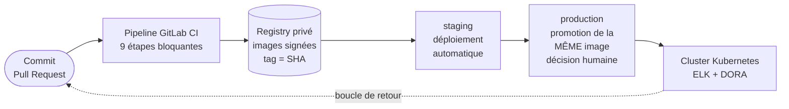
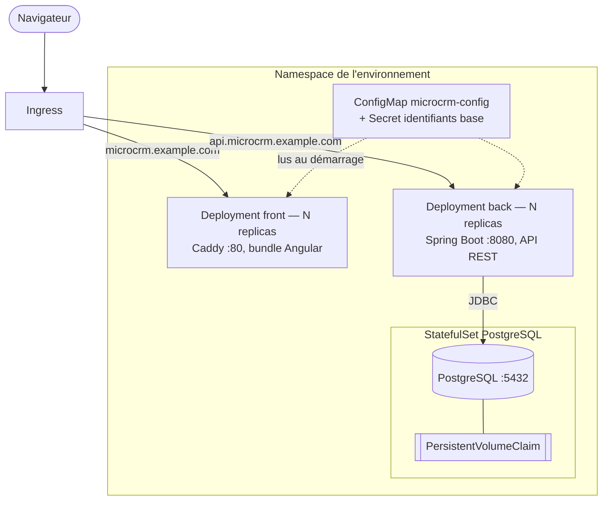
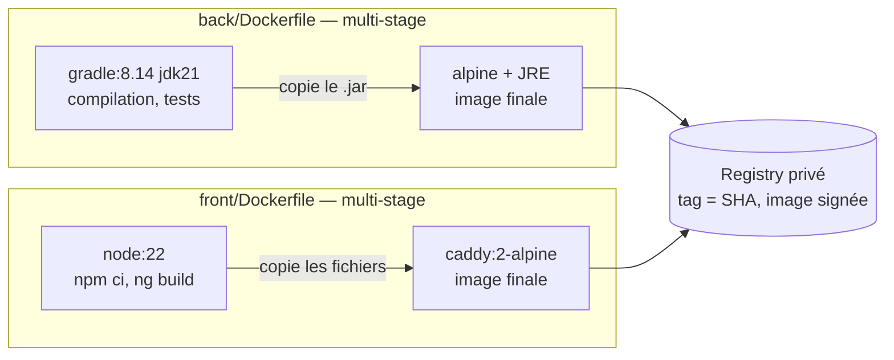
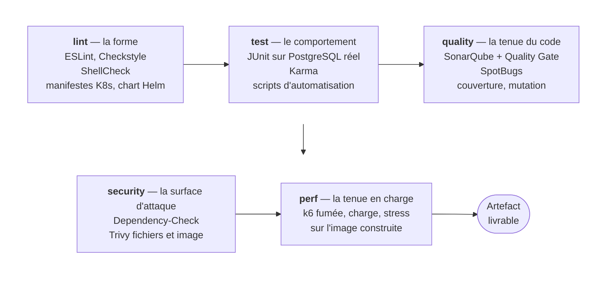
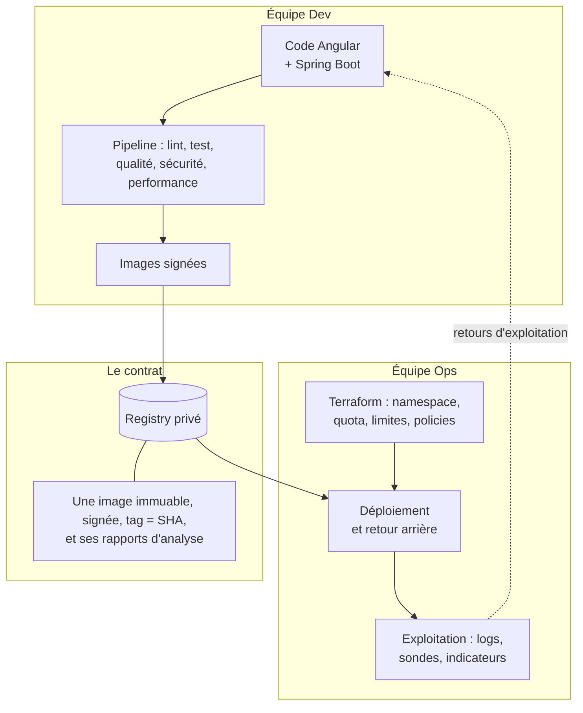
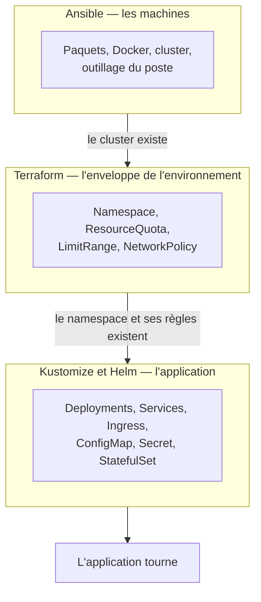
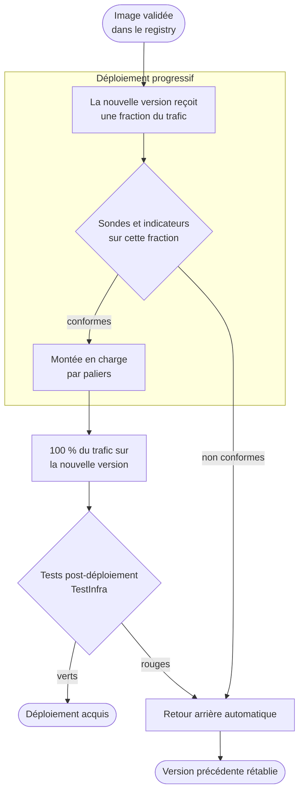
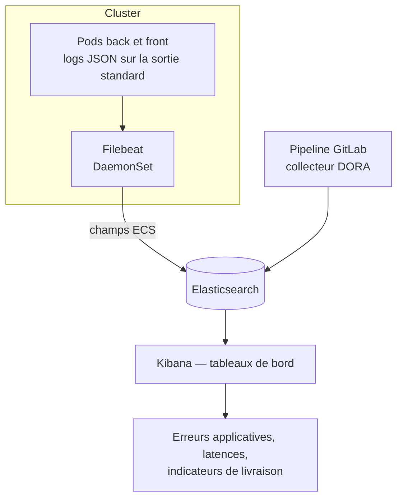

# Architecture finale — MicroCRM

**Plateforme de déploiement de l'équipe Orion.** Ce document décrit
l'architecture du projet dans son état abouti : les composants, leur agencement,
les artefacts produits, la chaîne qui les vérifie et les mène en production, et
la répartition des responsabilités entre les équipes Dev et Ops.

Chaque choix est présenté avec la raison qui le fonde. Une architecture se juge
moins sur ses composants que sur les décisions qui les relient — et ces
décisions, ici, sont prises en fonction de l'équipe réelle qui exploite la
plateforme.

> **L'équipe Orion.** Dev : Roubina (lead), Sylvain (senior), Temim (junior),
> Josefina (stagiaire). Ops : Nico (lead), Maïa (senior). Les compétences
> déclarées par les deux équipes dans le sondage « pratiques et technologies »
> orientent plusieurs décisions structurantes, signalées au fil du document et
> récapitulées au §12.

---

## 1. Les six principes de l'architecture

Tout ce qui suit découle de six règles. Elles sont énoncées en premier parce
qu'elles expliquent les schémas mieux que les schémas ne s'expliquent
eux-mêmes.

| #      | Principe                                                  | Ce qu'il implique concrètement                                                                                                                               |
| ------ | --------------------------------------------------------- | ------------------------------------------------------------------------------------------------------------------------------------------------------------ |
| **P1** | **L'artefact est immuable**                               | Chaque image est taguée par le SHA du commit qui l'a produite. Un déploiement désigne un artefact unique, identifiable et inaltérable.                       |
| **P2** | **On promeut, on ne reconstruit pas**                     | La même image passe de `staging` à `production`. Ce qui arrive en production est exactement ce qui a été testé.                                              |
| **P3** | **La vérification précède la livraison**                  | Une image n'atteint le registry qu'après les tests, les analyses de qualité, les contrôles de sécurité et un test de charge joué sur elle-même.              |
| **P4** | **Le retour arrière est un mécanisme, pas une procédure** | Le rollback est automatique en cas d'échec de déploiement, et disponible en une commande après coup. Il ne dépend d'aucun réflexe humain.                    |
| **P5** | **Tout état est décrit dans le dépôt**                    | Machines, environnements, application : trois couches d'infrastructure comme code, sans recouvrement. L'environnement se reconstruit à partir du seul dépôt. |
| **P6** | **La chaîne se mesure**                                   | Les quatre indicateurs DORA sont collectés par le pipeline. Une chaîne de livraison qu'on n'instrumente pas ne s'améliore que par conviction.                |

---

## 2. Vue d'ensemble — du commit à la production

Le trajet complet tient en une phrase : **un commit produit deux images
vérifiées et signées, qui atteignent staging sans intervention, et la
production sur décision humaine — cette décision étant le seul geste manuel
conservé.**

Ce point d'arrêt est délibéré. L'automatisation supprime le geste répétitif,
qui est source d'erreur et coûte du temps ; elle ne supprime pas la décision de
livrer, qui relève de l'arbitrage produit et engage l'équipe. Un pipeline qui
met en production sans que personne l'ait voulu ne fait pas gagner du temps, il
déplace le risque.

---

## 3. Les environnements

| Environnement  | Namespace             | Déclencheur                      | Mise à jour        | Ingress                                                            |
| -------------- | --------------------- | -------------------------------- | ------------------ | ------------------------------------------------------------------ |
| **staging**    | `microcrm-staging`    | branche `develop`                | **automatique**    | `microcrm.staging.example.com`, `api.microcrm.staging.example.com` |
| **production** | `microcrm-production` | branche `main` ou tag de version | validation humaine | `microcrm.example.com`, `api.microcrm.example.com`                 |

Les deux environnements partagent la même base Kustomize et ne diffèrent que par
un overlay : hôtes d'Ingress, valeurs de configuration, ressources allouées.
C'est ce qui garantit qu'un comportement observé en staging se reproduit en
production — deux environnements décrits par deux jeux de fichiers séparés
divergent inévitablement, et cette divergence se découvre toujours le jour de la
mise en production.

Chaque environnement reçoit son **enveloppe** de Terraform : un `ResourceQuota`
qui plafonne ce qu'il peut consommer, un `LimitRange` qui donne des valeurs par
défaut à tout conteneur qui n'en déclare pas, et des `NetworkPolicy` qui
restreignent les flux. En production, le quota est calé pour absorber le
dépassement transitoire d'un déploiement progressif, où l'ancienne et la
nouvelle version coexistent.

---

## 4. L'application en exécution

| Brique | Technologie                     | Port   | Rôle                                 |
| ------ | ------------------------------- | ------ | ------------------------------------ |
| Front  | Angular 17, servi par Caddy     | `80`   | Sert l'interface au navigateur       |
| Back   | Spring Boot 3, Tomcat intégré   | `8080` | Expose l'API REST (Spring Data REST) |
| Base   | PostgreSQL, `StatefulSet` + PVC | `5432` | Stockage persistant                  |

**La configuration est lue au démarrage, jamais au build.** Le bundle Angular
récupère l'URL de l'API sur `/config.json`, servi par Caddy à partir d'une
variable d'environnement. C'est ce qui permet à **la même image** de servir en
staging et en production — sans quoi P2 serait impossible : promouvoir une image
qui embarque l'URL de staging n'aurait aucun sens.

**Les deux services sont pilotés par trois sondes.** Un `startupProbe` sur
`/actuator/health/liveness` accorde au back un budget de démarrage confortable
sans allonger les délais de détection ensuite ; dès qu'il réussit, la
`livenessProbe` et la `readinessProbe` prennent le relais avec des périodes
courtes. C'est cette distinction qui permet à Kubernetes de savoir si un pod
_démarre_ ou s'il _dysfonctionne_ — deux situations qui appellent des réactions
opposées.

**Le schéma de base est géré par migrations versionnées.** Chaque évolution du
modèle produit un script, appliqué au démarrage et rejoué à l'identique sur
chaque environnement. La structure de la base est donc décrite dans le dépôt au
même titre que le code, et son évolution est relue en revue.

**Les deux services montent en charge horizontalement.** L'état applicatif vit
entièrement dans PostgreSQL : aucun pod ne détient de donnée que les autres
ignorent, et le nombre de replicas devient un simple réglage — deux fronts pour
un back, ou l'inverse, selon la charge observée.

---

## 5. Les artefacts

**Un service, une image.** Deux artefacts sont produits, et deux seulement.

**Le multi-stage sépare l'atelier de la livraison.** L'étape de compilation
contient le JDK, Gradle, Node et `node_modules` ; elle est jetée. L'image livrée
ne contient que l'artefact et son runtime. Le bénéfice est double : une image
plus légère à transférer, et une surface d'attaque réduite à ce qui est
strictement nécessaire pour exécuter l'application.

**Un service par image, pour trois raisons.** Les cadences sont découplées — un
correctif sur le front ne republie pas le back. La montée en charge est
indépendante — on peut placer plusieurs fronts devant un back. Et la surface à
analyser reste minimale : chaque image ne porte que ses propres dépendances.
L'outil de confort qui démarre l'ensemble en une commande est
`docker-compose.yml`, qui compose les deux images réelles : il ne doit pas être
un artefact de production.

**Chaque application a son propre `.dockerignore`.** Les images sont construites
avec `--context ./back` et `--context ./front`, et Docker ne lit que le
`.dockerignore` situé à la racine du contexte. Côté front, cela ramène le
contexte de build de **1 195 Mo à 0,6 Mo** : le cache de compilation Angular et
`node_modules` n'ont aucune raison d'être transférés au démon Docker, puisque
l'image les régénère.

**Les deux images tournent en UID 1000 non privilégié**, le même que celui
déclaré dans les manifestes Kubernetes, avec `capabilities.drop: [ALL]`. Le
conteneur se comporte donc à l'identique qu'on le lance avec Docker ou avec
Kubernetes — une image qui ne fonctionne en local que parce qu'elle y tourne en
root est une image qui échouera au premier déploiement.

**Les images de base sont miroitées dans le registry interne.** Aucun `FROM` ne
pointe vers une plateforme externe. La construction ne dépend donc ni de la
disponibilité ni des limitations de débit d'un service tiers, et l'entreprise
maîtrise la chaîne d'approvisionnement de ses images.

---

## 6. La chaîne de vérification

Neuf étapes, dont quatre entièrement consacrées à établir qu'un changement est
livrable. Chacune est **bloquante** : une étape rouge arrête le pipeline, et
aucun artefact n'atteint le registry.

**Les analyses de sécurité sont dans le pipeline de développement.** C'est la
décision la plus structurante de cette chaîne, et elle répond directement au
besoin exprimé par l'équipe Ops : les vulnérabilités sont détectées **avant** la
remise, au moment où le code est encore frais à l'esprit de la personne qui l'a
écrit. Le coût de correction d'une CVE croît avec le temps écoulé depuis son
introduction ; l'analyse la plus utile est donc la plus précoce.

**Les exceptions sont tenues explicitement.** Le fichier `.trivyignore` associe
à chaque CVE tolérée une justification et une date de réexamen. C'est la
contrepartie indispensable d'un contrôle bloquant : sans liste d'exceptions
tenue, une porte trop stricte finit contournée, et l'équipe apprend à ignorer le
signal.

**Les tests d'intégration du back s'exécutent contre un PostgreSQL réel**,
démarré comme service de CI. Le code rencontre donc son moteur de production dès
la CI, et non au premier démarrage en production.

**Les tests de mutation mesurent la valeur des tests eux-mêmes.** Un seuil de
couverture dit quelles lignes sont exécutées ; il ne dit pas si un test échoue
lorsque le code devient faux. La mutation modifie volontairement le code et
vérifie qu'un test s'en aperçoit. C'est ce qui distingue une suite de tests
d'une suite d'exécutions.

**Les tests de performance tournent sur l'image construite**, démarrée comme
service du job — donc sur l'artefact qui partira en production, et non sur une
compilation locale. Le test de fumée est court, stable et bloquant ; les tests
de charge et de stress portent les seuils de temps de réponse.

**L'infrastructure est validée avant qu'on ne compile.** Un chart, un manifeste
ou un plan Terraform incorrect n'a pas besoin d'attendre une compilation Gradle
pour être signalé.

---

## 7. La frontière Dev / Ops

**Ce qui traverse la frontière est un fait, pas un message.** Un identifiant
d'image immuable, signé, accompagné des rapports d'analyse qui l'ont validé. La
question « quelle version tourne exactement ? » se répond par une commande, à
tout moment, par n'importe qui — et non par la reconstitution d'un échange.

**La signature établit la provenance.** Une image non signée par le pipeline est
refusée au déploiement. Ce qui arrive sur le cluster provient donc
nécessairement d'un commit du dépôt, passé par la chaîne de vérification du §6.

**Le partage des responsabilités est net.** L'équipe Dev possède le code et la
qualité de ce qu'elle remet. L'équipe Ops possède les environnements et l'acte
de déployer. Ce qui a changé par rapport à un fonctionnement classique n'est pas
la propriété — c'est le **moment** du contrôle de sécurité, remonté en amont, et
la **forme** de l'échange, outillée plutôt que rédigée.

**La boucle de retour est explicite.** Ce que l'exploitation observe — un
incident, une dérive de temps de réponse, une nouvelle vulnérabilité — revient
au développement par les tableaux de bord, pas par un signalement individuel.

---

## 8. L'infrastructure comme code

Trois outils, trois périmètres qui ne se recouvrent pas. Chacun s'arrête là où
commence la responsabilité du suivant.

**Un objet a un propriétaire, et un seul.** C'est la règle qui rend ces trois
couches composables. Si Terraform décrivait aussi les Deployments, chaque
`terraform plan` proposerait sans fin de défaire ce que le dernier déploiement a
posé, et l'outil deviendrait une source de bruit plutôt qu'une source de vérité.

**Ansible touche aux machines, et c'est un choix qui tient compte de l'équipe.**
L'équipe Ops le maîtrise et l'utilise déjà ; le provisionnement s'écrit donc dans
son langage plutôt que dans un outil supplémentaire. Le playbook est idempotent :
il se rejoue sans effet de bord, ce qui en fait autant un outil d'installation
qu'un outil de vérification de conformité.

**Terraform décrit ce qu'un environnement a le droit de consommer**, sans jamais
déployer l'application. Cette séparation préserve la frontière du §7 : un
`terraform apply` ne doit pas pouvoir devenir un acte de livraison.

**L'application est décrite en Kustomize, doublée d'un chart Helm** de contenu
équivalent. Kustomize compose par superposition de patches, sans langage de
gabarit ; Helm empaquette et versionne. Le pipeline vérifie que les deux rendus
concordent, ce qui interdit à l'un de dériver silencieusement de l'autre.

**L'environnement se reconstruit intégralement depuis le dépôt**, dans l'ordre
imposé par ces trois couches : le playbook Ansible, puis `terraform apply`, puis
l'application des manifestes. C'est la garantie qui compte réellement — bien
plus qu'une sauvegarde, elle rend un environnement reproductible plutôt que
seulement restaurable.

---

## 9. Le déploiement et le retour arrière

**Le retour arrière est acquis avant d'être nécessaire.** Le script de
déploiement suit l'avancement du rollout et rétablit de lui-même la version
précédente si celui-ci échoue ou dépasse son délai. Une équipe qui traite un
incident n'a donc pas à se souvenir d'une commande sous pression : le mécanisme
s'est déjà déclenché.

**Un retour arrière manuel reste disponible** pour le cas où un défaut se révèle
après un déploiement pourtant réussi — vers la version précédente, ou vers une
révision précise. Comme chaque révision correspond à une image immuable (P1), on
sait toujours exactement vers quoi on revient.

**Ces mécanismes sont testés à chaque commit.** Un faux `kubectl` simule un
déploiement qui échoue, et les tests vérifient que le retour arrière se
déclenche, qu'il ne se déclenche pas lorsque tout va bien, et qu'une alerte est
levée si le retour arrière échoue lui-même. Un filet de sécurité qu'on ne teste
pas est une hypothèse.

**Les tests post-déploiement sont écrits en TestInfra**, l'outil que l'équipe
Ops pratique déjà. Ce n'est pas un détail d'outillage : ces tests sont lus en
situation d'incident, par les personnes d'astreinte. Un test de production que
son lecteur ne déchiffre pas ne reste pas longtemps maintenu.

---

## 10. L'observabilité et le pilotage

**Les applications écrivent en JSON sur la sortie standard.** Elles n'écrivent
pas de fichier et ne connaissent pas la destination de leurs logs : c'est
Filebeat, déployé en `DaemonSet`, qui les collecte sur chaque nœud. Un conteneur
qui gère lui-même ses fichiers de logs est un conteneur qui a besoin d'un volume,
d'une rotation, et d'une purge — trois responsabilités qui ne sont pas les
siennes.

**Les champs suivent la convention ECS**, ce qui rend les logs des deux services
interrogeables ensemble, avec les mêmes noms de champs.

**Les quatre indicateurs DORA sont collectés par le pipeline** et injectés dans
Elasticsearch, où ils alimentent un tableau de bord dédié. Ils constituent le
pilotage de la chaîne elle-même :

| Indicateur                   | Ce qu'il mesure                                       | Cible                    |
| ---------------------------- | ----------------------------------------------------- | ------------------------ |
| Fréquence de déploiement     | Le rythme auquel la valeur atteint l'utilisateur      | ≥ 1 par jour sur staging |
| Délai de mise en production  | Le temps entre le commit et son arrivée en production | < 1 jour                 |
| Temps de rétablissement      | La durée d'un incident jusqu'au retour à la normale   | < 1 heure                |
| Taux d'échec des changements | La part des déploiements nécessitant une correction   | < 15 %                   |

Ces quatre indicateurs sont retenus parce qu'ils **se contredisent utilement**.
La fréquence seule pousserait à livrer vite au détriment de la qualité ; le taux
d'échec seul pousserait à ne plus livrer du tout. C'est leur lecture conjointe
qui décrit une chaîne saine, et c'est pourquoi aucun ne se pilote isolément.

---

## 11. Les responsabilités

| Domaine                                       | Équipe Dev      | Équipe Ops            |
| --------------------------------------------- | --------------- | --------------------- |
| Code applicatif, tests, migrations de schéma  | **responsable** | consultée             |
| Dockerfiles et contenu des images             | **responsable** | consultée             |
| Portes de qualité et de sécurité du pipeline  | **responsable** | co-définit les seuils |
| Registry et images de base miroitées          | consultée       | **responsable**       |
| Environnements : namespaces, quotas, policies | informée        | **responsable**       |
| Déploiement, retour arrière, astreinte        | informée        | **responsable**       |
| Tests post-déploiement                        | consultée       | **responsable**       |
| Tableaux de bord et indicateurs DORA          | co-lit          | **responsable**       |

**Deux domaines sont volontairement partagés.** Les seuils des portes de
sécurité sont co-définis : l'équipe Dev les subit, l'équipe Ops en dépend, et un
seuil imposé par un seul côté est un seuil qui sera contesté au premier
blocage. Les tableaux de bord sont co-lus : ils n'ont d'utilité que si
l'information qu'ils portent atteint celles et ceux qui écrivent le code.

---

## 12. Les technologies retenues

| Domaine          | Technologie                                 | Pourquoi celle-ci                                                                               |
| ---------------- | ------------------------------------------- | ----------------------------------------------------------------------------------------------- |
| Front            | Angular 17 / TypeScript                     | Compétence forte de l'équipe Dev                                                                |
| Back             | Spring Boot 3 / Java 21                     | Socle du projet, encadré par l'outillage d'analyse du §6                                        |
| Build            | Gradle, NPM                                 | Encapsulés dans les Dockerfiles et la CI : le build est reproductible sans configuration locale |
| Tests            | JUnit, Karma, k6, TestInfra, BashUnit       | Chaque niveau testé par l'outil que l'équipe qui le lit maîtrise                                |
| Qualité          | SonarQube, SpotBugs, couverture, mutation   | Réponse au besoin d'analyse statique exprimé par l'équipe Dev                                   |
| Sécurité         | Trivy, Dependency-Check, signature d'images | Réponse au besoin d'analyse en amont exprimé par l'équipe Ops                                   |
| Conteneurisation | Docker multi-stage                          | Compétence forte des deux équipes                                                               |
| Registry         | Registry privé GitLab                       | Réponse au souhait d'un dépôt d'images interne                                                  |
| Orchestration    | Kubernetes, Kustomize, Helm                 | Résilience, montée en charge et retour arrière natifs                                           |
| Environnements   | Terraform                                   | Enveloppe des environnements, séparée de l'application                                          |
| Machines         | Ansible                                     | Compétence forte de l'équipe Ops                                                                |
| Base de données  | PostgreSQL                                  | Moteur exploité par l'équipe Ops, présent dès la CI                                             |
| Observabilité    | Elasticsearch, Filebeat, Kibana             | Logs des deux services interrogeables ensemble                                                  |
| CI/CD            | GitLab CI                                   | Pipeline, registry et environnements dans un même outil                                         |

**Le fil conducteur de ce tableau est la compétence réelle des équipes.** À
service rendu comparable, l'architecture retient l'outil que l'équipe qui en
héritera sait déjà lire : Ansible pour les machines, TestInfra pour les tests
d'exploitation, Bash pour les scripts de déploiement. Là où la compétence est en
construction, ce n'est pas l'outil qu'on abaisse — c'est l'outillage de
vérification qu'on renforce, comme au §6 pour le back. Une architecture n'est
aboutie que si l'équipe qui la fait vivre la comprend.
