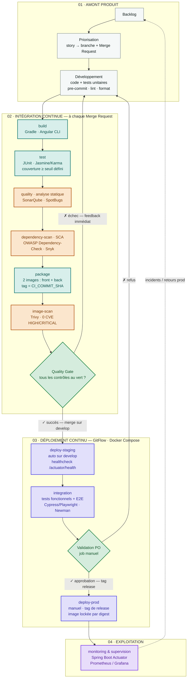

# Schéma — Chaîne CI/CD normalisée (MicroCRM)

Chaque étape du cycle de développement est traduite en _stage_ GitLab CI, outillée
et assortie d'un critère bloquant. La sécurité est déplacée au plus tôt
(**shift-left / DevSecOps**), le déploiement est automatisé jusqu'à la validation PO.

Source visuelle : https://claude.ai/code/artifact/831ad9ad-9664-4e62-b252-80c239ff19fb

## Workflow complet

**Légende des couleurs**

| Couleur    | Nature                              |
| ---------- | ----------------------------------- |
| Gris       | Amont produit (hors CI)             |
| Vert d'eau | Intégration continue                |
| Orange     | Sécurité — shift-left / DevSecOps   |
| Vert       | Quality gate / validation bloquante |
| Indigo     | Déploiement continu                 |
| Violet     | Exploitation                        |

## Table de normalisation — cycle → GitLab CI

| Étape du cycle                   | Stage GitLab                 | Outils                          | Critère bloquant                  |
| -------------------------------- | ---------------------------- | ------------------------------- | --------------------------------- |
| Développement                    | _(local)_                    | pre-commit, lint                | Format + lint OK avant push       |
| Build                            | `build`                      | Gradle, Angular CLI             | Compilation sans erreur           |
| Tests unitaires                  | `test`                       | JUnit, Jasmine/Karma            | Couverture ≥ seuil (ex. 80 %)     |
| Analyse statique                 | `quality`                    | SonarQube, SpotBugs             | Quality Gate Sonar au vert        |
| Analyse des dépendances          | `dependency-scan`            | OWASP DC, Snyk                  | 0 CVE critique / haute            |
| Construction des images          | `package`                    | Docker/Kaniko, Registry         | Build OK, tag = commit SHA        |
| Analyse des images               | `image-scan`                 | Trivy                           | 0 CVE HIGH/CRITICAL               |
| Quality gate                     | `quality-gate`               | règles GitLab (`needs`)         | Tous les jobs amont au vert       |
| Déploiement staging              | `deploy-staging` · `develop` | GitLab Env, Docker Compose      | Healthcheck `/actuator/health` OK |
| Tests fonctionnels & intégration | `integration`                | Cypress/Playwright, Newman      | Scénarios E2E + API passants      |
| Validation PO                    | `validate` (manual)          | job manuel GitLab               | Approbation explicite du PO       |
| Déploiement production           | `deploy-prod` (manual · tag) | GitLab Env prod, Docker Compose | Healthcheck OK, digest locké      |
| Monitoring & supervision         | _(post-deploy)_              | Actuator, Prometheus/Grafana    | Alerting actif, SLO surveillés    |

---

> ⚠️ **État actuel du repo.** Ce schéma décrit la chaîne **cible**. Le
> `.gitlab-ci.yml` en place ne contient que 2 stages (`test`, `build`) et
> 4 jobs (`test-front`, `test-back`, `build-front`, `build-back`) — ni `package`,
> ni scans de sécurité, ni stage `deploy`. Les règles GitFlow (`.rules_test` /
> `.rules_build`) sont en revanche déjà posées et servent de base au déclenchement.
