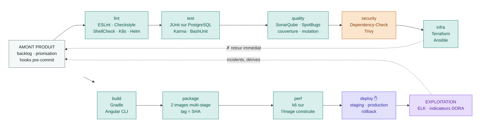

# Schéma — Chaîne CI/CD (MicroCRM)

Chaque étape du cycle de développement est traduite en _stage_ GitLab CI, outillée
et assortie d'un critère explicite. La sécurité est déplacée au plus tôt
(**shift-left / DevSecOps**) : elle s'exécute **avant** la construction des
artefacts, pas après. Le déploiement est outillé jusqu'à la décision humaine, qui
reste le seul geste manuel conservé.

## Workflow complet

**Légende des couleurs**

| Couleur    | Nature                            |
| ---------- | --------------------------------- |
| Gris       | Amont produit (hors CI)           |
| Vert d'eau | Vérification et livraison         |
| Orange     | Sécurité — shift-left / DevSecOps |
| Indigo     | Déploiement                       |
| Violet     | Exploitation                      |

## Table de normalisation — cycle → GitLab CI

Neuf stages, 30 jobs. La colonne « bloquant » dit ce qui arrête réellement le
pipeline aujourd'hui, pas ce qui devrait l'arrêter.

| Étape du cycle          | Stage       | Outils                                    | Bloquant                     |
| ----------------------- | ----------- | ----------------------------------------- | ---------------------------- |
| Développement           | _(local)_   | husky, lint-staged, Prettier, commitlint  | oui, avant le push           |
| Forme du code           | `lint`      | ESLint, Checkstyle, ShellCheck, Helm, K8s | **oui**, les 5 jobs          |
| Comportement            | `test`      | JUnit sur PostgreSQL, Karma, BashUnit     | **oui**, les 3 jobs          |
| Tenue du code           | `quality`   | SonarQube, SpotBugs, JaCoCo, PIT          | `coverage-gate` seul         |
| Surface d'attaque       | `security`  | OWASP Dependency-Check, Trivy             | Dependency-Check seul        |
| Infrastructure          | `infra`     | Terraform, Ansible                        | `validate` et `lint` seuls   |
| Compilation             | `build`     | Gradle, Angular CLI                       | **oui**                      |
| Construction des images | `package`   | Docker multi-stage, Registry GitLab       | **oui**, tag = SHA du commit |
| Tenue en charge         | `perf`      | k6 sur l'image construite                 | `k6-smoke` seul              |
| Déploiement staging     | `deploy`    | Kubernetes, Kustomize, `deploy.sh`        | manuel, sur `develop`        |
| Déploiement production  | `deploy`    | Kubernetes, promotion de la même image    | manuel, sur `main` ou tag    |
| Retour arrière          | `deploy`    | `rollback.sh`, historique des révisions   | automatique **et** manuel    |
| Supervision             | _(hors CI)_ | Filebeat, Elasticsearch, Kibana, DORA     | —                            |

Le détail des interdépendances entre jobs est dans
[docs/pipeline-ci.md](docs/pipeline-ci.md).

---

## Ce que la chaîne ne fait pas encore

Cette section est le pendant honnête de la précédente. Ce sont des écarts connus,
pas des oublis.

| Élément                                    | État                                                                                     |
| ------------------------------------------ | ---------------------------------------------------------------------------------------- |
| Tests E2E (Cypress/Playwright)             | **non implémenté** — aucun stage `integration`                                           |
| `deploy-staging` automatique sur `develop` | en `when: manual` ; le passage en `on_success` est une ligne                             |
| Trivy bloquant                             | tourne en `--exit-code 0` — 4 mauvaises configurations à traiter d'abord                 |
| Quality Gate Sonar bloquant                | `allow_failure: true`, et ne tourne que sur `main`                                       |
| Tests de mutation bloquants                | `allow_failure: true` — le seuil de 80 % est tenu mais non imposé                        |
| Métriques Prometheus / Grafana             | **non implémenté** — la supervision est faite par les logs (ELK) et les indicateurs DORA |
| Signature des images                       | **non implémenté** — les images sont taguées par SHA, pas signées                        |
| Déploiement progressif (canary)            | **non implémenté** — `RollingUpdate` avec `maxUnavailable: 0`                            |

Deux choix méritent d'être signalés plutôt que subis. **Snyk** figurait dans la
cible initiale : il est remplacé par Trivy et OWASP Dependency-Check, qui
couvrent le même besoin sans compte tiers. **Docker Compose** était prévu comme
cible de déploiement : il est remplacé par Kubernetes ([RELEASE.md](RELEASE.md)),
et ne sert plus qu'à démarrer la pile en local.
