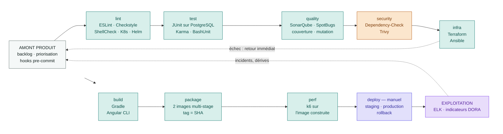

# Schéma — Chaîne CI/CD (MicroCRM)

Chaque étape du cycle de développement est traduite en _stage_ GitLab CI, outillée
et assortie d'un critère explicite. La sécurité est déplacée au plus tôt
(**shift-left / DevSecOps**) : elle s'exécute **avant** la construction des
artefacts, pas après. Le déploiement est outillé jusqu'à la décision humaine, qui
reste le seul geste manuel conservé.

## Workflow complet

```mermaid
flowchart LR
    subgraph R1[" "]
        direction LR
        A["AMONT PRODUIT<br/>backlog · priorisation<br/>hooks pre-commit"] --> B1["lint<br/>ESLint · Checkstyle<br/>ShellCheck · K8s · Helm"]
        B1 --> B2["test<br/>JUnit sur PostgreSQL<br/>Karma · BashUnit"]
        B2 --> B3["quality<br/>SonarQube · SpotBugs<br/>couverture · mutation"]
        B3 --> B4["security<br/>Dependency-Check<br/>Trivy"]
        B4 --> B5["infra<br/>Terraform<br/>Ansible"]
    end
    subgraph R2[" "]
        direction LR
        C1["build<br/>Gradle<br/>Angular CLI"] --> C2["package<br/>2 images multi-stage<br/>tag = SHA"]
        C2 --> C3["perf<br/>k6 sur<br/>l'image construite"]
        C3 --> D["deploy — manuel<br/>staging · production<br/>rollback"]
        D --> E["EXPLOITATION<br/>ELK · indicateurs DORA"]
    end
    R1 --> R2
    B5 -.->|"échec : retour immédiat"| A
    E -.->|"incidents, dérives"| A

    classDef prod fill:#f5f8f8,stroke:#5b6c69,color:#13201e
    classDef ci fill:#d8efeb,stroke:#0f766e,color:#0b5049
    classDef sec fill:#fbe6cd,stroke:#b45309,color:#7c3a06
    classDef deploy fill:#e2e0fb,stroke:#4f46e5,color:#312c9e
    classDef ops fill:#e8ddfb,stroke:#7c3aed,color:#54209e
    class A prod
    class B1,B2,B3,B5,C1,C2,C3 ci
    class B4 sec
    class D deploy
    class E ops
    style R1 fill:none,stroke:none
    style R2 fill:none,stroke:none
```

**Légende des couleurs**

| Couleur    | Nature                            |
| ---------- | --------------------------------- |
| Gris       | Amont produit (hors CI)           |
| Vert d'eau | Vérification et livraison         |
| Orange     | Sécurité — shift-left / DevSecOps |
| Indigo     | Déploiement                       |
| Violet     | Exploitation                      |

## Table de normalisation — cycle → GitLab CI

Dix étapes, 39 jobs (dont trois dans un pipeline enfant). La colonne « bloquant » dit ce qui arrête réellement le
pipeline, pas ce qui devrait l'arrêter.

| Étape du cycle           | Stage         | Outils                                          | Bloquant                                                  |
| ------------------------ | ------------- | ----------------------------------------------- | --------------------------------------------------------- |
| Développement            | _(local)_     | husky, lint-staged, Prettier, commitlint        | oui, avant le push                                        |
| Forme du code            | `lint`        | ESLint, Checkstyle, ShellCheck, Helm, K8s       | **oui**, les 6 jobs (`version-consistency` sur tag seul)  |
| Comportement             | `test`        | JUnit sur PostgreSQL, Karma, BashUnit           | **oui**, les 3 jobs                                       |
| Tenue du code            | `quality`     | SonarQube, SpotBugs, JaCoCo, PIT                | **oui**, sauf `spotbugs-back` ; `quality-gate` sur `main` |
| Surface d'attaque        | `security`    | OWASP Dependency-Check, Trivy                   | **oui**, les 2 jobs, rapports en artefacts                |
| Infrastructure           | `infra`       | Terraform, Ansible                              | **oui** : `validate`, `ansible-lint`, `plan`              |
| Compilation              | `build`       | Gradle, Angular CLI                             | **oui**                                                   |
| Construction des images  | `package`     | Docker multi-stage, Trivy, Registry GitLab      | **oui** : scan avant push, tag = SHA du commit            |
| Version livrée           | `package`     | promotion par retag, `glab` (Release GitLab)    | **oui**, sur tag seulement                                |
| Tenue en charge          | `perf`        | k6 sur l'image construite                       | `k6-smoke` (et `k6-stress`, sur demande)                  |
| Déploiement staging      | `deploy`      | Kubernetes, Kustomize, `deploy.sh`              | manuel, sur `develop`                                     |
| Déploiement production   | `deploy`      | Kubernetes, promotion de la même image          | manuel, sur `main` ou tag                                 |
| Retour arrière           | `deploy`      | `rollback.sh`, historique des révisions         | automatique **et** manuel                                 |
| Indicateurs DORA         | `deploy`      | `collect_dora.py`, artefact `reports/dora.json` | non (`allow_failure`)                                     |
| Infrastructure appliquée | `infra-apply` | `terraform apply` par environnement             | manuel ; notification d'échec non bloquante               |
| Supervision              | _(hors CI)_   | Filebeat, Elasticsearch, Kibana, APM Server     | — ; huit règles d'alerte Kibana, sans notification        |

Le détail des interdépendances entre jobs est dans
[docs/pipeline-ci.md](docs/pipeline-ci.md).

---

## Ce que la chaîne ne fait pas encore

Cette section est le pendant honnête de la précédente. Ce sont des écarts connus,
pas des oublis.

| Élément                                    | État                                                                                                                                              |
| ------------------------------------------ | ------------------------------------------------------------------------------------------------------------------------------------------------- |
| Tests E2E (Cypress/Playwright)             | **non implémenté** — aucun stage `integration`                                                                                                    |
| `deploy-staging` automatique sur `develop` | en `when: manual` ; le passage en `on_success` est une ligne                                                                                      |
| Métriques Prometheus / Grafana             | **non implémenté** — la supervision est faite par les logs (ELK), huit règles d'alerte Kibana et les indicateurs DORA ; ni CPU ni mémoire mesurés |
| Traces de l'API en service                 | **en service** en staging et en production, sur du trafic provoqué — aucune latence en service relevée                                            |
| Notification des alertes applicatives      | **non implémenté** — les alertes restent dans Kibana (connecteurs webhook sous licence payante)                                                   |
| Signature des images                       | **non implémenté** — les images sont taguées par SHA, pas signées                                                                                 |
| Déploiement progressif (canary)            | **non implémenté** — `RollingUpdate` avec `maxUnavailable: 0`                                                                                     |

Deux choix méritent d'être signalés. **Trivy et OWASP Dependency-Check plutôt
que Snyk** : ils couvrent le même besoin sans compte tiers. **Kubernetes plutôt
que Docker Compose** comme cible de déploiement, parce qu'il conserve
l'historique des révisions et fait du rollback une commande
([RELEASE.md](RELEASE.md)) ; Docker Compose sert à démarrer la pile en local.
